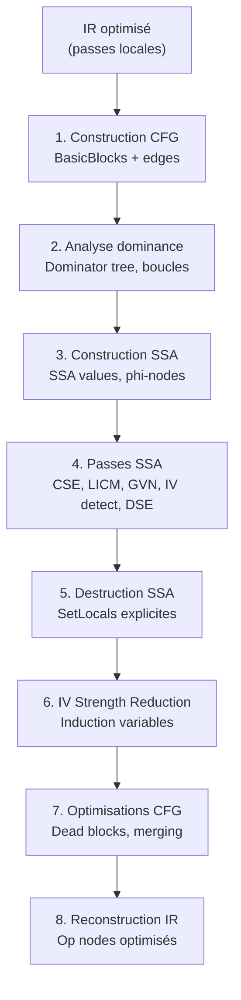
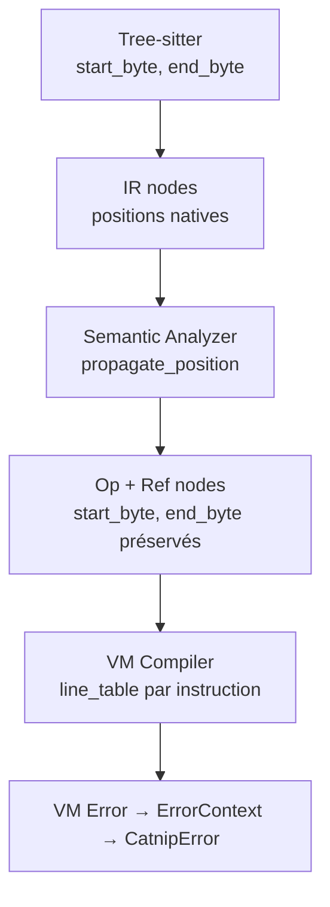
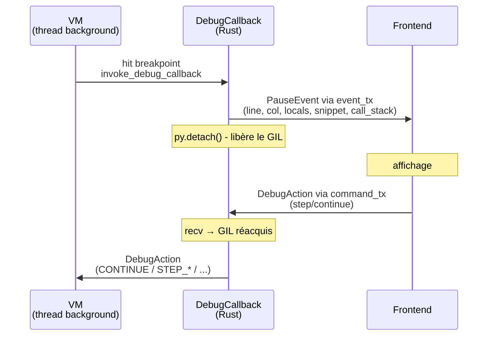

# Architecture

Vue d'ensemble de l'architecture Catnip pour contributeurs.

## Stratégie : Rust + Python

Catnip utilise une architecture hybride, pour garder l'ergonomie côté Python et la performance côté Rust :

**Python** : API de haut niveau, orchestration, intégration

- Classe principale `Catnip`, context, REPL et CLI

**Rust** : Composants bas niveau (via PyO3)

- Parser et transformations (tree-sitter)
- Semantic analyzer et optimisations
- Scope management (O(1) lookup)
- VM bytecode et JIT (Cranelift)
- Registry et dispatch d'opérations

**Principe** : Rust fait le travail lourd, Python garde l'interface simple.

### Pourquoi PyO3

[PyO3](https://pyo3.rs/) sert de pont propre entre Python et Rust :

- Interopérabilité zéro-cost (pas de sérialisation)
- Memory safety garantie par Rust
- Intégration directe avec l'API Python
- Utilisé par projet production (Ruff, Polars, tiktoken)

**Références** :

- [PyO3 User Guide](https://pyo3.rs/)
- [Extending Python with Rust](https://www.youtube.com/watch?v=jmP_i3C_O4Y) (PyCon 2023)

## Pipeline d'Execution

En mode VM (défaut), `Catnip` délègue l'exécution à `Pipeline`, un pipeline Rust complet :


Le pipeline utilise un pattern **prepare/execute** : `parse()` appelle `prepare(source)` qui fait parse + semantic et
stocke l'IR optimisé. `execute()` appelle `execute_prepared()` qui compile et exécute depuis l'IR stocké (pas de
re-parse). Un seul chemin de parsing.

`parse()` expose les PyIRNode via `get_prepared_ir_nodes()` (wrappers lecture seule). Les PyIRNode servent à `-p 1/2` et
au MCP `parse_catnip`.

`PyIRNode` (`catnip_rs/src/ir/pyclass.rs`) wrappe `IR` pour inspection Python : getters en lecture seule (`opcode`,
`args`, `kwargs`, `value`, `name`...) et serialisation JSON native (`to_json()`).

### 1. Parsing : Tree-sitter

Le parser utilise [Tree-sitter](https://tree-sitter.github.io/tree-sitter/), un générateur de parseur incrémental :

> Transparence : Tree-sitter n'est pas formellement prouvé dans ce repo.

**Pourquoi Tree-sitter** :

- Parser généré en C (performance native)
- Parsing incrémental (réévalue seulement les modifications)
- Error recovery (robuste face aux erreurs de syntaxe)
- Écosystème riche (syntax highlighting, code folding)

**Avantage vs parser manuel** : la précédence des opérateurs est codée dans la grammaire (`prec.left()`,
`prec.right()`), pas besoin de la recoder ailleurs.

**Références** :

- [Tree-sitter documentation](https://tree-sitter.github.io/tree-sitter/)
- [Tree-sitter in Practice](https://siraben.dev/2022/03/01/tree-sitter.html)

### 2. Transformation : CST → IR

Le transformer convertit l'arbre de syntaxe en IR (Intermediate Representation) :

**IR** : structure basée sur des OpCode (entiers) pour identifier les opérations

- Sortie brute du parser, pas encore optimisée
- Utilise l'enum `IROpCode`
- Type `IR` (Rust) sans dépendance PyO3 pour pipeline standalone
- `PyIRNode` wrappe `IR` pour inspection Python (getters, `to_json()`)

72+ transformateurs en Rust pur, wrapper PyO3 pour le bridge Python. Couvrent tout le langage :

- Literals (int, float, string, list, dict)
- Operators (binary, unary, comparison, bitwise)
- Control flow (if, while, for, match, block)
- Functions (lambda, fn_def, call)
- Pattern matching (literal, var, wildcard, or, tuple)
- Broadcasting et accès (chained, getattr, index, slice)

### 3. Semantic Analysis : IR → Op

L'analyse sémantique transforme l'IR en Op exécutable :

**Responsabilités** :

- Résolution des identifiants
- Détection des tail calls (TCO)
- Application des pragmas
- Optimisations (10 passes)

**Optimisations** (optionnel, contrôlé par niveau 0-3) :

- **Passes IR** (niveau expression) : simplifications locales (constant folding, CSE, dead code, etc.)
- **Passes CFG/SSA** (niveau contrôle de flux, level >= 3) : optimisations globales (voir ci-dessous)

Voir [OPTIMIZATIONS](OPTIMIZATIONS.md) pour détails sur les niveaux.

**Op** : structure exécutable finale avec OpCode optimisé

#### CFG/SSA : Optimisations Inter-blocs

À partir du niveau 3, le semantic analyzer construit un **Control Flow Graph** (CFG) puis passe en **SSA** pour pouvoir
optimiser à l'échelle de plusieurs blocs.

> Warning: ce passage augmente la résistance mentale de +5.

**Pipeline CFG/SSA** :



**Passes SSA** (5 passes inter-blocs) :

1. **CSE inter-blocs** - Élimine expressions redondantes entre blocs dominants
1. **LICM** - Hoist les calculs invariants hors des boucles
1. **GVN** - Global Value Numbering, détecte équivalences entre expressions
1. **IV detection** - Détecte les variables d'induction dans les boucles (utilise les infos SSA)
1. **DSE globale** - Élimine les SetLocals dont le résultat n'est jamais lu

**Post-SSA** : après destruction SSA, **IV strength reduction** transforme les multiplications d'induction en additions
incrémentales.

**Construction SSA** : utilise l'algorithme de
[Braun et al. (2013)](https://pp.ipd.kit.edu/uploads/publikationen/braun13cc.pdf), en un seul passage RPO (reverse
postorder), sans calcul explicite des dominance frontiers.

**SetLocals** est le nœud IR central pour l'SSA : chaque affectation crée une nouvelle version de variable. Les
phi-nodes aux jonctions sont convertis en SetLocals explicites lors de la destruction SSA.

> L'SSA garantit que chaque variable n'est assignée qu'une seule fois. Ce qui est pratique pour l'optimiseur, mais
> existentiellement perturbant pour les variables qui se pensaient réassignables.

### 4. Execution

`Pipeline.prepare()` stocke l'IR optimisé. `execute_prepared()` compile et exécute depuis l'IR stocké (pas de re-parse).
Voir [VM](VM.md) pour details.

**Mode AST** (interne, non documenté utilisateur) : `parse()` convertit l'IR en Op nodes via `prepared_ir_to_op()`.
`execute()` interprète les Op directement via Registry (`exec_stmt()`). Accessible via `-x ast` ou
`CATNIP_EXECUTOR=ast`. Sert d'oracle indépendant : un test qui passe en AST et échoue en VM isole un bug de compilation
ou de dispatch VM. Code derrière le feature flag `ast-executor` en Rust.

**Mode standalone** (`--executor standalone`) : `CatnipStandalone` (`catnip/compat.py`) utilise les memes classes PyO3
que le mode DSL (`PragmaContext`, `CatnipRuntime`, `_ImportWrapper`, `Memoization`). Couvre 100% du langage Catnip. Les
seules differences sont les couches d'adaptation de l'API d'embedding Python (`@pass_context`, `Catnip(context=ctx)`,
broadcast purity tracking) qui ne concernent pas les scripts `.cat`.

## Concepts Clés

### OpCode : Identifiants d'Opérations

Les opérations sont identifiées par l'enum `OpCode` (Rust), utilisée pour le dispatch rapide et la cohérence entre
parsing, semantic et exécution.

**Avantages vs strings** :

- Comparaisons O(1) (entiers vs strings)
- Lookups rapides dans dictionnaires
- Consommation mémoire réduite

**Convention** : Opcodes correspondant à mots-clés Python préfixés `OP_` (`OP_IF`, `OP_WHILE`)

### Scope : Variables O(1)

La gestion des scopes utilise un **IndexMap plat** en Rust, plutôt qu'une chaîne de scopes parents :

**Approche classique** (O(n) lookup) :

```
Scope 3 → Scope 2 → Scope 1 → Global
```

Recherche d'une variable = remonter la chaîne jusqu'à trouver

**Approche Catnip** (O(1) lookup) :

- Un seul IndexMap contenant toutes les variables (ordre d'insertion préservé)
- Tracking par frame pour savoir quoi nettoyer au pop
- Shadow stack pour gérer le masquage de variables

**Trade-off** : lookup O(1), cleanup O(n) où n = variables dans le frame

**Références** :

- [Hash table](https://en.wikipedia.org/wiki/Hash_table) (Wikipedia)
- Concept inspiré de V8's hidden classes

> Les scopes classiques sont une tour d'annuaires empilés. Pour trouver un numéro, on monte étage par étage. Catnip
> utilise un annuaire unique avec des post-its de couleur pour savoir quel numéro appartient à quel étage. Chercher est
> instantané, ranger nécessite de lire les post-its.

### Registry : Table des Opérations

Le Registry dispatche les opcodes vers leurs implémentations Rust via pattern matching direct (O(1), branch prediction).
12 modules spécialisés (arithmetic, logical, control_flow, functions, patterns, etc.).

### Tail Call Optimization (TCO)

Catnip utilise un **trampoline pattern** pour éviter que la pile d'appels grossisse :

**Principe** :

1. La fonction tail-recursive retourne `TailCall(func, args)` au lieu d'appeler
1. La boucle trampoline détecte `TailCall`, rebind les paramètres, continue
1. Un seul frame Python pour toute la récursion

**Avantage** : récursion possible sans gonfler la stack (O(1) stack space)

**Détection** : automatique par l'analyseur sémantique (appels en dernière position)

**Références** :

- [Tail call](https://en.wikipedia.org/wiki/Tail_call) (Wikipedia)
- [Proper Tail Calls in Scheme](https://www.scheme.com/tspl4/further.html#./further:h3)

### Lazy Evaluation

Les opérations de contrôle de flux (`if`, `while`, `for`, `match`, etc.) reçoivent leurs arguments **non évalués** :

**Raison** : les blocs doivent être évalués conditionnellement ou plusieurs fois

```python
# if (condition) { then_block } else { else_block }
# → then_block et else_block ne sont PAS évalués immédiatement
# → Seul le bloc choisi sera exécuté
```

**Implémentation** : HashSet `CONTROL_FLOW_OPS` marque les opcodes lazy

### Error Handling : Source Locations

Les erreurs runtime capturent la position source complète (fichier, ligne, colonne) avec une pile d'appels claire.

**Pipeline de propagation** :



**Line table** : le `CodeObject` contient un vecteur parallèle aux instructions qui mappe chaque instruction vers son
`start_byte`. La VM maintient `last_src_byte` (mis à jour à chaque instruction) et une pile d'appels avec nom de
fonction et position source.

**Capture lazy** : quand une erreur se produit, la VM utilise `last_src_byte` (toujours à jour, même si le frame est
dépilé pendant la propagation), snapshote le call stack, puis le bridge Python convertit `start_byte` en ligne/colonne
et enrichit l'exception avec un extrait. Le `call_stack` complet (liste de `(func_name, line)`) est attaché à
l'exception via `exc.call_stack` pour le traceback.

**Suggestions "Did you mean?"** : trois niveaux de suggestions automatiques basées sur la distance de
Damerau-Levenshtein (`catnip_tools/src/suggest.rs`) :

- **Variables** : `NameError` collecte locals + globals et suggère les noms proches
- **Attributs struct** : `AttributeError` sur fields/methods suggère l'attribut le plus similaire
- **Attributs Python** : `AttributeError` sur objets Python utilise `dir()` + Damerau-Levenshtein pour suggérer
  (`"hello".uper()` -> `upper`)
- **Keywords syntaxe** : tokens inconnus sont comparés aux keywords Catnip + aliases cross-langage (`class` -> `struct`,
  `switch` -> `match`)

Les erreurs sémantiques (unknown opcode, unknown pragma) incluent la position source via `start_byte` enrichi par
SourceMap dans le pipeline.

**Résultat** : messages d'erreur avec traceback complet et suggestions :

```
File '<input>', line 1, column 1: Name 'factoral' is not defined
  Did you mean 'factorial'?
    1 | factorial = 1; factoral
    | ^
```

**Détails** : voir [VM](VM.md) pour l'architecture.

### Module Loading : Résolution Statique

Le loader (`catnip/loader.py`) résout les imports par nom avec une liste de recherche **fixée au démarrage** :
caller_dir -> CWD -> CATNIP_PATH. Le code ne peut pas modifier cette liste à l'exécution.

**Choix de design : pas de `sys.path`**

Catnip n'a délibérément pas d'équivalent mutable de `sys.path`. Un search path mutable est un état global implicite qui
crée des dépendances d'ordre entre modules (A modifie le path, B en dépend sans le savoir). Ça rend le résultat d'un
`import("x")` non-déterministe par rapport à l'ordre d'exécution - exactement le genre de couplage qu'on veut éviter.

La résolution statique garantit que `import("x")` produit toujours le même résultat pour un (fichier, environnement)
donné, sans dépendre de l'historique d'exécution. CATNIP_PATH couvre le cas d'usage "ajouter des répertoires" sans
mutation runtime.

**Protocoles et packages** : le préfixe `py:`/`cat:`/`rs:` force un backend ; `lib.toml` dans un répertoire le déclare
comme package avec entry point et exports filtrés.

**Détails** : voir [MODULE_LOADING](../user/MODULE_LOADING.md).

## Debugger

Le debugger connecte la VM Rust à un frontend (console Rust ou MCP Python) via des channels `std::sync::mpsc`.

### Architecture



### Points d'entrée dans la VM

Le breakpoint opcode est injecté par l'analyseur sémantique quand il rencontre un appel `breakpoint()`. La VM intercepte
aussi les instructions dont le `start_byte` correspond à un breakpoint utilisateur (ajouté via
`add_debug_breakpoint(offset)`).

Au point de pause, la VM snapshote l'état : variables locales (slotmap complet, y compris nil), call stack, et position
source. Le `DebugCallback` Rust construit un `PauseEvent`, l'envoie via `event_tx`, puis libère le GIL pendant
`command_rx.recv_timeout(60s)` (auto-continue après 5 min).

**Composants** : logique pure dans `catnip_tools`, channels et GIL dans `catnip_rs/debug`, wrapper Python dans
`catnip/debug`, 6 tools MCP dans `catnip_mcp/` (Rust) et `catnip_mcp_py/` (Python).

### Step modes

| Action      | Comportement                                        |
| ----------- | --------------------------------------------------- |
| `CONTINUE`  | Reprend jusqu'au prochain breakpoint                |
| `STEP_INTO` | Pause à la prochaine instruction                    |
| `STEP_OVER` | Pause à la prochaine instruction de même profondeur |
| `STEP_OUT`  | Pause au retour du frame courant                    |

> Le debugger observe la VM sans la modifier. Ce qui est pratique, parce qu'un debugger qui modifie l'exécution du
> programme qu'il débogue serait un programme qui s'observe en train de ne pas être lui-même.

## Vérification Formelle

Les propriétés structurelles du langage sont prouvées en [Coq](https://coq.inria.fr/). Chaque fichier modélise un
composant Rust et prouve ses invariants.

| Axe           | Couverture                                                                                                                               |
| ------------- | ---------------------------------------------------------------------------------------------------------------------------------------- |
| Syntaxe       | Grammaire CF, précédence (13 niveaux), monotonie fuel                                                                                    |
| Sémantique    | Broadcasting (foncteur, confluence), ND-récursion                                                                                        |
| Runtime       | IR opcodes, scopes, patterns, fonctions/TCO, NaN-boxing, VM stack safety, frames/IP/jumps, C3 MRO, structs/traits, desugaring opérateurs |
| Optimisations | 10/10 passes IR (constant folding, CSE, DCE, propagation, etc.)                                                                          |
| Analyses      | Liveness/DSE, dominance CFG, SSA complet (49 lemmes), cache                                                                              |

Preuves paramétriques, compilent avec `make proof`. Détails : [COQ_PROOFS](COQ_PROOFS.md).

> Un programme prouvé correct n'a pas de bugs. Il a des hypothèses.

## Où Trouver le Code

| Dossier           | Contenu                                                                                       |
| ----------------- | --------------------------------------------------------------------------------------------- |
| `catnip/`         | API Python, intégration                                                                       |
| `catnip_core/`    | Coeur Rust pur (types, IR, VM opcodes, JIT, parser, CFG, freeze, constants)                   |
| `catnip_vm/`      | VM pure Rust sans PyO3 (Value NaN-boxed, collections, structs/traits, PureHost, PureCompiler) |
| `catnip_rs/`      | Bindings PyO3 + runtime (parser, semantic, VM, PyIRNode)                                      |
| `catnip_libs/`    | Standard library (specs TOML + implémentations Rust par module)                               |
| `catnip_grammar/` | Grammaire Tree-sitter                                                                         |
| `catnip_tools/`   | Outils Rust (formatter, linter, debugger)                                                     |
| `catnip_lsp/`     | Serveur LSP Rust (diagnostics, formatting, rename)                                            |
| `catnip_mcp/`     | Serveur MCP pur Rust (rmcp, stdio, 10 tools, 4 resource templates)                            |
| `proof/`          | Preuves Coq                                                                                   |

## Workflow de Développement

```bash
# Après modification Rust
uv pip install -e .

# Tests rapides Rust (~5s)
make test-rust-fast

# Tests complets Python (~25s)
make test

# Après modification grammar.js
make grammar-deps
```
