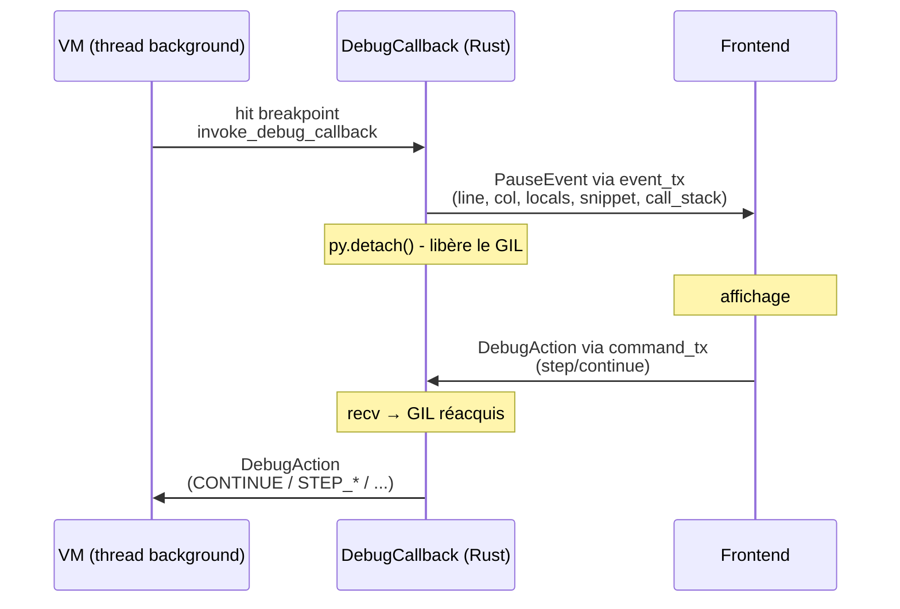

# Architecture

Vue d'ensemble de l'architecture Catnip pour contributeurs.

## Stratégie : Rust + Python

Catnip utilise une architecture hybride, pour garder l'ergonomie côté Python et la performance côté Rust :

**Python** : API de haut niveau, orchestration, intégration

- Classe principale `Catnip` (`catnip/__init__.py`)
- Context et gestion de l'environnement
- Interface REPL et CLI

**Rust** : Composants bas niveau (via PyO3)

- Parser et transformations (tree-sitter)
- Semantic analyzer et optimisations
- Scope management (O(1) lookup)
- VM bytecode et JIT (Cranelift)
- Registry et dispatch d'opérations

**Principe** : Rust fait le travail lourd, Python garde l'interface simple.

### Pourquoi PyO3

[PyO3](https://pyo3.rs/) sert de pont propre entre Python et Rust :

- Interopérabilité zero-cost (pas de sérialisation)
- Memory safety garantie par Rust
- Intégration directe avec l'API Python
- Utilisé par projet production (Ruff, Polars, tiktoken)

**Références** :

- [PyO3 User Guide](https://pyo3.rs/)
- [Extending Python with Rust](https://www.youtube.com/watch?v=jmP_i3C_O4Y) (PyCon 2023)

## Pipeline de Compilation

Catnip transforme le code source en résultat exécutable via un pipeline en 4 étapes :

```
1. Parsing        → Parse tree (CST)
2. Transformation → IR (Intermediate Representation)
3. Semantic       → Op (Optimized AST)
4. Execution      → Result
```

### 1. Parsing : Tree-sitter

Le parser utilise [Tree-sitter](https://tree-sitter.github.io/tree-sitter/), un générateur de parseur incrémental :

**Pourquoi Tree-sitter** :

- Parser généré en C (performance native)
- Parsing incrémental (réévalue seulement les modifications)
- Error recovery (robuste face aux erreurs de syntaxe)
- Écosystème riche (syntax highlighting, code folding)

**Grammaire** : `catnip_grammar/grammar.js` définit la syntaxe complète

**Avantage vs parser manuel** : la précédence des opérateurs est déjà codée dans la grammaire (`prec.left()`, `prec.right()`), pas besoin de la recoder ailleurs.

**Références** :

- [Tree-sitter documentation](https://tree-sitter.github.io/tree-sitter/)
- [Tree-sitter in Practice](https://siraben.dev/2022/03/01/tree-sitter.html)

### 2. Transformation : CST → IR

Le transformer (`catnip_rs/src/parser/`) convertit l'arbre de syntaxe en IR (Intermediate Representation) :

**IR** : structure basée sur des OpCode (entiers) pour identifier les opérations

- Sortie brute du parser, pas encore optimisée
- Utilise l'enum `IROpCode` (57 opcodes)
- Type `IRPure` (Rust) sans dépendance PyO3 pour pipeline standalone

**Architecture unifiée** :

- `pure_transforms.rs` : source unique de vérité (72+ transformateurs en Rust pur)
- `transforms.rs` : Wrapper PyO3 ultra-léger qui délègue et convertit
- `to_python.rs` : Convertisseur `IRPure` → objets Python (IR, Ref, Pattern\*)
- `utils.rs` : Helpers partagés (node_text, named_children, unescape_string, extract_operator)

**Transformateurs** couvrent tout le langage :

- Literals (int, float, string, list, dict)
- Operators (binary, unary, comparison, bitwise)
- Control flow (if, while, for, match, block)
- Functions (lambda, fn_def, call)
- Pattern matching (literal, var, wildcard, or, tuple)
- Broadcasting et accès (chained, getattr, index, slice)

### 3. Semantic Analysis : IR → Op

L'analyse sémantique (`catnip_rs/src/semantic/`) transforme l'IR en Op exécutable :

**Responsabilités** :

- Résolution des identifiants
- Détection des tail calls (TCO)
- Application des pragmas
- Optimisations (6 passes)

**Optimisations** (optionnel, contrôlé par niveau 0-3) :

- **Passes IR** (niveau expression) : simplifications locales (constant folding, CSE, dead code, etc.)
- **Passes CFG/SSA** (niveau contrôle de flux, level >= 3) : optimisations globales (voir ci-dessous)

Voir [OPTIMIZATIONS](OPTIMIZATIONS.md) pour détails sur les niveaux.

**Op** : structure exécutable finale avec OpCode optimisé (57 opcodes)

#### CFG/SSA : Optimisations Inter-blocs

À partir du niveau 3, le semantic analyzer construit un **Control Flow Graph** (CFG) puis passe en **SSA** pour pouvoir optimiser à l'échelle de plusieurs blocs.

> Warning: ce passage augmente la résistance mentale de +5.

**Pipeline CFG/SSA** :

```
IR optimisé (passes locales)
    ↓
1. Construction CFG    (builder_ir.rs)     → BasicBlocks + edges
2. Analyse dominance   (analysis.rs)       → Dominator tree, boucles
3. Construction SSA    (ssa_builder.rs)     → SSA values, phi-nodes
4. Passes SSA          (ssa_*.rs)          → Optimisations inter-blocs
5. Destruction SSA     (ssa_destruction.rs) → SetLocals explicites
6. Optimisations CFG   (optimization.rs)   → Dead blocks, merging
7. Reconstruction IR   (region.rs)         → Op nodes optimisés
```

**Passes SSA** (4 passes inter-blocs) :

1. **CSE inter-blocs** (`ssa_cse.rs`) - Élimine expressions redondantes entre blocs dominants
1. **LICM** (`ssa_licm.rs`) - Hoist les calculs invariants hors des boucles
1. **GVN** (`ssa_gvn.rs`) - Global Value Numbering, détecte équivalences entre expressions
1. **DSE globale** (`ssa_dse.rs`) - Élimine les SetLocals dont le résultat n'est jamais lu

**Construction SSA** : utilise l'algorithme de [Braun et al. (2013)](https://pp.info.uni-karlsruhe.de/uploads/publikationen/braun13cc.pdf), en un seul passage RPO (reverse postorder), sans calcul explicite des dominance frontiers.

**SetLocals** est le nœud IR central pour l'SSA : chaque affectation crée une nouvelle version de variable. Les phi-nodes aux jonctions sont convertis en SetLocals explicites lors de la destruction SSA.

> L'SSA garantit que chaque variable n'est assignée qu'une seule fois. Ce qui est pratique pour l'optimiseur, mais existentiellement perturbant pour les variables qui se pensaient réassignables.

### 4. Execution : Deux modes

Catnip supporte deux modes d'exécution :

**VM Bytecode** (défaut) :

- Compile Op → bytecode → VM stack-based
- NaN-boxing pour représentation compacte
- JIT Cranelift pour hot loops/functions
- Voir [VM](VM.md) pour détails

**AST Interpretation** (fallback) :

- Interprète Op directement via Registry
- Dispatch O(1) en Rust
- Utilisé pour debug et tests

## Concepts Clés

### OpCode : Identifiants d'Opérations

Les opérations sont identifiées par l'enum `OpCode` (Rust), utilisée pour le dispatch rapide et la cohérence entre parsing, semantic et exécution.

**Avantages vs strings** :

- Comparaisons O(1) (entiers vs strings)
- Lookups rapides dans dictionnaires
- Consommation mémoire réduite

**Convention** : Opcodes correspondant à mots-clés Python préfixés `OP_` (`OP_IF`, `OP_WHILE`)

### Scope : Variables O(1)

La gestion des scopes utilise un **HashMap plat** en Rust, plutôt qu'une chaîne de scopes parents :

**Approche classique** (O(n) lookup) :

```
Scope 3 → Scope 2 → Scope 1 → Global
```

Recherche d'une variable = remonter la chaîne jusqu'à trouver

**Approche Catnip** (O(1) lookup) :

- Un seul HashMap contenant toutes les variables
- Tracking par frame pour savoir quoi nettoyer au pop
- Shadow stack pour gérer le masquage de variables

**Trade-off** : lookup O(1), cleanup O(n) où n = variables dans le frame

**Références** :

- [Hash table](https://en.wikipedia.org/wiki/Hash_table) (Wikipedia)
- Concept inspiré de V8's hidden classes

> Les scopes classiques sont une tour d'annuaires empilés. Pour trouver un numéro, on monte étage par étage. Catnip utilise un annuaire unique avec des post-its de couleur pour savoir quel numéro appartient à quel étage. Chercher est instantané, ranger nécessite de lire les post-its.

### Registry : Table des Opérations

Le Registry (`catnip_rs/src/core/registry/`) est le moteur d'exécution :

**Responsabilités** :

- Dispatcher les opcodes vers leurs implémentations
- Gérer la stack d'évaluation
- Exécuter les opérations (arithmétique, logique, contrôle de flux, etc.)

**Dispatch** : pattern matching Rust direct (O(1))

- Compare l'opcode
- Appelle la fonction Rust appropriée
- Optimisé par le compilateur Rust (branch prediction)

**Modules Registry** : 12 fichiers spécialisés dans `core/registry/` (arithmetic.rs, logical.rs, control_flow.rs, functions.rs, patterns.rs, etc.)

### Tail Call Optimization (TCO)

Catnip utilise un **trampoline pattern** pour éviter que la pile d'appels grossisse :

**Principe** :

1. La fonction tail-recursive retourne `TailCall(func, args)` au lieu d'appeler
1. La boucle trampoline détecte `TailCall`, rebind les paramètres, continue
1. Un seul frame Python pour toute la récursion

**Avantage** : récursion possible sans gonfler la stack (O(1) stack space)

**Détection** : automatique par l'analyseur sémantique (appels en dernière position)

**Références** :

- [Tail call](https://en.wikipedia.org/wiki/Tail_call) (Wikipedia)
- [Proper Tail Calls in Scheme](https://www.scheme.com/tspl4/further.html#./further:h3)

### Lazy Evaluation

Les opérations de contrôle de flux (`if`, `while`, `for`, `match`, etc.) reçoivent leurs arguments **non évalués** :

**Raison** : les blocs doivent être évalués conditionnellement ou plusieurs fois

```python
# if (condition) { then_block } else { else_block }
# → then_block et else_block ne sont PAS évalués immédiatement
# → Seul le bloc choisi sera exécuté
```

**Implémentation** : HashSet `CONTROL_FLOW_OPS` marque les opcodes lazy

### Error Handling : Source Locations

Les erreurs runtime capturent la position source complète (fichier, ligne, colonne) avec une pile d'appels claire.

**Pipeline de propagation** :

```
Tree-sitter (start_byte, end_byte)
    ↓
IR nodes (positions natives)
    ↓
Semantic Analyzer (propagate_position)
    ↓
Op nodes (start_byte, end_byte préservés)
    ↓
VM Compiler (line_table par instruction)
    ↓
VM Error → ErrorContext → CatnipError
```

**Line table** : le `CodeObject` contient un `Vec<u32>` parallèle aux instructions, qui mappe chaque instruction vers son `start_byte`.

**Call stack** : la VM maintient une pile d'appels avec nom de fonction et position source. Push/pop dans les handlers CALL/TAILCALL/RETURN.

**Capture lazy** : quand une erreur se produit, `capture_error_context()` lit la line table, snapshote le call stack, puis le bridge Python (`rust_bridge.py`) convertit `start_byte` en ligne/colonne et enrichit l'exception avec un extrait.

**Résultat** : messages d'erreur avec traceback complet :

```
File '<input>', line 2, column 14: division by zero
    2 | f = (x) => { x / 0 }
    |              ^
Traceback (most recent call last):
  File "<input>", in <lambda>
CatnipRuntimeError: division by zero
```

**Détails** : voir [VM](VM.md) pour l'architecture.

## Debugger

Le debugger connecte la VM Rust à un frontend (console Rust ou MCP Python) via des channels `std::sync::mpsc`.

### Architecture



### Points d'entrée dans la VM

Le breakpoint opcode (IR=57, VM=71) est injecté par l'analyseur sémantique quand il rencontre un appel `breakpoint()`. La VM intercepte aussi les instructions dont le `start_byte` correspond à un breakpoint utilisateur (ajouté via `add_debug_breakpoint(offset)`).

Au point de pause, la VM snapshote l'état : variables locales (slotmap complet, y compris nil), call stack, et position source. Le `DebugCallback` Rust construit un `PauseEvent`, l'envoie via `event_tx`, puis libère le GIL pendant `command_rx.recv_timeout(60s)` (auto-continue après 5 min).

### Composants

- `catnip_tools/src/debugger.rs` -- logique pure : parsing de commandes (`DebugCommand` enum), formatage de sortie (help, pause, vars, backtrace)
- `catnip_tools/src/sourcemap.rs` -- `SourceMap` : conversion lazy byte offset -> ligne/colonne, extraction de snippets
- `catnip_rs/src/debug/callback.rs` -- `DebugCallback` : `#[pyclass]` callable, channels mpsc, libère le GIL pendant l'attente
- `catnip_rs/src/debug/session.rs` -- `RustDebugSession` : gestion des channels, spawn du thread VM, `wait_for_event` avec libération GIL
- `catnip_rs/src/debug/console.rs` -- `run_debugger()` : boucle console Rust (`py.detach()`), `Python::attach()` pour eval
- `catnip_rs/src/tools/debugger_shims.rs` -- wrappers PyO3 pour `DebugCommand`, `SourceMap`, fonctions de formatage
- `catnip/debug/session.py` -- `DebugSession` : wrapper Python autour de `RustDebugSession`, préserve l'API pour tests et MCP
- `catnip/debug/console.py` -- `ConsoleDebugger` : délègue à `run_debugger()` Rust
- `catnip_rs/src/vm/core.rs` -- bloc `debug_should_pause` : collecte des locals, invocation du callback
- `catnip_mcp/server.py` -- 6 tools MCP (`debug_start`, `debug_continue`, `debug_step`, `debug_inspect`, `debug_eval`, `debug_breakpoint`)

### Step modes

| Action      | Comportement                                        |
| ----------- | --------------------------------------------------- |
| `CONTINUE`  | Reprend jusqu'au prochain breakpoint                |
| `STEP_INTO` | Pause à la prochaine instruction                    |
| `STEP_OVER` | Pause à la prochaine instruction de même profondeur |
| `STEP_OUT`  | Pause au retour du frame courant                    |

> Le debugger observe la VM sans la modifier. Ce qui est pratique, parce qu'un debugger qui modifie l'exécution du programme qu'il débogue serait un programme qui s'observe en train de ne pas être lui-même.

## Où Trouver le Code

- `catnip/` : API Python publique et couches d'intégration (debug, semantic, transformer, VM).
- `catnip_grammar/` : grammaire Tree-sitter et corpus de tests de parsing.
- `catnip_tools/` : outils standalone (formatter, linter) côté Rust.
- `catnip_rs/` : runtime Rust principal (IR, parser, semantic, CFG/SSA, VM, JIT, pragmas).

## Workflow de Développement

```bash
# Après modification Rust
uv pip install -e .

# Tests rapides Rust (~5s)
make rust-test-fast

# Tests complets Python (~25s)
make test

# Après modification grammar.js
make grammar-deps
```
