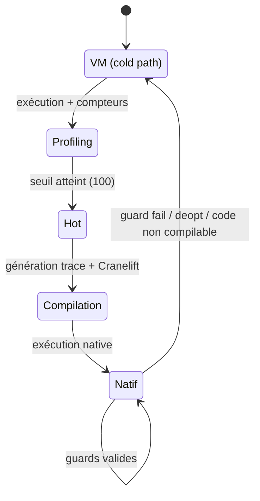
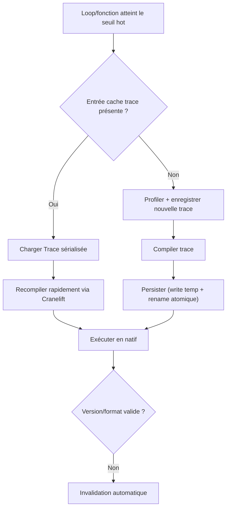

# Compilation JIT

Catnip utilise un compilateur Just-In-Time (JIT) pour accélérer automatiquement le code qui tourne souvent.

## Pourquoi un JIT

Le JIT corrige trois limites majeures de l'interprétation :

**Performance** : code natif 100-200x plus rapide que la VM sur les boucles numériques

**Stack overflow** : évite les limites de profondeur pour les fonctions récursives compilées

**Transparence** : activation automatique sans intervention utilisateur (détection à chaud)

## Architecture : Trace-based JIT

Catnip utilise une approche **trace-based** plutôt que method-based :

- On enregistre l'**exécution réelle** d'une boucle ou fonction (trace)
- On compile cette trace linéaire en code natif
- Les branches rarement prises sont ignorées (guards + deoptimization)

Cette approche simplifie la compilation et optimise les chemins chauds réels plutôt que tous les chemins possibles.

> La trace JIT regarde le réel, puis lui colle un circuit rapide en natif. Si ça part en freestyle, retour VM sans
> drame. On bétonne les trajets du quotidien, on tague le reste.

### Références académiques

**Trace compilation** :
[Gal et al. 2009 - "Trace-based Just-in-Time Type Specialization for Dynamic Languages"](https://doi.org/10.1145/1542476.1542528)
(ACM PLDI)

**Deoptimization** :
[Hölzle et al. 1992 - "Debugging Optimized Code with Dynamic Deoptimization"](https://dl.acm.org/doi/10.1145/143095.143114)
(ACM PLDI)

## Backend : Cranelift

Catnip utilise [Cranelift](https://cranelift.dev/) comme backend de compilation :

> Transparence : Cranelift n'est pas formellement prouvé dans ce repo.

- Bibliothèque Rust pour génération de code machine (x86-64, ARM64, etc.)
- Temps de compilation rapide (adapté au JIT)
- Utilisé par Wasmtime, SpiderMonkey, autres projets production
- Alternative moderne à LLVM pour cas d'usage JIT

**Pourquoi Cranelift** :

- Intégration Rust native (pas de FFI)
- Compile en ~100µs (vs millisecondes pour LLVM)
- API sûre (pas d'UB possible en Rust safe)
- Maintenance active (Bytecode Alliance)

## Détection de code chaud

Le JIT surveille deux types de "hot paths" :



### Loops (boucles)

**Seuil** : 100 itérations du même loop body

```python
# Devient hot après 100 itérations
for i in range(10000) {
    sum = sum + i
}
# Itération 1-100 : interpréteur + profiling
# Itération 100 : compilation trace
# Itération 101+ : code natif
```

### Functions (fonctions)

**Seuil** : 100 appels de la même fonction

```python
fib = (n) => {
    if n < 2 { n } else { fib(n-1) + fib(n-2) }
}

fib(30)
# Appels 1-100 : interpréteur + profiling
# Appel 100 : compilation trace (avec CallSelf natif)
# Appel 101+ : code natif récursif
```

**Identification** : fonction identifiée par hash stable du bytecode + nom + nombre d'arguments

## Optimisations supportées

Le JIT applique automatiquement :

**Spécialisation de types** : génère du code natif pour int/float détectés dans la trace

**Élimination d'overhead** : pas de boxing/unboxing, dispatch direct

**Builtins natifs** : `abs`, `bool`, `int`, `max`, `min`, `round` compilés en instructions machine
(icmp/select/identity), `float` via callback extern C -- pas d'appel Python

**Inline de fonctions pures** : petites fonctions pures (\<20 opcodes) inlinées automatiquement

**Récursion native** : appels récursifs compilés en CALL natif (avec protection overflow)

## Activation et contrôle

**Défaut** : JIT activé automatiquement en mode VM

**Désactiver** :

```bash
catnip -o jit:off script.cat
```

**Pragma** :

```python
pragma("jit", False)  # Désactive JIT pour ce fichier
```

**Variables d'environnement** :

```bash
CATNIP_OPTIMIZE=jit:off catnip script.cat
```

## Cache de traces

Les traces compilées sont persistées sur disque pour éliminer le warm-up au prochain lancement.

### Mécanisme



1. **Hash du bytecode** : chaque programme reçoit un hash FNV-1a calculé sur les instructions (opcode + arg) ET le
   constant pool (valeurs NaN-boxed). Deux programmes avec les mêmes instructions mais des constantes différentes
   produisent des hash différents.

1. **Stockage** : les traces sont sérialisées en bincode dans `~/.cache/catnip/` (fichiers plats). Clé :
   `jit_v{VERSION}_{HASH:016x}_{OFFSET:06x}`.

1. **Chargement** : au moment où la VM détecte un loop chaud (seuil 100), elle vérifie d'abord le cache disque. Si une
   trace existe et que la version correspond, elle est rechargée et recompilée via Cranelift sans repasser par
   l'enregistrement.

1. **Invalidation** : par version Catnip + version format cache. Un changement de version invalide automatiquement les
   entrées.

### Multiprocessus (ND)

Le cache est safe pour l'exécution concurrente ND (mode `spawn`) :

- **Atomic writes** : écriture dans fichier temporaire puis `rename()` (POSIX atomique)
- **Last writer wins** : toutes les traces pour un même offset sont équivalentes, pas besoin de lock
- **Mémoire séparée** : chaque worker recompile indépendamment depuis la trace cachée

### Ce qui est cachée vs ce qui ne l'est pas

**Cachée** : la `Trace` (séquence de `TraceOp`, type, metadata) - structure sérialisable

**Non cachée** : le `CompiledFn` (pointeur vers code machine) - runtime-specific, non sérialisable

Les stencils Cranelift (code machine non relocaté + table de relocations) sont cachés séparément (`jit_native_{SHA256}`)
via le trait `CacheKvStore` de Cranelift. Au rechargement, le stencil est désérialisé et les relocations appliquées par
`define_function_bytes` + `finalize_definitions` -- sans repasser par la compilation Cranelift. La clé SHA-256 inclut le
triple ISA + les flags CPU, ce qui invalide le cache en cas de changement d'architecture.

> Le cache garde la trace (le plan), pas le binaire final. Chaque process forge son code machine localement.

## Limitations et fallback

Le JIT ne compile pas tout le code :

**Non compilable** :

- Appels à fonctions Python externes (sauf builtins purs : `abs`, `bool`, `float`, `int`, `max`, `min`, `round`)
- Opérations non supportées (I/O, réflexion)
- Branches froides (rarement exécutées)

**Comportement** : fallback transparent vers l'interpréteur VM, aucune erreur

**Deoptimization** : si une guard échoue (type change, condition inattendue), retour à l'interpréteur

## Performances typiques

| Type de code                  | Speedup vs VM  |
| ----------------------------- | -------------- |
| Boucles arithmétiques (int)   | 100-200x       |
| Boucles arithmétiques (float) | 50-100x        |
| Fonctions récursives simples  | 1.1-2x         |
| Fonctions avec inline         | 1.2-1.4x       |
| Code avec beaucoup d'I/O      | 1.0x (JIT off) |

> Le JIT aime les workloads CPU-bound qui cognent fort. Si ton code attend surtout le réseau/disque, il reste zen et le
> gain reste modeste.
