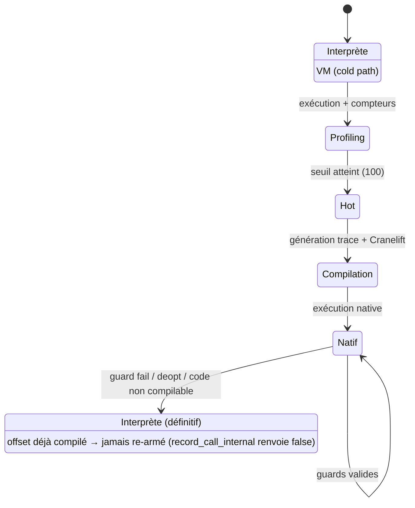
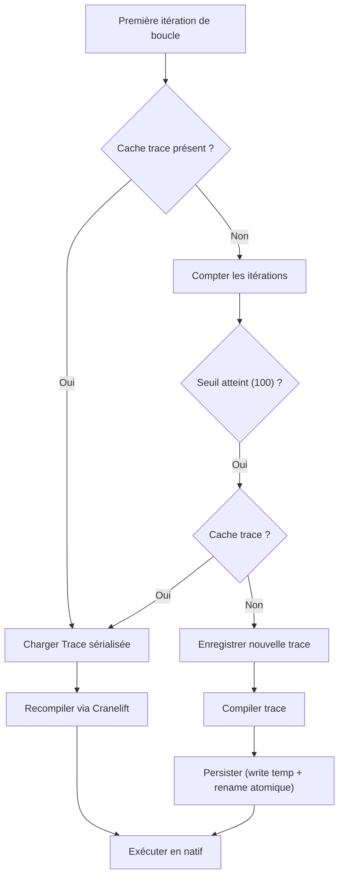

# Compilation JIT

Catnip utilise un compilateur Just-In-Time (JIT) pour accélérer automatiquement le code qui tourne souvent.

## Pourquoi un JIT

Le JIT corrige trois limites majeures de l'interprétation :

**Performance** : code natif 100-200x plus rapide que la VM sur les boucles numériques

**Stack overflow** : évite les limites de profondeur pour les fonctions récursives compilées

**Transparence** : activation automatique sans intervention utilisateur (détection à chaud)

## Architecture : Trace-based JIT

Catnip utilise une approche **trace-based** plutôt que method-based :

- On enregistre l'**exécution réelle** d'une boucle ou fonction (trace)
- On compile cette trace linéaire en code natif
- Les branches rarement prises sont ignorées (guards + deoptimization)

Cette approche simplifie la compilation et optimise les chemins chauds réels plutôt que tous les chemins possibles.

> La trace JIT regarde le réel, puis lui colle un circuit rapide en natif. Si ça part en freestyle, retour VM sans
> drame. On bétonne les trajets du quotidien, on tague le reste.

### Références académiques

**Trace compilation** :
[Gal et al. 2009 - "Trace-based Just-in-Time Type Specialization for Dynamic Languages"](https://doi.org/10.1145/1542476.1542528)
(ACM PLDI)

**Deoptimization** :
[Hölzle et al. 1992 - "Debugging Optimized Code with Dynamic Deoptimization"](https://dl.acm.org/doi/10.1145/143095.143114)
(ACM PLDI)

## Backend : Cranelift

Catnip utilise [Cranelift](https://cranelift.dev/) comme backend de compilation :

> Transparence : Cranelift n'est pas formellement prouvé dans ce repo.

- Bibliothèque Rust pour génération de code machine (x86-64, ARM64, etc.)
- Temps de compilation rapide (adapté au JIT)
- Utilisé par Wasmtime, SpiderMonkey, autres projets production
- Alternative moderne à LLVM pour cas d'usage JIT

**Pourquoi Cranelift** :

- Intégration Rust native (pas de FFI)
- Compile en ~100µs (vs millisecondes pour LLVM)
- API sûre (pas d'UB possible en Rust safe)
- Maintenance active (Bytecode Alliance)

## Détection de code chaud

Le JIT surveille deux types de "hot paths" :



### Loops (boucles)

**Seuil** : 100 itérations du même loop body

```python
# Devient hot après 100 itérations
for i in range(10000) {
    sum = sum + i
}
# Itération 1-100 : interpréteur + profiling
# Itération 100 : compilation trace
# Itération 101+ : code natif
```

### Functions (fonctions)

**Seuil** : 100 appels de la même fonction

```python
fib = (n) => {
    if n < 2 { n } else { fib(n-1) + fib(n-2) }
}

fib(30)
# Appels 1-100 : interpréteur + profiling
# Appel 100 : compilation trace (avec CallSelf natif)
# Appel 101+ : code natif récursif
```

**Identification** : fonction identifiée par hash stable du bytecode + nom + nombre d'arguments

## Optimisations supportées

Le JIT applique automatiquement :

**Spécialisation de types** : génère du code natif pour int/float détectés dans la trace. Quand l'arithmétique est déjà
typée en amont (opcodes `AddInt`/`AddFloat`, `SubInt`/`SubFloat`, `MulInt`/`MulFloat` issus de la réécriture sémantique,
voir `docs/dev/OPTIMIZATIONS.md`), le type de l'opération est connu statiquement : la trace choisit son opcode natif
sans dépendre du profilage de valeurs.

**Élimination d'overhead** : pas de boxing/unboxing, dispatch direct

**Builtins natifs** : `abs`, `bool`, `int`, `max`, `min`, `round` compilés en instructions machine
(icmp/select/identity), `float` via callback extern C - pas d'appel Python

**Récursion native** : appels récursifs compilés en CALL natif (avec protection overflow)

**Division gardée interprétée** : la division n'est pas compilée en instruction native. La division vraie (`/`) produit
toujours un `float` et doit lever sur diviseur nul ; ni `sdiv` (troncature entière + trap matériel sur `/0`) ni `fdiv`
(qui renvoie `inf` sur `/0`) ne préservent cette sémantique. Le traceur émet donc un *fallback* sur la division, ce qui
rend la trace non compilable et laisse la boucle s'exécuter dans l'interpréteur (résultat `float` correct,
`ZeroDivisionError` levée). Réactiver une division native suppose un side-exit gardé sur diviseur nul.

> Une boucle qui divise par zéro à la millième itération doit lever à la millième itération, pas renvoyer l'infini en
> silence.

**Modulo compilé avec side-exit** : contrairement à la division vraie, le modulo entier (`%`) *est* compilé. Le `srem`
natif a deux écueils, traités au codegen :

- **diviseur nul** : `srem` trappe (SIGFPE) là où l'interpréteur lève `ZeroDivisionError`. Le codegen garde donc le
  diviseur (`brif b == 0 → guard_fail_block`) et ne calcule le `srem` que sur le chemin non nul ; un diviseur nul déopte
  vers l'interpréteur qui rejoue l'itération et lève. Même forme que les guards d'overflow ci-dessous ;
- **signe** : `srem` est tronqué (signe du dividende), alors que `%` suit la sémantique plancher de Python (signe du
  diviseur). Le codegen applique le correctif plancher `r = srem(a,b); si r != 0 et (r ^ b) < 0 alors r + b` pour que la
  boucle compilée donne le même résultat que l'interpréteur sur des opérandes de signes opposés.

Les opérandes étant des SmallInt bornés (±2⁴⁶), le cas de trap `INT_MIN % -1` est inatteignable et `r + b` reste dans
les bornes (pas de deopt d'overflow nécessaire).

## Inlining de fonctions pures

Une boucle chaude qui appelle une fonction marquée `@pure` paie l'overhead d'un appel à chaque itération. Le JIT
remplace l'appel par le corps de la fonction directement dans la trace : un seul bloc de code natif, sans franchir la
frontière d'appel.

Deux familles :

- **builtins purs** (`abs`, `bool`, `int`, `max`, `min`, `round`) : remplacés par leurs instructions machine (voir «
  Builtins natifs ») ;
- **fonctions user `@pure`** : le corps de la callee est reconstruit depuis un registre (alimenté à chaque appel pur) et
  inséré à la place de l'appel. Le corps de la callee n'est pas tracé dans la boucle — l'appel apparaît comme une seule
  opération que l'inliner développe ensuite ; son `return` laisse le résultat sur la pile et la boucle continue.

**Soundness — garde d'identité.** Le corps inliné est figé au moment de la compilation. Si la fonction était réassignée
ensuite, la boucle compilée exécuterait l'ancien corps. Le JIT pose donc une garde sur l'identité de la fonction : à
l'entrée du code natif, la fonction doit toujours être la même qu'à la compilation, sinon la boucle déopte vers
l'interpréteur. Une fonction réassignée *dans* la boucle fait abandonner la trace.

> Une fonction inlinée est une promesse : « je suis encore moi à la prochaine itération ». La garde vérifie la promesse.

**Périmètre.** Sont inlinées les fonctions résolues depuis une portée englobante ou globale (helper `@pure` au niveau
module) **et** les fonctions tenues dans une variable locale de la frame qui porte la boucle. Les deux cas se ramènent à
la même forme : la fonction n'est jamais poussée sur la pile JIT — pour le cas local, son chargement (`LoadLocal`) est
élidé de la trace et remplacé par une garde d'identité sur le slot, lue directement dans `frame.locals`. La garde par
nom (portée/global) et la garde par slot (local) sont les deux variantes du même contrat « inliné ⟹ gardé ».

## Activation et contrôle

**Défaut** : JIT activé automatiquement en mode VM

**Désactiver** :

```bash
catnip -o jit:off script.cat
```

**Pragma** :

```python
pragma("jit", False)  # Désactive JIT pour ce fichier
```

**Variables d'environnement** :

```bash
CATNIP_OPTIMIZE=jit:off catnip script.cat
```

## Cache de traces

Les traces compilées sont persistées sur disque pour éliminer le warm-up au prochain lancement.

### Mécanisme



1. **Hash du bytecode** : chaque CodeObject reçoit un hash FNV-1a calculé sur les instructions (opcode + arg) ET le
   constant pool (valeurs NaN-boxed), cached dans un `OnceLock<u64>` pour éviter le recalcul. Le hash est mis à jour à
   chaque Call (nouveau frame) et restauré sur Return, propagé au JIT executor comme au détecteur de hot loops.

1. **Stockage** : les traces sont sérialisées en postcard dans `~/.cache/catnip/` (fichiers plats). Clé :
   `jit_v{VERSION}_{HASH:016x}_{OFFSET:06x}`.

1. **Warm-start** : au premier passage d'une boucle, la VM vérifie le cache disque *avant* de compter les itérations. Si
   une trace compilée existe, elle est chargée et le code natif est utilisé dès la première itération (zéro warm-up). Si
   pas de cache, le flow classique s'applique (100 itérations → hot → trace → compile → cache). Un offset compilé —
   fraîchement tracé ou chargé du cache — ne ré-arme plus la hot detection : des échecs de guards répétés (par exemple
   un flip de type entre deux appels) laissent la boucle interprétée au lieu de re-tracer et recompiler en plein vol (le
   compteur d'itérations reste alimenté pour les stats). Les symboles Cranelift sont versionnés par compilation
   (`trace_{hash}_{offset}_v{n}`) et les guards d'une trace ne sont écrits qu'après une compilation réussie : le contrat
   consulté par la VM décrit toujours le code réellement installé.

1. **Invalidation** : par version Catnip + version format cache. Un changement de version invalide automatiquement les
   entrées.

### Multiprocessus (ND)

Le cache est safe pour l'exécution concurrente ND (mode `spawn`) :

- **Atomic writes** : écriture dans fichier temporaire puis `rename()` (POSIX atomique)
- **Last writer wins** : à hash de bytecode *et* offset identiques, les traces sont équivalentes, pas besoin de lock
  (les workers ND exécutent le même bytecode) — l'état compilé est indexé par `(hash, offset)`, jamais par l'offset seul
- **Mémoire séparée** : chaque worker recompile indépendamment depuis la trace cached

### VM réutilisé (REPL, embedding)

En one-shot (`catnip script.cat`), un programme = un VM, et l'offset de boucle suffirait à identifier une trace. Mais un
même VM peut enchaîner des programmes sans rapport — REPL ligne à ligne, hôte qui embarque le moteur — et deux d'entre
eux ont souvent une boucle chaude au *même* offset sans partager une ligne de code.

D'où l'invariant : **tout** l'état JIT en mémoire est keyé par `(hash, offset)`, jamais par l'offset seul — les
compteurs du `HotLoopDetector`, le code compilé, et le symbole de la boucle dans le module Cranelift partagé
(`trace_{hash}_{offset}`). Sinon le second programme serait vu « déjà chaud » et jamais re-compilé, ou redéclarerait un
symbole déjà défini → échec de compilation. Les traces de fonction, elles, sont déjà uniques par identité de fonction et
compilées au plus une fois : elles gardent un nom nu.

> Le hash ne sert pas qu'à retrouver une trace sur disque : il empêche deux programmes qui se croisent au même offset de
> se prendre l'un pour l'autre.

### Ce qui est cached vs ce qui ne l'est pas

**Cachée** : la `Trace` (séquence de `TraceOp`, type, metadata) - structure sérialisable

**Non cached** : le `CompiledFn` (pointeur vers code machine) - runtime-specific, non sérialisable

Les stencils Cranelift (code machine non relocaté + table de relocations) sont cached séparément
(`jit_nv{CACHE_VERSION}_{SHA256}`) via le trait `CacheKvStore` de Cranelift. Le préfixe `nv` (native versioned) inclut
`CACHE_VERSION = VMOpCode::MAX + COMPILER_SALT`, ce qui invalide automatiquement le cache quand les opcodes, la
sémantique de compilation, ou le layout de la `Trace` sérialisée changent (bump de `COMPILER_SALT`). Au démarrage, les
fichiers d'anciennes versions (y compris le legacy `jit_native_*`) sont nettoyés. Au rechargement, le stencil est
désérialisé et les relocations appliquées par `define_function_bytes` + `finalize_definitions` -- sans repasser par la
compilation Cranelift.

> Le cache garde la trace (le plan), pas le binaire final. Chaque process forge son code machine localement.

## Limitations et fallback

Le JIT ne compile pas tout le code :

**Non compilable** :

- Appels à fonctions Python externes (sauf builtins purs : `abs`, `bool`, `float`, `int`, `max`, `min`, `round`)
- Opérations non supportées (I/O, réflexion)
- Branches froides (rarement exécutées)
- Exception handling : les opcodes `SetupExcept`, `SetupFinally`, `PopHandler`, `Raise`, `ResumeUnwind`,
  `ClearException` abort la trace immédiatement. Une boucle contenant du `try`/`except` ne sera pas JIT-compilée
- Opérandes non numériques : si une valeur observée au moment du trace n'est ni `int`, ni `bool`, ni `float`
  (typiquement un `BigInt` issu d'un dépassement SmallInt *avant* que la boucle ne chauffe, mais aussi une struct, un
  module, etc.), la trace est abandonnée et la boucle reste interprétée. Le JIT ne raisonne que sur des scalaires
  numériques. À distinguer du deopt d'overflow (voir « Overflow Guards »), qui gère un SmallInt débordant *pendant* une
  boucle déjà compilée

**Comportement** : fallback transparent vers l'interpréteur VM, aucune erreur. L'abort sur exception reset l'état de
tracing pour que les boucles suivantes dans la même session puissent encore être compilées

**Deoptimization** : si une guard échoue (type change, condition inattendue), retour à l'interpréteur.

**Contrat de type par slot** : le code compilé déboîte chaque slot local avec le type observé au moment du trace
(`GuardInt` → extraction du payload i64, `GuardFloat` → bitcast f64) et ne revérifie *jamais* au runtime — les
`GuardInt`/`GuardFloat` compilent en no-op. L'unique garde est à l'entrée : la VM valide chaque slot tracé contre son
type (`slot_type_guards`, extraits post-inlining), et les slots non tracés contre « scalaire numérique » (le write-back
écraserait un type heap sans release). Un slot au mauvais type = pas d'entrée JIT, jamais un résultat faux. Même contrat
pour les fonctions compilées : leurs arguments sont des i64 natifs, tout argument non-int retombe sur l'interpréteur.

## Performances typiques

| Type de code                  | Speedup vs VM  |
| ----------------------------- | -------------- |
| Boucles arithmétiques (int)   | 100-200x       |
| Boucles arithmétiques (float) | 50-100x        |
| Fonctions récursives simples  | 1.1-2x         |
| Code avec beaucoup d'I/O      | 1.0x (JIT off) |

> Le JIT aime les workloads CPU-bound qui cognent fort. Si ton code attend surtout le réseau/disque, il reste zen et le
> gain reste modeste.

## SSA et Block Parameters

Cranelift travaille en SSA (Static Single Assignment) en interne. Catnip utilise des **block parameters explicites**
pour les variables loop-carried, plutôt que de s'appuyer sur l'inférence automatique de phi-nodes.

### Pourquoi des block parameters

L'inférence automatique via `use_var()`/`def_var()` de Cranelift casse quand une variable est utilisée puis redéfinie
dans le corps d'une boucle (def après use). Le résultat : la variable garde sa valeur initiale à chaque itération.

```python
# Ce code bouclait infiniment avant le fix
total = 0
for i in range(1000) {
    total = total + i
}
```

### Solution : passage explicite

Les variables mutées dans la boucle sont passées comme paramètres du bloc :

```rust
// Création des paramètres de boucle
let loop_params: Vec<Value> = locals_order
    .iter()
    .map(|_| builder.append_block_param(loop_block, types::I64))
    .collect();

// Jump initial avec valeurs initiales
builder.ins().jump(loop_block, &initial_vals);

// Back edge avec valeurs mises à jour
let back_args: Vec<Value> = locals_order
    .iter()
    .map(|slot| builder.use_var(slot_vars[slot]))
    .collect();
builder.ins().jump(loop_block, &back_args);
```

`locals_order` est trié en amont pour garantir que tous les jumps vers `loop_block` passent les arguments dans le même
ordre.

**Référence SSA** : Cytron et al. (1991), "Efficiently Computing Static Single Assignment Form and the Control
Dependence Graph" (IEEE TOPLAS). Construction SSA du pipeline CFG/SSA de Catnip : Braun et al. (2013), "Simple and
Efficient Construction of Static Single Assignment Form".

## Préservation des locals non-JIT

Le JIT opère sur un tableau `Vec<i64>` contenant les bits NaN-boxed bruts des `Value` du frame (`v.bits() as i64`). Le
codegen Cranelift unboxe les valeurs dans l'entry block (extraction du payload pour les ints, bitcast pour les floats)
et re-boxe dans les exit/guard_fail blocks avant de les écrire en mémoire.

Après exécution JIT, seuls les slots dont la valeur NaN-boxed a changé sont restaurés dans le frame via
`Value::from_raw()`. Les slots inchangés conservent leur `Value` originale.

## Overflow Guards (BigInt)

Les opérations arithmétiques compilées (+, -, \*) incluent des guards de dépassement SmallInt. Après chaque `iadd`,
`isub`, `imul` Cranelift, le codegen vérifie que le résultat reste dans la plage 47-bit signée :

```rust
let too_big = builder.ins().icmp(SignedGreaterThan, result, max_val);
let too_small = builder.ins().icmp(SignedLessThan, result, min_val);
let overflow = builder.ins().bor(too_big, too_small);
builder.ins().brif(overflow, guard_fail_block, &fail_args, cont, &cont_args);
```

Si le résultat dépasse la plage SmallInt, le code natif effectue une **deoptimization** : retour à l'interpréteur VM qui
gère la promotion BigInt correctement. Ce mécanisme garantit que les boucles JIT-compilées produisant des entiers larges
(ex: fibonacci au-delà de 2^46) fonctionnent sans corruption.

**Restauration post-JIT** : quand le JIT rend la main (exit normal ou guard failure), les locals sont restaurés depuis
le `Vec<i64>` via `Value::from_raw()` -- les valeurs sont déjà NaN-boxed par le codegen. L'ancienne valeur du slot est
`decref`-ée avant écrasement pour maintenir l'intégrité du refcount des valeurs heap-allocated.

**Sortie normale vs side-exit** : les deux blocs n'écrivent pas le même état. L'`exit_block` (condition de boucle
fausse) écrit l'état *final* des locals. Le `guard_fail_block` écrit l'état *début d'itération* -- les block params du
header de boucle, qui dominent le bloc. La raison : au side-exit, l'interpréteur reprend en rejouant l'itération fautive
**entière** depuis le header (`frame.ip = loop_offset`). Écrire les valeurs mi-itération réappliquerait chaque
`StoreLocal` committé avant le guard (ex. `total += i` suivi d'une branche gardée), double-comptant l'accumulateur sur
l'itération du repli.

> Le code natif a déjà vécu l'itération ; l'interpréteur la rejoue. Pour que les deux ne s'additionnent pas, on rend la
> mémoire à l'instant d'avant.
