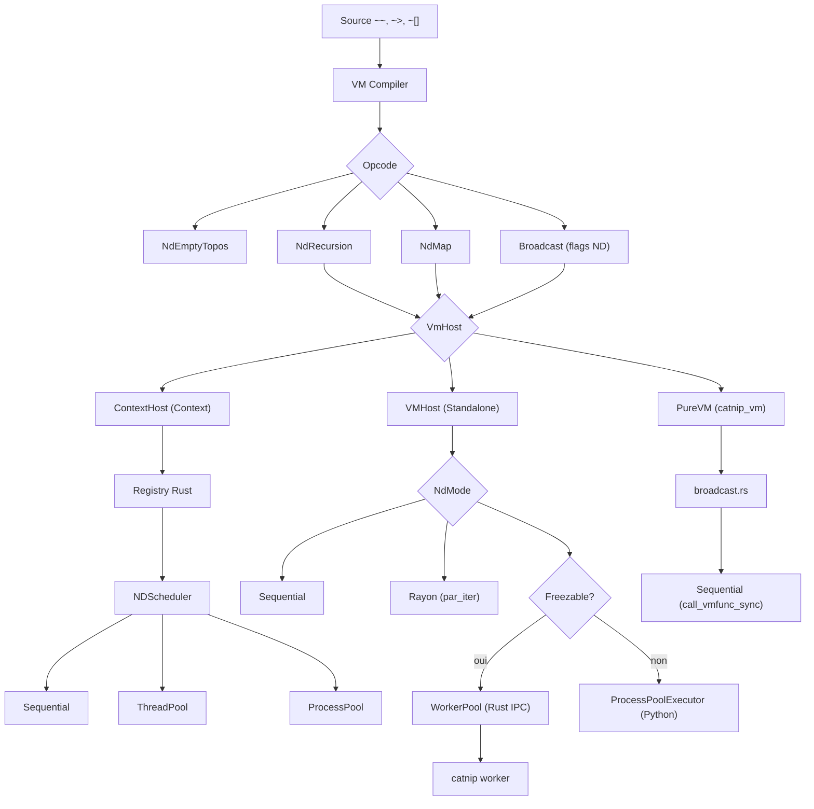

# ND VM Architecture

Ce document explique comment les opérations non-déterministes (\~~, ~>, ~[]) passent dans la VM et le bytecode.

## Vue d'ensemble

Les opérations ND sont compilées en opcodes VM dédiés qui délèguent l'exécution au `VmHost`. L'architecture garantit :

- **Cohérence sémantique** : même comportement en AST et en VM
- **Performance** : dispatch O(1) via opcodes dédiés
- **Abstraction** : le trait `VmHost` permet deux chemins d'exécution (ContextHost via Registry/NDScheduler, VMHost via
  rayon/WorkerPool natif)



## Opcodes VM

### NdEmptyTopos

Singleton vide `~[]` - élément identité des opérations ND.

**Stack effect** : `() -> NDTopos`

**Implémentation** :

```rust
OpCode::NdEmptyTopos => {
    let nd_topos = NDTopos.instance()  // Import depuis catnip.nd
    frame.push(nd_topos)
}
```

**Bytecode** :

```
NdEmptyTopos 0
```

### NdRecursion

Opérateur `~~` - récursion non-déterministe avec 2 formes.

**Stack effect** : variable selon arg

- Form 0 (combinator) : `(seed, lambda) -> result`
- Form 1 (declaration) : `(lambda) -> lambda`

**Arguments** :

- `arg = 0` : Combinator form `~~(seed, lambda)`
- `arg = 1` : Declaration form `~~ lambda`

**Implémentation** :

```rust
OpCode::NdRecursion => {
    if arg == 0 {
        // Combinator: pop lambda, pop seed, execute
        let lambda = frame.pop()
        let seed = frame.pop()
        let result = registry.execute_nd_recursion_py(seed, lambda)
        frame.push(result)
    } else {
        // Declaration: pop lambda, wrap in NDDeclaration
        let lambda = frame.pop()
        let decl = NDDeclaration::new(lambda, ctx)
        frame.push(decl)
    }
}
```

`NDDeclaration` est un wrapper callable : quand `f(seed)` est appelé, il crée un `NDScheduler` et dispatche vers
`execute_sync`/`execute_thread`/`execute_process` selon les pragmas du contexte.

**Bytecode** :

```
# Combinator: ~~(5, (n, r) => n - 1)
LoadConst 0        # Push 5
LoadConst 1        # Push lambda
NdRecursion 0      # Execute combinator

# Declaration: countdown = ~~(n, r) => n - 1
LoadConst 0        # Push lambda
NdRecursion 1      # Wrap in NDDeclaration
StoreLocal 0       # Store countdown
```

### NdMap

Opérateur `~>` - map non-déterministe avec 2 formes.

**Stack effect** : variable selon arg

- Form 0 (applicative) : `(data, func) -> result`
- Form 1 (lift) : `(func) -> func`

**Arguments** :

- `arg = 0` : Applicative form `~>(data, f)`
- `arg = 1` : Lift form `~> f`

**Implémentation** :

```rust
OpCode::NdMap => {
    if arg == 0 {
        // Applicative: pop func, pop data, execute
        let func = frame.pop()
        let data = frame.pop()
        let result = registry.execute_nd_map_py(data, func)
        frame.push(result)
    } else {
        // Lift: pop func, push back (no-op)
        let func = frame.pop()
        frame.push(func)
    }
}
```

**Bytecode** :

```
# Applicative: ~>([1,2,3], (x) => x * 2)
BuildList 3        # Push [1,2,3]
LoadConst 0        # Push lambda
NdMap 0            # Execute applicative

# Lift: double = ~> (x) => x * 2
LoadConst 0        # Push lambda
NdMap 1            # Lift (no-op)
StoreLocal 0       # Store double
```

## Broadcast ND

Les formes broadcast `data.[~~ lambda]` et `data.[~> f]` utilisent l'opcode `Broadcast` existant avec des flags
spéciaux.

### Flags Broadcast

```rust
const FLAG_FILTER: u32 = 1       // bit 0: mode filter
const FLAG_OPERAND: u32 = 2      // bit 1: has operand
const FLAG_ND_RECURSION: u32 = 4 // bit 2: ND recursion
const FLAG_ND_MAP: u32 = 8       // bit 3: ND map
```

### Compilation Broadcast ND

Le compilateur détecte si l'opérateur d'un Broadcast est une opération ND :

```rust
fn compile_broadcast(node: Broadcast) {
    let operator = node.operator

    if operator is Op(ND_RECURSION) {
        // Extract lambda from Op.args[0]
        compile_node(target)
        compile_node(lambda)
        emit(Broadcast, FLAG_ND_RECURSION)
    }
    else if operator is Op(ND_MAP) {
        compile_node(target)
        compile_node(func)
        emit(Broadcast, FLAG_ND_MAP)
    }
    else {
        // Regular broadcast
        compile_node(target)
        compile_node(operator)
        if has_operand: compile_node(operand)
        emit(Broadcast, flags)
    }
}
```

### Exécution Broadcast ND

Le handler VM détecte les flags ND et délègue au `VmHost` :

```rust
OpCode::Broadcast => {
    if flags & FLAG_ND_RECURSION {
        let lambda = frame.pop()
        let target = frame.pop()
        let result = host.broadcast_nd_recursion(py, target, lambda)?
        frame.push(result)
    }
    else if flags & FLAG_ND_MAP {
        let func = frame.pop()
        let target = frame.pop()
        let result = host.broadcast_nd_map(py, target, func)?
        frame.push(result)
    }
    else {
        // Regular broadcast via registry._apply_broadcast
    }
}
```

**Bytecode** :

```
# list(5,3,7).[~~(n, r) => if n <= 1 { 1 } else { n * r(n-1) }]
BuildList 3        # Push [5,3,7]
LoadConst 0        # Push lambda
Broadcast 4        # FLAG_ND_RECURSION
```

## Délégation au VmHost

Les opcodes ND et le broadcast ND délèguent au trait `VmHost`. Le trait définit deux méthodes avec implémentation par
défaut (séquentielle) :

```rust
// vm/host.rs
trait VmHost {
    fn broadcast_nd_recursion(&mut self, py, target, lambda) -> Result<...>;
    fn broadcast_nd_map(&mut self, py, target, func) -> Result<...>;
}
```

Deux implémentations :

### ContextHost (Context Python)

Délègue au Registry Rust puis au NDScheduler :

```rust
// Registry (catnip_rs/src/core/registry/nd.rs)
pub fn execute_nd_recursion_py(seed, lambda) -> result {
    let scheduler = context.nd_scheduler
    match scheduler.mode {
        "thread" => scheduler.execute_thread(seed, callable),
        "process" => scheduler.execute_process(seed, callable),
        _ => scheduler.execute_sync(seed, callable),
    }
}
```

Le NDScheduler gère :

- **Memoization** : cache des résultats (si `pragma("nd_memoize", True)`)
- **Concurrence** : ThreadPoolExecutor ou ProcessPoolExecutor

### VMHost (Standalone)

Exécution directe avec trois modes configurables via `NdConfig` :

- **Sequential** : boucle simple, `NDVmDecl`/`NDVmRecur` (memoization `RefCell<HashMap>`)
- **Thread (rayon)** : parallélisme via `par_iter().map_with()`, `NDParallelDecl`/`NDParallelRecur` (memoization
  `Arc<Mutex<HashMap>>`, depth `AtomicUsize`)
- **Process** : pool de workers Rust natifs (`catnip worker`) avec IPC bincode. Si la lambda et ses captures ne sont pas
  freezables, fallback vers `ProcessPoolExecutor` Python avec `_worker_execute_simple`

```rust
// vm/host.rs - VMHost
fn broadcast_nd_recursion(&self, py, target, lambda) -> Result<...> {
    match self.nd_config.mode {
        NdMode::Sequential => { /* boucle simple */ }
        NdMode::Thread => {
            // rayon par_iter, GIL release, thread-local globals
        }
        NdMode::Process => {
            // 1. Tenter le chemin natif Rust
            if let Some(results) = self.try_native_nd_recursion(py, &elements, lambda)? {
                return Ok(results);  // WorkerPool IPC bincode
            }
            // 2. Fallback Python ProcessPoolExecutor
        }
    }
}
```

Configuration : `Pipeline.set_nd_mode("thread" | "sequential" | "process")`

**Optimisation NDVmRecur** : `NDVmDecl.__call__` extrait `vm_code`/`vm_closure` du `VMFunction` lambda. Le VM Call
opcode détecte `NDVmRecur` avec `vm_code` et pousse un frame sur la stack courante au lieu de créer une VM par appel
récursif. Tracking via `NdRecurEntry` dans `nd_recur_stack` (depth guard, memoization cache, cleanup sur frame pop et
error path).

### PureVM (catnip_vm)

La PureVM (`catnip_vm/src/vm/broadcast.rs`) implémente broadcast et ND en Rust pur, sans PyO3. Exécution séquentielle
uniquement.

**Broadcast** : `apply_broadcast()` itère sur les éléments d'une liste/tuple et applique l'opérateur (string binaire ou
VMFunc) via `apply_single()`. Deep broadcast automatique : si un élément est lui-même une collection, récursion. Type
preservation : list→list, tuple→tuple. Filter par condition ou masque booléen.

**Appel synchrone** : `call_vmfunc_sync()` sauvegarde le frame_stack (`std::mem::take`), crée un nouveau frame, exécute
`dispatch()`, puis restaure le frame_stack. Permet d'appeler des VMFunc depuis la logique broadcast sans modifier la
boucle de dispatch.

**ND recursion** : `nd_recursion_call()` utilise un sentinel `"__nd_recur__"` comme handle `recur`. Le lambda reçoit
`(seed, recur)`, et le Call opcode intercepte les appels au sentinel pour déclencher la récursion. Stack de lambdas ND
(`nd_lambda_stack`) pour supporter la récursion imbriquée. Depth guard à 10k.

**ND declaration** : `~~(lambda)` et `~>(func)` produisent des wrappers NativeTuple (`("__nd_decl__", lambda)`,
`("__nd_lift__", func)`) reconnus par le Call opcode.

## Pragmas Supportés

Les pragmas ND sont lus par le Context Python et passés au NDScheduler :

```python
pragma("nd_mode", ND.sequential)  # ou ND.thread, ND.process
pragma("nd_workers", 8)          # nombre de workers
pragma("nd_memoize", True)       # activer memoization
pragma("nd_batch_size", 100)     # taille des batches
```

Configuration via CLI :

```bash
catnip -o nd_mode:thread -o nd_workers:8 script.cat
```

## Truthiness et Conditionals

La VM utilise `is_truthy_py()` pour respecter la sémantique Python des PyObjects :

```rust
// value.rs
impl Value {
    pub fn is_truthy_py(self, py: Python) -> bool {
        if self.is_pyobj() {
            // Delegate to Python's __bool__()
            let obj = self.to_pyobject(py)
            obj.is_truthy().unwrap_or(true)
        }
        else {
            // Fast path for primitives (int, float, bool)
            self.is_truthy()
        }
    }
}
```

Cela permet à `NDTopos.instance()` d'être falsy :

```python
if ~[] { 1 } else { 2 }  # Returns 2 (NDTopos is falsy)
```

## Performance

### Dispatch O(1)

Les opcodes ND utilisent le dispatch direct de la VM (jump table) :

```rust
match opcode {
    OpCode::NdRecursion => { /* ... */ }
    OpCode::NdMap => { /* ... */ }
    // ...
}
```

Coût : ~5-10 ns par dispatch (vs ~100-200 ns pour lookup Python dict).

### Allocation Minimale

La forme lift est un no-op (0 alloc). La forme declaration alloue un `NDDeclaration` wrapper (1 alloc) :

```rust
// Declaration: ~~ lambda
NdRecursion 1      # Pop lambda, wrap in NDDeclaration (1 alloc)

// Lift: ~> f
NdMap 1            # Pop + Push same func (0 alloc)
```

### JIT Potential

Les opérations ND actuelles ne sont pas JIT-compilables car elles :

1. Peuvent bloquer (modes thread/process/rayon)
1. Ont des side-effects (memoization)
1. Le chemin ContextHost appelle du code Python (NDScheduler)

Le chemin VMHost (standalone) est plus proche du JIT : la boucle séquentielle est du Rust pur. Pistes d'optimisation
futures :

- **Inline sequential mode** : compiler la récursion directement en loop
- **Specialize pure functions** : détection + compilation native
- **Batch optimization** : fusionner plusieurs appels ND consécutifs

## Tests

Les opérations ND sont couvertes dans `tests/language/`, `tests/optimization/` et `tests/serial/`. Tous passent en modes
AST et VM.

## Références

- `catnip_rs/src/vm/host.rs` : trait `VmHost`, `NdMode`, `NdConfig`, broadcast ND delegation
- `catnip_rs/src/vm/core.rs` : handlers VM (opcodes ND, dispatch au host)
- `catnip_rs/src/nd/` : `NDScheduler`, `NDVmDecl`, `NDParallelDecl`, `NDRecur`
- `catnip_rs/src/core/registry/nd.rs` : logique ND AST (Registry)
- `catnip_vm/src/vm/broadcast.rs` : broadcast et ND en PureVM (Rust pur, sans PyO3)
- `catnip_vm/src/vm/core.rs` : dispatch loop PureVM (opcodes Broadcast, NdRecursion, NdMap, NdEmptyTopos)
- `catnip/nd.py` : NDTopos, worker functions (process mode)
- `docs/lang/PRAGMAS.md` : spécification langage (section ND-récursion)

> Cette architecture unifie les modes AST et VM via le trait `VmHost`. L'utilisateur ne voit aucune différence de
> comportement, seul le backend d'exécution change. La VM standalone supporte le parallélisme rayon sans dépendance au
> NDScheduler Python.
