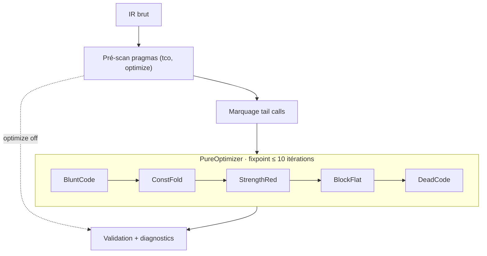

# Optimisations

Vue d'ensemble des optimisations disponibles dans Catnip, avec l'idée simple : accélérer sans complexifier.

## Niveaux d'Optimisation

Le niveau accepte les valeurs 0-3, mais l'effet est binaire : `0` désactive toutes les passes, `1` à `3` les activent
toutes. Les valeurs intermédiaires (et les alias `low`/`medium`/`high`) sont acceptées pour compatibilité ; aucune
sélection de passes par niveau n'est câblée.

La plage 0-3 est conservée parce que le niveau est, par nature, un arbitrage compile/runtime (historiquement, sur le
cœur Python, les passes dominaient la compile des petits scripts ; la réécriture Rust a ramené ce coût à ~7-10 %). Le
seul tier assez coûteux pour justifier un palier distinct est l'optimisation inter-blocs (CFG/SSA : construction de
graphe + SSA + reconstruction) : elle est **réservée au niveau 3** une fois rebranchée (moteur pur Rust dormant
aujourd'hui, voir [ARCHITECTURE](ARCHITECTURE.md)).

**Défauts par entrypoint** :

| Entrypoint                                | Défaut          |
| ----------------------------------------- | --------------- |
| CLI `catnip` (config `optimize`)          | `3` (activé)    |
| Binaire standalone `catnip-run`, MCP, LSP | activé          |
| API Python `Catnip()`                     | `0` (désactivé) |

## Quand Désactiver les Optimisations

Les passes sont sûres (elles préservent les valeurs observables) et leur coût de compilation est faible (mesuré ~7-10 %
d'une compile déjà rapide). Désactiver (`optimize=0`) sert surtout à :

- inspecter l'IR tel qu'écrit (`-p 2` montre l'IR que le niveau 3 exécute, optimisations comprises) ;
- isoler une passe suspecte en cas de comportement inattendu ;
- comparer les sorties optimisé/non optimisé (c'est le protocole de test des passes elles-mêmes).

> Le mode débrayé existe pour pouvoir prouver que le mode embrayé ne ment pas.

## Contrôle du Niveau

**Précédence** : CLI/env > pragma in-file > config/défaut. Un `-o level:N` sur la ligne de commande (ou
`CATNIP_OPTIMIZE=level:N`) l'emporte sur les `pragma("optimize", ...)` du fichier, qui l'emportent sur la config et le
défaut.

**Via CLI** :

```bash
catnip script.cat                 # Défaut CLI : activé
catnip -o level:0 script.cat      # Désactive toutes les passes

# Alias textuels (none=0, low=1, medium=2, high=3)
catnip -o level:none script.cat   # Désactivé
catnip -o level:high script.cat   # Activé
```

**Via pragma** (file-scoped, s'applique au fichier qui le contient) :

```python
pragma("optimize", 0)   # Désactive les passes pour ce fichier
pragma("optimize", 3)   # Les active
```

**Via API Python** :

```python
from catnip import Catnip

cat = Catnip()              # Défaut API : désactivé
cat = Catnip(optimize=3)    # Activé ; ce kwarg est un override, les pragmas in-file ne le renversent pas
```

**Introspection** :

```python
catnip.optimize  # Retourne le niveau actuel (0-3)

# Branchement conditionnel
if catnip.optimize > 0 {
    "code optimisé"
} else {
    "sans optimisation"
}
```

## Passes Disponibles

Catnip applique deux types de passes complémentaires.

Les passes IR vivent dans `catnip_core/src/semantic/passes/` (pur Rust, opèrent directement sur `IR`) et servent tous
les pipelines. Le trait `PurePass` et le `PureOptimizer` appliquent les passes itérativement jusqu'au point fixe (max 10
itérations, détection par `PartialEq`). L'ancien pipeline PyO3 (`catnip_rs/src/semantic/`, classes `Semantic` et
`Optimizer` exposées à Python) a été supprimé : hors production, il divergeait du pipeline vivant.

### Passes IR (Niveau Expression)

Optimisations locales sur expressions et statements :

1. **Constant Folding** - Évalue les expressions constantes au compile-time

   - `2 + 3` → `5`
   - `True and False` → `False`
   - Ne s'applique que si **tous** les opérandes sont des littéraux

1. **Strength Reduction** - Simplifications booléennes (`True && False` → `False`) quand les deux opérandes sont des
   `Bool` littéraux

1. **Block Flattening** - Simplifie les blocs imbriqués

   - `{ { x } y }` → `{ x y }`
   - Un bloc qui déclare des variables locales est conservé : il porte un scope, l'aplatir ferait fuiter les liaisons
     dans le bloc parent

1. **Dead Code Elimination** - Supprime code inaccessible

   - Branches `if False`, `while False`, cases de match à guard constamment faux
   - Un match réduit à un seul case `_` est remplacé par son corps ; le scrutinee est conservé s'il n'est pas un
     littéral (il peut porter des effets ou lever)
   - Un match dont tous les cases sont morts est conservé tel quel : au runtime il lève « no case matched »

1. **Blunt Code Simplification** - Simplifie patterns maladroits

   - `not (a == b)` → `a != b` (et `!=` → `==` ; les comparaisons d'ordre ne sont pas inversées : `not (a < b)` n'est
     pas équivalent à `a >= b` en présence de `NaN`)
   - `x and (not x)` → `False` (complément)
   - Les simplifications `and`/`or` avec constantes (`x and False` → `False`, `x or True` → `True`) ne s'appliquent que
     quand les deux opérandes sont des `Bool`. En Catnip, `and`/`or` retournent toujours un booléen — simplifier avec un
     opérande non-bool changerait le type de retour

**Identités absentes par construction** : sans information de type, les réécritures arithmétiques changent des valeurs
observables dans un langage dynamique. `"abc" * 0` vaut `""` (pas `0`), `7.5 // 1` vaut `7.0` (pas `7.5`), `7 / 1` vaut
`7.0` (pas `7`), `5 == True` vaut `False` (pas `5`), `not not 5` vaut `True` (pas `5`), et `x ** 2` ne peut pas devenir
`x * x` (`**` et `*` dispatchent vers des surcharges distinctes). Le cas tout-littéral revient au constant folding.

**Spécialisation arithmétique typée** : quand un type *est* connu, l'analyse réécrit l'opération polymorphe en sa
variante typée. Une opération binaire dont les deux opérandes sont prouvés `int` (resp. `float`) -- via un paramètre
annoté, dont le type est garanti à l'entrée de la fonction (voir la spécialisation au boundary dans
`docs/lang/FUNCTIONS.md`), un littéral, ou le résultat chaîné d'une réécriture typée -- devient `AddInt`/`AddFloat`,
`SubInt`/`SubFloat`, `MulInt`/`MulFloat` ou `DivFloat`. La forme typée saute le dispatch de type et la recherche de
surcharge à l'exécution, et fournit au JIT une trace déjà typée. La réécriture (`rewrite_typed_arith`,
`catnip_core/src/pipeline/semantic/`) est sound par construction : un opérande dont le type n'est plus garanti
(paramètre réassigné, lié par un pattern, variable de boucle, binding `except`, ou masqué par une définition locale)
fait retomber l'opération sur sa forme polymorphe. La division vraie (`/`) n'a pas de variante entière : elle produit
toujours un `float`, donc seule `DivFloat` existe et `int / int` reste polymorphe.

**Passes désactivées** : Constant Propagation, Copy Propagation et Dead Store Elimination sont retirées du pipeline.
Leur suivi des assignations est insensible au flot de contrôle et aux scopes ; les réactiver demande un vrai dataflow
(invalidation par branche, invalidation des sources de copies, détection de cycles).

### Passes CFG/SSA (gate interne)

Le module `catnip_core/src/cfg/` contient une infrastructure complète CFG + SSA
([Braun et al. 2013](https://pp.ipd.kit.edu/uploads/publikationen/braun13cc.pdf)) : construction du graphe, passes
inter-blocs (LICM, DSE globale, GVN — qui subsume la CSE syntaxique —, IV), destruction SSA et reconstruction IR. Elle
n'est **pas branchée par défaut** sur le pipeline sémantique vivant ; le JIT construit ses propres CFG indépendamment.

Un **gate interne** (`SemanticAnalyzer::set_cfg_enabled`, off par défaut, sans surface utilisateur) câble le round-trip
`IR → CFG → SSA → LICM → DSE → GVN → destruction → reconstruction` dans `analyze_full`. Trois passes inter-blocs y
tournent, chacune gardée pour refuser plutôt que dégrader : **LICM** (hoist des défs invariantes de `while` dans un bloc
gardé par une copie de la condition — pas de spéculation zéro-itération), **DSE** (v1 étroite : seuls les stores «
transparents » — littéral scalaire ou référence — tués sur tous les chemins tombent ; un call ou un op fautable dans la
fenêtre fait barrière), **GVN** (les expressions redondantes prouvées scalaires immuables deviennent des copies — alias
ou snapshot selon le nombre de défs du canonique). Validé en différentiel d'exécution sur la **suite entière** (env
interne `CATNIP_CFG_INTERNAL`, modes VM et AST), passes actives. Le gate reste néanmoins **interne** : le `match`
round-trippe par préservation d'op (arms non reconstruits), et l'activation par env ambiante doit sortir du binaire
distribué avant tout ship. Une fois ces garanties acquises, ce tier inter-blocs devient le **niveau 3** (cf. plus haut).
Détails dans [ARCHITECTURE](ARCHITECTURE.md).

## Architecture du Pipeline



**Ordre d'exécution** (`SemanticAnalyzer::analyze_full`, `catnip_core/src/pipeline/semantic/mod.rs`) :

1. Transform (interception des intrinsics : `typeof`, `breakpoint`)
1. Pré-scan des pragmas top-level (`tco`, `optimize`) -- précédence : override host (CLI/env) > pragma in-file >
   baseline
1. Marquage des tail calls (si TCO actif)
1. Passes IR (5 passes) jusqu'au point fixe, max 10 itérations (si optimisation active)
1. Validation des opcodes et pragmas, puis une pré-passe globale (`collect_unique_fns`) qui relève les signatures des
   fonctions à liaison prouvablement unique et les noms susceptibles de masquer un constructeur, suivie de la traversée
   type-aware (`check_exhaustiveness`) qui suit les types des variables sur un treillis plat (`types.rs`), lie les
   paramètres annotés, infère les champs de struct typés, et collecte les diagnostics : exhaustivité des `match` (I103)
   et incompatibilités de type prouvables (E300) -- aux sites de déclaration (défaut de param/champ, type de retour)
   comme aux sites d'appel (arguments positionnels et nommés vs paramètres d'une fonction unique, ou champs d'un
   constructeur de struct)

## Tail Call Optimization (TCO)

La TCO est une optimisation **toujours active** (indépendante du niveau) :

**Principe** : proper tail calls -- tout appel **par nom** en position terminale s'exécute en pile O(1), pas seulement
l'auto-récursion. Couvre la récursion mutuelle (`ping` → `pong` → `ping`), les fonctions imbriquées et les appels
terminaux vers une autre fonction.

```python
is_even = (n) => { if n == 0 { True } else { is_odd(n - 1) } }   # ← tail call mutuel
is_odd  = (n) => { if n == 0 { False } else { is_even(n - 1) } }
```

**Détection** : traversée unique `mark_tails` dans l'analyseur sémantique (`catnip_core/src/pipeline/semantic/mod.rs`).
Positions terminales propagées : dernière expression d'un bloc, corps des branches d'un `if`, corps des cases d'un
`match`, expression d'un `return`. La traversée descend dans tous les corps de lambdas, y compris les définitions
imbriquées et les lambdas passées en argument. Le flag ne peut jamais apparaître hors d'un corps de lambda (un signal
`TailCall` qui fuirait au top-level surfacerait comme valeur).

**Implémentation** : trampoline pattern (pas de frame empilée). En VM, `TailCall` réutilise le frame courant (locals
rebindés, piles vidées, code object remplacé si la cible diffère) ; en mode AST, l'appel retourne un signal `TailCall`
consommé par la boucle trampoline, avec swap de scope synchronisé quand la cible change de closure (les écritures aux
variables capturées sont propagées comme au retour d'un appel normal). Les cibles non-fonction (builtins, constructeurs
de structs, fonctions d'un autre contexte Catnip) sont appelées directement.

**Positions jamais terminales** :

- corps de `while`/`for` (la boucle doit reprendre la main), y compris un `return f()` dans une boucle ;
- tout ce qui est sous `try` (le handler doit rester sur la pile) ;
- opérandes de `and`/`or`/`??` (consommés par le test de vérité) ;
- arguments d'appels, conditions, guards de match.

Voir [ARCHITECTURE](ARCHITECTURE.md) section TCO pour détails.
