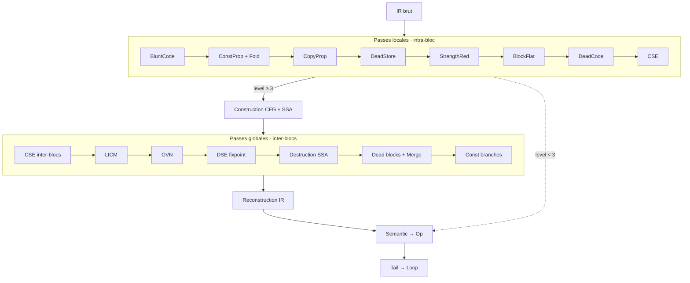

# Optimisations

Vue d'ensemble des optimisations disponibles dans Catnip, avec l'idée simple : accélérer sans complexifier.

## Niveaux d'Optimisation

Catnip supporte 4 niveaux d'optimisation (0-3) contrôlables via pragma, CLI ou API.

**Défaut** : `optimize=0` (aucune optimisation)

| Niveau | Alias                  | Description              | Passes actives                                                           |
| ------ | ---------------------- | ------------------------ | ------------------------------------------------------------------------ |
| **0**  | none, off (défaut)     | Aucune optimisation      | Aucune                                                                   |
| **1**  | basic, low             | Optimisations légères    | Constant folding (IR)                                                    |
| **2**  | medium                 | Optimisations standard   | Constant folding, Strength reduction, Block flattening (IR)              |
| **3**  | aggressive, high, full | Optimisations agressives | Toutes passes IR + CFG (dead code, merge, empty, branches), 5 itérations |

## Quand Activer les Optimisations

**Défaut (`optimize=0`)** - Recommandé pour :

- Scripts et REPL (latence optimale)
- Code avec JIT activé (JIT domine les optimisations)
- Développement itératif (compilation 2x plus rapide)

**`optimize=3`** - Activer pour :

- Code exécuté 100+ fois sans JIT (gains 4-11%)
- Templates/code généré avec beaucoup de dead code (réduction AST 46%)
- Scripts de production sans JIT

**Trade-offs mesurés** :

- Compile-time : `optimize=3` est 2x plus lent (0.3ms → 0.7ms)
- Runtime sans JIT : `optimize=3` est 4-11% plus rapide
- Runtime avec JIT : aucune différence (JIT masque les optimisations)

> Les optimisations sont un boost au démarrage. Le JIT est un turbo qui s'allume en plein vol. Si ton code chauffe assez pour déclencher le JIT, les optimisations de compile-time deviennent secondaires.

## Contrôle du Niveau

**Via CLI** :

```bash
catnip script.cat                 # Défaut (optimize=0)
catnip -o level:3 script.cat      # Active toutes les optimisations

# Alias textuels
catnip -o level:none script.cat   # Niveau 0 (défaut)
catnip -o level:low script.cat    # Niveau 1
catnip -o level:medium script.cat # Niveau 2
catnip -o level:high script.cat   # Niveau 3
```

**Via pragma** :

```python
# Défaut : optimize=0
pragma("optimize", 3)   # Activer toutes les optimisations
pragma("optimize", 1)   # Optimisations légères
```

**Via API Python** :

```python
from catnip import Catnip

cat = Catnip()              # Défaut (optimize=0)
cat = Catnip(optimize=3)    # Toutes les optimisations
```

**Introspection** :

```python
catnip.optimize  # Retourne le niveau actuel (0-3)

# Branchement conditionnel
if catnip.optimize > 0 {
    "code optimisé"
} else {
    "sans optimisation"
}
```

## Passes Disponibles

Catnip applique deux types de passes complémentaires :

### Passes IR (Niveau Expression)

Optimisations locales sur expressions et statements :

1. **Constant Folding** - Évalue les expressions constantes au compile-time

   - `2 + 3` → `5`
   - `True and False` → `False`

1. **Strength Reduction** - Remplace opérations coûteuses par équivalents rapides

   - `x * 2` → `x + x` (si x simple)
   - `x ** 2` → `x * x`

1. **Block Flattening** - Simplifie les blocs imbriqués

   - `{ { { x } } }` → `x`

1. **Dead Code Elimination** - Supprime code inaccessible

   - Code après `return`
   - Branches `if False`

1. **Common Subexpression Elimination (CSE)** - Réutilise calculs identiques

   - `a*b + a*b` → `temp = a*b; temp + temp`

1. **Blunt Code Simplification** - Simplifie patterns maladroits

   - `not not x` → `x`
   - `x == True` → `x`
   - `not (a < b)` → `a >= b` (inversion de comparaison)
   - `x and x` → `x` (idempotence)
   - `x and (not x)` → `False` (complement)

1. **Constant/Copy Propagation** - Propage valeurs connues

   - `x = 5; y = x * 2` → `x = 5; y = 10`

### Passes CFG (Niveau Contrôle de Flux)

Optimisations globales sur le graphe de flot de contrôle :

1. **Dead Block Elimination** - Supprime blocs inaccessibles
1. **Block Merging** - Fusionne blocs consécutifs
1. **Empty Block Removal** - Supprime blocs vides
1. **Constant Branch Folding** - Résout branches constantes

### Passes SSA (Niveau Inter-blocs)

Optimisations globales en forme SSA ([Braun et al. 2013](https://pp.info.uni-karlsruhe.de/uploads/publikationen/braun13cc.pdf)), activées au niveau 3 :

1. **CSE inter-blocs** (`ssa_cse.rs`) - Élimine expressions redondantes entre blocs dominants (même opcode + mêmes operandes SSA)
1. **LICM** (`ssa_licm.rs`) - Hoist les opérations pures invariantes hors des boucles vers un preheader
1. **GVN** (`ssa_gvn.rs`) - Global Value Numbering, assigne un value number à chaque expression pour détecter les équivalences
1. **DSE globale** (`ssa_dse.rs`) - Élimine les SetLocals avec RHS pur dont le résultat n'est jamais utilisé, itération au fixpoint

## Architecture du Pipeline



**Ordre d'exécution** :

1. Passes IR (9 passes) sur l'IR brut
1. CFG construction depuis IR optimisé
1. Analyse de dominance + construction SSA (Braun)
1. Passes SSA (4 passes) sur le graphe en forme SSA
1. Destruction SSA (phi → SetLocals)
1. Passes CFG (4 passes) sur le graphe
1. Reconstruction IR depuis CFG optimisé
1. Semantic analysis → Op final

**Itérations** : à niveau 3, le pipeline IR+CFG est exécuté 5 fois (certaines passes débloquent d'autres optimisations)

## Tail Call Optimization (TCO)

La TCO est une optimisation **toujours active** (indépendante du niveau) :

**Principe** : transforme récursion terminale en boucle (stack O(1))

```python
fact = (n, acc) => {
    if n <= 1 { acc }
    else { fact(n-1, n*acc) }  # ← Tail call
}
```

**Détection** : automatique par l'analyseur sémantique (appels en dernière position)

**Implémentation** : trampoline pattern (pas de frame empilée)

Voir [ARCHITECTURE](ARCHITECTURE.md) section TCO pour détails.
