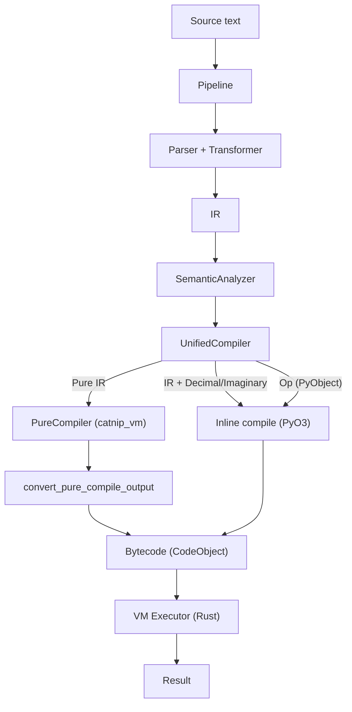
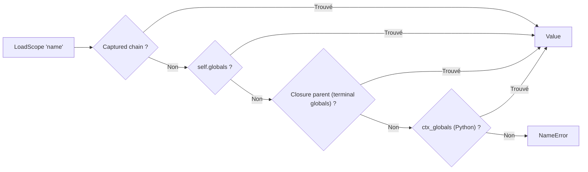

# Machine Virtuelle

Catnip utilise une VM stack-based en Rust pour exécuter du bytecode sans buter sur la profondeur de pile Python.

## Pourquoi une VM

La VM corrige trois limites de l'interprétation AST directe :

**Stack overflow** : supprime la limite de profondeur Python

- Récursion profonde possible (factorielle, fibonacci)
- Pas de `RecursionError` sur code tail-recursive

**Performance** : dispatch O(1) via pattern matching

- 2-15x plus rapide que l'interpréteur AST
- Bytecode compact et linéaire (cache-friendly)

**Profilabilité** : instrumentation et tracing intégrés

- Comptage d'opcodes pour hot detection
- Traces pour debugging
- Support JIT (voir [JIT](JIT.md))

## Architecture : Stack-based VM

Catnip utilise une **stack machine** plutôt qu'une register machine :

**Stack-based** :

```
LOAD_CONST 10    # Push 10
LOAD_CONST 20    # Push 20
ADD              # Pop 20, Pop 10, Push 30
```

**Avantages** :

- Bytecode compact (pas de registres à encoder)
- Simple à générer (compilation directe depuis AST)
- Simple à implémenter (une seule stack)

**Trade-off** : Plus d'instructions stack (push/pop) vs register-based, mais dispatch rapide compense

**Références** :

- [Stack machine](https://en.wikipedia.org/wiki/Stack_machine) (Wikipedia)
- [Virtual machine comparison](https://www.usenix.org/legacy/events/vee05/full_papers/p153-yunhe.pdf) (USENIX 2005)

### NaN-boxing : Représentation Compacte

La VM utilise le **NaN-boxing** pour représenter toutes les valeurs sur 64 bits :

**Principe** : les floats IEEE-754 ont des patterns NaN inutilisés qu'on peut exploiter

```
[Sign:1][Exponent:11=0x7FF][Quiet:1][Tag:4][Payload:47]
```

| Tag    | Type               | Payload                                                                                |
| ------ | ------------------ | -------------------------------------------------------------------------------------- |
| `0000` | SmallInt           | 47-bit signed integer                                                                  |
| `0001` | Bool               | 0 = false, 1 = true                                                                    |
| `0010` | Nil                | (unused)                                                                               |
| `0011` | Symbol             | symbol id (includes enum variants)                                                     |
| `0100` | PyObject / Closure | handle ObjectTable (catnip_rs) ; `Arc<PureFuncSlot>` d'une closure runtime (catnip_vm) |
| `0101` | Struct             | pointeur `Arc<StructCell>` (catnip_vm)                                                 |
| `0110` | BigInt             | pointeur `Arc<GmpInt>` (47-bit, wrapper partagé `catnip_core::scalar`)                 |
| `0111` | VMFunc             | index template dans la FunctionTable (catnip_vm : slots runtime → tag 4)               |
| `1000` | NativeStr          | pointeur `Arc<NativeString>`                                                           |
| `1001` | NativeList         | pointeur `Arc<NativeList>`                                                             |
| `1010` | NativeDict         | pointeur `Arc<NativeDict>`                                                             |
| `1011` | NativeTuple        | pointeur `Arc<NativeTuple>`                                                            |
| `1100` | NativeSet          | pointeur `Arc<NativeSet>`                                                              |
| `1101` | NativeBytes        | pointeur `Arc<NativeBytes>`                                                            |
| `1110` | StructType         | type_id dans PureStructRegistry                                                        |
| `1111` | Extended           | pointeur `Arc<ExtendedValue>`                                                          |

Tag 15 (Extended) est un tag "overflow" qui stocke un `Arc<ExtendedValue>`. Variants actuels :

- `Module(ModuleNamespace)` -- namespaces d'import `.cat` en mode pur Rust
- `EnumType(u32)` -- marqueur de type enum (type_id dans EnumRegistry)
- `Union(UnionNamespace)` -- namespace d'union taggée (bindings de variantes : struct type ou symbole)
- `Complex(f64, f64)` -- nombre complexe natif (real, imag)
- `Meta(NativeMeta)` -- objet META (getattr/setattr, exports programmatiques)

Les futurs types s'y ajouteront sans consommer de tag supplémentaire. Dispatch GetAttr/CallMethod dans `core/mod.rs`.

Dans `catnip_rs` (VM principale avec PyO3), Complex utilise un tag dédié (`TAG_COMPLEX = 8`) avec `Arc<NativeComplex>`
au lieu de passer par Extended. Le round-trip Python se fait via `PyComplex::from_doubles` / `PyComplex.real()/.imag()`.

#### Classification et frontière de valeur

Les tags se rangent en trois classes (source : `catnip_core/src/nanbox.rs`, `TagClass`) :

- **Scalaire** -- donnée inline, toujours sûre : SmallInt, Bool, Nil, Symbol (et les floats non tagués).
- **Index** -- handle dans une table bornée, sûr tant que l'index reste dans les bornes : PyObject, Struct, VMFunc,
  StructType.
- **Pointeur** -- `Arc` brut déréférencé, non certifiable depuis les bits seuls : BigInt, Complex, collections natives,
  Extended.

Le constructeur de frontière `from_raw_scalar(bits)` n'admet qu'un scalaire (ou un float) et rejette tout tag
index/pointeur. Les sources de bits non fiables -- restauration des locals JIT, retours de plugins natifs -- passent par
lui, si bien qu'un pointeur fabriqué ne peut jamais être reconstruit puis déréférencé : l'UB silencieuse n'a plus de
chemin d'existence. Le verrou est prouvé en Coq -- `CatnipValueClassProof` (partition des classes) et
`CatnipBoundaryProof` (`from_raw_scalar` n'émet jamais un tag pointeur) -- et étendu à la frontière FFI des plugins
(`CatnipPluginBoundaryProof`, ABI v5 ; voir `docs/dev/ARCHITECTURE.md`).

> Un tag pointeur, c'est un pari sur l'allocateur d'en face. La frontière scalaire refuse de parier.

Tag 3 (Symbol) stocke un symbol_id interné. Les enum variants utilisent ce tag : chaque variante est internée comme
`"EnumName.variant"` dans la `SymbolTable`, et la `PureEnumRegistry` mappe symbol_id vers (type_id, variant_id) pour le
dispatch `match` et `GetAttr`. Opcode `MakeEnum` (89) enregistre un type enum et ses variantes dans les registres.

Opcode `MakeUnion` (98) matérialise un type somme : variantes nullaires en `CatnipEnumVariant` (réutilise tag 3),
variantes avec payload en `CatnipStructType` au nom qualifié `"Union.Variant"`. Le `CatnipUnionType` est un objet Python
qui expose les variantes via `__getattr__`. Le handler PyO3 réutilise `build_union_type` (partagé avec `op_union` côté
AST) ; la PureVM décode la même constante dans `handle_make_union` (variantes payload en `PureStructType` qualifié,
nullaires en symboles internés, namespace en `ExtendedValue::Union`). Les deux VM internent les variantes nullaires dans
la `SymbolTable` dès `MakeUnion` (comme `MakeEnum`), pas à la première traversée : un symbole créé dans un callback se
résout alors dans la table du VM qui a défini l'union. Contrairement à `MakeEnum`, les variantes d'union ne sont pas
inscrites dans l'`EnumRegistry` (le namespace porte déjà les bindings) ; `typeof` sur une variante nullaire lit donc le
nom de l'union depuis le symbole qualifié `"Union.variant"` quand `EnumRegistry` ne la connaît pas.

Les méthodes d'union (déclarées au niveau de l'union, `self` = n'importe quelle variante) suivent le 4e élément
optionnel de la constante `MakeUnion`. Les variantes payload les portent sur leur struct type, enregistré comme **type
natif** (`register_type` + entrée `struct_type_map`) au même titre qu'un `struct` : `Union.Variant(...)` construit alors
une instance native (`TAG_STRUCT`) par le chemin rapide -- sans `__call__` Python ni proxy -- et `CallMethod` dispatche
nativement (dispatch struct standard). Les nullaires sont des symboles NaN-boxés qui ne peuvent pas porter de méthodes :
chaque VM garde une table symbole→méthodes (par symbol_id en PureVM, par nom qualifié en thread-local côté PyO3 -- le
round-trip `TAG_SYMBOL → CatnipEnumVariant` la consulte pour restaurer les bindings), et `CallMethod` sur un symbole
dispatch nativement dans le VM courant, sans traverser la frontière Python (les ids de symboles ne sont stables que dans
la table du VM qui les a internés).

Un callback (lambda de broadcast `.[]`, fonction passée à un builtin) s'exécute par défaut dans un VM enfant (le **map**
d'une collection de structs par un `VMFunc` emprunte un fast-path in-VM sans enfant, décrit plus bas). Côté PyO3, cet
enfant clone la `SymbolTable` et l'`EnumRegistry` du parent en plus de la `StructRegistry` et de la `FunctionTable` :
une variante passée dans le callback, ou créée dedans via `Union.variant`, garde son identité (résolution de méthode,
`==`, `match`, `typeof`). Sans ce partage, `resolve_symbol` échouerait dans la table vide de l'enfant et la variante
retomberait sur son entier de discrimination -- `str` afficherait l'index, `CallMethod` et `match` casseraient.

En mode ND `thread` (`pragma("nd_mode", ND.thread)`), ce callback tourne dans un worker rayon : un thread distinct dont
les thread-locals de registres sont nuls au départ. Le parent les transmet via un handle typé `NdRegistryHandle`
(`Send + Sync`) capturé avant `py.detach` ; chaque worker l'installe le temps du callback, un guard RAII restaurant
l'état au drop. Le handle porte les quatre registres (`StructRegistry`, `FunctionTable`, `SymbolTable`, `EnumRegistry`)
plus la table symbole→méthodes des variantes nullaires -- celle-ci transportée par valeur, un `Arc<HashMap>`
copy-on-write dont le snapshot/install n'est qu'un incref atomique, car la table est possédée par son thread-local (elle
n'est pas un registre aliasé par pointeur brut dans le frame parent). Sans cette transmission le worker hériterait de
tables vides : même retombée sur l'index, mais à travers la frontière de thread. La justification de soundness reste le
GIL, qui sérialise les accès des workers aux registres partagés -- même invariant que les pointeurs thread-local de
registres décrits plus bas.

Opcode `PatchClosure` (99) câble le letrec de groupe : `MakeFunction(name_idx + 1)` injecte la self-référence dans la
closure de la fonction créée, et `PatchClosure` (émis par le compilateur à chaque définition `nom = lambda` d'un bloc,
une fois par voisine déjà définie) insère la nouvelle fonction dans les closures des définitions précédentes du même
bloc -- la récursion mutuelle entre fonctions imbriquées fonctionne donc après échappement du scope. Ces liaisons sont
marquées dans la `NativeClosureScope` et omises à la sérialisation (elles forment des cycles que le memo de pickle ne
voit pas : chaque conversion native→Python crée des wrappers frais) ; `__setstate__` ne restaure que la self-référence.

Tags 5, 8-14 sont définis dans `catnip_vm` (VM pure Rust, sans PyO3). Tag 5 (Struct) pointe vers un `Arc<StructCell>`
(champs `Box<[Cell<Value>]>` + drapeau `frozen`), au même titre que les collections natives : le compte fort de l'`Arc`
**est** le refcount de l'instance, donc `clone_refcount()`/`decref()` sont self-contained et `StructCell::drop` cascade
dans les champs. Le `PureStructRegistry` ne garde plus que les **types** (index stable) ; les instances s'auto-gèrent.
Tag 14 (StructType) est un type callable (type_id) pour la construction. Les types mutables (List, Dict, Set) utilisent
`RefCell` pour la mutabilité single-threaded. Les types immutables (Tuple, Bytes) utilisent `Box<[T]>`.

> `catnip_vm` a longtemps stocké les instances dans un registry indexé à refcount par slot, dont `Value::decref` était
> un no-op -- une fuite systémique fermée en basculant sur `Arc<StructCell>` (2026-07). `catnip_rs` garde son modèle
> index+registry (voir plus bas), refcounté via `struct_registry.incref()`.

**Registre struct en mutabilité intérieure** : dans `catnip_rs`, les slots d'instances (`instances`, `free_list`) de la
`StructRegistry` vivent derrière un `RefCell`, si bien que tout le chemin de release — `decref`, `create_instance`,
`decref_slot`, `cascade_decref_fields`, `decref_discard`, `decref_frame_value`, `bind_args` — prend un `&self` partagé,
et `with_proxy_registry` (la table d'identité que les proxies Python consultent) déréférence le registre en `&*ptr`
partagé, jamais `&mut`. C'est ce qui rend la **réentrance** sûre : la libération d'un champ pyobj pendant une cascade
peut exécuter un `__del__` arbitraire qui drope un proxy du **même** registre (`CatnipStructProxy::drop` →
`proxy_registry_decref` → `with_proxy_registry`) ; comme plus aucun `&mut StructRegistry` n'existe sur un chemin de
release ou de réentrance-live (tous convertis en `&`, y compris les `&mut` fabriqués depuis un pointeur brut ; les seuls
`&mut self` restants sont sur le chemin de *définition* — `register_type`, `set_variant_templates` — qui mutent des
champs non-`RefCell` sans exécuter de code réentrant tant que l'emprunt vit), la réentrance ne prend qu'un emprunt
partagé de plus, et le `RefCell` n'est verrouillé que par fenêtres courtes non chevauchantes (`decref` rend les champs
*avant* que le caller ne libère les pyobj). Avec l'ancien `&mut StructRegistry` sur le dispatch, ce même enchaînement
était un aliasing de deux `&mut` (UB). Le `RefCell` transforme en outre toute violation future de discipline d'emprunt
en **panique bruyante** plutôt qu'en corruption silencieuse. L'accès aux champs d'une instance passe par des helpers
scopés (`with_instance`/`with_instance_mut`/`has_instance`) plutôt qu'un `&StructInstance` qui pourrait fuir hors de
l'emprunt. Justification du `RefCell` (`!Sync`) sur un `#[pyclass]` qui exige `Send + Sync` : `unsafe impl Send/Sync`,
VM single-threaded sous GIL, même invariant et même précédent que `NativeClosureScope`. Cette soundness dépend du
**build GIL** : un `elem`/résultat proxy droppé hors GIL sur un worker rayon décréferait un slot, sûr uniquement parce
que PyO3 diffère les drops `Py` hors-GIL (`ReferencePool`) jusqu'à un flush sous GIL — un build free-threaded (PEP 703)
l'invaliderait et imposerait un flag d'emprunt atomique (un vrai verrou).

Les floats sont stockés directement (pas dans un NaN pattern). Toutes les primitives tiennent dans 8 bytes sans
allocation heap.

**Garde refcount** : les tags 5-6, 8-13 et 15 pointent vers des `Arc` heap-allocated. `clone_refcount()` et `decref()`
dans `catnip_vm` doivent vérifier `!is_float()` avant d'inspecter le tag, car certains floats normaux (subnormals,
grands exposants) ont des bits 50-47 qui matchent accidentellement un tag heap. Sans cette garde, un float comme
`1e-100` déclencherait `Arc::increment_strong_count` sur un pointeur invalide. `catnip_rs` n'a pas ce problème car ses
méthodes `is_bigint()`/`is_pyobj()` vérifient le préfixe QNAN_BASE complet.

**`clone_refcount()` unifié** : dans `catnip_rs`, `Value::clone_refcount()` gère les quatre types refcountés : BigInt
(Arc increment), Complex (Arc increment), PyObject (ObjectTable handle), et Struct instance (thread-local
`struct_registry_incref()`). Tout code qui duplique une Value (DupTop, StoreScope vers globals, default parameter
binding) passe par cette méthode unique. À la libération, `decref_discard` couvre les quatre types en un point ; le
helper `decref_non_pyobj` est une garde `!is_pyobj` devant `decref_discard`, réservé aux bras dont le fallback Python
(`call_binary_op`) consomme déjà les refs pyobj — un bras dont le fallback **emprunte** son opérande (par ex. le bras
bitwise unaire `~`) ou n'a pas de fallback consommateur doit relâcher par `decref_discard`, sinon ses opérandes pyobj
fuient sur le chemin d'erreur.

**Discipline stack-owned (PyObject)** : tout `Value` de tag PyObject présent sur la pile d'opérandes ou dans les locals
possède une référence du handle ObjectTable. Les opcodes Load (`LoadConst`/`LoadLocal`/`LoadScope`/`LoadGlobal`)
incréfèrent le handle au push (`clone_refcount_pyobj`, en plus de l'incref struct explicite via
`self.struct_registry.incref()` et de `clone_refcount_bigint` pour BigInt/Complex) ; les consommateurs le relâchent au
discard (`decref_discard` par défaut — `decref_pyobj` uniquement aux sites prouvés pyobj-only, voir plus bas), et le
teardown de frame (`FramePool::free` → `decref_frame_values`) libère **tout** le résidu — handles pyobj ET références
BigInt/Complex/struct — de la pile et des locals, **sur les trois chemins de retour** (opcode `Return`, fin de bytecode,
`Return`-par-unwind) **et sur la sortie `Halt` de la frame top-level** (qui passait par un release pyobj-only + drop :
chaque global BigInt/Complex/struct de niveau module fuyait la référence de son slot à chaque exécution — le `Halt` sync
clone la sienne, le slot garde la sienne jusqu'au `free`). Le contrat « équilibré par les opcodes » ne valait que pour
les écrasements (un `StoreLocal` relâche l'ancienne valeur) : l'état final des slots restants fuyait une référence par
heap-local à chaque retour de fonction. Les champs de struct possèdent aussi leur handle : les défauts pyobj sont
incréfés à la construction, équilibrés par le `cascade_decref_fields` au teardown d'instance.

**Opérandes du bloc arithmétique et des tests** : les helpers `binary_*`/`compare_*` (wrappers minces sur les corps
génériques de `catnip_core::arith`, partagés avec la VM pure — Phase 5 ; `ArithError` est mappé en `VMError` par crate)
**empruntent** leurs opérandes et produisent une valeur neuve, et le fallback Python (`call_binary_op`) ne consomme
**que** les refs pyobj (avant son appel faillible) ; chaque bras binaire relâche donc ses opérandes poppés en UN point
après le calcul — `release_binop_operands`, erreurs comprises — le `continue` de l'overload struct (transfert dans la
frame de méthode) étant la seule sortie qui ne relâche pas. Les bras **bitwise binaires** (`&`, `|`, `^`) suivent la
même règle : leur fallback Python (dispatch numpy/pyobj élément par élément via `operator.and_`/`or_`/`xor`, comme le
mode AST) consomme les refs pyobj, donc ils relâchent par `release_binop_operands`. Deux exceptions au helper : le bras
**bitwise unaire** (`~`) a un fallback qui **emprunte** son opérande (`operator.invert`, sans le consommer), donc il
relâche par `decref_discard` après le calcul ; les bras **float typés** ne relâchent que dans leur fallback (le fast
path prouve deux doubles unboxés, rien à posséder). Sans ce release, chaque intermédiaire BigInt/Complex chaîné
(`(b + 1) + 2`) fuyait son allocation entière, invisible au refcount Python (Arc Rust) : le témoin est un test de
croissance RSS (`tests/serial/test_memory_growth.py`). Même règle pour les opcodes de test et de consommation simple
(`ToBool`, jumps conditionnels, `Is`/`Not`, `TypeOf`, `FormatValue`, `BuildString`, `SetAttr` non-struct — receveur
**et** valeur, champ de struct inconnu compris —, `Broadcast`, `MakeFunction`, `Pos` sur struct sans `op_pos`) et pour
les éléments des collections (`Build*`, `GetItem`/`SetItem`, `GetAttr` — sorties d'erreur incluses —, `GetIter` —
`decref_discard`, pas `decref_pyobj` : un élément BigInt ou struct possède aussi sa référence) : l'opérande poppé a
exactement un consommateur, transfert ou release, sur tous les chemins. `decref_pyobj` reste réservé aux sites prouvés
pyobj-only par construction (itérateur de `ForIter`, morceaux de `BuildString` — sorties de `FormatValue` ou consts
string —, code-object, `kw_names`, callables du slow path d'appel).

**Arguments des appels vers des callables Python** : les branches Python des opcodes d'appel (`Call`, `TailCall`,
`CallKw` — y compris le tuple `kw_names` et les valeurs de kwargs — et les sous-branches Python de `CallMethod`)
possèdent les `Value` poppées ; `to_pyobject` lit sans consommer (chaque entrée de `args_py` porte sa propre référence
Python), donc l'opcode relâche ses args juste après la conversion, avant la chaîne d'appel faillible. Cette
conversion+release vit en un point unique, le helper `build_python_call_args` (partagé par `Call`/`TailCall`/`CallKw` ;
`CallMethod` garde ses sous-branches propres), comme le dépliage d'un `BoundCatnipMethod` vit dans `unwrap_bound_method`
(args owned pris, relâchés sur erreur, l'instance préfixée comptée une seule fois). Le receveur de `CallMethod` est
relâché quand il n'est pas passé en `self` (champ-callable, méthode statique, fallback pyobj). Les branches VMFunction,
elles, **transfèrent** la propriété : `bind_args` copie les bits dans les locals du callee, que le teardown de frame
libère.

**Chemins d'erreur des opcodes d'appel** : une erreur levée pendant que les valeurs sont encore sur la pile est sûre —
le teardown de frame libère tout résidu. Le danger est la fenêtre où les opérandes sont poppés dans des `Vec` locaux («
en vol ») : chaque `return Err` de cette fenêtre les relâche (`release_operands`), y compris le handle callable dans
`TailCall`/`CallKw` (encore possédé à ce point, contrairement à `Call` qui le relâche en tête de slow path), les
`field_values` d'un constructeur avorté (args déplacés + défauts survivants incréfés, chacun une fois), l'instance
fraîche d'un `init` qui échoue, et les `new_frame` bindées puis abandonnées (`decref_frame_values` — un `Frame` n'a pas
de `Drop`). Les gardes d'invariant `ok_or` inatteignables sous bytecode valide restent hors contrat. Le cache-hit du
memo ND relâche aussi ses args sur le chemin nominal : rien d'autre ne les consomme quand le résultat vient du cache.
Les arms `NdRecursion`/`NdMap` suivent la même discipline que le bras Broadcast : les opérandes poppés (lambda, seed ou
data) sont relâchés sur tous les chemins après conversion, l'appel host n'empruntant que des clones. Côté worker ND
process, la collecte des résultats relâche chaque `Value` thawée une fois son payload cloné dans la liste Python
(`release_minted`, même règle que les boucles de freeze des seeds) — la garde `TestNDRefcountLedger` vérifie le delta
zéro du ledger sur ce chemin.

**Excès d'arguments** : un appel avec plus d'arguments que de paramètres est accepté et les surnuméraires ignorés — leur
référence déplacée est relâchée au binding (`bind_args` reçoit un `&StructRegistry` partagé pour la cascade struct —
voir « Registre struct en mutabilité intérieure » ci-dessous), au fast path poolé de `Call` et au rebind TCO de
`TailCall`. Un excès capté par un paramètre vararg est re-boxé dans une `PyList` qui porte ses propres références : les
originaux sont relâchés. Un kwarg qui écrase un slot déjà lié relâche la valeur délogée (et un constructeur de struct
lève `multiple values`, en miroir de Python).

**Défauts de champs au niveau du type** : un `StructType` possède une référence par défaut heap (évalué à la définition
du struct), sans autre chemin de release que la passe types de `StructRegistry::drop` — backstop uniquement, car les
types d'un child broadcast sont des bit-copies dont les références appartiennent au parent ; les types shadowés par une
redéfinition restent dans le vec (append-only) et sont couverts par la même passe. L'héritage `extends` prend sa propre
référence à la copie MRO du champ (miroir du `clone_ref` des méthodes héritées) : chaque type relâché au Drop possède
bien la sienne, y compris dans un diamant.

La VM pure (`catnip_vm`, MCP/standalone) applique le même contrat avec deux registries : `PureStructRegistry` et
`PureTraitRegistry` relâchent chacun leurs défauts à leur Drop (decref auto-suffisant du modèle Arc — pas d'exclusion
des défauts struct, la cascade est indépendante du registry), et les trois sites qui copient un défaut prennent leur
propre référence : l'héritage `extends`, le merge des champs de trait vers le struct implémentant, et le transplant
d'import (`transplant_structs` clone le type du child vers le parent — sans cette référence, le Drop des deux registries
serait un double-release par module importé). Un pipeline racine se `reset()` avant de mourir : les `Globals` (Rc) sont
partagées avec les pipelines enfants, donc aucun Drop ne les draine — c'est le contrat, pas une fuite.

**Scope de bloc et bindings de match** : deux autres sources de références vivent sur une frame, hors de la pile et des
locals que `decref_frame_values` balaie, et sont relâchées au même teardown. À l'entrée d'un bloc, `push_block` prend un
instantané des slots concernés en incrémentant chaque handle (une référence indépendante, pas une copie de bits) ;
`pop_block`, la troncature d'unwind (`Except`/`Finally`), la réinitialisation TCO et `FramePool::free` la relâchent —
`free` la draine **inconditionnellement**, car `reset` (qui draine aussi) ne tourne que sur le chemin poolé, si bien
qu'une frame libérée avec un `block_stack` non vide et le pool plein fuirait ses instantanés. Les bindings d'un `match`
possèdent de même leur référence : `vm_match_pattern` **emprunte** le sujet — `Var` clone sa référence, un champ de
struct est cloné à sa source, la star-list est une valeur fraîche — et ses possédés locaux (items de tuple décodés,
bindings partiels d'un pattern composé qui échoue à mi-course) remontent par un `spill` que l'opcode draine sur tous les
chemins, erreur comprise. `BindMatch` **clone** chaque binding dans son slot plutôt qu'il ne le *déplace* — un arm gardé
lie deux fois (une fois pour le garde, isolé dans son `push_block`/`pop_block`, une fois pour le corps), donc
`match_bindings` survit à la première liaison. Ces références conservées sont relâchées quand l'arm suivant écrase
`match_bindings`, en réentrée TCO et au teardown ; le sujet lui-même — une copie `DupTop` possédée par `MatchPatternVM`
— est relâché sur place inconditionnellement, quel que soit le verdict. Les opcodes d'unpacking (`MatchAssignPatternVM`,
`UnpackSequence`, `UnpackEx` — l'assignation destructurante et le tuple-unpacking des boucles `for`) suivent le même
contrat : le sujet poppé est relâché sur tous les chemins, erreurs comprises, et `vm_match_assign_pattern` clone ses
bindings comme le matcher. Le miroir PureVM applique le même contrat (emprunt du sujet, bindings possédés, release des
partiels abandonnés) avec une mécanique locale différente : ses items sont des copies de bits empruntées au sujet
vivant, sans spill.

**Contrat de propriété des globals** : trois stores détiennent des handles pour les noms globaux — la map interne du VM
(`VM.globals`, drainée par son `Drop`), la map du host (`host.globals`, un `Rc` partagé avec l'`ImportLoader`, drainée
par les hooks GC `__clear__`/`gc_clear`, idempotents par vidage) et les slots de frame (pool). **Chaque map possède
exactement une référence par entrée, prise par l'écrivain du store** : `StoreScope` clone pour la map VM et
`VMHost::store_global` clone en interne pour la map host (les appelants ne pré-clonent jamais), les écrasements et
retraits relâchent l'entrée remplacée, les chemins closure consomment la valeur poppée sur succès (owned-in-on-true,
toute autre prise de référence se fait avant le transfert), et `MakeFunction` clone à la capture (la map capturée
possède ses entrées). Les libérations de la map host passent par le dispatch : `store_global`/`delete_global`
**retournent l'entrée délogée** au lieu de la relâcher en interne, parce qu'un release struct exige le registry en main
(`Value::decref` est délibérément no-op sur `TAG_STRUCT` — la cascade a besoin des slots) ; le site d'appel la relâche
via `decref_discard`. L'équilibre vaut « teardown GC, ou refcount pur suivi d'une collection » — `host.globals` n'a
délibérément pas de releaser hors GC ; les slots struct encore vivants à la mort du `StructRegistry` voient leurs champs
heap non-struct relâchés par un backstop dans son `Drop`. Le broadcast copie les instances du parent dans chaque VM
enfant (`clone_from_parent`) en bit-copies dont les compteurs **globaux** de champs (ObjectTable, Arcs heap) restent
partagés : l'enfant prend une référence par champ copié (slots marqués `snapshot`), si bien que tout release côté enfant
— écrasement `SetAttr`, cascade, mort de l'enfant — consomme sa propre part et jamais celle du parent ; seuls les
survivants non-snapshot d'un enfant (transplantés, devenus fantômes dont les champs appartiennent au parent) sont exclus
du backstop. Une redéfinition de type purge les marker-maps (`struct_type_map`) par l'ancien pointeur avant de relâcher
l'objet : les instances vivantes de l'ancien type retombent sur le chemin lent correct.

**Résultat top-level et frontières de conversion** : le `Value` retourné par le `Halt` est la référence poppée de la
pile — **owned**, sur les trois chemins d'exécution du pipeline (`execute`, `execute_prepared`, `execute_quiet`).
`PyPipeline::consume_result` convertit en objet Python puis relâche cette référence, toutes classes heap confondues,
struct compris via `Executor::release_displaced` — le release struct-aware exige le registry en main, et le proxy
matérialisé par la conversion porte sa propre référence de slot, donc l'instance survit à la release (un release
pyobj-only laissait fuir un résultat BigInt/Complex nu ; `execute_quiet` ne relâchait rien du tout ; un résultat struct
nu épinglait un compte registry par exécution). Même contrat aux écrasements des maps de globals côté wrapper :
`inject_from_pydict` (la réinjection des globals à chaque `execute()` — `from_pyobject` sur un proxy réinterné
incrémente son slot, donc l'entrée délogée doit être relâchée struct-aware, un `decref` nu fuyait un compte registry par
run) et `PyPipeline::set_global`, tous deux via `release_displaced`, hors du borrow de la map (un release pyobj peut
exécuter du `__del__` qui ré-entre la map). Même contrat encore à la frontière `catnip_vm` → `catnip_rs`
(`py_interop.rs`) : `convert_vm_value_to_py` traite le `Value` converti comme un **porteur** — prise de la référence
Python, release du porteur — parce que la conversion récursive d'une constante composite internait un handle
`ObjectTable` par sous-objet (un `struct P { a }` en fuyait quatre par session : le nom, le nom de champ, la paire, le
tuple des paires). La **source** `catnip_vm` a son propre contrat, distinct du porteur : les éléments d'une liste, les
clés ET valeurs d'un dict, les éléments d'un set arrivent *possédés* (`to_value` clone l'`Arc`, `values`/`clone`
incréfèrent), donc chaque branche relâche sa source après conversion — le release du porteur ne libère jamais la source.
Une clé de dict ou un élément de set non relâché fuyait un strong count d'`Arc` par conversion de constante native.

**Ledger de refcount (témoin permanent)** : les classes heap refcountées à la main exposent des compteurs *live*
process-wide — slots `ObjectTable` occupés et somme de leurs refcounts (sommés sous le lock à la demande), allocations
`Arc<GmpInt>` et `Arc<NativeComplex>` vivantes (le compteur bigint vit dans `catnip_core::scalar` avec le `GmpInt`
partagé depuis la Phase 5 : les bigints de la VM pure alimentent le même compteur), et slots d'instances struct vivants
tous registries confondus (`InstanceSlot::new` unique constructeur, décrément au `Drop` — les bit-copies d'un child
broadcast comptent comme slots vivants et retombent à sa mort ; un `fetch_add` Relaxed par **allocation**, rien sur
incref/decref, compilé en permanent car la suite Python s'exécute sur l'extension release). Sondes :
`_rs._debug_live_counts()` (le quintuplet) et `_rs._debug_live_slot_types()` (idx, refcount, repr — attribue un delta de
slots à des objets concrets sans connaître leur identité d'avance, là où le TBLT exige un pointeur ; le `repr()` tourne
**hors** du lock `ObjectTable`, sur un snapshot des handles clonés sous le lock, car `repr()` peut exécuter du Python
arbitraire ou déclencher un GC qui ré-entre `decref` → `lock()`, et le mutex n'est pas réentrant). Deux oracles dans
`test_gc_context.py::test_ledger_*`, chacun avec sa frontière : le **delta de session** (cycle complet création →
exécution → drop → collect, après une session de warm-up) voit les fuites process-wide ; le **delta intra-session** (N
exécutions du même pipeline, après deux runs de warm-up) voit les fuites de comptes registry — invisibles à la frontière
de session, puisque le registry meurt avec le pipeline et rend ses slots en bloc. Complémentarité : le témoin pyobj
(`_witness_delta`) suit UN objet connu, le témoin RSS un volume à seuil ; le ledger compte exactement, par classe, toute
allocation restante — c'est lui qui a exposé les cinq fuites ci-dessus à ses deux premières exécutions.

**Angle mort à connaître** : les compteurs comptent des **allocations vivantes** (slots occupés, `Arc` alloués), pas la
**somme des refcounts**. Une fuite de refcount *pur* — un slot dont le compteur gonfle sans jamais retomber à zéro, donc
une seule allocation épinglée à vie — passe pour équilibrée (le slot ne se multiplie pas). Le ledger prouve « aucune
allocation abandonnée », pas « aucun refcount gonflé sur une allocation vivante » ; le témoin RSS reste requis pour
cette seconde classe. La revue adverse du chantier a trouvé un cas exact (écrasement d'un global struct via le
`GlobalsProxy` Python, dont le `decref` de l'ancien est un no-op struct) que le compteur d'instances rapportait à zéro.
Ce cas est **fermé** : `GlobalsProxy` installe le registry qui indexe ses structs comme thread-local de conversion
(`with_struct_registry_installed`, discipline d'`export_to_pydict`) — un struct stocké est donc toujours indexé dans ce
registry — et relâche l'ancien via `proxy_registry_decref` (le registry est enregistré dans la table d'identité à
`globals()`, comme au `Drop` de `CatnipStructProxy`). Les oracles lisent directement le refcount du slot
(`_debug_struct_slots`) au lieu du ledger, précisément parce que le ledger est aveugle à cette classe. Une première
version, plus naïve (release par id sans installer le TL), transformait la fuite en corruption sur écriture
cross-registry — attrapée par la review adverse, pas par l'auto-critique.

**Proptest différentiel** (`tests/serial/test_refcount_proptest.py`) : un générateur de programmes seedé (variables
typées, donc programmes valides par construction — un NameError testerait le résolveur, pas les refcounts), biaisé vers
les constructions historiquement fuyardes, branche chaque programme sur quatre oracles : les deux deltas du ledger en
mode VM, le delta de session en mode AST, et la convergence des résultats VM/AST. Sur échec, le programme est réduit
ligne à ligne avant d'être rapporté (repro minimal). Le gate exécute 12 graines déterministes (~2 s) ;
`CATNIP_PROPTEST_CASES`/`CATNIP_PROPTEST_SEED` dimensionnent les campagnes. Deux exclusions par construction,
documentées en tête de module : défauts de type scalaires (la rétention append-only des types redéfinis est un design
documenté qui noierait l'oracle intra) et pas de chemins d'erreur (grilles dédiées). À son évaluation, le générateur a
exposé deux fuites de plus dans ses 30 premiers programmes — l'host éphémère de `VMFunction::__call__` drainait ses
globals sans le registry (un proxy de contexte réinterné y laissait un compte par appel ré-entrant, fix
`drain_globals_with_registry`), et la copie privée matérialisée d'un résultat broadcast pass-through n'était jamais
transférée à son proxy (fix : le release post-conversion couvre transplanté ET matérialisé) — puis une campagne de 300
programmes est passée verte.

**Ownership du scope de closure** : la map capturée possède ses entrées de bout en bout — `MakeFunction` clone à la
liaison, un écrasement via `set`/`insert_captured` relâche l'entrée remplacée, et le `Drop` de l'inner du scope draine
les captures restantes à sa destruction. Ce dernier point ferme la fuite du runtime pur (`catnip_vm`) où une closure,
retenue par un slot de la table de fonctions jusqu'au `reset()`, abandonnait ses captures faute de destructeur ; les
deux VM appliquent désormais le même contrat (côté PyO3, `Value::decref` traite pyobj/BigInt/Complex, la ref registry
d'un struct capturé restant portée par le slot). Une **méthode liée** (`m = p.get`) ne capture pas son receveur : `self`
est le premier paramètre de la méthode, donc le slot de fonction porte un `bound_self` préfixé aux arguments à l'appel —
exactement comme l'appel direct `p.get()` préfixe le receveur. Le receveur est un argument curryfié, pas une capture, si
bien que **tout** site de dispatch d'un VMFunc doit le préfixer : `Call`/`TailCall`/`CallKw` via l'aide
`with_bound_receiver`, et les chemins ré-entrants `call_func_sync` (HOF) et `call_vmfunc_sync` (broadcast) qui invoquent
une valeur-fonction de première classe. Le receveur est cloné à chaque appel (le slot garde sa référence) et relâché par
le `Drop` du slot.

**Réclamation des slots de fonction runtime (`catnip_vm`)** : la `FunctionTable` était grow-only — chaque `MakeFunction`
et chaque méthode liée y ajoutaient un slot jamais libéré avant le `reset()`. Les slots **runtime** (closures, méthodes
liées) sont désormais des valeurs `Arc<PureFuncSlot>` (tag 4, `TAG_CLOSURE`), sur le même modèle que les instances
struct : le compte fort de l'`Arc` est le refcount, donc `decref()` est self-contained et le slot se libère dès que sa
dernière `Value` meurt (bound_self et captures relâchés en cascade). Les slots **template** (créés au compile/load, dont
les indices sont bakés dans les constantes des `CodeObject` et les maps de méthodes des structs, remappés par offset au
transplant de module) restent index-based sous `TAG_VMFUNC`. Le dispatch accepte les deux représentations via
`callable_slot_data`.

La self-référence letrec (`nom = () => { … nom … }`) est un handle **weak** dans le scope de closure : une référence
forte formerait un cycle `Arc` qui épinglerait le slot à jamais. L'invariant qui rend le weak sûr : la frame appelante
possède une **référence forte** à sa propre fonction (`PureFrame.callee`, prise sur le `func` poppé au lieu de le
décrémenter, relâchée au teardown), donc le slot vit tant que le corps s'exécute et l'`upgrade()` de la self-référence
réussit toujours — y compris quand la closure n'a aucune liaison survivante (`mk()(5)`). La capture mutuelle
(`PatchClosure`) reste **forte** (un weak casserait un groupe letrec retourné) : le cycle résiduel est cassé par un
**drain au reset** (`runtime_closures`, un registre de `Weak` peuplé aux cibles `PatchClosure`, dont le `Drop` de la VM
vide les captures). Ce drain est désactivé pour les VM enfants de module (`drain_closures_on_drop`), dont les closures
s'échappent chez le parent ; leurs handles de cassage sont alors **transférés au VM parent** (avec ceux des closures que
le remap reconstruit en portant une capture forte), si bien que le drain du parent réclame un groupe letrec exporté à
son propre reset. Sans ce transfert, un groupe de sœurs exporté — dont le patch mutuel est émis pour toute paire du même
bloc, récursion effective ou non — restait épinglé par son propre cycle une fois que le namespace draine ses globals.

Une closure runtime partage le `Arc<CodeObject>` de son template, qui baque des indices du func_table (constantes, maps
de méthodes). Quand une closure **s'échappe d'un module** vers le VM parent, ces indices enfant doivent être remappés
vers les templates transplantés du parent, sinon `MakeFunction` lit le mauvais template (résultat faux silencieux). Le
loader deep-remappe donc le graphe des closures exportées (code + captures + chaîne de scope), mémoïsé par pointeur pour
les cycles de récursion mutuelle (`loader.rs`, `ClosureGraphRemap`).

Le graphe descend aussi dans les **conteneurs exportés** (liste/tuple/dict) : une closure cachée dans `handlers = [f]`
est remappée comme un export direct. Côté PyO3 (`catnip_rs`, `pipeline/executor.rs`) le `VMFunction` n'est qu'un porteur
d'index, donc le walk **décale l'index en place** (refcount-neutre) au lieu de reconstruire, et couvre aussi les
**champs de struct** (proxy Python et instance native indexée dans le `StructRegistry`). Le pure-VM couvre les
conteneurs et les **instances de struct** : le walk reconstruit le `StructCell` (même mémoïsation par pointeur, même
garde de cycle, identité préservée si rien ne change) quand un champ est remappé **ou** quand le `type_id` a bougé au
transplant — une instance exportée alors que le parent définit déjà des types struct résoudrait sinon le mauvais type en
silence.

**Teardown d'un module (`catnip_vm`)** : le `ModuleNamespace` possède une référence par attribut exporté **et** draine
`module_globals` — la map du host enfant, partagée par `Rc` avec les chaînes de scope des closures exportées — à sa
destruction. Sans ce drain, chaque valeur heap module-level fuyait sa référence de store : le host enfant droppe sans
releaser (`Value` est `Copy`, pas de `Drop` par entrée) et le `clear_globals` du reset ne voit que le host parent. Le
drain casse au passage le cycle closure→scope→`Rc`(globals)→closure d'une closure exportée. La map est extraite du
`RefCell` (`mem::take`) avant les décréments, si bien qu'un `Drop` en cascade (module imbriqué dans les globals) ne peut
pas re-borrower. Le loader relâche aussi la valeur du **dernier statement** du module — le retour d'`execute` est une
référence possédée, comme pour tout appelant du pipeline.

**Reflet de portée dans un dict (`locals()`/`globals()`)** : ces opcodes matérialisent le scope en `NativeDict`, qui
**possède** ses entrées et les décrémente à sa destruction. Chaque valeur y est donc clonée à l'insertion (locals de
frame, captures de closure, entrées de la map globale gardent leur propre référence) ; sans ce clone, une valeur heap
(struct/bigint/liste) surfacée par `locals()` était décrémentée deux fois — une fois par le `Drop` du dict, une fois par
le teardown de frame/closure.

**Ownership du broadcast/ND** : l'opcode `Broadcast` (et ses variantes `NdMap`/`NdRecursion`) **possède** les `Value`
qu'il dépile — `target`, `operator`, `operand`, `lambda` — et les relâche toutes après application. `apply_broadcast` et
tout son sous-arbre (`apply_single`, `broadcast_map`/`filter`, `nd_map_apply`) **empruntent** ces entrées, dispatchées
une fois par élément et jamais consommées. Une branche qui remet un élément à un consommateur — `run_sync`, dont
`bind_args` **déplace** l'argument dans les locals du callee — le **clone** d'abord : sans ce clone, l'élément emprunté
au vecteur d'extraction serait à la fois consommé par le teardown du callee **et** décrémenté par l'item-cleanup (double
libération), et sans le release de l'opcode la référence dépilée du `target` fuit. Les deux défauts sont symétriques et
l'un masque l'autre — le sur-décrément détruit l'élément avant que la fuite du `target` ne devienne observable, si bien
qu'un clone seul échange un double-free contre une fuite. Asymétrie ND : `nd_map_apply` **consomme** son `data` (il
clone donc à la feuille), tandis que `nd_recursion_call` est refcount-neutre sur son `seed` (il l'emprunte), si bien que
les chemins `~~` ne clonent pas et l'opcode `NdRecursion` ne relâche pas son `seed`.

**Résolveurs de portée : owned sur tous les chemins** : `resolve_captured_chain`, `resolve_with_py` et
`VMHost::lookup_global` normalisent chaque chemin de retour en valeur **entièrement possédée** (`clone_refcount` complet
— pyobj, BigInt, struct via le thread-local registre), alignés sur les chemins `from_pyobject`
(`ContextHost::lookup_global`, terminal PyGlobals) qui construisent du owned par nature. Les appelants (`LoadScope`,
`LoadGlobal`) poussent le résultat tel quel, sans incref supplémentaire — l'ancien contrat (pyobj seul normalisé,
BigInt/struct incréfés par l'appelant) sur-incrémentait d'une référence par lecture sur les chemins déjà owned. Les
sites qui jettent le résultat sont équilibrés : le test d'existence de `StoreScope` passe par `contains_with_py` (même
parcours, aucune valeur construite, aucun effet refcount), et les guards JIT relâchent par `decref_discard` après
lecture des bits.

**Ownership des pools du `CodeObject`** : les pools `constants`, `defaults` et les littéraux de `patterns` possèdent une
référence par slot. Le compilateur y insère des `Value` fraîchement construites, puis les pools **déménagent** dans le
`CodeObject` au build (`mem::take` -- un seul propriétaire par référence) ; une compile avortée draine ses buffers
(`reset()` et le `Drop` du compilateur). Les consommateurs empruntent ou incréfèrent (`LoadConst` au push, liaison des
défauts, moteur de match) et ne décrémentent jamais le pool ; la libération unique est `impl Drop for CodeObject`.
`add_const` prend l'ownership de sa candidate : dédupliquée (BigInt/Complex par valeur), elle est relâchée au lieu de
disparaître en copie de bits. Le miroir PureVM (`catnip_vm`) ajoute un `impl Clone` manuel qui prend une référence par
slot dupliqué (le transplant du loader et `execute_output` clonent réellement des `CodeObject`) -- `Clone`/`Drop`
symétriques, équilibrés par construction.

**Participation au GC cyclique** : un `#[pyclass]` Rust est opaque au collecteur cyclique de CPython -- ses champs `Py`
restent invisibles tant qu'il n'implémente pas `__traverse__`/`__clear__`. Or plusieurs de ces pyclass ferment un cycle
vers le `Context` : `CatnipStructType` (via ses méthodes), `VMFunction` (via `context`), `BoundCatnipMethod` (via `func`
\+ `instance`), `CatnipMethod` (via `func`), `ImportLoader` et `CatnipRuntime` (via `context`). Chacun expose ses
références fortes en `__traverse__` et les relâche en `__clear__`, sans quoi toute session qui définit un type à
méthodes, une fonction ou une méthode liée épingle son `Context` indéfiniment. La régression est silencieuse (une fuite
ne lève rien) ; `tests/language/test_gc_context.py` la garde en CI (construire → `del` → `gc.collect()` → vérifier le
`Context` collecté, en VM comme en AST).

Cas particulier pour un `__traverse__` qui surface des handles `ObjectTable` (l'`ImportLoader` parcourt la map des
globaux VM) : un slot ne possède qu'**une** référence `Py`, partagée par tous les handles qui le pointent. Plusieurs
globaux peuvent viser le même slot (un type lié à deux noms, `v = P`) ; reporter cette référence une fois par handle la
sur-compterait, et le `gc_refs` négatif qui en résulte fait croire au collecteur que l'objet est référencé de
l'extérieur -- il épingle alors le slot et tout le cycle qui passe par lui. La dédup-par-index est portée par le helper
`visit_obj_handles` (`vm/value.rs`), au niveau de l'`ObjectTable` : toute traversée d'une collection de `Value` passe
par lui et reste correcte par construction, là où une boucle `for v in .. { visit_obj_handle(v) }` réintroduirait le
sur-comptage. Symétriquement, `__clear__` ne déduplique **pas** : il relâche chaque handle (N decrefs pour un slot visé
N fois), sans quoi le slot fuit.

> Compter une référence partagée deux fois revient à inventer un propriétaire qui n'existe pas ; le ramasse-miettes
> attend poliment ce fantôme.

La face inverse existe aussi : revendiquer une référence partagée dont le vrai propriétaire est **invisible** libère du
vivant. La map des globaux est copossédée (`Rc`) par le `VMHost` du pipeline et par l'`ImportLoader` ; seul le loader la
reportait, et un pipeline vivant sans référence Python vers son cluster d'import faisait passer celui-ci pour un cycle
mort clos -- le `__clear__` drainait la map sous le pipeline en cours d'usage (chaque builtin devenait un `NameError`, à
une position qui suivait les seuils d'allocation du collecteur). Le report seul depuis le propriétaire
(`PyPipeline::__traverse__`) ne suffit pas non plus : les collectes jeunes ne visitent que leur génération, et un
pipeline déjà promu ne protège plus son cluster jeune. D'où les deux règles appliquées : le propriétaire rapporte les
handles (`PyPipeline` → `Executor::gc_traverse` → `VMHost`), **et** il détient une référence `Py` directe vers le loader
(`VMHost.import_loader`) -- une référence C-level d'un objet hors génération n'est jamais soustraite, elle protège à
travers les générations. Le report du loader est conservé pour détacher les sessions mortes. `test_gc_context.py` garde
les deux sens : les sessions mortes se collectent, les vivantes survivent à une collecte.

Troisième face, exposée par la fuite historique des opcodes d'unpacking : une référence de handle **fantôme** — prise
par un opcode qui ne la relâche jamais, rattachée à aucune structure — ne pèse rien aux yeux du collecteur, puisque le
slot ne porte toujours qu'une référence `Py` et que seules les structures comptables la rapportent en `__traverse__`. Un
objet créé dans la session, dont toutes les références Python vivent dans le cycle pipeline/contexte, est alors collecté
normalement — et le slot fuité garde un `Py` pendu vers un objet mort, inerte tant que son compteur de handles ne
repasse pas par zéro (il ne le fait jamais), mais un use-after-free en puissance. Une fuite de handle n'est donc jamais
« juste une fuite » : selon la provenance de l'objet, elle retient du mort ou pointe du libéré. La discipline qui couvre
les deux : tout handle poppé a exactement un consommateur qui le relâche.

Le VM lui-même participe, pas seulement le host : `VM::gc_traverse`/`gc_clear` (branchés sur l'`Executor`) rapportent
les `Py` de chaque `FuncSlot` (le `code_py`, le `context`), les handles capturés des closures
(`NativeClosureScope::gc_traverse`) et ceux de `VM.globals`. Sans cette jambe, une session qui définit une fonction
portant un context était un cluster invisible (`PyPipeline` → VM → `func_table` → context → globals). Le maillon le plus
discret : une closure **auto-référencée** (letrec) injecte le handle de son propre `VMFunction` dans sa map capturée
(handle → `VMFunction` → `Rc` → captured → handle) ; `VMFunction::__traverse__` reporte désormais ces handles capturés
(et `__clear__` les draine), fermant un cycle que le collecteur ne pouvait pas voir.

> Deux propriétaires, un seul qui parle : le collecteur croit ce qu'on lui déclare, y compris les silences.

**Avantages** :

- Inline pour int/float/bool/None (pas d'allocation)
- Conversions zero-cost (reinterpret_cast)
- Cache-friendly (64 bits = 1 word)

**Promotion automatique** : quand un SmallInt overflow (47-bit), l'arithmétique promeut en BigInt (`Arc<GmpInt>` via
`rug`/GMP, linké statiquement). La démotion inverse se fait automatiquement si le résultat tient dans un SmallInt.

**Arithmétique overflow-safe** : les opérations binaires (+, -, \*) utilisent `checked_add`/`checked_sub`/`checked_mul`
pour détecter le dépassement i64. Si `checked_*` retourne `None` (overflow i64), promotion directe en BigInt via
`Integer::from(a) op Integer::from(b)`. Si le résultat i64 dépasse la plage SmallInt 47-bit, même promotion. La
restauration après exécution JIT fait un `decref` de l'ancienne valeur avant d'écrire le nouveau `Value` pour éviter les
corruptions de refcount sur les `BigInt` heap-allocated.

**Sentinelle NaN** : les floats IEEE-754 NaN ont des bits qui collisionnent avec le tag SmallInt(0). Pour distinguer un
vrai `float('nan')` d'un entier zéro, la VM utilise un signaling NaN canonique (`0x7FF0_0000_0000_0001`) comme
sentinelle. Les floats sont exclus du raccourci d'égalité bitwise.

**ObjectTable** : les TAG_PYOBJ ne stockent pas de pointeur brut mais un handle `u32` vers une `ObjectTable` globale
(protégée par `Mutex`, jamais contended sous le GIL). La table maintient un refcount par slot ; `clone_refcount()` et
`decref()` gèrent le cycle de vie. La table est globale (pas per-VM) car les handles doivent rester valides quand des
Values traversent les frontières de threads (workers ND). Contrainte de teardown : `release_handle` ne droppe pas le
`Py<PyAny>` sous le verrou -- il le retourne et `Value::decref` le droppe une fois le `Mutex` relâché. Un decref Python
peut exécuter du code arbitraire (`__del__`, collecte cyclique) qui réentre la table, et le `Mutex` n'est pas réentrant
(deadlock sinon, observé via `tests/debug`).

**VMFunc round-trip** : les fonctions VM sont stockées nativement avec TAG_VMFUNC (index dans une `FunctionTable`
grow-only). Quand une fonction traverse la frontière Python (ex: callback, `print(fn)`), `to_pyobject()` crée un
`VMFunction` lazy avec `func_table_idx`. `from_pyobject()` détecte `VMFunction` et restaure TAG_VMFUNC si l'index
appartient à la FunctionTable courante. Ce mécanisme évite le round-trip PyO3 dans la boucle de dispatch (`Call` fast
path : `func.is_vmfunc()` → lecture directe de la FunctionTable, sans ObjectTable ni downcast).

**Struct round-trip** : même pattern pour TAG_STRUCT. Quand un TAG_STRUCT traverse la frontière Python (ex: stocké dans
une `list()`), il est converti en `CatnipStructProxy` (PyObject) via `to_pyobject()`. Le proxy porte un
`native_instance_idx` et possède un refcount sur le slot StructRegistry : `instance_to_pyobject()` incref à la création
; le finalizer réel est `impl Drop for CatnipStructProxy` (PyO3 câble `Drop` via `tp_dealloc`, pas `fn __del__`), qui
decref via `proxy_registry_decref()` sur le registry propre au proxy (résolu par `native_registry_id`, donc incref et
decref tapent toujours le même registry). `from_pyobject()` détecte le proxy et restaure le TAG_STRUCT natif avec incref
(la nouvelle Value possède son propre refcount ; le chemin orphelin -- proxy venu d'une VM de lignée distincte -- recrée
le slot dans le registry courant, incref le slot retargeté pour le Drop, et decref l'ancien slot avant de réorienter le
proxy, sinon une VM sœur encore vivante garderait ce slot épinglé). `GetAttr`/`SetAttr` decref l'objet poppé du stack
après utilisation. `CallFunc` incref via `self.struct_registry` quand il reconstruit un TAG_STRUCT depuis
`BoundCatnipMethod.native_instance_idx`. `InstanceSlot.refcount` utilise `AtomicU32` pour permettre `incref(&self)` sans
aliasing avec les accès thread-local `*const`. Les pointeurs thread-local (StructRegistry, FunctionTable) sont
sauvegardés/restaurés dans `PyRustVM::execute()` et dans `VMFunction::__call__` (mode standalone) pour gérer les appels
VM réentrants. `Executor` implémente `Drop` pour nettoyer ces pointeurs, évitant les dangling references après
exécution. `FunctionTable::get()` retourne `Option` : les accès invalides produisent un `VMError` au lieu d'un panic. En
broadcast, un VM enfant transplante ses structs dans le registry parent (`transplant_to_parent()`, qui rend les indices
transplantés) ; à la frontière résultat, la réf VM-interne d'une struct **fraîchement transplantée** est libérée pour en
transférer la propriété au proxy -- sinon le compteur copié par le transplant resterait un fantôme jamais recyclé
(`CatnipOwnershipProof`). Symétriquement, un proxy matérialisé *pendant* le callback (struct exportée vers Python qui
échappe et survit à l'appel) est ancré sur le registry enfant ; `transplant_to_parent()` le **ré-ancre** sur le parent
pour les seuls slots transplantés (leur refcount -- proxy compris -- y a été copié), en laissant les pass-through ancrés
sur l'enfant : leur incref n'a jamais atteint le parent, donc les ré-ancrer over-décrémenterait le slot
(use-after-free). L'origine du refcount n'étant connue qu'au transplant, l'enfant enregistre les proxies qu'il
matérialise dans le thread-local `MATERIALIZED_PROXIES` (et non un champ du registry, qui rendrait le pyclass VM
`!Sync`) ; le ré-ancrage se propage aux broadcasts imbriqués.

Un résultat struct **pass-through** (absent des indices transplantés : c'est le snapshot de l'enfant, possiblement muté
par le callback, dont le slot heurte l'original du parent et n'est jamais transplanté) est **matérialisé comme nouvelle
instance parent** à l'épilogue — copie shallow des champs (`clone_refcount` chacun), le rc de création devient la
référence du résultat. C'est le versant VM de la sémantique « copie privée » du broadcast (`BROADCAST_SPEC.md`, décision
4\) : sans cette matérialisation, l'élément retourné retombait sur l'original intact du parent et la mutation du callback
était silencieusement perdue. Les copies AST (`deep_detached_copy`, feuilles de `core/broadcast/ops.rs`) et VM pure
(`snapshot_struct_element`, `catnip_vm/src/vm/broadcast.rs`) appliquent la même règle en copiant **profondément**
l'élément avant l'appel — récursif sur les champs struct imbriqués, les champs non-struct restant partagés par refcount
((5,1) : la mutation reste privée à toute profondeur) — gated côté AST sur « le callback n'est pas un VMFunction » (le
child isole déjà).

**Fast-path in-VM du map** : le cas dominant — `map` d'une collection (plate ou imbriquée) de structs par un `VMFunc`
(`.[f]`) — court-circuite tout ce mécanisme (VM enfant, `clone_from_parent`, transplant, matérialisation).
`try_broadcast_map_in_vm` invoque le callback sur la VM courante via `call_vmfunc_sync` (miroir du `run_sync` de PureVM
: `frame_stack`/`call_stack` isolés, `frame_pool`) et passe un **deep snapshot** de l'élément (`deep_snapshot` :
récursif sur les champs struct, identité préservée, cycle-safe) alloué dans le registry courant. Pas de `VM::new()`, pas
de clone de registry : O(N) au lieu de O(N²) (~700× à N=3000), et l'isolation (5,1) sans transplant élimine la fuite
create-rc du pass-through. `broadcast_map_in_vm` récurse dans les listes/tuples imbriqués en miroir exact de
`broadcast_map`. Retombe sur le chemin générique (VM enfant) pour un filtre, un opérande, un opérateur non-`VMFunc`, ou
pendant l'enregistrement d'une trace JIT.

**Freeze-on-hash** : `InstanceSlot` porte aussi un `frozen: AtomicBool`. `CatnipStructProxy::__hash__` set ce bit (via
`struct_registry_freeze()`) avant de retourner la valeur. L'opcode `SetAttr` consulte `is_frozen(idx)` avant toute
écriture de champ et lève `cannot mutate '<type>' after it has been hashed` si vrai. Le proxy lui-même consulte le même
bit dans `__setattr__` (cohérence avec la mutation côté Python via le proxy). Le but est de préserver l'invariant Python
`a == b ⇒ hash(a) == hash(b)` pour les structs utilisés comme clés `dict`/`set` : sans freeze, muter un champ après
insertion changerait le hash et casserait silencieusement les lookups. Le flag est propagé dans les deux sens de la
frontière : `instance_to_pyobject()` initialise le proxy avec `is_frozen(idx)` (un struct hashé puis retourné à Python
reste figé même après teardown du registry), et `Value::from_pyobject()` appelle `registry.freeze(idx)` quand un proxy
`frozen=true` revient dans la VM (slot existant ou orphan re-registered), pour empêcher `SetAttr` de muter derrière le
proxy. Le retour de `__hash__` est `isize` (Py_hash_t) : un `op_hash` user-defined peut retourner une valeur signée,
incluant les négatives. `BuildDict` propage maintenant les erreurs de `dict.set_item` (avec `to_vm(py)?` au lieu de
`.ok()`) pour que `{Box(1): "x"}` lève la même erreur que `d = dict(); d[Box(1)] = "x"` quand la clé est unhashable.

**Freeze-on-hash (PureVM)** : `catnip_vm` reproduit le mécanisme sans frontière Python. Les clés de `dict`/`set` sont
des `ValueKey` ; une struct instance (et les variantes payload d'`union`, qui en sont) devient
`ValueKey::Struct { type_id, fields, hash_override }` -- un snapshot des champs pris au moment du hash. Pas d'index
d'instance dans la clé : un `ValueKey` ne peut pas tenir de refcount registry (`Drop` sans accès au registry), ce qui
exposerait un use-after-free ; le snapshot est cohérent parce que l'instance est gelée. Le `Host` n'ayant pas le
registry, les opérations qui hachent ou matérialisent des clés (builtin `hash`, `BuildSet`/`BuildDict`,
`GetItem`/`SetItem`, `in`, `dict.get/keys/items`, `set.add/remove/discard/pop`, `GetIter`, affichage) sont interceptées
dans `core/mod.rs` -- même pattern que `deep_eq`/`contains_value` ; `key_to_value` reconstruit une instance gelée en
sortie. Un `op ==` rend le struct unhashable (cohérence hash/eq).

`op_hash` est honoré en PureVM (parité avec le CLI). La construction de clé passe par
`Value::to_key_ctx(&mut dyn KeyCtx)` au lieu d'un simple accès registre : `KeyCtx` (implémenté par
`KeyBuilder { vm, host }`, `core/mod.rs`) expose les requêtes registre **et** l'exécution synchrone d'`op_hash` via
`call_vmfunc_sync`. La récursion de `to_key_impl` honore ainsi `op_hash` à tout niveau (struct top-level, struct
imbriquée, struct dans un tuple-clé), comme PyO3 qui hache chaque champ via `hash()`. Le résultat d'`op_hash` est stocké
dans `hash_override` : il alimente le `Hash` du `ValueKey` ; l'égalité reste structurelle (`type_id` + `fields`), donc
la cohérence `a == b ⇒ hash(a) == hash(b)` reste à la charge de l'utilisateur. Le builtin `hash` d'un struct top-level
avec `op_hash` retourne la valeur brute (`hash(obj) == obj.op_hash()`), pas le `DefaultHasher` du snapshot.

**Réentrance standalone** : quand un callback Catnip (lambda capturant des variables) est appelé depuis Python (ex:
`fold` appelle un lambda), `VMFunction::__call__` crée un VM temporaire. Deux mécanismes assurent la continuité :

- **Closure** : `execute_with_host()` accepte un `closure_scope: Option<NativeClosureScope>` qui est assigné au frame
  initial, permettant au callback de résoudre les variables capturées.
- **FunctionTable** : le VM enfant copie les entrées de la FunctionTable du parent avant exécution. Sans cette copie,
  les valeurs TAG_VMFUNC dans la closure (indices dans la table du parent) provoqueraient des accès invalides.
- **Globals** : `take_vm_globals()` récupère l'Arc globals du parent (posé par `set_vm_globals()` avant le dispatch
  broadcast) et le transmet au `VMHost` du VM enfant pour que les mutations globales se propagent.
- **StructRegistry** : le VM enfant clone les types et instances du parent (`clone_from_parent`). Les nouvelles
  instances créées dans le child (index > parent_count) sont transplantées vers le parent via `transplant_to_parent()`
  avant la restauration des pointeurs thread-local. Sans ce transplant, les struct instances retournées par le broadcast
  seraient converties en `py.None()` car leur index n'existerait pas dans le parent registry.

**Références** :

- [LuaJIT's value representation](http://lua-users.org/lists/lua-l/2009-11/msg00089.html)
- [JavaScriptCore NaN-boxing](https://wingolog.org/archives/2011/05/18/value-representation-in-javascript-implementations)

> Le NaN-boxing exploite le fait que les float s IEEE-754 ont 2^52 patterns NaN possibles mais n'en utilisent qu'un. On
> récupère les autres pour stocker des ints, des pointeurs, des bools. C'est du "parasitage" légal de bits.

## Pipeline d'Exécution

En mode VM, la classe `Catnip` délègue à `Pipeline` qui orchestre le pipeline Rust complet :



### Compilation : IR → Bytecode

Deux compilateurs, un seul pipeline :

- **PureCompiler** (`catnip_vm/src/compiler/`) : compilateur 100% Rust, zéro PyO3. Compile IR → bytecode avec Value
  NaN-boxed natifs (NativeStr, NativeTuple). Gère tous les opcodes IR sauf Decimal/Imaginary (qui nécessitent Python)
- **UnifiedCompiler** (`catnip_rs/src/vm/unified_compiler/mod.rs`) : bridge PyO3. Délègue `compile_pure()` au
  PureCompiler, convertit le résultat via `convert_pure_compile_output()`. Fallback inline pour IR contenant
  Decimal/Imaginary. Chemin Op (PyObject) reste inchangé

L'état partagé des deux compilateurs (pools de constantes/noms/locals, émission, patch de sauts, `emit_store`,
break/continue) est un seul corps générique : `catnip_core::vm::compiler_core::CompilerCore<V, P>` (Phase 5),
monomorphisé par crate via les traits `CompilerValue`/`CompilerPattern`. Chaque crate ne garde que son
`build_code_object` (les `CodeObject` diffèrent) et son mapping d'erreurs (`SyntaxError` core → `CompileError` /
`PySyntaxError`).

Structure du PureCompiler :

| Fichier                    | Rôle                                                                       |
| -------------------------- | -------------------------------------------------------------------------- |
| `compiler/mod.rs`          | PureCompiler, CompileOutput, points d'entrée (compile/compile_function)    |
| `compiler/expr.rs`         | compile_node, dispatch d'opcodes, binaire/unaire, court-circuit, variables |
| `compiler/control_flow.rs` | if/while/for/match                                                         |
| `compiler/functions.rs`    | fn_def/lambda, closures, letrec                                            |
| `compiler/collections.rs`  | collections, broadcast, ND, f-strings                                      |
| `compiler/structs.rs`      | struct/trait/enum/union                                                    |
| `compiler/exceptions.rs`   | try/raise/finally                                                          |
| `compiler/helpers.rs`      | helpers (patterns IR, freeze_ir_body)                                      |
| `compiler/core.rs`         | Instanciation du CompilerCore générique de core + build_code_object        |
| `compiler/code_object.rs`  | CodeObject pur Rust                                                        |
| `compiler/pattern.rs`      | VMPattern/VMPatternElement                                                 |
| `compiler/error.rs`        | CompileError, CompileResult                                                |
| `compiler/input.rs`        | Helpers IR (ir_to_name, has_complex_pattern, etc.)                         |

Produit un `CompileOutput` (CodeObject principal + sous-fonctions). Les sous-fonctions (lambdas, méthodes) sont
référencées par `Value::from_vmfunc(idx)` et converties en `PyCodeObject` wraps lors du passage à catnip_rs.

**Génération** :

- Traverse récursivement les nœuds IR
- Génère les instructions (opcode + arg)
- Construit les tables (constants, names, varnames)

**Optimisations** :

- Slot allocation pour variables locales
- Constant pooling
- Jump optimization (peephole via catnip_core)

**Invariants de branchement (peephole et émission)** :

- La compaction du code mort réadresse **toutes** les cibles de branchement par une carte forward unique : les sauts
  simples (`Jump`/`JumpIf*`/`ForIter`/`Setup*`) **et** les cibles encodées dans les args composites — offset de sortie
  relatif de `ForRangeInt`, cible de retour absolue de `ForRangeStep`. Une cible retirée (Nop foldé, code mort) résout à
  son premier survivant. Historique : les args composites n'étaient pas réadressés, et du code mort après `break` dans
  un for-range faisait atterrir la sortie de boucle n'importe où (résultat faux silencieux ou stack underflow, les deux
  VM).
- `compile_if` émet **toujours** le saut de sortie d'une branche. L'élision « la dernière instruction émise est déjà un
  `Jump`/`Return` » est unsound : cette instruction peut appartenir à un seul bras d'un if imbriqué (`else { break }`)
  dont l'autre bras tombe à travers — son saut de sortie atterrissait alors sur l'`else` englobant (les deux branches
  exécutées). Un `then` réellement terminal laisse simplement le saut inatteignable, que le peephole retire.

**Output** : `CodeObject` avec bytecode linéaire

**Struct optimizations** :

- `CallMethod` (opcode 74) : fuse `GetAttr` + `Call` pour les appels de méthode sur structs. Encoding :
  `(name_idx << 16) | nargs`. Évite l'allocation de `BoundCatnipMethod` intermédiaire

**Slice optimizations** :

- `GetItem(arg=1)` : fuse `Slice` + `GetItem` pour les expressions `obj[start:stop:step]`. Le compilateur détecte quand
  le second argument de `getitem` est un nœud `IR::Slice` et inline start/stop/step directement sur la stack au lieu
  d'émettre `BuildSlice(3) + GetItem(0)`. Stack : `[obj, start, stop, step] → GetItem(1) → [result]`. Les deux VMs
  (PureVM et PyO3) implémentent ce dispatch : PureVM appelle `apply_slice()` (sémantique Python complète pour step
  positif/négatif), PyO3 VM construit un objet `slice()` Python à la volée. Nécessaire car PureCompiler est aussi
  utilisé via `UnifiedCompiler::compile_pure()` dans le pipeline catnip_rs

### Exécution : Bytecode → Result

L'executor (`catnip_rs/src/vm/core/mod.rs`) exécute le bytecode via une boucle de dispatch :

**Dispatch loop** :

```rust
loop {
    let instr = frame.fetch_instruction();
    match instr.op {
        VMOpCode::LoadConst => { /* ... */ }
        VMOpCode::Add => { /* ... */ }
        // ...
    }
}
```

**Résolution LoadScope** : la VM résout les noms en 4 étapes, du plus rapide au plus coûteux :



La première étape (`resolve_captured_chain`) marche les variables capturées de la closure courante **et de toutes ses
closures englobantes**, sans atteindre le terminal globals : c'est le niveau *enclosing* de LEGB, consulté **avant** les
globals pour qu'une liaison englobante (paramètre ou local d'une fonction parente) masque un global homonyme. Cette
étape et `self.globals` sont des lookups IndexMap en Rust pur (la chaîne est en O(profondeur d'imbrication), sans
frontière PyO3). La closure parent chain (qui ne sert plus qu'à atteindre son terminal globals/PyGlobals) et ctx_globals
impliquent des appels Python et ne sont atteints que pour les noms ni capturés ni dans `self.globals`.

> Le scope englobant passe avant le module : un nom répond à la fonction qui l'a lié, pas à celle qui l'a nommé en
> premier.

**Host abstraction** (`vm/host.rs`) : le dispatch loop ne fait pas d'appels PyO3 directs pour les opérations host. Le
trait `VmHost` (13+ méthodes) abstrait la résolution de noms (`lookup_global`, `store_global`, `delete_global`,
`has_global`), les opérateurs binaires Python (`binary_op` via `BinaryOp` enum, 11 variants), l'accès au registry
(`resolve_registry`), l'itération (`get_iter`), la construction de closures (`build_closure_parent`), l'accès
attributs/items Python (`obj_getattr`, `obj_setattr`, `obj_getitem`, `obj_setitem` et `contains_op` -- corps par défaut
du trait, seuls hôtes fournissent `cached_contains`), et le broadcast ND (`broadcast_nd_recursion`, `broadcast_nd_map` ;
côté `VMHost` les deux délèguent à un dispatch commun paramétré par `NdKind` -- la récursion est depth-guardée, le map
ne peut pas s'imbriquer). Trois implémentations : `ContextHost` (context Python, instancié dans `run()`), `VMHost`
(standalone, globals Rust IndexMap), et **PureVM** (`catnip_vm/src/vm/broadcast.rs`, Rust pur sans PyO3, séquentiel
uniquement). Le broadcast ND est délégué au host depuis `core/mod.rs` -- la boucle inline est remplacée par un appel à
`host.broadcast_nd_recursion/map`. PureVM implémente broadcast directement dans la dispatch loop via `call_vmfunc_sync`
(save/restore frame_stack). L'implémentation par défaut du trait est séquentielle. `VMHost` supporte trois modes via
`NdMode` :

- **Sequential** : boucle simple, `NDVmDecl`/`NDVmRecur`
- **Thread** (rayon) : `par_iter().map_with()`, GIL relâché (`py.detach`), chaque thread rayon re-acquiert le GIL
  (`Python::attach`), reçoit un snapshot indépendant des globals, et exécute le lambda ND avec `NDParallelDecl`
  (Send+Sync, cache `Arc<Mutex>`, depth `AtomicUsize`)
- **Process** : pool persistant de workers Rust natifs (`catnip worker`) communicant via IPC postcard (length-prefixed
  sur stdin/stdout). Si la lambda a un `encoded_ir` et que captures + seeds sont freezables, le `WorkerPool` distribue
  en round-robin sans passer par Python. Sinon, fallback transparent vers `ProcessPoolExecutor` avec
  `_worker_execute_simple`. Le pool est lazy-init au premier appel process et persiste pour la durée de vie du `VMHost`

Config via `Pipeline.set_nd_mode("thread"|"sequential"|"process")`.

**Optimisation NDVmRecur** : en mode standalone, le VM Call opcode détecte `NDVmRecur` et pousse un frame sur la stack
courante au lieu de créer une VM par appel récursif. `NDVmRecur` stocke `vm_code`/`vm_closure` extraits du `VMFunction`
au moment de la création. Le tracking se fait via `nd_recur_stack` (depth guard, cache de mémoïsation, cleanup sur pop
et erreur).

**Frame** : structure d'exécution

- Operand stack (valeurs NaN-boxed)
- Local variables (slots)
- Program counter (PC)
- handler_stack, active_exception_stack, pending_unwind (exception handling)

**Frame pooling** : `FramePool` recycle les frames libérées (`free` → `reset` → stockage). `alloc_with_code` réutilise
un frame existant (conserve la capacité des Vec internes) ou en alloue un nouveau. Taille du pool : 64 frames.

**Call fast path** : pour les fonctions TAG_VMFUNC avec \<= 8 args et sans varargs, les arguments sont copiés
directement de la stack du caller vers les locals du callee via un buffer inline `[Value; 8]` (pas d'allocation Vec).
Les defaults sont remplis pour les params manquants. Le slow path (varargs, > 8 args, PyObject callables) utilise
`bind_args` avec un Vec.

**TailCall** : tout appel par nom en position terminale compile en opcode `TailCall` (proper tail calls : mutuelle et
imbriquées incluses, pas seulement l'auto-récursion). Si la cible est une VMFunction, le frame courant est réutilisé :
locals rebindés, piles vidées, code object remplacé par celui de la cible -- O(1) frames sur toute chaîne d'appels
terminaux. Les cibles non-VMFunction (constructeurs de structs, wrappers ND, builtins, objets host) passent par la même
logique que `Call` (helper `call_non_vmfunc` partagé) ; le résultat atterrit sur la stack du frame courant et le
`Return` final du corps le renvoie à l'appelant. Côté AST, le même contrat est assuré par la boucle trampoline
(`catnip_rs/src/core/function.rs`) : swap de scope synchronisé quand la cible change de closure, appel direct pour les
cibles non-Catnip ou d'un autre contexte.

## Modes d'Exécution

**VM mode** (défaut) :

```bash
catnip script.cat              # Mode VM
catnip -x vm script.cat        # Explicite
```

**Mode AST** (interne, pour les contributeurs) :

```bash
catnip -x ast script.cat       # Interprétation AST directe
```

Le mode AST exécute les Op nodes via le Registry sans passer par la compilation bytecode. Il sert d'implémentation de
référence pour valider la VM :

- Un test qui passe en AST et échoue en VM isole un bug de compilation ou de dispatch VM
- `make test-all` exécute la suite dans les deux modes pour garantir l'équivalence sémantique
- Le flux est plus lisible pour le debug (pas de couche de compilation entre l'IR et l'exécution)

Le mode AST n'est pas exposé dans la documentation utilisateur. Il est plus lent (dispatch indirect, pas de NaN-boxing)
et n'a pas accès au JIT. Code Rust derrière le feature flag `ast-executor`.

## Boundary check des paramètres typés

Une annotation de type primitive sur un paramètre (`(x: int) => …`) est **appliquée** à l'entrée de la fonction, pas
seulement vérifiée statiquement. L'opcode VM-only `CheckType` (100) porte le code du type déclaré et opère sur le sommet
de pile : il coerce une valeur élargissable selon la tour numérique (`int`/`bool` → `float`, `bool` → `int`, `bigint` →
`float`) et laisse passer une valeur déjà du bon type. `str` est vérifié sans coercion : seule une chaîne passe. Le
compilateur l'émet au prologue (`LoadLocal` / `CheckType` / `StoreLocal`) pour chaque paramètre annoté d'un type
primitif concret, dans les deux compilateurs (PureVM et PyO3). Le mode AST applique le même contrôle au binding des
paramètres dans le registry (`coerce_typed_params`), pour garder la parité.

Les **types nominaux** (struct/enum/union/trait) sont eux aussi appliqués, par l'opcode `CheckNominal` (108) : il
vérifie l'appartenance avec sous-typage (MRO + traits implémentés, variantes d'union) sans coercion -- la valeur passe
inchangée ou lève une `TypeError`. Un nom de type inconnu au runtime laisse l'annotation inerte. Le nom voyage par la
table `names` (même canal que `GetAttr`).

Les **unions de types** (`int | str`, `Point | None`) sont appliquées par `CheckUnion` (109) : la valeur est acceptée si
elle satisfait *un* membre (primitif par la tour numérique, nominal par sous-typage), **sans coercion** -- une union ne
saurait pas vers quel membre coercer. Les membres sont pré-classifiés dans une table `union_checks` portée par le
`CodeObject` (l'arg indexe cette table). Un membre nominal de nom inconnu garde l'union inerte (comme `CheckNominal`),
plutôt que de rejeter une valeur peut-être valide.

Les **composites** (`list[T]`, `dict[K, V]`) sont appliqués par `CheckComposite` (110) : il vérifie le tag du conteneur
puis, récursivement, que chaque élément d'une `list[T]` et chaque clé/valeur d'un `dict[K, V]` satisfait le check du
paramètre (primitif par la tour numérique, nominal par sous-typage, union, ou composite imbriqué), **sans coercion**. Le
spec pré-classifié voyage par une table `composite_checks` portée par le `CodeObject` (l'arg l'indexe), en miroir
d'`union_checks`. Un paramètre absent (bare `list`) ou non vérifiable laisse l'élément inerte. L'itération est en
lecture seule : le PureVM prend un snapshot des éléments sans toucher au refcount (les clés de dict matérialisées via
`to_value` sont relâchées aussitôt), le runtime principal et le mode AST itèrent en `PyList`/`PyDict` (refcount géré par
PyO3).

Les **génériques nominaux** (`Option[int]`, `Result[T, E]`) sont appliqués par `CheckGeneric` (111) : appartenance à
l'union nommée puis substitution paramétrique -- chaque champ de payload qui est un paramètre de type (via les
`FieldTemplate` portés par les types de variantes) doit satisfaire l'argument de type correspondant, récursivement. Le
spec pré-classifié voyage par la table `generic_checks` du `CodeObject`. Un nom d'union inconnu est inerte.

Les **types de fonctions** (`(int) -> int`) sont appliqués par `CheckCallable` (112) : la valeur doit être callable et,
quand son arité est introspectable, accepter l'arité déclarée -- un vmfunc par son `CodeObject`
(`required <= arité <= nargs`, variadique = plancher seul ; la table `defaults` est paddée un-par-param, un vrai défaut
= entrée non-nil), un constructeur de struct par sa plage de champs, un callable Python sur sa seule callabilité. Pas de
table annexe : **l'arg de l'opcode est l'arité** (le prédicat partagé `callable_arity_accepts` vit dans `catnip_core`,
consommé par les trois exécuteurs). Le **retour** d'un callback est vérifié côté appelant : l'analyzer enveloppe chaque
appel d'un param fonction de confiance dans un nœud IR `CheckReturn` (80) que les compilateurs abaissent vers l'opcode
boundary correspondant au type de retour déclaré, appliqué au résultat du call -- aucun nouvel opcode VM, la
classification `ParamCheck` est réutilisée telle quelle. Le wrap retire le flag tail du call (un retour vérifié doit
être consommé, un `TailCall` sauterait le check).

Tout échec du boundary -- type disjoint **ou** `bigint` trop grand pour tenir dans un `f64` -- lève une `TypeError` : le
boundary expose un **contrat d'exception unique**, attrapable uniformément (`except TypeError`), identique en VM et AST.
Pour le cas `bigint` hors plage, le mode AST reconvertit l'`OverflowError` de `float()` en `TypeError` ; les deux VM le
rejettent au lieu de produire un `inf` silencieux (qui rendrait le résultat dépendant de l'exécuteur).

Conséquence : après le prologue, un paramètre `x: int` *est* un `int` (ou la fonction a déjà échoué) -- un fait runtime
exploitable par les optimisations ultérieures. Périmètre actuel : primitifs (`int`/`float`/`str`/`bool`/`None`), types
nominaux, unions de ces deux, et composites `list[T]`/`dict[K, V]` conteneur **et** paramètres (élément, clé/valeur,
récursivement) ; les autres composites et génériques (`set[int]`, `Option[T]`) ne sont pas vérifiés à l'exécution. En
mode ND `process`, la fonction est recompilée dans le worker depuis l'IR gelé, qui capture les paramètres (avec leurs
annotations) pour que le check soit ré-émis et non perdu.

## Arithmétique typée

Le fait runtime garanti par le boundary check alimente une famille d'opcodes arithmétiques spécialisés : `AddInt`/
`AddFloat` (101/102), `SubInt`/`SubFloat` (103/104), `MulInt`/`MulFloat` (105/106), `DivFloat` (107). L'analyse réécrit
une opération polymorphe en sa variante typée quand les deux opérandes sont prouvés `int` (resp. `float`) -- voir la
passe `rewrite_typed_arith` dans `docs/dev/OPTIMIZATIONS.md`. Au dispatch, la variante typée saute la recherche de
surcharge de struct et le dispatch de type : `*Int` réutilise la sémantique entière (débordement → bigint), `*Float`
opère directement sur les `f64`, avec repli défensif sur l'opération générique si un opérande est inattendu. Les deux VM
(PureVM et PyO3) implémentent ces arms ; le mode AST les traite comme leur forme polymorphe via le registry. La division
vraie (`/`) ne produit que `DivFloat` (elle renvoie toujours un `float`), et reste hors du JIT pour préserver
`ZeroDivisionError` (voir `docs/dev/JIT.md`).

## Error Handling

La VM produit des messages d'erreur avec position source (fichier, ligne, colonne) et call stack.

**Principe** : capture lazy - zéro overhead sur le chemin normal d'exécution.

**Variantes `VMError`** : au-delà des erreurs classiques (`NameError`, `TypeError`, `RuntimeError`, `ZeroDivisionError`,
`MemoryLimitExceeded`), trois variantes spécialisées :

- `VMError::UserException(ExceptionInfo)` - exception user-defined ou type groupe (ArithmeticError, LookupError,
  Exception) avec MRO complet pour le matching hiérarchique. Préserve l'identité à travers les rethrows et finally.

Deux variantes contrôlent l'arrêt du processus :

- `VMError::Exit(i32)` - arrêt explicite avec code de sortie. Produit par l'opcode `Exit` ou par conversion d'un
  `SystemExit` Python intercepté dans `pyerr_to_vmerror` (`py_interop.rs`)
- `VMError::Interrupted` - interruption coopérative (Ctrl+C depuis le REPL). Converti en `KeyboardInterrupt` côté Python

**Opcode `Exit` (83)** : termine le processus avec un code de sortie. Encoding de l'argument :

- `arg=0` : exit code 0 (succès)
- `arg=1` : pop le code de sortie depuis la stack

**Line table** : le `CodeObject` contient une table parallèle aux instructions, chaque entrée mappe une instruction vers
son `start_byte`. Le peephole optimizer maintient cette correspondance.

**Call stack** : la VM empile/dépile les frames d'appel avec nom de fonction et position source.

**Capture** : quand une erreur se produit, la VM consulte la line table et snapshote le call stack dans un
`ErrorContext` (start_byte, error_type, message, call_stack).

**Enrichissement** : trois chemins selon le mode d'exécution :

- **Standalone (binaire Rust)** : `Executor.enrich_error()` lit l'`ErrorContext` (sans le consommer) et génère un
  snippet via `SourceMap.get_snippet()`. Le snippet est ajouté au message d'erreur sous forme de texte
- **Python (PyO3)** : `_enrich_with_position()` dans `compat.py` ou `_enrich_error()` dans `rust_bridge.py` récupère
  l'`ErrorContext` via `get_last_error_context()` et enrichit l'exception `CatnipError` avec les champs structurés
  (`filename`, `line`, `column`, `context`, `traceback`)
- **Mode AST** : le `Registry` enregistre le `start_byte` du nœud fautif le plus profond (`error_byte` dans
  `core/registry/mod.rs` : premier échec gagne, les signaux return/break/continue sont exclus, un `try` qui attrape
  purge la position). Côté Python, `_enrich_error_position` le lit via `take_error_byte()` (lecture destructive) et
  retombe sur le statement top-level courant si rien n'a été enregistré

**Format des messages** : `VMError::Display` utilise les préfixes Python standards (`TypeError:`, `ValueError:`, etc.)
sans double-wrapping. Les types sans variante dédiée (`IndexError`, `KeyError`, etc.) préfixent le message dans
`pyerr_to_vmerror` pour préserver le type à travers la conversion `VMError::RuntimeError(String)`.

**Exemple de sortie** (standalone) :

```
Error: TypeError: 'int' object is not callable
  1 | x = 1; x()
    |        ^
```

**Références** :

- CPython [co_linetable](https://docs.python.org/3/reference/datamodel.html#codeobject.co_linetable) - même pattern de
  table parallèle aux instructions

> La VM logge la position source de chaque instruction. En exécution normale: rien à signaler. En erreur: ciblage
> chirurgical.

### Exception Handling (try/except/finally)

**Statut** : dispatch natif complet. Les 8 opcodes (90-97) sont implémentés dans les deux VMs (PureVM et PyO3). Plus de
fallback AST.

**Opcodes** :

| Opcode           | Valeur | Arg                   | Effet                                         |
| ---------------- | ------ | --------------------- | --------------------------------------------- |
| `SetupExcept`    | 90     | handler_addr          | Push Except handler sur la handler_stack      |
| `SetupFinally`   | 91     | finally_addr          | Push Finally handler                          |
| `PopHandler`     | 92     | --                    | Pop top handler                               |
| `Raise`          | 93     | 0=expr, 1=re-raise    | Lève une exception                            |
| `CheckExcMatch`  | 94     | const_idx (type name) | Push bool: type match?                        |
| `LoadException`  | 95     | --                    | Push message de l'exception active            |
| `ResumeUnwind`   | 96     | --                    | Reprend le pending_unwind après finally       |
| `ClearException` | 97     | --                    | Pop de l'active_exception_stack (fin handler) |

**Structures Frame** :

- `handler_stack: Vec<Handler>` -- pile de handlers actifs (Except/Finally)
- `active_exception_stack: Vec<ExceptionInfo>` -- pile d'exceptions actives avec MRO pour matching hiérarchique
- `pending_unwind: Option<PendingUnwind>` -- signal sauvegardé pendant l'exécution du finally

**Dispatch refactor** : la boucle dispatch est scindée en `dispatch` (wrapper) et `dispatch_inner` (exécution).
`dispatch_inner` prend `frame: &mut Frame` (pas ownership). Quand une instruction retourne `Err`, le wrapper intercepte
l'erreur et parcourt le `handler_stack` via `try_unwind_to_handler` :

- Except handler : push exception sur `active_exception_stack`, jump au handler
- Finally handler : set `pending_unwind`, push la valeur de retour si Return, jump au finally body
- Signaux de contrôle (Return/Break/Continue) : sautent les Except handlers, s'arrêtent au premier Finally

Pour Break/Continue à travers finally, le compilateur inline le finally body avant le jump (comme CPython). Le VM
n'utilise pas les opcodes Break/Continue dans ce cas.

**Compilation** : le `finally` est dupliqué (inline sur happy path, inline sur handler match path, et landing pad pour
l'unwind VM). Chaque handler except fait un `CheckExcMatch` par type, avec `Raise 1` si aucun match (re-raise par le
handler stack).

**Peephole** : `SetupExcept`/`SetupFinally` sont traités comme des jump targets (code handler marqué live).
`Raise`/`ResumeUnwind` sont terminaux (pas de fallthrough). Les targets de `SetupExcept`/`SetupFinally` sont remappées
lors du compactage.

**Scope write** : le compilateur pré-scanne le body d'une fonction pour détecter les variables assignées qui existent
dans le scope parent. Ces variables émettent `StoreScope` (pas `StoreLocal`) pour modifier le scope enclosant.

## Periodic Checks

La VM effectue des vérifications périodiques toutes les ~65536 instructions (bitwise AND sur le compteur, coût
négligeable). Deux checks sont effectués à chaque intervalle :

### Cooperative Interruption

La VM expose un `interrupt_flag: Arc<AtomicBool>` accessible via `vm.interrupt_flag()`. Un thread externe (typiquement
le handler Ctrl+C du REPL) peut positionner ce flag pour demander l'arrêt. La VM le consulte à chaque intervalle avec un
`load(Relaxed)` et produit `VMError::Interrupted` si le flag est levé.

### Memory Guard

La VM vérifie le RSS du processus pour empêcher un script de consommer toute la RAM.

**Mécanisme** : lecture de `/proc/self/statm` sur Linux (~5 µs par check). Sur les autres plateformes, le guard est
inactif (no-op).

**Limite par défaut** : 2048 MB. Configurable via `-o memory:SIZE` (en MB), config TOML (`memory_limit`), ou variable
d'environnement (`CATNIP_OPTIMIZE=memory:SIZE`). `memory:0` désactive le guard.

**Erreur** : `MemoryError` avec message indiquant le RSS courant, la limite, et comment augmenter ou désactiver.

```
MemoryError: memory limit exceeded (2100 MB / 2048 MB)
Increase: catnip -o memory:4096
Disable:  catnip -o memory:0
```

**Implémentation** : `catnip_rs/src/vm/memory.rs` (lecture RSS), champs `memory_limit_bytes` et `instruction_count` dans
la struct `VM`, variante `MemoryLimitExceeded` dans `VMError` (convertie en `PyMemoryError`).

## Higher-Order Function Builtins (PureVM)

`map`, `filter`, `fold`, `reduce` sont implémentés nativement dans PureVM (`catnip_vm`). Le mécanisme utilise un
dispatch ré-entrant car ces fonctions doivent appeler des closures utilisateur depuis un builtin -- impossible avec
`call_builtin` (fonction libre sans accès au VM).

**Signal HOF** : quand `dispatch_inner` détecte un appel à un HOF builtin (via `try_build_hof`), il retourne
`VMError::HofBuiltin(HofCall)` au lieu de déléguer à `host.call_function`. `dispatch` intercepte ce signal et appelle
`execute_hof`.

**Dispatch ré-entrant** : `execute_hof` itère sur les éléments et appelle `call_func_sync` pour chaque invocation de
closure. `call_func_sync` crée un frame et appelle `dispatch` récursivement. Le `base_depth` (profondeur de la
frame_stack au début de chaque `dispatch`) garantit que le dispatch interne ne pop jamais les frames de l'appelant
externe. `unwind_exception` respecte aussi cette limite.

**Signatures** :

- `map(func, iterable)` -- applique `func` à chaque élément, retourne une liste
- `filter(func, iterable)` -- garde les éléments où `func` retourne truthy, retourne une liste
- `fold(iterable, init, func)` -- réduction avec accumulateur initial
- `reduce(iterable, func)` -- réduction sans init (erreur si vide)

**Itérables** : l'extraction utilise `host.get_iter()`, donc tous les types itérables PureVM sont supportés (list,
tuple, range, dict, set, str, bytes).

**Divergence pipeline Python** : dans le pipeline PyO3, `map` et `filter` sont les builtins Python qui retournent des
itérateurs lazy. En PureVM, ils retournent des listes eager. PureVM n'a pas de type Value itérateur lazy -- les valeurs
sont NaN-boxed et il n'y a pas de tag pour un itérateur suspendu. En pratique, le code Catnip consomme quasi-toujours le
résultat immédiatement (`for`, `len`, indexation), donc la sémantique eager est le cas commun. `fold` et `reduce` ne
sont pas affectés (résultat scalaire dans les deux pipelines).

**Refcount** : les items sont collectés via `host.get_iter()` (qui clone les refcounts). `execute_hof` décrémente chaque
élément après usage, décrémente les `acc` intermédiaires (fold/reduce), et décrémente le callable. Le Call handler
décrémente le nom du builtin. Les chemins d'erreur (validation, runtime, itération) nettoient de façon identique.

**Fichiers** : `catnip_vm/src/error.rs` (types `HofCall`/`HofKind`), `catnip_vm/src/vm/core/mod.rs` (dispatch,
execute_hof, call_func_sync, try_build_hof, collect_iterable), `catnip_vm/src/host/mod.rs` (BUILTIN_NAMES).

## String Formatting (F-strings)

Les f-strings sont compilées en deux opcodes dédiés, alignés sur le design de CPython 3.12+ (`FORMAT_VALUE` +
`BUILD_STRING`) :

**FormatValue (84)** : formate une valeur avec conversion optionnelle et format spec.

```
... value [spec]  →  ... formatted_string
```

L'argument encode les flags : `(conversion << 1) | has_spec`

| flags | signification                |
| ----- | ---------------------------- |
| 0     | `format(value, '')`          |
| 1     | `format(value, spec)`        |
| 2     | `format(str(value), '')`     |
| 3     | `format(str(value), spec)`   |
| 4     | `format(repr(value), '')`    |
| 5     | `format(repr(value), spec)`  |
| 6     | `format(ascii(value), '')`   |
| 7     | `format(ascii(value), spec)` |

**BuildString (85)** : concatène n strings en une seule allocation.

```
... s1 s2 ... sn  →  ... concatenated
```

**Pipeline** : le transformer émet `Op(Fstring, parts)` où chaque part est soit un `String` (texte), soit un
`Tuple(expr, Int(conv), spec)` (interpolation). Le compiler traduit les textes en `LoadConst`, les interpolations en
`compile(expr) + FormatValue(flags)`, et conclut par `BuildString(n)` si n > 1.

**Correctness** : `FormatValue` appelle `format(value, spec)` (protocol `__format__`), pas `str(value)`. Ceci aligne le
comportement sur Python : les types avec un `__format__` custom (datetime, Decimal, etc.) sont formatés correctement.

**Références** :

- CPython [FORMAT_VALUE](https://docs.python.org/3/library/dis.html#opcode-FORMAT_VALUE) - même design flags
- CPython [BUILD_STRING](https://docs.python.org/3/library/dis.html#opcode-BUILD_STRING) - concaténation finale

### Intrinsics

**TypeOf (86)** : retourne le nom du type comme string. Pop 1 valeur, push 1 string. Pas d'argument.

```
... value  →  ... "type_name"
```

Le dispatch inspecte directement le tag NaN-boxed (O(1) pour les types natifs). Pour les struct instances, lookup du nom
via `StructRegistry`. Pour les PyObjects, cascade `isinstance` sur les types courants (bool, int, float, str, list,
tuple, dict, set, callable), fallback `"object"`.

L'analyzer intercepte `typeof(expr)` et émet `IROpCode::TypeOf` au lieu d'un `Call` générique (même pattern que
`breakpoint()` → `Breakpoint`).

## Performances Typiques

| Type de code        | VM vs AST |
| ------------------- | --------- |
| Arithmétique simple | 2-5x      |
| Boucles numériques  | 5-15x     |
| Listes/itération    | 3-10x     |
| Pattern matching    | 2-3x      |
| Récursion           | 2-8x      |

**Avec JIT** : 50-200x vs AST pour boucles numériques intensives

Voir [JIT](JIT.md) pour détails sur compilation native.
