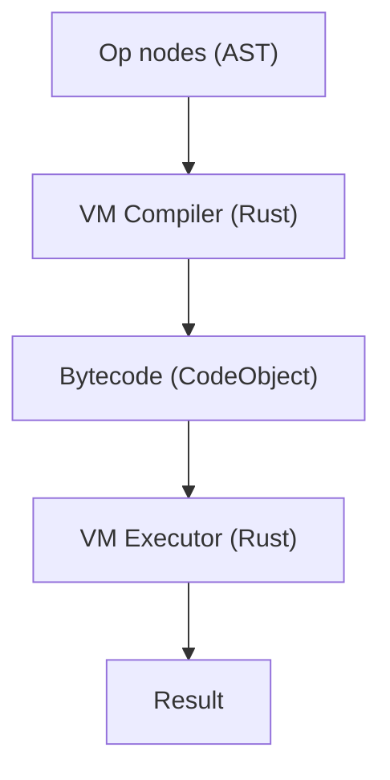

# Machine Virtuelle

Catnip utilise une VM stack-based en Rust pour exécuter du bytecode sans buter sur la profondeur de pile Python.

## Pourquoi une VM

La VM corrige trois limites de l'interprétation AST directe :

**Stack overflow** : supprime la limite de profondeur Python

- Récursion profonde possible (factorielle, fibonacci)
- Pas de `RecursionError` sur code tail-recursive

**Performance** : dispatch O(1) via pattern matching

- 2-15x plus rapide que l'interpréteur AST
- Bytecode compact et linéaire (cache-friendly)

**Profilabilité** : instrumentation et tracing intégrés

- Comptage d'opcodes pour hot detection
- Traces pour debugging
- Support JIT (voir [JIT](JIT.md))

## Architecture : Stack-based VM

Catnip utilise une **stack machine** plutôt qu'une register machine :

**Stack-based** :

```
LOAD_CONST 10    # Push 10
LOAD_CONST 20    # Push 20
ADD              # Pop 20, Pop 10, Push 30
```

**Avantages** :

- Bytecode compact (pas de registres à encoder)
- Simple à générer (compilation directe depuis AST)
- Simple à implémenter (une seule stack)

**Trade-off** : Plus d'instructions stack (push/pop) vs register-based, mais dispatch rapide compense

**Références** :

- [Stack machine](https://en.wikipedia.org/wiki/Stack_machine) (Wikipedia)
- [Virtual machine comparison](https://www.usenix.org/legacy/events/vee05/full_papers/p153-yunhe.pdf) (USENIX 2005)

### NaN-boxing : Représentation Compacte

La VM utilise le **NaN-boxing** pour représenter toutes les valeurs sur 64 bits :

**Principe** : les floats IEEE-754 ont des patterns NaN inutilisés qu'on peut exploiter

```
[Sign:1][Exponent:11=0x7FF][Quiet:1][Tag:3][Payload:48]
```

| Tag   | Type     | Payload                         |
| ----- | -------- | ------------------------------- |
| `000` | SmallInt | 48-bit signed integer           |
| `001` | Bool     | 0 = false, 1 = true             |
| `010` | Nil      | (unused)                        |
| `011` | Symbol   | symbol id                       |
| `100` | PyObject | pointeur `Py<PyAny>` (48-bit)   |
| `101` | Struct   | index dans le StructRegistry    |
| `110` | BigInt   | pointeur `Arc<BigInt>` (48-bit) |

Les floats sont stockés directement (pas dans un NaN pattern). Toutes les primitives tiennent dans 8 bytes sans
allocation heap.

**Avantages** :

- Inline pour int/float/bool/None (pas d'allocation)
- Conversions zero-cost (reinterpret_cast)
- Cache-friendly (64 bits = 1 word)

**Promotion automatique** : quand un SmallInt overflow (48-bit), l'arithmétique promeut en BigInt (`Arc<BigInt>` via
`num-bigint`). La demotion inverse se fait automatiquement si le résultat tient dans un SmallInt.

**Struct round-trip** : quand un TAG_STRUCT traverse la frontière Python (ex: stocké dans une `list()`), il est converti
en `CatnipStructProxy` (PyObject) via `to_pyobject()`. Le proxy porte un `native_instance_idx` qui permet à
`from_pyobject()` de restaurer le TAG_STRUCT natif si l'instance appartient au StructRegistry courant. Le pointeur
thread-local du StructRegistry est sauvegardé/restauré dans `PyRustVM::execute()` pour gérer les appels VM réentrants
(méthodes récursives sur structs dans des collections).

**Références** :

- [LuaJIT's value representation](http://lua-users.org/lists/lua-l/2009-11/msg00089.html)
- [JavaScriptCore NaN-boxing](https://wingolog.org/archives/2011/05/18/value-representation-in-javascript-implementations)

> Le NaN-boxing exploite le fait que les float s IEEE-754 ont 2^52 patterns NaN possibles mais n'en utilisent qu'un. On
> récupère les autres pour stocker des ints, des pointeurs, des bools. C'est du "parasitage" légal de bits.

## Pipeline d'Exécution



### Compilation : Op → Bytecode

Le compiler (`catnip_rs/src/vm/compiler.rs`) transforme les nœuds Op en instructions bytecode :

**Génération** :

- Traverse récursivement les Op nodes
- Génère les instructions (opcode + arg)
- Construit les tables (constants, names, varnames)

**Optimisations** :

- Slot allocation pour variables locales
- Constant pooling
- Jump optimization

**Output** : `CodeObject` avec bytecode linéaire

**Struct optimizations** :

- `CallMethod` (opcode 74) : fuse `GetAttr` + `Call` pour les appels de méthode sur structs. Encoding :
  `(name_idx << 16) | nargs`. Evite l'allocation de `BoundCatnipMethod` intermédiaire

### Exécution : Bytecode → Result

L'executor (`catnip_rs/src/vm/core.rs`) exécute le bytecode via une boucle de dispatch :

**Dispatch loop** :

```rust
loop {
    let instr = frame.fetch_instruction();
    match instr.op {
        VMOpCode::LoadConst => { /* ... */ }
        VMOpCode::Add => { /* ... */ }
        // ...
    }
}
```

**Frame** : structure d'exécution

- Operand stack (valeurs NaN-boxed)
- Local variables (slots)
- Program counter (PC)

**Frame pooling** : réutilisation des frames pour éviter les allocations

## Modes d'Exécution

**VM mode** (défaut) :

```bash
catnip script.cat              # Mode VM
catnip -x vm script.cat        # Explicite
```

**AST mode** (fallback) :

```bash
catnip -x ast script.cat       # Interprétation AST directe
```

**Rôle du mode AST** : implémentation de référence pour le développement de la VM. L'interpréteur AST existait avant la
VM et exécute directement les nœuds Op via le Registry. Son intérêt est de fournir un oracle indépendant :

- **Validation** : tout test qui passe en AST et échoue en VM isole un bug de compilation ou de dispatch VM
- **Debugging** : pas de couche de compilation entre l'IR et l'exécution, le flux est plus lisible
- **Régression** : `make test-all` exécute la suite complète dans les deux modes, ce qui garantit l'équivalence
  sémantique

Le mode AST n'est pas destiné aux utilisateurs finaux. Il est plus lent (pas de NaN-boxing, dispatch indirect via
Python) mais plus simple à raisonner.

## Error Handling

La VM produit des messages d'erreur avec position source (fichier, ligne, colonne) et pile d'appels.

**Principe** : capture lazy - zéro overhead sur le chemin normal d'exécution.

**Line table** : le `CodeObject` contient une table parallèle aux instructions, chaque entrée mappe une instruction vers
son `start_byte`. Le peephole optimizer maintient cette correspondance.

**Call stack** : la VM empile/dépile les frames d'appel avec nom de fonction et position source.

**Capture** : quand une erreur se produit, la VM consulte la line table et snapshote le call stack. Le bridge Python
convertit le `start_byte` en ligne/colonne via `SourceMap` et enrichit l'exception avec un extrait.

**Exemple de sortie** :

```
File '<input>', line 2, column 14: division by zero
    2 | f = (x) => { x / 0 }
    |              ^
Traceback (most recent call last):
  File "<input>", in <lambda>
CatnipRuntimeError: division by zero
```

**Références** :

- CPython [co_linetable](https://docs.python.org/3/reference/datamodel.html#codeobject.co_linetable) -- même pattern de
  table parallèle aux instructions

> La VM logge la position source de chaque instruction. En exécution normale: rien à signaler. En erreur: ciblage
> chirurgical.

## Performances Typiques

| Type de code        | VM vs AST |
| ------------------- | --------- |
| Arithmétique simple | 2-5x      |
| Boucles numériques  | 5-15x     |
| Listes/itération    | 3-10x     |
| Pattern matching    | 2-3x      |
| Récursion           | 2-8x      |

**Avec JIT** : 50-200x vs AST pour boucles numériques intensives

Voir [JIT](JIT.md) pour détails sur compilation native.
