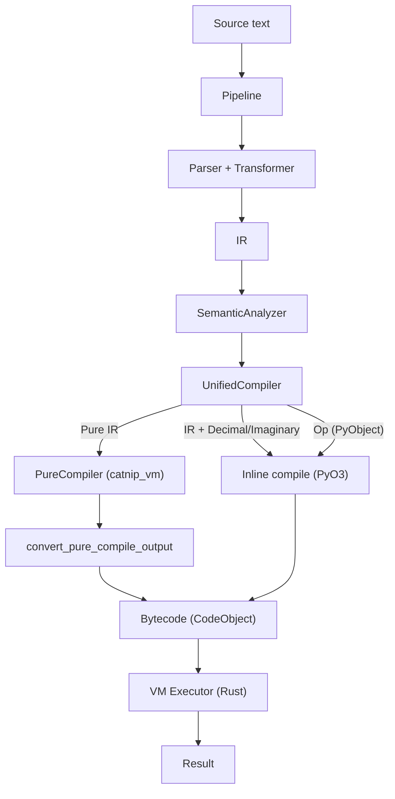
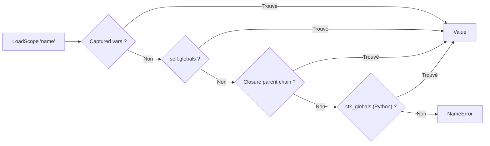

# Machine Virtuelle

Catnip utilise une VM stack-based en Rust pour exécuter du bytecode sans buter sur la profondeur de pile Python.

## Pourquoi une VM

La VM corrige trois limites de l'interprétation AST directe :

**Stack overflow** : supprime la limite de profondeur Python

- Récursion profonde possible (factorielle, fibonacci)
- Pas de `RecursionError` sur code tail-recursive

**Performance** : dispatch O(1) via pattern matching

- 2-15x plus rapide que l'interpréteur AST
- Bytecode compact et linéaire (cache-friendly)

**Profilabilité** : instrumentation et tracing intégrés

- Comptage d'opcodes pour hot detection
- Traces pour debugging
- Support JIT (voir [JIT](JIT.md))

## Architecture : Stack-based VM

Catnip utilise une **stack machine** plutôt qu'une register machine :

**Stack-based** :

```
LOAD_CONST 10    # Push 10
LOAD_CONST 20    # Push 20
ADD              # Pop 20, Pop 10, Push 30
```

**Avantages** :

- Bytecode compact (pas de registres à encoder)
- Simple à générer (compilation directe depuis AST)
- Simple à implémenter (une seule stack)

**Trade-off** : Plus d'instructions stack (push/pop) vs register-based, mais dispatch rapide compense

**Références** :

- [Stack machine](https://en.wikipedia.org/wiki/Stack_machine) (Wikipedia)
- [Virtual machine comparison](https://www.usenix.org/legacy/events/vee05/full_papers/p153-yunhe.pdf) (USENIX 2005)

### NaN-boxing : Représentation Compacte

La VM utilise le **NaN-boxing** pour représenter toutes les valeurs sur 64 bits :

**Principe** : les floats IEEE-754 ont des patterns NaN inutilisés qu'on peut exploiter

```
[Sign:1][Exponent:11=0x7FF][Quiet:1][Tag:4][Payload:47]
```

| Tag    | Type        | Payload                            |
| ------ | ----------- | ---------------------------------- |
| `0000` | SmallInt    | 47-bit signed integer              |
| `0001` | Bool        | 0 = false, 1 = true                |
| `0010` | Nil         | (unused)                           |
| `0011` | Symbol      | symbol id (includes enum variants) |
| `0100` | PyObject    | handle ObjectTable (u32)           |
| `0101` | Struct      | index dans le StructRegistry       |
| `0110` | BigInt      | pointeur `Arc<GmpInt>` (47-bit)    |
| `0111` | VMFunc      | index dans la FunctionTable        |
| `1000` | NativeStr   | pointeur `Arc<NativeString>`       |
| `1001` | NativeList  | pointeur `Arc<NativeList>`         |
| `1010` | NativeDict  | pointeur `Arc<NativeDict>`         |
| `1011` | NativeTuple | pointeur `Arc<NativeTuple>`        |
| `1100` | NativeSet   | pointeur `Arc<NativeSet>`          |
| `1101` | NativeBytes | pointeur `Arc<NativeBytes>`        |
| `1110` | StructType  | type_id dans PureStructRegistry    |
| `1111` | Extended    | pointeur `Arc<ExtendedValue>`      |

Tag 15 (Extended) est un tag "overflow" qui stocke un `Arc<ExtendedValue>`. Variants actuels :

- `Module(ModuleNamespace)` -- namespaces d'import `.cat` en mode pur Rust
- `EnumType(u32)` -- marqueur de type enum (type_id dans EnumRegistry)
- `Complex(f64, f64)` -- nombre complexe natif (real, imag)
- `Meta(NativeMeta)` -- objet META (getattr/setattr, exports programmatiques)

Les futurs types s'y ajouteront sans consommer de tag supplementaire. Dispatch GetAttr/CallMethod dans `core.rs`.

Dans `catnip_rs` (VM principale avec PyO3), Complex utilise un tag dedié (`TAG_COMPLEX = 8`) avec `Arc<NativeComplex>`
au lieu de passer par Extended. Le round-trip Python se fait via `PyComplex::from_doubles` / `PyComplex.real()/.imag()`.

Tag 3 (Symbol) stocke un symbol_id interné. Les enum variants utilisent ce tag : chaque variante est internée comme
`"EnumName.variant"` dans la `SymbolTable`, et la `PureEnumRegistry` mappe symbol_id vers (type_id, variant_id) pour le
dispatch `match` et `GetAttr`. Opcode `MakeEnum` (89) enregistre un type enum et ses variantes dans les registres.

Tags 5, 8-14 sont définis dans `catnip_vm` (VM pure Rust, sans PyO3). Tag 5 (Struct) utilise un index dans
`PureStructRegistry` avec refcount explicite (pas Arc). Tag 14 (StructType) est un type callable pour la construction.
Les types mutables (List, Dict, Set) utilisent `RefCell` pour la mutabilité single-threaded. Les types immutables
(Tuple, Bytes) utilisent `Box<[T]>`.

Les floats sont stockés directement (pas dans un NaN pattern). Toutes les primitives tiennent dans 8 bytes sans
allocation heap.

**Garde refcount** : les tags 6-13 et 15 pointent vers des `Arc` heap-allocated. `clone_refcount()` et `decref()` dans
`catnip_vm` doivent vérifier `!is_float()` avant d'inspecter le tag, car certains floats normaux (subnormals, grands
exposants) ont des bits 50-47 qui matchent accidentellement un tag heap. Sans cette garde, un float comme `1e-100`
déclencherait `Arc::increment_strong_count` sur un pointeur invalide. `catnip_rs` n'a pas ce problème car ses méthodes
`is_bigint()`/`is_pyobj()` vérifient le préfixe QNAN_BASE complet.

**`clone_refcount()` unifié** : dans `catnip_rs`, `Value::clone_refcount()` gère les quatre types refcountés : BigInt
(Arc increment), Complex (Arc increment), PyObject (ObjectTable handle), et Struct instance (thread-local
`struct_registry_incref()`). Tout code qui duplique une Value (DupTop, StoreScope vers globals, default parameter
binding) passe par cette méthode unique. La variante `clone_refcount_bigint()` gère BigInt et Complex (utilisée par les
Load opcodes qui font l'incref struct explicitement via `self.struct_registry.incref()`).

**Avantages** :

- Inline pour int/float/bool/None (pas d'allocation)
- Conversions zero-cost (reinterpret_cast)
- Cache-friendly (64 bits = 1 word)

**Promotion automatique** : quand un SmallInt overflow (47-bit), l'arithmétique promeut en BigInt (`Arc<GmpInt>` via
`rug`/GMP, linké statiquement). La demotion inverse se fait automatiquement si le résultat tient dans un SmallInt.

**Arithmétique overflow-safe** : les opérations binaires (+, -, \*) utilisent `checked_add`/`checked_sub`/`checked_mul`
pour détecter le dépassement i64. Si `checked_*` retourne `None` (overflow i64), promotion directe en BigInt via
`Integer::from(a) op Integer::from(b)`. Si le résultat i64 dépasse la plage SmallInt 47-bit, même promotion. La
restauration après exécution JIT fait un `decref` de l'ancienne valeur avant d'écrire le nouveau `Value` pour éviter les
corruptions de refcount sur les `BigInt` heap-allocated.

**Sentinelle NaN** : les floats IEEE-754 NaN ont des bits qui collisionnent avec le tag SmallInt(0). Pour distinguer un
vrai `float('nan')` d'un entier zéro, la VM utilise un signaling NaN canonique (`0x7FF0_0000_0000_0001`) comme
sentinelle. Les floats sont exclus du raccourci d'égalité bitwise.

**ObjectTable** : les TAG_PYOBJ ne stockent pas de pointeur brut mais un handle `u32` vers une `ObjectTable` globale
(protégée par `Mutex`, jamais contended sous le GIL). La table maintient un refcount par slot ; `clone_refcount()` et
`decref()` gèrent le cycle de vie. La table est globale (pas per-VM) car les handles doivent rester valides quand des
Values traversent les frontières de threads (workers ND).

**VMFunc round-trip** : les fonctions VM sont stockées nativement avec TAG_VMFUNC (index dans une `FunctionTable`
grow-only). Quand une fonction traverse la frontière Python (ex: callback, `print(fn)`), `to_pyobject()` crée un
`VMFunction` lazy avec `func_table_idx`. `from_pyobject()` détecte `VMFunction` et restaure TAG_VMFUNC si l'index
appartient à la FunctionTable courante. Ce mécanisme évite le round-trip PyO3 dans la boucle de dispatch (`Call` fast
path : `func.is_vmfunc()` → lecture directe de la FunctionTable, sans ObjectTable ni downcast).

**Struct round-trip** : même pattern pour TAG_STRUCT. Quand un TAG_STRUCT traverse la frontière Python (ex: stocké dans
une `list()`), il est converti en `CatnipStructProxy` (PyObject) via `to_pyobject()`. Le proxy porte un
`native_instance_idx` et possède un refcount sur le slot StructRegistry : `instance_to_pyobject()` incref à la création,
`CatnipStructProxy.__del__` decref via `struct_registry_release()`. `from_pyobject()` détecte le proxy et restaure le
TAG_STRUCT natif avec incref (la nouvelle Value possède son propre refcount). `GetAttr`/`SetAttr` decref l'objet poppé
du stack après utilisation. `CallFunc` incref via `self.struct_registry` quand il reconstruit un TAG_STRUCT depuis
`BoundCatnipMethod.native_instance_idx`. `InstanceSlot.refcount` utilise `AtomicU32` pour permettre `incref(&self)` sans
aliasing avec les accès thread-local `*const`. Les pointeurs thread-local (StructRegistry, FunctionTable) sont
sauvegardés/restaurés dans `PyRustVM::execute()` et dans `VMFunction::__call__` (mode standalone) pour gérer les appels
VM réentrants. `Executor` implémente `Drop` pour nettoyer ces pointeurs, évitant les dangling references après
exécution. `FunctionTable::get()` retourne `Option` : les accès invalides produisent un `VMError` au lieu d'un panic.

**Réentrance standalone** : quand un callback Catnip (lambda capturant des variables) est appelé depuis Python (ex:
`fold` appelle un lambda), `VMFunction::__call__` crée un VM temporaire. Deux mécanismes assurent la continuité :

- **Closure** : `execute_with_host()` accepte un `closure_scope: Option<NativeClosureScope>` qui est assigné au frame
  initial, permettant au callback de résoudre les variables capturées.
- **FunctionTable** : le VM enfant copie les entrées de la FunctionTable du parent avant exécution. Sans cette copie,
  les valeurs TAG_VMFUNC dans la closure (indices dans la table du parent) provoqueraient des accès invalides.
- **Globals** : `take_vm_globals()` récupère l'Arc globals du parent (posé par `set_vm_globals()` avant le dispatch
  broadcast) et le transmet au `VMHost` du VM enfant pour que les mutations globales se propagent.
- **StructRegistry** : le VM enfant clone les types et instances du parent (`clone_from_parent`). Les nouvelles
  instances créées dans le child (index > parent_count) sont transplantées vers le parent via `transplant_to_parent()`
  avant la restauration des pointeurs thread-local. Sans ce transplant, les struct instances retournées par le broadcast
  seraient converties en `py.None()` car leur index n'existerait pas dans le parent registry.

**Références** :

- [LuaJIT's value representation](http://lua-users.org/lists/lua-l/2009-11/msg00089.html)
- [JavaScriptCore NaN-boxing](https://wingolog.org/archives/2011/05/18/value-representation-in-javascript-implementations)

> Le NaN-boxing exploite le fait que les float s IEEE-754 ont 2^52 patterns NaN possibles mais n'en utilisent qu'un. On
> récupère les autres pour stocker des ints, des pointeurs, des bools. C'est du "parasitage" légal de bits.

## Pipeline d'Exécution

En mode VM, la classe `Catnip` délègue à `Pipeline` qui orchestre le pipeline Rust complet :



### Compilation : IR → Bytecode

Deux compilateurs, un seul pipeline :

- **PureCompiler** (`catnip_vm/src/compiler/`) : compilateur 100% Rust, zéro PyO3. Compile IR → bytecode avec Value
  NaN-boxed natifs (NativeStr, NativeTuple). Gère tous les opcodes IR sauf Decimal/Imaginary (qui nécessitent Python)
- **UnifiedCompiler** (`catnip_rs/src/vm/unified_compiler.rs`) : bridge PyO3. Délègue `compile_pure()` au PureCompiler,
  convertit le résultat via `convert_pure_compile_output()`. Fallback inline pour IR contenant Decimal/Imaginary. Chemin
  Op (PyObject) reste inchangé

Structure du PureCompiler :

| Fichier                   | Rôle                                                                 |
| ------------------------- | -------------------------------------------------------------------- |
| `compiler/mod.rs`         | PureCompiler, CompileOutput, toutes les méthodes compile\_\*         |
| `compiler/core.rs`        | CompilerCore (emit, patch, add_const, emit_store, build_code_object) |
| `compiler/code_object.rs` | CodeObject pur Rust                                                  |
| `compiler/pattern.rs`     | VMPattern/VMPatternElement                                           |
| `compiler/error.rs`       | CompileError, CompileResult                                          |
| `compiler/input.rs`       | Helpers IR (ir_to_name, has_complex_pattern, etc.)                   |

Produit un `CompileOutput` (CodeObject principal + sous-fonctions). Les sous-fonctions (lambdas, méthodes) sont
référencées par `Value::from_vmfunc(idx)` et converties en `PyCodeObject` wraps lors du passage à catnip_rs.

**Génération** :

- Traverse récursivement les nœuds IR
- Génère les instructions (opcode + arg)
- Construit les tables (constants, names, varnames)

**Optimisations** :

- Slot allocation pour variables locales
- Constant pooling
- Jump optimization (peephole via catnip_core)

**Output** : `CodeObject` avec bytecode linéaire

**Struct optimizations** :

- `CallMethod` (opcode 74) : fuse `GetAttr` + `Call` pour les appels de méthode sur structs. Encoding :
  `(name_idx << 16) | nargs`. Evite l'allocation de `BoundCatnipMethod` intermédiaire

**Slice optimizations** :

- `GetItem(arg=1)` : fuse `Slice` + `GetItem` pour les expressions `obj[start:stop:step]`. Le compilateur détecte quand
  le second argument de `getitem` est un noeud `IR::Slice` et inline start/stop/step directement sur la stack au lieu
  d'émettre `BuildSlice(3) + GetItem(0)`. Stack : `[obj, start, stop, step] → GetItem(1) → [result]`. Les deux VMs
  (PureVM et PyO3) implémentent ce dispatch : PureVM appelle `apply_slice()` (sémantique Python complète pour step
  positif/négatif), PyO3 VM construit un objet `slice()` Python à la volée. Nécessaire car PureCompiler est aussi
  utilisé via `UnifiedCompiler::compile_pure()` dans le pipeline catnip_rs

### Exécution : Bytecode → Result

L'executor (`catnip_rs/src/vm/core.rs`) exécute le bytecode via une boucle de dispatch :

**Dispatch loop** :

```rust
loop {
    let instr = frame.fetch_instruction();
    match instr.op {
        VMOpCode::LoadConst => { /* ... */ }
        VMOpCode::Add => { /* ... */ }
        // ...
    }
}
```

**Résolution LoadScope** : la VM résout les noms en 4 étapes, du plus rapide au plus coûteux :



Les deux premiers niveaux (captured vars, self.globals) sont des IndexMap lookups O(1) en Rust pur, sans traverser la
frontière PyO3. La closure parent chain et ctx_globals impliquent des appels Python et ne sont atteints que pour les
variables non locales ni capturées.

**Host abstraction** (`vm/host.rs`) : le dispatch loop ne fait pas d'appels PyO3 directs pour les opérations hôte. Le
trait `VmHost` (13+ méthodes) abstrait la résolution de noms (`lookup_global`, `store_global`, `delete_global`,
`has_global`), les opérateurs binaires Python (`binary_op` via `BinaryOp` enum, 11 variants), l'accès au registry
(`resolve_registry`), l'itération (`get_iter`), la construction de closures (`build_closure_parent`), l'accès
attributs/items Python (`obj_getattr`, `obj_setattr`, `obj_getitem`, `obj_setitem`), et le broadcast ND
(`broadcast_nd_recursion`, `broadcast_nd_map`). Trois implémentations : `ContextHost` (context Python, instancié dans
`run()`), `VMHost` (standalone, globals Rust IndexMap), et **PureVM** (`catnip_vm/src/vm/broadcast.rs`, Rust pur sans
PyO3, séquentiel uniquement). Le broadcast ND est délégué au host depuis `core.rs` -- la boucle inline est remplacée par
un appel à `host.broadcast_nd_recursion/map`. PureVM implémente broadcast directement dans la dispatch loop via
`call_vmfunc_sync` (save/restore frame_stack). L'implémentation par défaut du trait est séquentielle. `VMHost` supporte
trois modes via `NdMode` :

- **Sequential** : boucle simple, `NDVmDecl`/`NDVmRecur`
- **Thread** (rayon) : `par_iter().map_with()`, GIL relâché (`py.detach`), chaque thread rayon re-acquiert le GIL
  (`Python::attach`), reçoit un snapshot indépendant des globals, et exécute le lambda ND avec `NDParallelDecl`
  (Send+Sync, cache `Arc<Mutex>`, depth `AtomicUsize`)
- **Process** : pool persistant de workers Rust natifs (`catnip worker`) communicant via IPC bincode (length-prefixed
  sur stdin/stdout). Si la lambda a un `encoded_ir` et que captures + seeds sont freezables, le `WorkerPool` distribue
  en round-robin sans passer par Python. Sinon, fallback transparent vers `ProcessPoolExecutor` avec
  `_worker_execute_simple`. Le pool est lazy-init au premier appel process et persiste pour la durée de vie du `VMHost`

Config via `Pipeline.set_nd_mode("thread"|"sequential"|"process")`.

**Optimisation NDVmRecur** : en mode standalone, le VM Call opcode détecte `NDVmRecur` et pousse un frame sur la stack
courante au lieu de créer une VM par appel récursif. `NDVmRecur` stocke `vm_code`/`vm_closure` extraits du `VMFunction`
au moment de la création. Le tracking se fait via `nd_recur_stack` (depth guard, memoization cache, cleanup sur pop et
erreur).

**Frame** : structure d'exécution

- Operand stack (valeurs NaN-boxed)
- Local variables (slots)
- Program counter (PC)
- handler_stack, active_exception_stack, pending_unwind (exception handling)

**Frame pooling** : `FramePool` recycle les frames libérées (`free` → `reset` → stockage). `alloc_with_code` réutilise
un frame existant (conserve la capacité des Vec internes) ou en alloue un nouveau. Taille du pool : 64 frames.

**Call fast path** : pour les fonctions TAG_VMFUNC avec \<= 8 args et sans varargs, les arguments sont copiés
directement de la stack du caller vers les locals du callee via un buffer inline `[Value; 8]` (pas d'allocation Vec).
Les defaults sont remplis pour les params manquants. Le slow path (varargs, > 8 args, PyObject callables) utilise
`bind_args` avec un Vec.

## Modes d'Exécution

**VM mode** (défaut) :

```bash
catnip script.cat              # Mode VM
catnip -x vm script.cat        # Explicite
```

**Mode AST** (interne, pour les contributeurs) :

```bash
catnip -x ast script.cat       # Interprétation AST directe
```

Le mode AST exécute les Op nodes via le Registry sans passer par la compilation bytecode. Il sert d'implémentation de
référence pour valider la VM :

- Un test qui passe en AST et échoue en VM isole un bug de compilation ou de dispatch VM
- `make test-all` exécute la suite dans les deux modes pour garantir l'équivalence sémantique
- Le flux est plus lisible pour le debug (pas de couche de compilation entre l'IR et l'exécution)

Le mode AST n'est pas exposé dans la documentation utilisateur. Il est plus lent (dispatch indirect, pas de NaN-boxing)
et n'a pas accès au JIT. Code Rust derrière le feature flag `ast-executor`.

## Error Handling

La VM produit des messages d'erreur avec position source (fichier, ligne, colonne) et pile d'appels.

**Principe** : capture lazy - zéro overhead sur le chemin normal d'exécution.

**Variantes `VMError`** : au-delà des erreurs classiques (`NameError`, `TypeError`, `RuntimeError`, `ZeroDivisionError`,
`MemoryLimitExceeded`), trois variantes spécialisées :

- `VMError::UserException(ExceptionInfo)` - exception user-defined ou type groupe (ArithmeticError, LookupError,
  Exception) avec MRO complet pour le matching hiérarchique. Préserve l'identité à travers les rethrows et finally.

Deux variantes contrôlent l'arrêt du processus :

- `VMError::Exit(i32)` - arrêt explicite avec code de sortie. Produit par l'opcode `Exit` ou par conversion d'un
  `SystemExit` Python intercepté dans `pyerr_to_vmerror` (`py_interop.rs`)
- `VMError::Interrupted` - interruption coopérative (Ctrl+C depuis le REPL). Converti en `KeyboardInterrupt` côté Python

**Opcode `Exit` (83)** : termine le processus avec un code de sortie. Encoding de l'argument :

- `arg=0` : exit code 0 (succès)
- `arg=1` : pop le code de sortie depuis la stack

**Line table** : le `CodeObject` contient une table parallèle aux instructions, chaque entrée mappe une instruction vers
son `start_byte`. Le peephole optimizer maintient cette correspondance.

**Call stack** : la VM empile/dépile les frames d'appel avec nom de fonction et position source.

**Capture** : quand une erreur se produit, la VM consulte la line table et snapshote le call stack dans un
`ErrorContext` (start_byte, error_type, message, call_stack).

**Enrichissement** : deux chemins distincts selon le mode d'exécution :

- **Standalone (binaire Rust)** : `Executor.enrich_error()` lit l'`ErrorContext` (sans le consommer) et génère un
  snippet via `SourceMap.get_snippet()`. Le snippet est ajouté au message d'erreur sous forme de texte
- **Python (PyO3)** : `_enrich_with_position()` dans `compat.py` ou `_enrich_error()` dans `rust_bridge.py` récupère
  l'`ErrorContext` via `get_last_error_context()` et enrichit l'exception `CatnipError` avec les champs structurés
  (`filename`, `line`, `column`, `context`, `traceback`)

**Format des messages** : `VMError::Display` utilise les préfixes Python standards (`TypeError:`, `ValueError:`, etc.)
sans double-wrapping. Les types sans variante dédiée (`IndexError`, `KeyError`, etc.) préfixent le message dans
`pyerr_to_vmerror` pour préserver le type à travers la conversion `VMError::RuntimeError(String)`.

**Exemple de sortie** (standalone) :

```
Error: TypeError: 'int' object is not callable
  1 | x = 1; x()
    |        ^
```

**Références** :

- CPython [co_linetable](https://docs.python.org/3/reference/datamodel.html#codeobject.co_linetable) - même pattern de
  table parallèle aux instructions

> La VM logge la position source de chaque instruction. En exécution normale: rien à signaler. En erreur: ciblage
> chirurgical.

### Exception Handling (try/except/finally)

**Statut** : dispatch natif complet. Les 8 opcodes (90-97) sont implementes dans les deux VMs (PureVM et PyO3). Plus de
fallback AST.

**Opcodes** :

| Opcode           | Valeur | Arg                   | Effet                                         |
| ---------------- | ------ | --------------------- | --------------------------------------------- |
| `SetupExcept`    | 90     | handler_addr          | Push Except handler sur la handler_stack      |
| `SetupFinally`   | 91     | finally_addr          | Push Finally handler                          |
| `PopHandler`     | 92     | --                    | Pop top handler                               |
| `Raise`          | 93     | 0=expr, 1=re-raise    | Leve une exception                            |
| `CheckExcMatch`  | 94     | const_idx (type name) | Push bool: type match?                        |
| `LoadException`  | 95     | --                    | Push message de l'exception active            |
| `ResumeUnwind`   | 96     | --                    | Reprend le pending_unwind apres finally       |
| `ClearException` | 97     | --                    | Pop de l'active_exception_stack (fin handler) |

**Structures Frame** :

- `handler_stack: Vec<Handler>` -- pile de handlers actifs (Except/Finally)
- `active_exception_stack: Vec<ExceptionInfo>` -- pile d'exceptions actives avec MRO pour matching hierarchique
- `pending_unwind: Option<PendingUnwind>` -- signal sauvegarde pendant l'execution du finally

**Dispatch refactor** : la boucle dispatch est scindee en `dispatch` (wrapper) et `dispatch_inner` (execution).
`dispatch_inner` prend `frame: &mut Frame` (pas ownership). Quand une instruction retourne `Err`, le wrapper intercepte
l'erreur et parcourt le `handler_stack` via `try_unwind_to_handler` :

- Except handler : push exception sur `active_exception_stack`, jump au handler
- Finally handler : set `pending_unwind`, push la valeur de retour si Return, jump au finally body
- Signaux de controle (Return/Break/Continue) : sautent les Except handlers, s'arretent au premier Finally

Pour Break/Continue a travers finally, le compilateur inline le finally body avant le jump (comme CPython). Le VM
n'utilise pas les opcodes Break/Continue dans ce cas.

**Compilation** : le `finally` est duplique (inline sur happy path, inline sur handler match path, et landing pad pour
l'unwind VM). Chaque handler except fait un `CheckExcMatch` par type, avec `Raise 1` si aucun match (re-raise par le
handler stack).

**Peephole** : `SetupExcept`/`SetupFinally` sont traites comme des jump targets (code handler marque live).
`Raise`/`ResumeUnwind` sont terminaux (pas de fallthrough). Les targets de `SetupExcept`/`SetupFinally` sont remappes
lors du compactage.

**Scope write** : le compilateur pre-scanne le body d'une fonction pour detecter les variables assignees qui existent
dans le scope parent. Ces variables emettent `StoreScope` (pas `StoreLocal`) pour modifier le scope enclosant.

## Periodic Checks

La VM effectue des vérifications périodiques toutes les ~65536 instructions (bitwise AND sur le compteur, coût
négligeable). Deux checks sont effectués à chaque intervalle :

### Cooperative Interruption

La VM expose un `interrupt_flag: Arc<AtomicBool>` accessible via `vm.interrupt_flag()`. Un thread externe (typiquement
le handler Ctrl+C du REPL) peut positionner ce flag pour demander l'arrêt. La VM le consulte à chaque intervalle avec un
`load(Relaxed)` et produit `VMError::Interrupted` si le flag est levé.

### Memory Guard

La VM vérifie le RSS du processus pour empêcher un script de consommer toute la RAM.

**Mécanisme** : lecture de `/proc/self/statm` sur Linux (~5 µs par check). Sur les autres plateformes, le guard est
inactif (no-op).

**Limite par défaut** : 2048 MB. Configurable via `-o memory:SIZE` (en MB), config TOML (`memory_limit`), ou variable
d'environnement (`CATNIP_OPTIMIZE=memory:SIZE`). `memory:0` désactive le guard.

**Erreur** : `MemoryError` avec message indiquant le RSS courant, la limite, et comment augmenter ou désactiver.

```
MemoryError: memory limit exceeded (2100 MB / 2048 MB)
Increase: catnip -o memory:4096
Disable:  catnip -o memory:0
```

**Implémentation** : `catnip_rs/src/vm/memory.rs` (lecture RSS), champs `memory_limit_bytes` et `instruction_count` dans
la struct `VM`, variante `MemoryLimitExceeded` dans `VMError` (convertie en `PyMemoryError`).

## Higher-Order Function Builtins (PureVM)

`map`, `filter`, `fold`, `reduce` sont implémentés nativement dans PureVM (`catnip_vm`). Le mécanisme utilise un
dispatch ré-entrant car ces fonctions doivent appeler des closures utilisateur depuis un builtin -- impossible avec
`call_builtin` (fonction libre sans accès au VM).

**Signal HOF** : quand `dispatch_inner` détecte un appel à un HOF builtin (via `try_build_hof`), il retourne
`VMError::HofBuiltin(HofCall)` au lieu de déléguer à `host.call_function`. `dispatch` intercepte ce signal et appelle
`execute_hof`.

**Dispatch ré-entrant** : `execute_hof` itère sur les éléments et appelle `call_func_sync` pour chaque invocation de
closure. `call_func_sync` crée un frame et appelle `dispatch` récursivement. Le `base_depth` (profondeur de la
frame_stack au début de chaque `dispatch`) garantit que le dispatch interne ne pop jamais les frames de l'appelant
externe. `unwind_exception` respecte aussi cette limite.

**Signatures** :

- `map(func, iterable)` -- applique `func` à chaque élément, retourne une liste
- `filter(func, iterable)` -- garde les éléments où `func` retourne truthy, retourne une liste
- `fold(iterable, init, func)` -- réduction avec accumulateur initial
- `reduce(iterable, func)` -- réduction sans init (erreur si vide)

**Itérables** : l'extraction utilise `host.get_iter()`, donc tous les types itérables PureVM sont supportés (list,
tuple, range, dict, set, str, bytes).

**Divergence pipeline Python** : dans le pipeline PyO3, `map` et `filter` sont les builtins Python qui retournent des
itérateurs lazy. En PureVM, ils retournent des listes eager. PureVM n'a pas de type Value itérateur lazy -- les valeurs
sont NaN-boxed et il n'y a pas de tag pour un itérateur suspendu. En pratique, le code Catnip consomme quasi-toujours le
résultat immédiatement (`for`, `len`, indexation), donc la sémantique eager est le cas commun. `fold` et `reduce` ne
sont pas affectés (résultat scalaire dans les deux pipelines).

**Refcount** : les items sont collectés via `host.get_iter()` (qui clone les refcounts). `execute_hof` décrémente chaque
élément après usage, décrémente les `acc` intermédiaires (fold/reduce), et décrémente le callable. Le Call handler
décrémente le nom du builtin. Les chemins d'erreur (validation, runtime, itération) nettoient de façon identique.

**Fichiers** : `catnip_vm/src/error.rs` (types `HofCall`/`HofKind`), `catnip_vm/src/vm/core.rs` (dispatch, execute_hof,
call_func_sync, try_build_hof, collect_iterable), `catnip_vm/src/host.rs` (BUILTIN_NAMES).

## String Formatting (F-strings)

Les f-strings sont compilées en deux opcodes dédiés, alignés sur le design de CPython 3.12+ (`FORMAT_VALUE` +
`BUILD_STRING`) :

**FormatValue (84)** : formate une valeur avec conversion optionnelle et format spec.

```
... value [spec]  →  ... formatted_string
```

L'argument encode les flags : `(conversion << 1) | has_spec`

| flags | signification                |
| ----- | ---------------------------- |
| 0     | `format(value, '')`          |
| 1     | `format(value, spec)`        |
| 2     | `format(str(value), '')`     |
| 3     | `format(str(value), spec)`   |
| 4     | `format(repr(value), '')`    |
| 5     | `format(repr(value), spec)`  |
| 6     | `format(ascii(value), '')`   |
| 7     | `format(ascii(value), spec)` |

**BuildString (85)** : concatène n strings en une seule allocation.

```
... s1 s2 ... sn  →  ... concatenated
```

**Pipeline** : le transformer émet `Op(Fstring, parts)` où chaque part est soit un `String` (texte), soit un
`Tuple(expr, Int(conv), spec)` (interpolation). Le compiler traduit les textes en `LoadConst`, les interpolations en
`compile(expr) + FormatValue(flags)`, et conclut par `BuildString(n)` si n > 1.

**Correctness** : `FormatValue` appelle `format(value, spec)` (protocol `__format__`), pas `str(value)`. Ceci aligne le
comportement sur Python : les types avec un `__format__` custom (datetime, Decimal, etc.) sont formatés correctement.

**Références** :

- CPython [FORMAT_VALUE](https://docs.python.org/3/library/dis.html#opcode-FORMAT_VALUE) - même design flags
- CPython [BUILD_STRING](https://docs.python.org/3/library/dis.html#opcode-BUILD_STRING) - concaténation finale

### Intrinsics

**TypeOf (86)** : retourne le nom du type comme string. Pop 1 valeur, push 1 string. Pas d'argument.

```
... value  →  ... "type_name"
```

Le dispatch inspecte directement le tag NaN-boxed (O(1) pour les types natifs). Pour les struct instances, lookup du nom
via `StructRegistry`. Pour les PyObjects, cascade `isinstance` sur les types courants (bool, int, float, str, list,
tuple, dict, set, callable), fallback `"object"`.

L'analyzer intercepte `typeof(expr)` et émet `IROpCode::TypeOf` au lieu d'un `Call` générique (même pattern que
`breakpoint()` → `Breakpoint`).

## Performances Typiques

| Type de code        | VM vs AST |
| ------------------- | --------- |
| Arithmétique simple | 2-5x      |
| Boucles numériques  | 5-15x     |
| Listes/itération    | 3-10x     |
| Pattern matching    | 2-3x      |
| Récursion           | 2-8x      |

**Avec JIT** : 50-200x vs AST pour boucles numériques intensives

Voir [JIT](JIT.md) pour détails sur compilation native.
