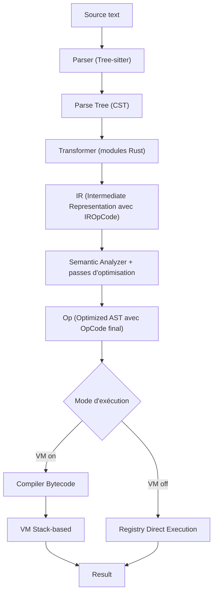

# Doc Développeur

Architecture interne et contribution au projet Catnip.

> Si tu lis ceci, tu es déjà dans le circuit, branché au flux.

## Vue d'ensemble

Catnip transforme du texte en résultat en plusieurs étapes, un peu comme une chaîne d'assemblage : on lit, on simplifie,
on optimise, puis on exécute.



L'architecture est hybride **Rust + Python** : Rust gère le "gros œuvre" (performance et sécurité), Python expose une API
simple côté application.

**Étapes détaillées** :

1. **Parsing** : Tree-sitter lit le texte et le transforme en arbre de syntaxe (CST)
1. **Transformation** : l'arbre est converti en une représentation intermédiaire (IR)
1. **Analyse sémantique** : l'IR est nettoyé et optimisé
1. **Compilation** (mode VM) : l'IR est traduit en bytecode pour la VM
1. **Exécution** :
   - **Mode VM** : exécution via bytecode (rapide, optimisable)
   - **Mode AST** : exécution directe (simple, utile pour certains cas)

## Composants principaux

| Composant       | Rôle                                      | Implémentation            | Opcodes     |
| --------------- | ----------------------------------------- | ------------------------- | ----------- |
| **Parser**      | Analyse syntaxique Tree-sitter            | Rust                      | -           |
| **Transformer** | Parse tree → IR (Intermediate Repr.)      | Rust (72 transformateurs) | IROpCode 56 |
| **Semantic**    | Analyse et optimisation IR → Op           | Rust (6 passes)           | OpCode 56   |
| **CFG**         | Control Flow Graph pour analyse           | Rust (dominance, loops)   | -           |
| **Compiler**    | Op → Bytecode (mode VM uniquement)        | Rust                      | VMOpCode 68 |
| **VM**          | Exécution bytecode stack-based            | Rust (NaN-boxing, JIT)    | -           |
| **Registry**    | Dispatch direct des opérations (mode AST) | Rust (52 opérations)      | -           |
| **Scope**       | Gestion des variables O(1)                | Rust                      | -           |
| **Context**     | Environnement d'exécution, pragmas        | Python                    | -           |

## Documents de cette section

- **[ARCHITECTURE](ARCHITECTURE.md)** - Pipeline complet, parsing, analyse sémantique, scopes
- **[VM](VM.md)** - Machine virtuelle Rust, NaN-boxing, modes d'exécution
- **[ND_VM_ARCHITECTURE](ND_VM_ARCHITECTURE.md)** - Opérations ND dans le VM (@@, @>, @[])
- **[JIT](JIT.md)** - Compilation Just-In-Time trace-based, Cranelift backend, hot detection
- **[OPTIMIZATIONS](OPTIMIZATIONS.md)** - Passes d'optimisation, niveaux, quand les activer
- **[CACHE](CACHE.md)** - Système de cache multi-niveaux, backends intégrés, protocole custom
- **[TEST_STRATEGY](TEST_STRATEGY.md)** - Répartition Rust/Python, parité VM/AST, anti-doublons
- **[BENCHMARKING](BENCHMARKING.md)** - Méthodologie de mesure et comparaison de performances
- **[EXTENDING](EXTENDING.md)** - Ajouter opcodes, opérations, extensions
- **[CONSTANTS](CONSTANTS.md)** - Configuration par défaut (prompts, couleurs, seuils JIT, etc.)

## Où trouver le code

```
catnip/             # module Python
catnip_rs/          # coeur Rust
catnip_grammar/     # Grammaire Tree-sitter
catnip_repl/        # REPL
catnip_tools/       # outils format, linter
catnip_mcp/         # serveur mcp
```

## Workflow de développement

```bash
# Après modification de fichiers Rust
uv pip install -e .

# Tests rapides Rust (~5s)
make rust-test-fast

# Tests complets Python (~25s)
make test

# Après modification de grammar.js
make grammar-deps
```

> Pipeline simple et composable : chaque étape prépare la suivante. C'est moins "Unix pur", mais plus lisible pour un
> moteur qui exécute du code.
