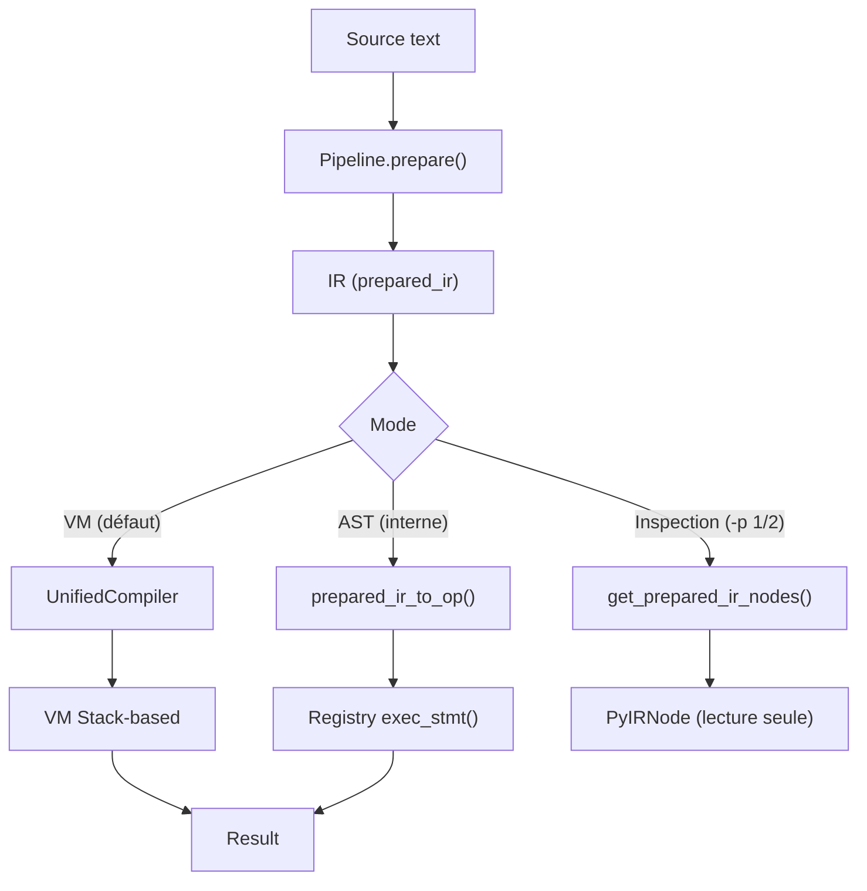

# Doc développeur

Architecture interne et contribution au projet Catnip. Section technique destinée à l'implémentation du runtime et des
outils. Le cap est simple : comprendre le moteur, puis le faire aller plus vite.

## Vue d'ensemble

Catnip transforme du texte en résultat en plusieurs étapes, un peu comme une chaîne d'assemblage : on lit, on simplifie,
on optimise, puis on exécute.



Un seul parse via `Pipeline.prepare()` produit l'IR. La VM compile et exécute le bytecode (chemin par défaut). Le mode
AST (`-x ast`, interne) interprète les Op nodes via le Registry -- il sert d'oracle de référence pour valider la VM.
L'inspection retourne des `PyIRNode` pour `-p 1/2` et le MCP.

L'architecture est hybride **Rust + Python** : Rust gère le "gros œuvre" (performance et sécurité), Python expose une
API simple côté application.

> Transparence : les preuves Coq du repo ne couvrent ni Tree-sitter ni Cranelift.

Détails de chaque étape : voir [Architecture](ARCHITECTURE.md).

## Composants principaux

| Composant       | Rôle                                      | Implémentation          | Opcodes  |
| --------------- | ----------------------------------------- | ----------------------- | -------- |
| **Parser**      | Analyse syntaxique Tree-sitter            | Rust                    | -        |
| **Transformer** | Parse tree → IR (Intermediate Repr.)      | Rust                    | IROpCode |
| **Semantic**    | Analyse et optimisation IR → Op           | Rust                    | OpCode   |
| **CFG**         | Control Flow Graph pour analyse           | Rust (dominance, loops) | -        |
| **Compiler**    | IR → Bytecode                             | Rust                    | -        |
| **VM**          | Exécution bytecode stack-based            | Rust (NaN-boxing, JIT)  | -        |
| **Registry**    | Dispatch direct des Op (mode AST interne) | Rust                    | -        |
| **Scope**       | Gestion des variables O(1)                | Rust                    | -        |
| **Context**     | Environnement d'exécution, pragmas        | Python                  | -        |

## Documents de cette section

- **[CONTRIBUTING](CONTRIBUTING.md)** - Setup environnement de dev, boucle de dev, commandes de test
- **[ARCHITECTURE](ARCHITECTURE.md)** - Pipeline complet, parsing, analyse sémantique, scopes
- **[VM](VM.md)** - Machine virtuelle Rust, NaN-boxing, modes d'exécution
- **[ND_VM_ARCHITECTURE](ND_VM_ARCHITECTURE.md)** - Opérations ND dans la VM (\~~, ~>, ~[])
- **[JIT](JIT.md)** - Compilation Just-In-Time trace-based, Cranelift backend, hot detection
- **[OPTIMIZATIONS](OPTIMIZATIONS.md)** - Passes d'optimisation, niveaux, quand les activer
- **[CACHE](CACHE.md)** - Système de cache multi-niveaux, backends intégrés, protocole custom
- **[TEST_STRATEGY](TEST_STRATEGY.md)** - Répartition Rust/Python, parité VM/AST, anti-doublons
- **[BENCHMARKING](BENCHMARKING.md)** - Méthodologie de mesure et comparaison de performances
- **[EXTENDING](EXTENDING.md)** - Ajouter opcodes, opérations, extensions
- **[CONSTANTS](CONSTANTS.md)** - Configuration par défaut (prompts, couleurs, seuils JIT, etc.)
- **[COQ_PROOFS](COQ_PROOFS.md)** - Preuves Coq : périmètre, vérification (`make proof`), modules de preuve

## Où trouver le code

```
catnip/             # module Python
catnip_rs/          # coeur Rust
catnip_grammar/     # Grammaire Tree-sitter
catnip_repl/        # REPL
catnip_tools/       # outils format, linter
catnip_lsp/         # serveur LSP
catnip_mcp/         # serveur mcp
```

## Workflow de développement

```bash
# Après modification de fichiers Rust
uv pip install -e .

# Tests rapides Rust (~5s)
make rust-test-fast

# Tests complets Python (~25s)
make test

# Après modification de grammar.js
make grammar-deps
```

Pipeline composable : chaque étape prépare la suivante.
