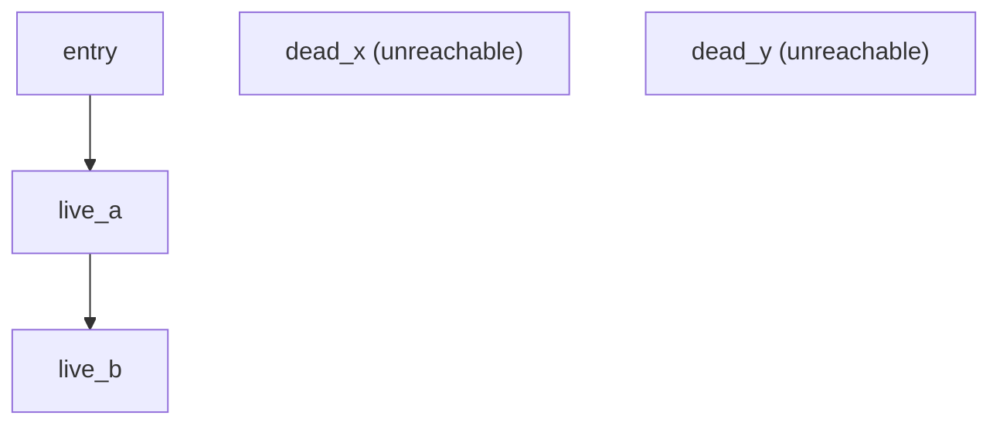
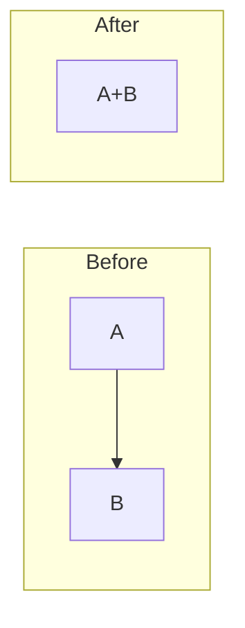
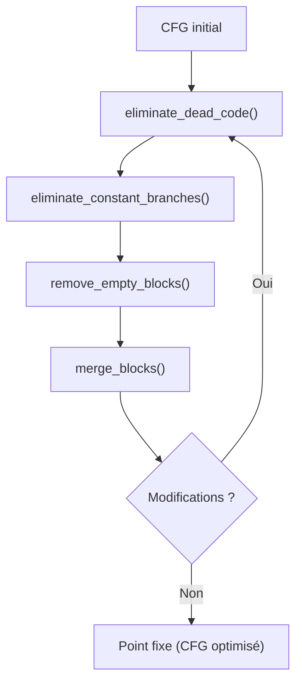

# CFG Optimizations

Optimisations basées sur le CFG pour réduire la taille et améliorer la performance du code.

## Importation

```python
from catnip import Catnip
import catnip._rs as rs

c = Catnip()
```

## Élimination de code mort

Suppression des blocs non atteignables depuis l'entrée.



```python
ir = c.parse('x = 1; y = 2')
cfg = rs.cfg.build_cfg_from_ir(ir, 'test')

print(f'Blocks before: {cfg.num_blocks}')
dead = cfg.eliminate_dead_code()
print(f'Dead blocks removed: {dead}')
print(f'Blocks after: {cfg.num_blocks}')
```

Les blocs non atteignables peuvent apparaître après d'autres optimisations ou dans du code mal formé.

## Fusion de blocs

Fusion de blocs séquentiels qui peuvent être combinés.



**Conditions de fusion** :

- A a exactement un successeur (B)
- B a exactement un prédécesseur (A)
- L'edge est Fallthrough ou Unconditional

```python
ir = c.parse('''
x = 1
y = 2
z = 3
''')
cfg = rs.cfg.build_cfg_from_ir(ir, 'linear')

print(f'Blocks before: {cfg.num_blocks}')
merged = cfg.merge_blocks()
print(f'Blocks merged: {merged}')
print(f'Blocks after: {cfg.num_blocks}')
```

La fusion réduit le nombre de sauts et améliore la localité.

## Suppression de blocs vides

Suppression des blocs sans instructions qui peuvent être contournés.

```python
code = '''
while x < 10 {
    x = x + 1
}
'''
ir = c.parse(code)
cfg = rs.cfg.build_cfg_from_ir(ir, 'while')

print(f'Blocks before: {cfg.num_blocks}')
removed = cfg.remove_empty_blocks()
print(f'Empty blocks removed: {removed}')
print(f'Blocks after: {cfg.num_blocks}')
```

Les blocs vides (comme `while_exit`) peuvent être court-circuités directement.

## Élimination de branches constantes

Si les deux branches d'un if vont vers la même cible, la condition est inutile.

```python
# Exemple artificiel - en pratique, détecté par constant folding
ir = c.parse('''
if x {
    y = 1
} else {
    y = 1
}
''')
cfg = rs.cfg.build_cfg_from_ir(ir, 'constant_branch')

branches = cfg.eliminate_constant_branches()
print(f'Constant branches eliminated: {branches}')
```

Cette optimisation est plus efficace après propagation de constantes.

## Pipeline complet

Applique toutes les optimisations dans l'ordre jusqu'à convergence.



```python
code = '''
x = 0
while x < 10 {
    if x % 2 == 0 {
        y = x
    }
    x = x + 1
}
'''
ir = c.parse(code)
cfg = rs.cfg.build_cfg_from_ir(ir, 'complex')

print(f'Before: {cfg.num_blocks} blocks, {cfg.num_edges} edges')

# Optimiser
dead, merged, empty, branches = cfg.optimize()

print(f'Optimizations:')
print(f'  Dead blocks removed: {dead}')
print(f'  Blocks merged: {merged}')
print(f'  Empty blocks removed: {empty}')
print(f'  Constant branches eliminated: {branches}')
print(f'After: {cfg.num_blocks} blocks, {cfg.num_edges} edges')
```

Le pipeline itère jusqu'à convergence (point fixe).

## Optimisations individuelles

Chaque optimisation peut être appelée séparément.


```python
ir = c.parse('while x { y = 1 }')
cfg = rs.cfg.build_cfg_from_ir(ir, 'test')

# Ordre recommandé :
cfg.eliminate_dead_code()
cfg.eliminate_constant_branches()
cfg.remove_empty_blocks()
cfg.merge_blocks()

# Ou tout en une fois :
dead, merged, empty, branches = cfg.optimize()
```

## Idempotence

Les optimisations sont idempotentes : les appliquer plusieurs fois donne le même résultat.

```python
ir = c.parse('while x < 10 { x = x + 1 }')
cfg = rs.cfg.build_cfg_from_ir(ir, 'loop')

# Première passe
cfg.optimize()
blocks_after_first = cfg.num_blocks

# Deuxième passe (ne devrait rien faire)
dead, merged, empty, branches = cfg.optimize()
assert dead == 0 and merged == 0 and empty == 0 and branches == 0
assert cfg.num_blocks == blocks_after_first

print('✓ Optimisations idempotentes')
```

## Préservation de sémantique

Les optimisations préservent la sémantique du programme.

```python
ir = c.parse('''
if x > 0 {
    y = 1
} else {
    y = 2
}
z = y + 1
''')
cfg = rs.cfg.build_cfg_from_ir(ir, 'test')

# Blocs atteignables avant
before = set(cfg.get_reachable_blocks())

# Optimiser
cfg.optimize()

# Blocs atteignables après (peut être réduit par fusion)
after = set(cfg.get_reachable_blocks())

# Tous les blocs d'origine sont toujours représentés
assert len(after) > 0
print(f'Blocks: {len(before)} → {len(after)}')
```

## Visualisation avant/après

```python
ir = c.parse('''
while x < 10 {
    if x == 5 {
        break
    }
    x = x + 1
}
''')
cfg = rs.cfg.build_cfg_from_ir(ir, 'example')

# Avant
cfg.visualize('before.dot')
print(f'Before: {cfg.num_blocks} blocks, {cfg.num_edges} edges')

# Optimiser
cfg.optimize()

# Après
cfg.visualize('after.dot')
print(f'After: {cfg.num_blocks} blocks, {cfg.num_edges} edges')

# Comparer :
# dot -Tpng before.dot -o before.png
# dot -Tpng after.dot -o after.png
```

## Métriques d'optimisation

```python
def analyze_optimizations(code, name):
    """Analyse l'impact des optimisations."""
    c = Catnip()
    ir = c.parse(code)
    cfg = rs.cfg.build_cfg_from_ir(ir, name)

    before_blocks = cfg.num_blocks
    before_edges = cfg.num_edges

    dead, merged, empty, branches = cfg.optimize()

    after_blocks = cfg.num_blocks
    after_edges = cfg.num_edges

    print(f'⇒ {name}' )
    print(f'Blocks: {before_blocks} → {after_blocks} ({before_blocks - after_blocks} removed)')
    print(f'Edges: {before_edges} → {after_edges} ({before_edges - after_edges} removed)')
    print(f'Dead: {dead}, Merged: {merged}, Empty: {empty}, Branches: {branches}')
    print()

# Analyser différents patterns
analyze_optimizations('x = 1; y = 2; z = 3', 'linear')
analyze_optimizations('while x < 10 { x = x + 1 }', 'loop')
analyze_optimizations('if x { y = 1 } else { y = 2 }', 'branch')
```

## Impact sur le bytecode

Les optimisations CFG réduisent le bytecode généré :

- Moins de blocs = moins de labels
- Moins d'edges = moins de sauts
- Fusion de blocs = moins de dispatch overhead

```python
ir = c.parse('''
while x < 100 {
    if x % 3 == 0 {
        continue
    }
    y = y + x
    x = x + 1
}
''')
cfg = rs.cfg.build_cfg_from_ir(ir, 'optimizable')

# Avant optimisation
before = cfg.num_blocks * 2 + cfg.num_edges  # Estimation simplifiée

cfg.optimize()

# Après optimisation
after = cfg.num_blocks * 2 + cfg.num_edges

print(f'Estimated bytecode reduction: {before - after} instructions')
```

> Ces optimisations sont des procédures administratives obligatoires. Chaque bloc doit justifier son existence devant le
> comité des blocs. Les blocs vides sont systématiquement révoqués, sauf s'ils ont un formulaire d'exemption de
> révocation, disponible uniquement auprès des blocs révoqués.
