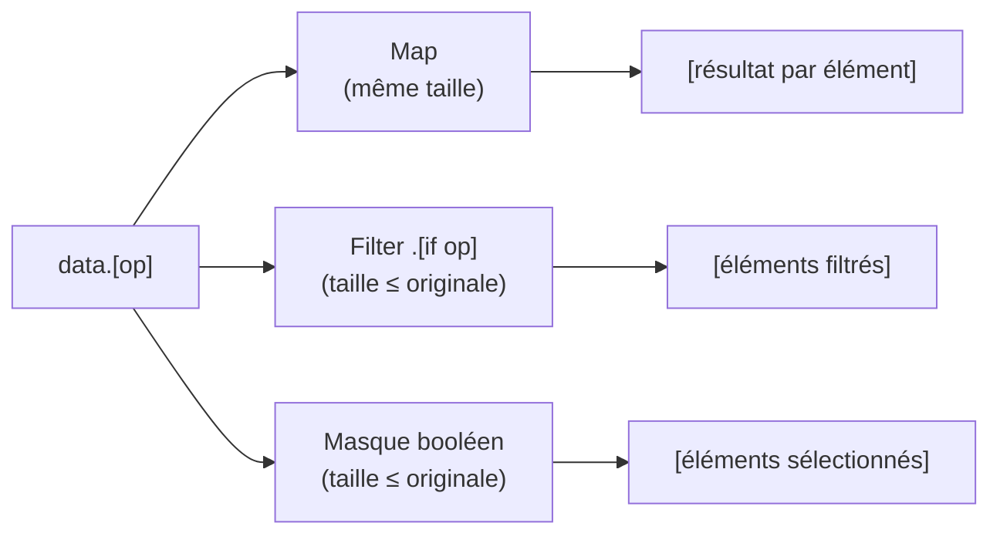

# BROADCAST_SPEC

Voir aussi : [BROADCAST_RATIONALE](BROADCAST_RATIONALE.md) pour la motivation et les comparaisons.

## Le Concept

### Notation et Opérations

Le broadcasting applique des opérations sur des collections (listes, tuples, etc.) de manière uniforme, sans branches
conditionnelles.

**Cinq modes d'opération** :

| Syntaxe              | Mode               | Résultat                                      | Exemple                                                  |
| -------------------- | ------------------ | --------------------------------------------- | -------------------------------------------------------- |
| `data.[op value]`    | **Map**            | Collection de même taille avec transformation | `list(1,2,3).[* 2]` → `[2,4,6]`                          |
| `data.[if op value]` | **Filter**         | Collection filtrée (taille ≤ originale)       | `list(1,2,3).[if > 1]` → `[2,3]`                         |
| `data.[mask]`        | **Masque booléen** | Collection filtrée par masque                 | `list(1,2,3).[list(True,False,True)]` → `[1,3]`          |
| `data.[~> f]`        | **ND-map**         | Applique `f` à chaque feuille scalaire        | `list(list(-1,2),list(-3,4)).[~> abs]` → `[[1,2],[3,4]]` |
| `data.[~~ lambda]`   | **ND-recursion**   | Applique `~~` à chaque feuille scalaire       | `list(3,5).[~~ factorial]` → `[6,120]`                   |

### Principe

Le broadcasting permet d'écrire des opérations qui portent **indifféremment** sur des scalaires ou des collections, sans
embranchements logiques (`if`/`elif`/`else`).

Une seule expression fonctionne que les données soient :

- Un scalaire (int, float, str, bool)
- Une liste Python
- Un tuple
- Tout autre itérable

______________________________________________________________________

## Syntaxe Implémentée : `A.[op M]`

La syntaxe **Opération à Droite** a été choisie.

### Syntaxe

<!-- check: no-check -->

```catnip
target.[operator operand]  # Opération binaire (map)
target.[operator]           # Opération unaire (map)
target.[lambda]             # Lambda/fonction (map)
target.[if operator operand]  # Filtrage conditionnel
target.[if lambda]          # Filtrage par lambda
target.[boolean_mask]       # Indexation par masque booléen
```

### Exemples Fonctionnels

<!-- check: no-check -->

```catnip
# Multiplication
doubled = data.[* 2]

# Addition
shifted = values.[+ 10]

# Puissance
squares = data.[** 2]

# Comparaison (retourne booléens)
masks = data.[> 3]

# Filtrage conditionnel (retourne éléments)
filtered = data.[if > 3]

# Lambda
tripled = data.[(x) => { x * 3 }]
```

### Avantages de Cette Syntaxe

- **Chaînage explicite** : `data.[* 2].[+ 10]`
- **Style orienté données** : Lecture gauche à droite
- **Familier** : Rappelle `.apply()` de pandas
- **Lisible** : L'objet traité vient en premier

> **digression** : en mode maths, quand les deux côtés sont "dimensionnés", on voit des écritures du genre `[A].[B]`
> (intuition bifoncteur). Ici on garde un seul côté objet explicite : le `target`. L'autre côté est embarqué dans
> `[operator operand]`. C'est volontaire : lecture gauche → droite, sans dupliquer la logique de parcours.

______________________________________________________________________

### Broadcast sur scalaires littéraux

La notation de broadcast `.[…]` s'applique aussi aux **scalaires littéraux**. Un littéral (ex: `5`, `3.14`, `"foo"`) est
un `primary` et peut donc chaîner des membres, y compris un broadcast.

```catnip
5.[+ 10]        # → 15
(2 + 3).[* 2]   # → 10
5.[abs]         # → 5

# Filtrage sur un scalaire : retourne une liste
5.[if > 0]      # → list(5)
5.[if < 0]      # → list()  (liste vide)
```

## Map, Filter et Masques Booléens



### Distinction Map vs Filter

Le broadcasting supporte deux modes distincts :

**Map (transformation)** : Transforme chaque élément et retourne une collection de même taille

```catnip
data = list(3, 8, 2, 9, 5)
masks = data.[> 5]      # → [False, True, False, True, False]
```

**Filter (filtrage)** : Ne garde que les éléments qui satisfont une condition

```catnip
data = list(3, 8, 2, 9, 5)
filtered = data.[if > 5]  # → [8, 9]
```

La différence est critique pour le chaînage d'opérations :

<!-- check: no-check -->

```catnip
# PIÈGE : map puis multiply donne 0 et 2
data.[> 5].[* 2]       # [0, 2, 0, 2, 0]  (False*2=0, True*2=2)

# CORRECT : filter puis multiply
data.[if > 5].[* 2]    # [16, 18]  (garde 8 et 9, puis multiplie)
```

### Indexation par Masque Booléen

Un masque booléen (liste/tuple de bool) peut être utilisé pour filtrer :

```catnip
data = list(10, 20, 30, 40)
mask = list(True, False, True, False)
result = data.[mask]    # → [10, 30]
```

Workflow suggéré : générer un masque puis le réutiliser

```catnip
data = list(3, 8, 2, 9, 5)
mask = data.[> 5]       # [False, True, False, True, False]
result = data.[mask]    # [8, 9] - équivaut à data.[if > 5]
```

### Erreurs possibles

Masque de longueur incompatible :

<!-- check: no-check -->

```catnip
data = list(10, 20, 30)
mask = list(True, False)
data.[mask]  # Error: Mask size mismatch: target has 3 elements, mask has 2
```

Masque non booléen :

<!-- check: no-check -->

```catnip
data = list(10, 20, 30)
mask = list(1, 0, 1)
data.[mask]  # Error: Mask must be a list or tuple of booleans, got list with non-boolean elements
```

Réutilisation du même masque sur plusieurs collections

```catnip
data1 = list(10, 20, 30, 40)
data2 = list("a", "b", "c", "d")
mask = data1.[> 20]     # [False, False, True, True]
result1 = data1.[mask]  # [30, 40]
result2 = data2.[mask]  # ["c", "d"]
```

### Filtrage avec Lambdas

Le filtrage conditionnel supporte les lambdas arbitraires :

```catnip
# Nombres pairs
data = list(1, 2, 3, 4, 5, 6)
pairs = data.[if (x) => { x % 2 == 0 }]  # [2, 4, 6]

# Conditions complexes
data = list(-5, 3, -2, 8, 0, -1)
result = data.[if (x) => { x > 0 and x < 5 }]  # [3]
```

### Préservation du Type

Le filtrage préserve le type de la collection d'origine :

```catnip
# Liste → Liste
data_list = list(1, 2, 3, 4)
result = data_list.[if > 2]  # [3, 4] (type: list)

# Tuple → Tuple
data_tuple = tuple(1, 2, 3, 4)
result = data_tuple.[if > 2]  # (3, 4) (type: tuple)
```

> **Note sur l'invariance des collections** : Les opérations de broadcasting préservent toujours le type de la
> collection d'origine. Une liste reste une liste, un tuple reste un tuple - bref, rien ne se transforme subitement en
> autre chose pendant le trajet. Aucune démarche n'est nécessaire : un changement de type n'est autorisé que lorsqu'il
> est explicitement demandé. Cette règle s'applique récursivement, sauf si elle s'applique déjà, auquel cas elle
> s'applique quand même.

## Opérations Supportées

### Opérateurs Arithmétiques

#### Broadcasting Scalaire

<!-- check: no-check -->

```catnip
# Multiplication
2.[x]          # x * 2
x.[* 2]        # x * 2

# Addition
10.[x]         # x + 10
x.[+ 10]       # x + 10

# Soustraction
100.[- x]      # 100 - x
x.[- 50]       # x - 50

# Division
1.[/ x]        # 1 / x
x.[/ 2]        # x / 2

# Puissance
2.[** x]       # 2 ** x
x.[** 2]       # x ** 2

# Modulo
x.[% 10]       # x % 10
```

#### Broadcasting Liste-à-Liste

Opérations élément-par-élément entre deux collections :

```catnip
a = list(1, 2, 3)
b = list(10, 20, 30)

# Addition élément par élément
a.[+ b]        # → [11, 22, 33]

# Multiplication élément par élément
a.[* b]        # → [10, 40, 90]

# Division élément par élément
b.[/ a]        # → [10.0, 10.0, 10.0]

# Puissance élément par élément
a.[** b]       # → [1**10, 2**20, 3**30]
```

Les deux collections doivent avoir la même taille, sinon le résultat s'arrête à la plus courte (comportement `zip`).

### Opérateurs de Comparaison

#### Map (retourne booléens)

<!-- check: no-check -->

```catnip
# Supérieur
x.[> 0]        # retourne [True/False pour chaque x]

# Inférieur
x.[< 100]      # retourne masque booléen

# Égalité
x.[== 42]      # retourne masque booléen

# Différent
x.[!= 0]       # retourne masque booléen
```

#### Filter (retourne éléments)

<!-- check: no-check -->

```catnip
# Filtrer éléments supérieurs à 0
x.[if > 0]     # retourne seulement les éléments > 0

# Filtrer éléments inférieurs à 100
x.[if < 100]   # retourne seulement les éléments < 100

# Filtrer éléments égaux à 42
x.[if == 42]   # retourne seulement les 42

# Filtrer éléments différents de 0
x.[if != 0]    # retourne seulement les non-zéros
```

### Fonctions Unaires

<!-- check: no-check -->

```catnip
abs.[x]        # abs(x)
sqrt.[x]       # sqrt(x)
log.[x]        # log(x)
exp.[x]        # exp(x)
round.[x]      # round(x)
```

### Lambdas

<!-- check: no-check -->

```catnip
# Lambda simple
((x) => { x * 2 }).[data]

# Lambda complexe
((x) => {
    if x > 0 {
        x * 2
    } else {
        0
    }
}).[data]
```

______________________________________________________________________

## Décisions Prises

### 1. Syntaxe Finale

**Choix** : `A.[op M]` (opération à droite)

**Raisons** :

- Chaînage naturel
- Style orienté données
- Familier pour utilisateurs pandas

### 2. Priorité des Opérateurs

Le broadcasting a la priorité d'accès membre (`.`)

<!-- check: no-check -->

```catnip
2 + data.[* 3]  # = 2 + (data.[* 3])
```

Équivalent à :

<!-- check: no-check -->

```catnip
2 + data.method()  # Priorité de . avant +
```

### 3. Type Safety et Erreurs

Les erreurs Python sont propagées

Si l'opération échoue sur un élément, une exception Python est levée.

<!-- check: no-check -->

```catnip
data = list("a", "b", "c")
result = data.[+ 2]  # TypeError: can only concatenate str (not "int") to str
```

## Comportement par Type de Collection

Le broadcast traite les types de données différemment selon leur nature :

| Type     | Comportement                         | Résultat          |
| -------- | ------------------------------------ | ----------------- |
| `list`   | Itération + descente récursive       | `list`            |
| `tuple`  | Itération + descente récursive       | `tuple`           |
| `set`    | Itération (ordre non garanti)        | `list`            |
| `dict`   | Itération sur les **clés**           | `list`            |
| `range`  | Consommé comme itérable              | `list`            |
| `str`    | Scalaire (pas d'itération caractère) | Résultat scalaire |
| `bytes`  | Scalaire                             | Résultat scalaire |
| struct   | Scalaire                             | Résultat scalaire |
| scalaire | Opération directe                    | Résultat scalaire |

Seuls `list` et `tuple` bénéficient de la descente récursive et de la préservation du type. Les autres itérables sont
consommés à plat et produisent une `list`.

```catnip
# set : itéré, résultat en list
set(10, 20, 30).[* 2]         # → [20, 40, 60]

# dict : itère sur les clés (strings), pas les valeurs
dict(a=1).[* 3]               # → ['aaa']

# range : consommé comme itérable
range(4).[+ 10]               # → [10, 11, 12, 13]

# string : scalaire, pas itéré caractère par caractère
"hello".[* 3]                 # → "hellohellohello"
```

> Les dicts itèrent sur les clés, pas les valeurs. C'est le comportement standard de `for k in dict` en Python. Si on
> veut les valeurs, utiliser `dict.values()` explicitement.

## Broadcast Récursif sur Structures Imbriquées

Le broadcast descend automatiquement dans les listes et tuples imbriqués jusqu'aux feuilles scalaires. L'opération n'est
appliquée qu'aux valeurs terminales ; la structure (shape) est préservée.

```catnip
# Broadcast deep : descente automatique
matrix = list(list(1, 2), list(3, 4))
matrix.[* 2]  # → [[2, 4], [6, 8]]

# Profondeur mixte
list(1, list(2, 3)).[+ 10]  # → [11, [12, 13]]

# Tensor 3D
cube = list(
    list(list(1, 2), list(3, 4)),
    list(list(5, 6), list(7, 8))
)
cube.[+ 10]  # → [[[11, 12], [13, 14]], [[15, 16], [17, 18]]]
```

### Operand Vectoriel

Quand l'operand est une collection (liste ou tuple), le broadcast adapte son comportement selon la profondeur du target
:

- **Target plat** : zip élément par élément (même sémantique que les opérations binaires vectorielles ci-dessus)
- **Target imbriqué** : l'operand est propagé dans chaque sous-collection, puis zippé au niveau le plus bas

```catnip
# Target plat : zip
list(1, 2, 3).[+ list(10, 20, 30)]
# → [11, 22, 33]

# Target imbriqué : propagation puis zip par ligne
matrix = list(list(1, 2, 3), list(4, 5, 6))
matrix.[+ list(10, 20, 30)]
# → [[11, 22, 33], [14, 25, 36]]

# Facteurs par colonne
matrix.[* list(1, 0.9, 1)]
# → [[1, 1.8, 3], [4, 4.5, 6]]
```

La détection se fait sur le premier élément du target : si c'est une liste ou un tuple, le broadcast récurse ; sinon, il
zippe.

Les opérateurs ND (`~>` et `~~`) suivent la même sémantique de descente implicite :

```catnip
# ND-map implicite
matrix = list(list(-1, 2), list(-3, 4))
matrix.[~> abs]  # → [[1, 2], [3, 4]]

# ND-recursion implicite
nums = list(3, 5)
nums.[~~(n, recur) => { if n <= 1 { 1 } else { n * recur(n - 1) } }]
# → [6, 120]
```

### Forme Explicite

La forme `.[.[...]]` reste valide pour exprimer une descente manuelle niveau par niveau, mais n'est plus nécessaire
puisque le broadcast descend automatiquement.

### Spécification Minimale (Règles Formelles)

1. **Descente implicite** : le broadcast parcourt récursivement la structure jusqu'aux feuilles scalaires.
1. **Arrêt récursif** : une feuille est un scalaire (`int`, `float`, `str`, `bool`, `None`), un struct, ou une valeur
   non-itérable.
1. **Préservation de structure** : le shape (imbrication, cardinalités, type de conteneur) est conservé ; seules les
   feuilles changent.
1. **Composition** : pour fonctions pures, `A.[f].[g] == A.[(x) => { g(f(x)) }]`.
1. **Déterminisme** : pour fonctions pures, l'ordre de parcours interne n'affecte pas le résultat.

<!-- check: no-check -->

```catnip
# Invariant 3: shape conservé
list(list(1, 2), list(3, 4)).[~> (x) => { x * 10 }]
# -> [[10, 20], [30, 40]]

# Invariant 4: composition
A.[~> f].[~> g] == A.[~> (x) => { g(f(x)) }]
```

### Garanties Recherchées (pour ND implicite)

**Naturalité** : Le résultat ne dépend pas de l'ordre de traitement des dimensions

- Parcourir par ligne puis colonne donne le même résultat que colonne puis ligne
- La profondeur de récursion est déterminée par la structure des données
- Pas de dépendance sur l'implémentation interne

**Composition** : Les opérations se composent de manière prévisible

- `A.[f].[g]` équivaut à `A.[(x) => { g(f(x)) }]` pour toute profondeur
- Pas d'effet de bord entre opérations successives
- Une seule forme de code pour les cas simples et complexes

**Préservation de structure** : Le "shape" du tensor reste identique

- La forme du tensor (dimensions, imbrication) est préservée
- Nombre de dimensions constant
- Seules les valeurs scalaires changent

## Pièges Possibles

### Broadcast sur des listes de dicts ou de tuples

Le broadcast descend récursivement dans tous les itérables (listes, tuples, dicts, sets) jusqu'aux feuilles scalaires.
Cela signifie que broadcaster sur une liste de dicts ou de tuples ne passe **pas** le dict/tuple entier à la fonction --
il descend dedans.

<!-- check: no-check -->

```catnip
# Piège : on veut passer chaque dict à f, mais le broadcast descend dans les clés
specs = list(dict(label="A", value=1), dict(label="B", value=2))
specs.[some_function]  # some_function reçoit "label", "value" (les clés), pas les dicts

# Même piège avec les tuples : le broadcast descend dans les éléments
rows = list(tuple(1, "Alice"), tuple(2, "Bob"))
rows.[some_function]   # some_function reçoit 1, "Alice", 2, "Bob" (les éléments)
```

**Pourquoi ?** Les dicts et tuples sont itérables. Le broadcast les traverse comme il traverse les listes imbriquées.
Seuls les **scalaires** (`int`, `float`, `str`, `bool`, `None`) et les **structs** sont des feuilles.

**Solution : utiliser des structs**

Les structs ne sont pas itérables -- le broadcast les traite comme des feuilles et les passe entiers à la fonction :

```catnip
struct Metric {
    label
    value

    display(self) => { f"{self.label}: {self.value}" }
}

metrics = list(Metric("A", 1), Metric("B", 2))
metrics.[(m) => { m.display() }]  # chaque Metric est passé entier à la lambda
# → ['A: 1', 'B: 2']
```

**Solution alternative : boucle `for`**

Quand les données viennent d'une source externe (SQL, JSON) sous forme de tuples ou dicts, une boucle `for` est plus
directe qu'un broadcast :

<!-- check: no-check -->

```catnip
rows = db.execute("SELECT name, price FROM products").fetchall()
for row in rows {
    print(f"{row[0]} : {row[1]} EUR")
}
```

> Le broadcast est un opérateur dimensionnel, pas un `map`. Il traverse la structure jusqu'aux scalaires. Si l'élément
> qu'on veut traiter est lui-même une structure traversable, il faut soit le rendre opaque (struct), soit ne pas
> utiliser le broadcast.
