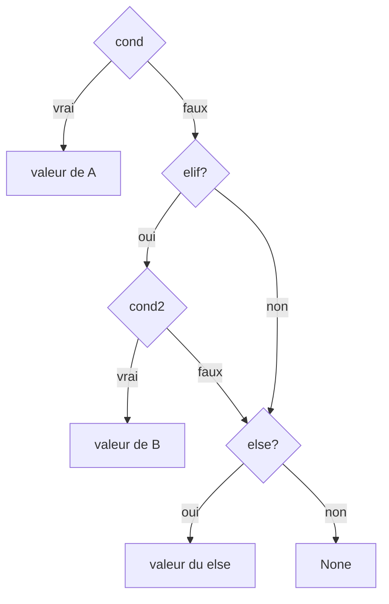

# Control Flow

- [Syntax](SYNTAX.md)
- [Types](TYPES.md)
- [Expressions](EXPRESSIONS.md)
- [Control Flow](CONTROL_FLOW.md)
- [Functions](FUNCTIONS.md)
- [Structures](STRUCTURES.md)
- [Pattern Matching](PATTERN_MATCHING.md)

## Structures de contrôle

### Blocs

Les blocs regroupent plusieurs instructions et retournent la valeur de la dernière expression.

```catnip
# Bloc simple
resultat = {
    x = 10
    y = 20
    x + y          # Valeur retournée: 30
}

# Bloc vide
vide = {}          # Retourne None
```

### Conditions (`if`/`elif`/`else`)

<!-- check: no-check -->

```catnip
# simple if
if x > 0 {
    print("x is positive")
}

# if/else
if x > 0 {
    print("positive")
} else {
    print("negative or zero")
}

# if/elif/else
if x > 0 {
    print("positive")
} elif x < 0 {
    print("negative")
} else {
    print("zero")
}

# nested conditions
if x > 0 {
    if x > 100 {
        print("large number")
    } else {
        print("small number")
    }
}
```

`elif` est du sucre syntaxique pour un `else` contenant un `if`.

#### `if` comme expression

`if` est une expression, pas un statement.

<!-- check: no-check -->

```catnip
result = if x > 0 { "positive" } else { "non-positive" }
```

Un bloc `{ … }` a pour valeur la valeur de sa **dernière expression**.

La valeur d'un `if` est définie par les règles suivantes.

Forme sans `else`

<!-- check: no-check -->

```catnip
if cond { A }
```

est une expression dont la valeur est :

- si `cond` est vrai → la valeur de `A`
- si `cond` est faux → `None`

```catnip
value = if False { 123 }
# value == None
```

Forme avec `else`

<!-- check: no-check -->

```catnip
if cond { A } else { B }
```

est une expression dont la valeur est :

- si `cond` est vrai → la valeur de `A`
- si `cond` est faux → la valeur de `B`

Forme avec `elif`

<!-- check: no-check -->

```catnip
if cond1 { A } elif cond2 { B } else { C }
```

est équivalent à :

<!-- check: no-check -->

```catnip
if cond1 {
    A
} else {
    if cond2 {
        B
    } else {
        C
    }
}
```

et suit les mêmes règles de valeur.



#### Interaction avec les fonctions

Le corps d'une fonction est un bloc expression :

```catnip
f = (x) => {
    if x > 0 {
        "positive"
    } else {
        "non-positive"
    }
}
```

ici, la valeur de la fonction est la valeur de l'expression `if`.

`return expr` sort explicitement de la fonction avec la valeur `expr`.

si aucun `return` explicite n'est exécuté, la fonction renvoie la valeur de la *dernière expression* du bloc.

#### Note pour voyageurs inter-langages

Dans Catnip, `if` est une expression, et renvoie une **vraie valeur**.

Et un `if` sans `else` renvoie `None` quand la condition est fausse.

### Boucle while

```catnip
# Boucle while simple
i = 0
while i < 5 {
    print("i =", i)
    i = i + 1
}

# Condition complexe
somme = 0
n = 1
while somme < 100 {
    somme = somme + n
    n = n + 1
}
```

### Boucle for

<!-- check: no-check -->

```catnip
# Itération sur une séquence
for i in range(1, 6) {
    print("i =", i)
}

# Itération sur une liste
for nom in list("Capitaine Whiskers", "Docteur Latte", "Agent Photon") {
    print("BORN TO SEGFAULT,", nom, "!")
}

# Avec enumerate
for idx in range(len(nombres)) {
    print("Index:", idx, "Valeur:", nombres.get(idx))
}
```

### Contrôle de flux dans les boucles : break et continue

#### break - Sortir d'une boucle

Le mot-clé `break` permet de sortir immédiatement d'une boucle `while` ou `for`.

```catnip
# Recherche dans une liste
found = False
for i in list(1, 5, 10, 15, 20) {
    if i == 10 {
        found = True
        break  # Sort de la boucle dès qu'on trouve
    }
}

# Boucle infinie avec break
count = 0
while True {
    count = count + 1
    if count == 5 {
        break  # Sort après 5 itérations
    }
}

# Dans des boucles imbriquées, break ne sort que de la boucle interne
for i in list(1, 2, 3) {
    for j in list(1, 2, 3) {
        if j == 2 {
            break  # Sort uniquement de la boucle interne
        }
        print(i, j)
    }
}
```

#### continue - Passer à l'itération suivante

Le mot-clé `continue` passe directement à l'itération suivante de la boucle, en ignorant le reste du code.

```catnip
# Ignorer les nombres pairs
for i in range(10) {
    if i % 2 == 0 {
        continue  # Passe à l'itération suivante
    }
    print(i)  # Affiche uniquement les impairs
}

# Filtrage dans une boucle while
i = 0
sum = 0
while i < 10 {
    i = i + 1
    if i % 3 == 0 {
        continue  # Ignore les multiples de 3
    }
    sum = sum + i
}

# Validation de données
ages = list(25, -5, 30, 150, 42)
valid_ages = list()
for age in ages {
    if age < 0 or age > 120 {
        continue  # Ignore les valeurs invalides
    }
    valid_ages = valid_ages + list(age)
}
```

#### Combiner break et continue

```catnip
# Recherche avec filtrage
numbers = list(10, 20, 35, 40, 55, 60)
result = None

for num in numbers {
    if num % 10 == 0 {
        continue  # Ignore les multiples de 10
    }
    if num > 50 {
        result = num
        break  # Trouve le premier > 50 (non multiple de 10)
    }
}
# result = 55
```

**Notes importantes** :

- `break` et `continue` ne fonctionnent **que dans les boucles** (`while`, `for`)
- Utiliser `break` ou `continue` en dehors d'une boucle lève une exception
- Dans des boucles imbriquées, ils n'affectent que la boucle la plus interne
- Pour sortir d'une fonction, utiliser `return` (qui fonctionne même dans une boucle)
