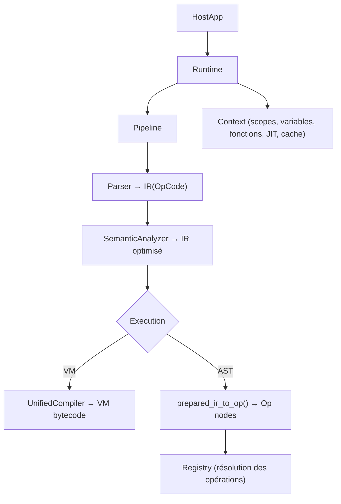

# Glossaire Catnip

Ce document définit les concepts clés et la terminologie utilisée dans Catnip, pour éviter les ambiguïtés.

## Architecture et composants

### HostApp (application hôte)

L'**application hôte** est le programme Python qui intègre et utilise Catnip comme DSL. Elle fournit :

- Le contexte d'exécution
- Les fonctions et objets Python accessibles depuis Catnip
- L'environnement d'intégration

**Exemple**: Une application web Flask qui utilise Catnip pour les scripts de configuration utilisateur.

### Runtime

L'ensemble des composants nécessaires à l'exécution du code Catnip :

- Parser
- Semantic analyzer
- Registry
- Executor
- Context

### Registry

Le **registre** est le composant central qui :

- Gère le mapping entre opérations (opcodes) et leurs implémentations
- Maintient le contexte d'exécution (scopes, variables)
- Fournit l'interface entre l'AST et les opérations concrètes

**Composant**: Moteur d'exécution central du langage

### Context

Le **contexte d'exécution** contient :

- Les scopes (portées) avec leurs variables locales/globales
- Le résultat de la dernière expression
- L'accès aux builtins Python
- L'état d'exécution (pile de scopes)

**Fichier**: `catnip/context.py`

## Phases d'exécution

### Parsing

Transformation du code source Catnip en **Abstract Syntax Tree (AST)**.

**Propriétés** :

- Analyse incrémentale : le parser peut mettre à jour l'AST sans tout reparser
- Tolérance aux erreurs : continue l'analyse même sur code invalide
- Parse tree → IR : 72 transformateurs convertissent l'arbre syntaxique en représentation intermédiaire

### Semantic Analysis

Transformation de l'AST en **Op nodes** (opérations exécutables):

- Résolution des références
- Optimisation (constant folding, etc.)
- Détection des tail-calls
- Application des pragmas

**Phase**: Analyse statique et optimisation du code avant exécution

### Execution

Exécution des Op nodes via le Registry, par interprétation directe de l'arbre.

### OpCode

**Code d'opération numérique** (enum) utilisé pour identifier les opérations de manière efficace.

**Avantages** :

- Comparaisons O(1) (entiers vs strings)
- Lookups rapides dans les dictionnaires
- Moins de mémoire
- Unifié : IR et Op utilisent le même enum

**Exemples** :

```python
OpCode.ADD = 1
OpCode.SUB = 2
OpCode.OP_IF = 50     # Préfixe OP_ pour mots-clés Python réservés
OpCode.OP_WHILE = 51
```

**Convention** : Les opcodes correspondant à des mots-clés Python réservés (`if`, `while`, `for`, etc.) sont préfixés
par `OP_`.

**Module** : `catnip/semantic/opcode.py`

### Trampoline

Technique d'optimisation TCO qui transforme les appels récursifs en une boucle avec rebinding de paramètres.

**Principe** : Au lieu d'empiler des frames, la fonction retourne un signal `TailCall` qui indique au trampoline de
rebinder les paramètres et recommencer.

**Résultat** : O(1) stack space au lieu de O(n).

> La fonction rebondit sur elle-même sans jamais vraiment s'appeler.

## Structures de données

### IR (Intermediate Representation)

Nœud intermédiaire produit par le transformer :

```python
IR(ident=OpCode.ADD, args=(left, right), kwargs={})
```

### Op (Operation)

Nœud exécutable produit par l'analyse sémantique :

```python
Op(ident=OpCode.ADD, args=(left, right), kwargs={})
```

**Points communs** : IR et Op utilisent le même enum `OpCode` pour identifier les opérations.

**Différence** : IR est la sortie brute du parser (avant optimisation), Op est optimisé et annoté (tail calls, etc.).

### Scope (Portée)

Une **portée** est un dictionnaire de symboles (variables) avec un parent optionnel :

- **Global scope**: Portée racine
- **Local scope**: Portée créée par fonction/lambda/bloc
- **Lookup**: Recherche en cascade (local → parent → global)

**Caractéristique**: Résolution en temps constant O(1) via table de hachage

### Node

Classes pour les objets Catnip exécutables :

- `Op`: Nœud d'opération (PyO3 class Rust)
- `IR`: Nœud intermédiaire (hérite de Op)
- `Function`: Fonction nommée
- `Lambda`: Fonction anonyme
- `Pattern*`: Patterns de pattern matching

**Structure**: Représentation uniforme des opérations exécutables

### CFG (Control Flow Graph)

**Graphe de flot de contrôle** : représentation du programme comme un graphe orienté où les nœuds sont des blocs
basiques (séquences d'instructions linéaires) et les arêtes représentent les transitions possibles.

**Utilité** :

- Analyse de dominance (quels blocs contrôlent l'exécution d'autres blocs)
- Détection de loops et back-edges
- Optimisations sur graphe (dead code, merge de blocs, simplification de branches)
- Reconstruction de code structuré

**Types d'arêtes** :

- `Fallthrough` : séquence linéaire
- `ConditionalTrue/False` : branches if/else
- `Unconditional` : saut direct (goto)
- `Break/Continue` : contrôle de boucle
- `Return` : sortie vers exit

**Construction** : Le CFG est construit depuis l'IR via `rs.cfg.build_cfg_from_ir()`. Voir `docs/examples/cfg/` pour des
exemples d'utilisation.

**Algorithmes** : Dominance calculée via l'algorithme de Cooper-Harvey-Kennedy (2001), convergence en O(n²) mais
typiquement 2-3 itérations.

> Le CFG cartographie blocs et transitions. Il sert à calculer la dominance, détecter les boucles et reconstruire du
> code structuré. Du graphe pur, zéro magie noire.

### HOF (Higher-Order Function)

**Fonction d'ordre supérieur**: fonction qui prend une ou plusieurs fonctions en argument et/ou qui retourne une
fonction.

## Optimisations

### TCO (Tail-Call Optimization)

**Optimisation des appels terminaux**: Les fonctions qui se terminent par un appel récursif sont optimisées pour ne pas
consommer de stack Python.

**Implémentation**: Trampoline pattern avec détection de self-recursion.

**Pragma**: `pragma("tco", True)` / `pragma("tco", False)`

### ND-Recursion (Non-Deterministic Recursion)

**Récursion non-déterministe** : Modèle de concurrence structurelle où l'async émerge de la sémantique plutôt que de
mots-clés explicites.

**Philosophie** :

- Catnip est un langage de calcul, pas d'orchestration I/O
- Pas de `async`/`await` - l'async émerge naturellement
- Le runtime choisit le mode d'exécution (bloquant, concurrent, batché, distribué)
- Synchronisation implicite aux frontières (fin de bloc, return, `collect`)

**Syntaxe** :

- `~~` : ND recursion
- `~>` : ND map
- `~[]` : ND empty topos

**Statut** : Implémenté (`~[]` est un singleton falsy, itérable vide).

### Constant Folding

**Résolution anticipée**: Les expressions constantes sont évaluées au moment de l'analyse sémantique plutôt qu'à
l'exécution.

**Exemple**: `2 + 3 * 4` → `14` (au parse-time)

### Optimisations performance

Les composants critiques du runtime sont optimisés pour:

- Résolution de scope en O(1)
- Dispatch d'opérations sans overhead
- Transformations AST natives
- Analyse sémantique et optimisations agressives
- Récursion non-déterministe sans overhead

### Strength Reduction

**Réduction de force** : Remplacement d'opérations coûteuses par des équivalentes moins coûteuses.

**Exemple** : `x ** 2` → `x * x` (multiplication plus rapide que puissance)

### Dead / Blunt Code Elimination

**Élimination de code mort** : Suppression du code inaccessible ou jamais exécuté.

**Exemple** : `if (true) { a } else { b }` → `{ a }` (branche `else` supprimée)

### SSA (Static Single Assignment)

**Forme SSA** : représentation intermédiaire où chaque variable est assignée exactement une fois. Quand plusieurs
chemins d'exécution convergent, des **phi-nodes** (φ) fusionnent les valeurs possibles.

**Propriétés** :

- Chaque variable a une seule définition statique
- Les phi-nodes insèrent des définitions aux points de convergence (blocs avec plusieurs prédécesseurs)
- Chaque usage d'une variable est dominé par sa définition

**Utilité** : la forme SSA simplifie les passes d'optimisation (constant propagation, dead code elimination, CSE) car
chaque variable a une provenance unique, ce qui élimine les ambiguïtés sur "quelle valeur cette variable contient-elle
ici ?".

**Dépendance** : la construction SSA repose sur le CFG et l'analyse de dominance (dominance frontier) pour déterminer où
placer les phi-nodes.

> Warning: si tu comprends du premier coup, vérifie quand même.

**Référence** : Cytron et al. (1991), "Efficiently Computing Static Single Assignment Form and the Control Dependence
Graph"

> La forme SSA est une promesse : chaque variable ne sera définie qu'une seule fois, et si deux chemins veulent lui
> donner des valeurs différentes, un comité de conciliation (le phi-node) tranchera à l'entrée du bloc. C'est de la
> bureaucratie de compilation, mais la paperasse simplifie tout le reste.

## Pragmas

### Pragma

**Directive de compilation** qui contrôle le comportement du compilateur/runtime.

**Syntaxe**: `pragma("directive", value)` où value peut être un booléen, string ou nombre

**Directives supportées**:

- `tco`: Tail-call optimization (`True`/`False`)
- `optimize`: Niveau d'optimisation (0-3 ou "none"/"high")
- `cache`: Cache de parsing (`True`/`False`)
- `debug`: Mode debug (`True`/`False`)
- `feature`: (**deprecated**, remplace par `import()`) Charger un module Catnip ou Python (pur ou binaire) par nom ou
  chemin (`alias = import("module")`)

**Exemples**:

<!-- check: no-check -->

```catnip
pragma("tco", True)
pragma("optimize", 3)
json = import("json")
pd = import("pandas")
tools = import("toolbox")
```

**Module**: `pragma.py`

## Pattern Matching

### Pattern

Structure utilisée pour le matching dans `match/case`:

- **PatternLiteral**: Match une valeur exacte (`1`, `"text"`)
- **PatternVar**: Capture la valeur dans une variable (`x`)
- **PatternWildcard**: Match tout (`_`)
- **PatternOr**: Match une alternative (`a | b | c`)

### Guard

**Condition** ajoutée à un pattern: `n if n > 10`

## Fonctions et Lambdas

### Function (Fonction Nommée)

Fonction définie avec un nom:

<!-- check: no-check -->

```catnip
factorial = (n) => { … }
```

### Lambda (Fonction Anonyme)

Fonction sans nom, souvent inline:

<!-- check: no-check -->

```catnip
numbers.[() => { x * 2 }]
```

### Variadic Parameters

Paramètres qui acceptent un nombre variable d'arguments:

<!-- check: no-check -->

```catnip
sum = (*args) => { … }
```

**Syntaxe**: Préfixe `*` devant le nom du paramètre.

### Closure (Fermeture)

Fonction qui **capture** les variables de son scope parent.

**Exemple** :

```catnip
make_adder = (n) => {
    (x) => { x + n }  # Capture 'n' du scope parent
}

add5 = make_adder(5)
add5(10)  # → 15
```

### Décorateur

Modificateur appliqué à une fonction via la syntaxe `@name`.

**Syntaxe** :

<!-- check: no-check -->

```catnip
@jit factorial = (n, acc=1) => { ... }
```

**Désucrage** : `@dec f = expr` devient `f = dec(expr)`

**Décorateurs disponibles** :

- `@jit` : Force la compilation JIT immédiate
- `@pure` : Marque la fonction comme pure (sans effets de bord)

**Multiples décorateurs** : Appliqués de l'intérieur vers l'extérieur.

```catnip
@pure @jit f = (x) => { x * 2 }
# Équivaut à : f = pure(jit((x) => { x * 2 }))
```

### Unpacking (Destructuring)

Décomposition d'une structure de données en plusieurs variables.

**Syntaxe** :

```catnip
(a, b) = tuple(1, 2)
(first, *rest) = list(1, 2, 3, 4, 5)
(x, (y, z)) = list(1, tuple(2, 3))
```

**Support** : Tuples, listes, imbrication, star operator (`*`)

## Broadcasting

### Broadcasting Operation

Application d'une opération, étendue naturellement à toutes les dimensions internes.

La même expression fonctionne quel que soit le "niveau" : scalaire, liste, matrice, colonne, tenseur, ou structure hôte
arbitraire.

**Syntaxe**: `collection.[operation]`

**Types**:

- Binaire: `.[+ 10]`, `.[* 2]`
- Unaire: `.[abs]`, `.[not]`
- Fonction: `.[(x) => { x ** 2 }]`
- Filtre: `.[(x) => { x % 2 == 0 }]`

> Catnip applique toujours l'opération "au bon endroit", même quand la dimension n'est pas connue à l'avance.

## Termes généraux

### Builtin

Fonction ou objet Python accessible depuis Catnip sans import.

**Exemples**: `range`, `list`, `dict`

### Pure Function

Fonction **sans effets de bord** qui retourne toujours le même résultat pour les mêmes arguments.

**Utilisé pour**: Optimisations de broadcasting, mémoization.

**Décorateur** : `@pure` en Python

### Tail Position

Une expression est en **position terminale** si sa valeur est immédiatement retournée sans autre calcul.

**Important pour**: TCO (Tail-Call Optimization)

### Cache

Système de mémorisation pour éviter de re-parser ou re-compiler du code déjà traité.

**Types** :

- **Parse cache** : Cache des AST parsés (évite le parsing)
- **Compilation cache** : Cache des Op nodes compilés
- **Function cache** : Mémoization des résultats de fonctions pures

**Backends** : Mémoire, disque, Redis

**Activation** :

```python
catnip = Catnip(enable_cache=True)
```

**Pragma** :

```catnip
pragma("cache", True)
```

**Module** : `cachesys.py`

### Sandbox (Bac à sable)

Environnement d'exécution **isolé** qui limite les actions possibles du code.

**Objectif** : Permettre l'exécution de code utilisateur sans risque pour le système hôte.

> Catnip peut s'exécuter dans un contexte restreint où seules certaines fonctions Python sont accessibles.

## Fichiers et structure

### `.cat`

Extension de fichier pour les scripts Catnip (code source).

### `.catf`

Extension de fichier pour le format binaire **frozen** : IR compilé ou données sérialisées via `freeze`/`thaw`.

### Freeze/Thaw

**Persistance binaire** de code IR ou de données Catnip au format `.catf`.

- `encode` / `decode` : bincode brut pour transport (IPC workers, in-memory)
- `freeze` / `thaw` : builtins Catnip (`freeze(value) -> bytes`, `thaw(bytes) -> value`)
- Format `.catf` : header (magic, opcode_hash, source_hash) + bincode, pour le cache disque avec auto-invalidation

**Module** : `catnip_core/src/freeze/`, `catnip_rs/src/freeze.rs`

## Interfaces et Outils

### REPL (Read-Eval-Print Loop)

Mode **interactif** de Catnip accessible via `catnip` sans arguments.

**Fonctionnalités** :

- Lecture d'une expression utilisateur
- Évaluation immédiate
- Affichage du résultat
- Contexte persistant entre les commandes

**Exemple** :

```bash
$ catnip
```

<!-- check: no-check -->

```catnip
▸ x = 10
▸ x * 2
20
▸ factorial = (n) => { if (n <= 1) { 1 } else { n * factorial(n-1) } }
▸ factorial(5)
120
```

**Fichier** : `__main__.py`

### CLI (Command Line Interface)

Interface en ligne de commande pour exécuter Catnip.

**Modes d'exécution** :

- **Script** : `catnip script.cat` (fallback automatique)
- **Script explicite** : `catnip -- script.cat` (avec séparateur)
- **Commande** : `catnip -c "expression"`
- **Pipe** : `echo "2 + 3" | catnip`
- **REPL** : `catnip` (interactif, défaut)
- **Sous-commandes** : `catnip format script.cat`, `catnip check script.cat` (futur)

**Options** :

- `-c, --command` : Exécute une commande unique
- `-p, --parsing` : Niveau de parsing (0-3)
- `-o, --optimize` : Options d'optimisation (ex: `tco:on`, `level:2`)
- `-m, --module` : Charge un module Python (`-m math`)
- `-v, --verbose` : Mode verbeux
- `--vm` : Mode d'exécution VM (`on`, `off`)

**Exemples** :

```bash
catnip script.cat                 # Exécute (fallback)
catnip -- script.cat              # Exécute (explicite)
catnip -c "2 + 3"                 # Évalue
catnip -o tco:on script.cat       # Avec TCO
catnip -m math script.cat         # Charge module
catnip -m math -c "math.sqrt(4)"  # Charge module et évalue
echo "10 * 2" | catnip            # Depuis stdin
```

**Séparateur `--`** : Force l'interprétation de l'argument suivant comme un fichier, levant toute ambiguïté avec les
sous-commandes.

**Fichier** : `__main__.py`

### JIT (Just-In-Time Compilation)

Compilation **à la volée** du code Catnip.

**Modes d'activation** :

1. **Hot loop detection** (automatique) :

```catnip
pragma("jit", True)  # Compile après ~100 appels
```

2. **JIT forcé par fonction** :

<!-- check: no-check -->

```catnip
@jit factorial = (n, acc=1) => { ... }  # Décorateur
factorial = jit((n) => { ... })          # Builtin
```

3. **JIT forcé global** :

```catnip
pragma("jit", "all")  # Compile tout à la définition
```

**Limitations** : Seules les fonctions tail-récursives simples (1-3 paramètres entiers) sont compilables. Les autres
s'exécutent normalement via l'interpréteur.

> Le JIT détecte les hot paths et les compile. Si la fonction n'est pas compilable, elle s'exécute normalement - pas de
> panique.

## Acronymes

- **AST**: Abstract Syntax Tree (Arbre Syntaxique Abstrait)
- **IR**: Intermediate Representation (Représentation Intermédiaire)
- **TCO**: Tail-Call Optimization (Optimisation des Appels Terminaux)
- **VM**: Virtual Machine (Machine Virtuelle)
- **REPL**: Read-Eval-Print Loop (Boucle Lecture-Évaluation-Affichage)
- **CLI**: Command Line Interface (Interface en Ligne de Commande)
- **CFG**: Control Flow Graph (Graphe de Flot de Contrôle)
- **SSA**: Static Single Assignment (Assignation Statique Unique)
- **JIT**: Just-In-Time Compilation (Compilation à la Volée)
- **Op**: Operation (Opération exécutable)
- **CATF**: Catnip Frozen Format (Format Binaire Frozen)
- **CSE**: Common Subexpression Elimination (Élimination des Sous-Expressions Communes)
- **DCE**: Dead Code Elimination (Élimination de Code Mort)
- **DSE**: Dead Store Elimination (Élimination des Écritures Mortes)
- **GVN**: Global Value Numbering (Numérotation Globale des Valeurs)
- **LICM**: Loop-Invariant Code Motion (Déplacement de Code Invariant de Boucle)

## Conventions de nommage

### Fonctions internes

- Préfixe `_`: Fonction privée (ex: `_execute()`)
- Préfixe `visit_`: Méthode de visitor pattern (ex: `visit_if()`)
- Préfixe `exec_`: Méthode d'exécution (ex: `exec_stmt()`)

### Architecture

- Runtime optimisé pour performance
- API Python avec backend natif

### Classes

- PascalCase: `PatternLiteral`, `Function`, `Lambda`
- Suffixe `Mixin`: Classe mixin (ex: `ControlFlowMixin`)

## Relations entre concepts



## Exemples d'usage

### Intégration dans une HostApp

```python
from catnip import Catnip

# Créer l'interpréteur
cat = Catnip()

# Injecter des objets Python
cat.context.locals['db'] = my_database
cat.context.locals['config'] = app_config

# Exécuter du code Catnip
result = cat.parse('db.query("SELECT * FROM users")').execute()
```

### Pragma

<!-- check: no-check -->

```catnip
pragma("tco", True)
pragma("optimize", 3)
json = import("json")

factorial = (n, acc=1) => {
    if n <= 1 { acc } else { factorial(n - 1, n * acc) }
}

# Utiliser le module chargé
data = dict(x=10)
json_str = json.dumps(data)
```

### Broadcasting

```catnip
numbers = list(1, 2, 3, 4, 5)
doubled = numbers.[* 2]                # → [2, 4, 6, 8, 10]
squares = numbers.[(x) => { x ** 2 }]  # → [1, 4, 9, 16, 25]
```
