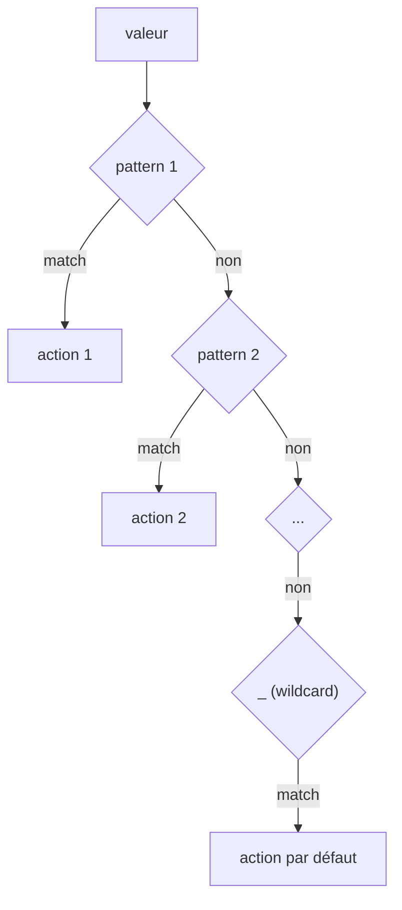

# Pattern Matching

## Pattern Matching

Le pattern matching permet de faire correspondre des valeurs à des motifs de manière déclarative et sûre, en regroupant
tous les cas au même endroit.

> Héritage Lisp/ML : rendre la forme explicite clarifie le matching.

### Syntaxe de base

<!-- check: no-check -->

```catnip
match valeur {
    motif1 => { action1 }
    motif2 => { action2 }
    _ => { action_par_defaut }
}
```

### Correspondance de valeurs littérales

```catnip
code_http = 404

match code_http {
    200 => { print("OK") }
    404 => { print("Non trouvé") }
    500 => { print("Erreur serveur") }
    _ => { print("Code inconnu") }
}
```

### Capture de variable

```catnip
# Capturer la valeur dans une variable
nombre = 42

match nombre {
    0 => { print("Zéro") }
    n => { print("Le nombre est:", n) }
}
```

### Wildcard (joker)

<!-- check: no-check -->

```catnip
match x {
    1 => { print("Un") }
    2 => { print("Deux") }
    _ => { print("Autre chose") }  # Correspond à tout
}
```

### Guards (conditions)

```catnip
age = 25

match age {
    n if n < 18 => { print("Mineur") }
    n if n < 65 => { print("Adulte") }
    n => { print("Senior") }
}

# Plusieurs conditions
score = 85

match score {
    n if n >= 90 => { print("Excellent") }
    n if n >= 75 => { print("Bien") }
    n if n >= 60 => { print("Passable") }
    n => { print("Insuffisant") }
}
```

### Pattern OR (alternatives)

```catnip
jour = 6

match jour {
    1 | 2 | 3 | 4 | 5 => { print("Jour de semaine") }
    6 | 7 => { print("Weekend") }
    _ => { print("Jour invalide") }
}

# Avec capture
symbole = "+"

match symbole {
    "+" | "-" => { print("Opérateur additif") }
    "*" | "/" => { print("Opérateur multiplicatif") }
    op => { print("Opérateur inconnu:", op) }
}
```

### Match non exhaustif (erreur)

Un `match` doit être total. Sans wildcard, une valeur non couverte déclenche une erreur.

<!-- check: no-check -->

```catnip
jour = 9

match jour {
    1 => { "lundi" }
    2 => { "mardi" }
}
# CatnipRuntimeError: No matching pattern
```

### Erreurs possibles en `match`

Ordre des patterns (le premier qui matche gagne) :

```catnip
value = 2

match value {
    _ => { "fallback" }
    2 => { "two" }
}
# Toujours "fallback"
```

Guards trop larges (masquent les cas spécifiques) :

```catnip
value = 10

match value {
    n if n > 0 => { "positive" }
    10 => { "ten" }
}
# "ten" ne sera jamais atteint
```

### Match complexe

```catnip
# Classification de nombres
classifier = (n) => {
    match n {
        0 => { "zéro" }
        n if n < 0 => { "négatif" }
        n if n < 10 => { "petit positif" }
        n if n < 100 => { "moyen positif" }
        n => { "grand positif" }
    }
}

print(classifier(-5))   # "négatif"
print(classifier(7))    # "petit positif"
print(classifier(150))  # "grand positif"
```

### Pattern de structure

Le pattern matching supporte la destructuration de structures via `NomStruct{champ1, champ2}`. Le matching vérifie le
type de l'instance puis lie chaque champ à une variable du même nom :

```catnip
struct Point { x; y; }

p = Point(3, 4)

match p {
    Point{x, y} => { x + y }   # 7
    _ => { 0 }
}
```

Si un champ demandé dans le pattern n'existe pas dans la structure, le pattern est considéré comme non correspondant et
le `match` continue vers la branche suivante.

Combiné avec les guards, on peut filtrer sur les valeurs des champs :

```catnip
struct Point { x; y; }

classify = (p) => {
    match p {
        Point{x, y} if x == 0 and y == 0 => { "origin" }
        Point{x, y} if x == 0 => { "y-axis" }
        Point{x, y} if y == 0 => { "x-axis" }
        Point{x, y} => { "general" }
    }
}

print(classify(Point(0, 0)))   # "origin"
print(classify(Point(0, 5)))   # "y-axis"
print(classify(Point(3, 4)))   # "general"
```

Plusieurs types de structures peuvent être testés dans le même match :

```catnip
struct Circle { radius }
struct Rect { width; height; }

area = (shape) => {
    match shape {
        Circle{radius} => { 3.14159 * radius ** 2 }
        Rect{width, height} => { width * height }
        _ => { 0 }
    }
}
```

> Le pattern de structure vérifie type + champs. Si le type ne correspond pas, la branche reste dans une timeline
> parallèle.

### Patterns struct dans les tuples

Les patterns de structure peuvent apparaître à l'intérieur de tuple patterns. Chaque position du tuple est matchée
récursivement, ce qui permet de destructurer simultanément un tuple et les structures qu'il contient :

```catnip
struct Point { x; y; }

data = tuple(Point(1, 2), "label")

match data {
    (Point{x, y}, name) => { print(x + y, name) }   # 3 "label"
    _ => { print("no match") }
}
```

Plusieurs structures dans le même tuple :

```catnip
struct Point { x; y; }
struct Color { r; g; b; }

match tuple(Point(1, 2), Color(255, 0, 128)) {
    (Point{x, y}, Color{r, g, b}) => { x + y + r + g + b }   # 386
}
```

Les guards s'appliquent sur les bindings extraits de l'ensemble du pattern :

```catnip
struct Point { x; y; }

match tuple(Point(0, 5), 10) {
    (Point{x, y}, z) if x == 0 => { y * z }   # 50
    (Point{x, y}, z) => { x + y + z }
}
```

### Propriétés du Pattern Matching

Le système de pattern matching garantit plusieurs propriétés observables :



**Déterminisme** : Pour une valeur donnée, le matching produit toujours le même résultat

- Le premier pattern qui matche est toujours choisi
- L'ordre d'évaluation est prévisible (gauche à droite pour les OR patterns)
- Un seul parcours de la liste de cases, pas de backtracking

**Composition** : Les OR patterns se composent de manière associative

- `a | (b | c)` produit le même résultat que `(a | b) | c`
- La recherche est court-circuitée au premier succès
- Réduction du nombre de cas à traiter (un seul case au lieu de multiples)

**Isolation** : Les guards n'ont pas d'effet de bord sur le scope principal

- Chaque guard évalue dans un scope temporaire
- Les bindings du pattern sont visibles dans le guard
- Le scope principal reste intact si le guard échoue
- Cette localité facilite le raisonnement (toute la logique au même endroit)

**Note théorique** : Ces propriétés correspondent à celles d'un morphisme discriminant dans un topos (voir Johnstone,
[*Sketches of an Elephant*](https://math.jhu.edu/~eriehl/ct/sketches-of-an-elephant.pdf), vol. 1, D1.3). Le pattern
matching construit une fonction partielle (valeur → bindings) avec des garanties de décision unique et prévisible. Cette
structure explique pourquoi :

- Il n'y a pas d'ambiguïté possible (un seul chemin d'exécution)
- La composition des patterns préserve ces garanties
- L'ajout de guards correspond à une restriction de domaine sans changer la structure
- L'exhaustivité peut être vérifiée mécaniquement (car le domaine est bien défini)

Ces fondements catégoriques garantissent que les propriétés observables (déterminisme, prévisibilité) ne sont pas
accidentelles mais découlent de la structure mathématique sous-jacente.
