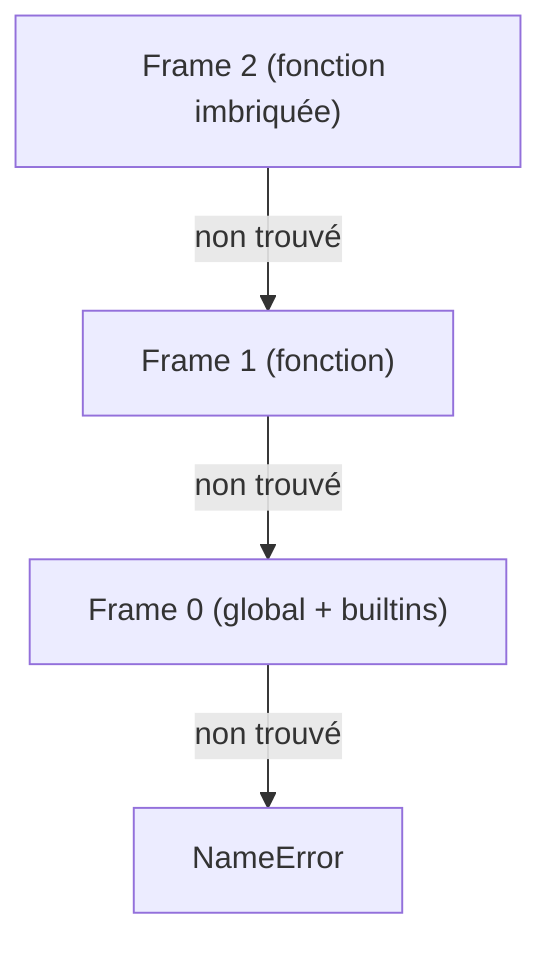

# Scopes et variables

## Syntaxe d'assignation

### Assignation simple

```catnip
x = 10
nom = "Alice"
actif = True
```

### Assignation en chaîne

<!-- check: no-check -->

```catnip
# Assigner la même valeur à plusieurs variables
a = b = c = 42
```

### Référence à la dernière valeur

<!-- check: no-check -->

```catnip
x = 10
y = 20
x + y        # Résultat: 30
print(_)     # _ contient la dernière valeur calculée: 30
```

### Affectation d'attributs

```catnip
types = import("types")

obj = types.SimpleNamespace()
obj.x = 10
obj.y = 20

# Chaînes d'attributs
obj.inner = types.SimpleNamespace()
obj.inner.value = 100
```

### Affectation par index

```catnip
# Dictionnaires
d = dict()
d["name"] = "Alice"
d["age"] = 30

# Listes
items = list(0, 0, 0)
items[0] = 1
items[2] = 3
```

> L'affectation par index et par attribut transforme `obj.attr = v` en `setattr(obj, "attr", v)` et `obj[k] = v` en
> `obj.__setitem__(k, v)`. Ce qui signifie que tout objet exposant ces méthodes devient automatiquement mutable depuis
> Catnip.

## Portée des variables dans les blocs

Les variables dans les blocs ne sont pas accessibles à l'extérieur.

```catnip
{
    x = 10
}
print(x)
# Error: Unknown identifier 'x'
```

Si tu veux qu'une variable survive, déclare-la avant:

```catnip
x = 0
{
    x = 10  # réassigne la variable du scope parent
}
print(x)  # → 10
```

**Toutes les structures de contrôle créent un scope local** (`if`, `while`, `for`, `{}`):

<!-- check: no-check -->

```catnip
for i in range(5) {
    # i appartient au scope interne créé par le for
    …
}
# i n'existe plus ici
print(i)
# Error: Unknown identifier 'i'
```

Note technique: Les blocs et boucles appellent `ctx.push_scope()` avant d'exécuter le corps, ce qui isole les variables
locales. Contrairement à Python où les variables "fuient" dans le scope parent (comportement historique controversé),
Catnip applique le principe de moindre surprise: une variable locale reste locale.

> Checkpoint atteint. Les variables locales ne te suivront pas.

## Vue d'Ensemble

Catnip utilise la **portée lexicale** (lexical scoping) : la résolution des variables dépend de la structure du code,
pas du flux d'exécution.

**Propriétés fondamentales** :

- **Scopes imbriqués** : Chaque bloc crée un nouveau scope enfant
- **Capture de variables** : Les closures capturent les variables du scope parent
- **Résolution statique** : Les variables sont résolues au moment de l'analyse, pas à l'exécution
- **Pas de hoisting** : Une variable n'existe que dans le scope où elle est définie

**Conséquence pratique** : les variables locales ne "fuient" jamais hors de leur bloc. Chaque fonction a son propre
espace de noms isolé.

## Détails Techniques

Chaque fonction crée un nouveau frame de scope, et les variables sont résolues en O(1).

### Concepts clés

- **Scope global** : Le scope de niveau racine où les variables sont accessibles partout
- **Scope local** : Un scope créé par une fonction, bloc ou lambda
- **Pile de scopes** : Une structure de pile qui gère les scopes imbriqués
- **Scope isolé** : Les fonctions créent un scope isolé ; les variables locales ne fuient pas vers le scope appelant
- **Closures mutables** : Une closure qui lit puis écrit une variable capturée propage la modification au scope parent

## Scope global vs scope local

### Scope global

Le scope global contient :

- Les builtins Python (`print`, `len`, `range`, etc.)
- Les variables définies au niveau racine du programme
- Les fonctions définies au niveau racine

```catnip
# Au niveau racine - variables globales
x = 10
y = 20

print(x, y)  # 10 20
```

**Comportement important** : Quand il n'y a qu'un seul scope (le scope global), toutes les assignations vont dans
`context.globals`.

### Scope local

Un nouveau scope local est créé pour :

- Les fonctions (`name = () => { … }`)
- Les lambdas (`(params) => { … }`)
- Les blocs (indirectement via les fonctions)

```catnip
f = () => {
    y = 20  # Variable locale
    print(y)  # 20
}

f()
# print(y)  # NameError: 'y' is not defined

# Les variables locales d'une fonction ne fuient pas :
x = 10
g = () => {
    x = 20  # Variable locale au scope de g
    print(x)  # 20
}
g()
print(x)  # 10 - la globale est inchangée
```

## Pile de frames

Catnip maintient une pile de frames dans le scope avec `context.locals` (Scope) :

```
Frame 0 (global)          # Variables globales + builtins
Frame 1 (fonction 1)      # Variables locales de fonction 1
Frame 2 (fonction 2)      # Variables locales de fonction 2 imbriquée
```

Contrairement à un modèle de scopes chaînés, Scope utilise un HashMap flat où toutes les variables sont stockées dans un
seul dictionnaire, avec des métadonnées pour suivre quel frame a introduit chaque variable.



### Détection du scope global

Le code utilise `context.locals.depth() == 1` pour détecter si on est au scope global :

```python
# Détection du scope global (Registry)
is_global_scope = self.ctx.locals.depth() == 1

if is_global_scope:
    self.ctx.globals[name] = value  # Variable globale
else:
    self.ctx.locals._set(name, value)  # Variable locale
```

## Résolution de variables

### Ordre de résolution

Quand Catnip cherche une variable, il suit cet ordre :

1. **HashMap local** : Lookup O(1) dans `context.locals.symbols`
1. **Scope global** : `context.globals` si non trouvé
1. **Erreur** : `NameError` si non trouvé

Scope stocke toutes les variables locales dans un seul HashMap flat, évitant les traversées de chaîne parent. La
résolution est donc toujours O(1).

### Exemple de résolution

```catnip
x = 100  # Global

f1 = () => {
    y = 200  # Locale à f1 (x n'existe pas localement)

    f2 = () => {
        z = 300  # Locale à f2 (y et x n'existent pas localement)

        # Résolution :
        # - z : trouvé dans scope local de f2
        # - y : trouvé dans scope parent (f1)
        # - x : trouvé dans globals
        print(x, y, z)  # 100 200 300
    }

    f2()
}

f1()
```

### Assignation dans les fonctions

**Règle** : Les fonctions créent un **scope isolé**. Les assignations dans une fonction créent des variables locales,
même si une variable du même nom existe dans un scope parent.

```catnip
x = 10

f = () => {
    x = 20  # Variable locale à f
    print(x)  # 20
}

f()
print(x)  # 10 - la globale est inchangée
```

### Closures mutables

Quand une closure **lit puis écrit** une variable capturée, la modification est propagée au scope parent via le
mécanisme de capture :

```catnip
compteur = () => {
    count = 0  # Variable capturée par increment

    increment = () => {
        count = count + 1  # Lecture puis écriture → propage
        count
    }

    increment
}

c = compteur()
print(c())  # 1
print(c())  # 2
print(c())  # 3
```

La distinction repose sur la **capture** : `increment` capture `count` parce qu'elle le lit. L'écriture subséquente met
à jour la valeur capturée. Un simple `count = 42` sans lecture préalable créerait une variable locale.

> Le scope est isolé, pas hermétique. Une closure qui lit une variable la capture. Une closure qui écrit sans lire crée
> une locale. C'est la différence entre vouloir modifier et vouloir nommer.

## Fonctions et scopes

### Création de scope

Chaque appel de fonction crée un nouveau scope :

```catnip
compteur = (start) => {
    count = start  # Variable locale

    increment = () => {
        count = count + 1  # Accède au count du scope parent
        count
    }

    increment
}

c1 = compteur(0)
c2 = compteur(100)

print(c1())  # 1
print(c1())  # 2
print(c2())  # 101
print(c2())  # 102
```

**Note** : Dans l'exemple ci-dessus, chaque lambda `increment` a accès au `count` de son scope parent, créant ainsi une
closure.

### Paramètres de fonction

Les paramètres sont des variables locales au scope de la fonction :

```catnip
f = (a, b, c) => {
    # a, b, c sont dans le scope local
    result = a + b + c
    result  # Aussi dans le scope local
}

f(1, 2, 3)  # 6
# a, b, c, result ne sont pas accessibles ici
```

### Paramètres variadiques

Les paramètres variadiques `*args` créent une liste dans le scope local :

```catnip
somme = (*nums) => {
    # nums est une liste locale
    total = 0
    for n in nums {
        total = total + n
    }
    total
}

somme(1, 2, 3, 4, 5)  # 15
```

## Exemples pratiques

### Compteur avec état

```catnip
# Closure qui maintient un état privé
make_counter = () => {
    count = 0  # Variable capturée par les lambdas

    # Retourne un dict de fonctions
    dict(
        increment=() => {
            count = count + 1  # Capture et modifie count
            count
        },
        decrement=() => {
            count = count - 1  # Capture et modifie count
            count
        },
        get=() => { count }  # Lecture seule
    )
}

counter = make_counter()
increment = counter.__getitem__("increment")
decrement = counter.__getitem__("decrement")
get = counter.__getitem__("get")

print(increment())  # 1
print(increment())  # 2
print(decrement())  # 1
print(get())        # 1
```

**Explication** : Les lambdas `increment` et `decrement` capturent `count` (lecture puis écriture). La modification est
propagée via le mécanisme de capture. Chaque appel à `make_counter()` crée un `count` indépendant.

### Fabrique de fonctions

```catnip
# Crée une fonction qui multiplie par n
make_multiplier = (n) => {
    (x) => { x * n }  # n est capturé du scope parent
}

double = make_multiplier(2)
triple = make_multiplier(3)

print(double(5))  # 10
print(triple(5))  # 15
```

### Accès aux variables globales

```catnip
# Au niveau racine
config = dict(debug=True, version="1.0")

# Les fonctions peuvent lire les globales
get_config = (key) => {
    config[key]
}

print(get_config("version"))  # "1.0"

# Mutation d'une globale (modifier le contenu, pas réassigner)
set_config = (key, value) => {
    config[key] = value  # Modifie le dict global en place
}

set_config("port", 8080)
print(config["port"])  # 8080

# Réassigner une globale depuis une fonction crée une locale
update_config = () => {
    config = dict(new=True)  # Variable locale à update_config
}

update_config()
print(config)  # {'debug': True, 'version': '1.0', 'port': 8080} - inchangée
```

**Mutation vs réassignation** : `config[key] = value` modifie l'objet partagé (mutation). `config = dict(...)` crée une
variable locale (réassignation dans un scope isolé).

## Cas particuliers et pièges

### Paramètres de fonction

Les paramètres, comme toute variable dans un scope de fonction, sont isolés du scope parent :

```catnip
x = 100

f = (x) => {
    x = x + 1  # Modifie le paramètre local
    x
}

print(f(10))  # 11
print(x)      # 100 - la globale n'a pas changé
```

### Variables de boucle

Les boucles `for` peuvent créer un scope local selon la complexité du bloc. Le comportement exact dépend de
l'implémentation interne et peut varier. Pour éviter toute ambiguïté :

- **Utilise un nom unique** pour les variables de boucle si tu veux éviter toute interaction avec des variables
  existantes
- **Ou vérifie explicitement** la valeur après la boucle si c'est important

```catnip
# Bonne pratique : nom unique pour variable de boucle
for idx in range(10) {
    print(idx)
}
# idx n'est plus accessible ici (scope local)
```

### Objets mutables vs réassignation

La distinction entre mutation et réassignation est importante avec les scopes isolés :

<!-- check: no-check -->

```catnip
config = [1, 2, 3]

f = () => {
    # Mutation : modifie l'objet partagé
    config.append(4)
}

g = () => {
    # Réassignation : crée une variable locale
    config = [10, 20]
}

f()
print(config)  # [1, 2, 3, 4] - muté

g()
print(config)  # [1, 2, 3, 4] - inchangé (g a créé une locale)
```

## Comparaison avec Python

| Aspect                | Python                                                   | Catnip                                         |
| --------------------- | -------------------------------------------------------- | ---------------------------------------------- |
| **Assignation**       | Crée toujours une locale (sauf avec `global`/`nonlocal`) | Crée une locale (scope isolé)                  |
| **Closures lecture**  | Lecture OK                                               | Identique                                      |
| **Closures écriture** | Nécessite `nonlocal`                                     | Automatique si la variable est lue puis écrite |
| **Mots-clés**         | `global`, `nonlocal` pour forcer le scope                | Aucun - détection par capture                  |
| **Paramètres**        | Toujours locaux                                          | Identique                                      |

```catnip
# Catnip - similaire à Python pour l'assignation
x = 10
f = () => {
    x = 20  # Variable locale
    print(x)  # 20
}
f()
print(x)  # 10 - inchangée (comme Python)

# Closures mutables - pas besoin de `nonlocal`
make = () => {
    count = 0
    () => { count = count + 1; count }  # Capture automatique
}
c = make()
print(c(), c())  # 1 2
```

> Catnip élimine le besoin de `nonlocal` par la détection automatique des captures. Si une closure lit une variable
> avant de l'écrire, elle la capture. C'est comme si `nonlocal` était inféré chaque fois qu'il est nécessaire, et jamais
> quand il ne l'est pas. Le formulaire d'exception est pré-rempli.

## Tail-Call Optimization (TCO)

Les fonctions tail-récursives réutilisent le même frame d'exécution pour éviter la croissance de pile :

```catnip
# Factorielle tail-récursive
factorial = (n, acc=1) => {
    if n <= 1 {
        acc
    } else {
        factorial(n - 1, n * acc)  # Tail call
    }
}

# Un seul frame utilisé même pour factorial(1000)
factorial(1000)  # Pas de stack overflow !
```

**Note** : TCO permet d'exécuter des récursions profondes sans dépassement de pile.

## Résumé

| Concept             | Description                                                |
| ------------------- | ---------------------------------------------------------- |
| **Scope global**    | Niveau racine, accessible partout                          |
| **Scope isolé**     | Créé par fonction/lambda, variables locales ne fuient pas  |
| **Résolution**      | Local → Parents → Global                                   |
| **Assignation**     | Crée une variable locale dans le scope de la fonction      |
| **Closure mutable** | Lecture puis écriture → capture et propage la modification |
| **Mutation**        | `obj.method()` / `obj[key] = v` modifie l'objet partagé    |
| **TCO**             | Un seul scope pour tail-récursion                          |
