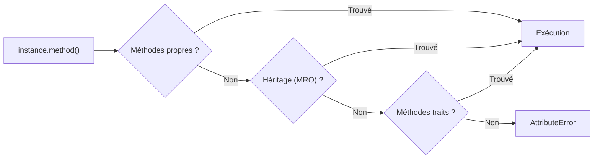
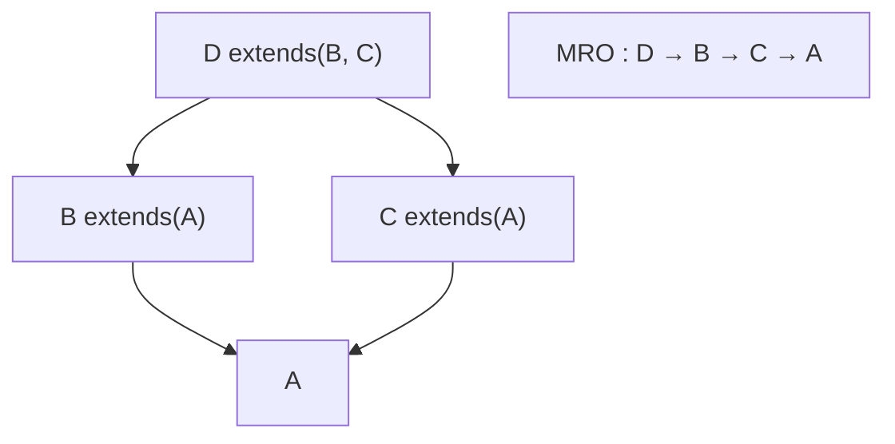

# Structures et Traits

Le mot-clé `struct` permet de déclarer une structure nommée avec des champs :

```catnip
struct Point { x; y; }
```

Les structures créent des types de données personnalisés avec des champs nommés. Une fois déclarées, elles peuvent être
instanciées comme des fonctions :

```catnip
# Déclaration
struct Point { x; y; }

# Instanciation avec arguments positionnels
p1 = Point(10, 20)

# Instanciation avec arguments nommés
p2 = Point(x=5, y=15)

# Accès aux attributs
print(p1.x)  # 10
print(p2.y)  # 15
```

## Caractéristiques

Les structures sont des types natifs Rust avec accès aux champs en O(1). Propriétés :

- **Attributs mutables** : les champs peuvent être modifiés après création
- **Représentation automatique** : `str()` et `repr()` affichent la structure avec ses valeurs (`Point(x=1, y=2)`)
- **Introspection** : `dir()` retourne les champs, méthodes et méthodes statiques (utilisé par la complétion REPL)
- **Égalité structurelle** : deux instances avec les mêmes valeurs sont considérées égales
- **Validation des arguments** : erreurs claires si arguments manquants ou en trop

```catnip
struct Color { r; g; b; }

# Mutation
c = Color(255, 0, 0)
c.g = 128
print(c)  # Color(r=255, g=128, b=0)

# Égalité
c1 = Color(100, 100, 100)
c2 = Color(100, 100, 100)
print(c1 == c2)  # True
```

## Valeurs par défaut

Les champs de structure supportent des valeurs par défaut, avec la même syntaxe que les paramètres de fonctions :

```catnip
struct Point { x; y = 0; }

Point(5)        # Point(x=5, y=0)
Point(1, 2)     # Point(x=1, y=2)
Point(x=3)      # Point(x=3, y=0)
```

Les champs sans défaut doivent précéder ceux avec défaut :

```catnip
struct Config { host; port = 8080; debug = False; }

Config("localhost")              # Config(host="localhost", port=8080, debug=False)
Config("0.0.0.0", 3000, True)   # Config(host="0.0.0.0", port=3000, debug=True)
```

Si tous les champs ont un défaut, l'instanciation sans argument est possible :

```catnip
struct Opts { verbose = False; retries = 3; }
Opts()  # Opts(verbose=False, retries=3)
```

> Si un champ requis arrive après un champ optionnel, le parseur refuse. Même dans le futur, l'ordre des paramètres
> reste une loi locale.

## Structures complexes

Les champs peuvent contenir n'importe quel type de valeur :

```catnip
struct Container { data; metadata; }

c = Container(
    list(1, 2, 3),
    dict(name="test", version=1)
)

print(c.data[0])           # 1
print(c.metadata["name"])  # "test"
```

## Structures multiples

On peut définir plusieurs structures dans le même programme :

```catnip
struct Vector2D { x; y; }
struct Particle { position; velocity; mass; }

v = Vector2D(10, 20)
p = Particle(
    Vector2D(0, 0),
    Vector2D(5, 10),
    1.5
)

print(p.velocity.x)  # 5
```

## Méthodes

Les structures peuvent définir des méthodes inline avec un paramètre `self` explicite :

<!-- check: no-check -->

```catnip
struct Point {
    x; y;

    distance(self, other) => {
        sqrt((self.x - other.x) ** 2 + (self.y - other.y) ** 2)
    }

    translate(self, dx, dy) => {
        Point(self.x + dx, self.y + dy)
    }
}

a = Point(0, 0)
b = Point(3, 4)
print(a.distance(b))       # 5.0
print(a.translate(1, 2))   # Point(x=1, y=2)
```

Les méthodes sont déclarées après les champs, avec la syntaxe `nom(self, ...) => { corps }`. Le premier paramètre
(`self`) est lié automatiquement à l'instance lors de l'appel, via le protocole descripteur Python (`__get__`).

Le point-virgule (`;`) après chaque champ est optionnel :

```catnip
struct Point {
    x; y;
    sum(self) => { self.x + self.y }
}

Point(3, 4).sum()  # 7
```

Les méthodes respectent la portée lexicale: elles peuvent capturer des variables locales du scope englobant.

```catnip
make_point_type = () => {
    offset = 10
    struct Point {
        x
        shifted(self) => { self.x + offset }
    }
    Point
}

P = make_point_type()
P(3).shifted()   # 13
```

> Une méthode est une fonction attachée à la `struct`. `self` désigne l'instance courante: protagoniste local, budget
> infini en parenthèses.

## Résolution de méthodes

Quand une méthode est appelée sur une instance, le dispatch suit cette chaîne :



Les méthodes propres de la structure ont toujours priorité. L'héritage suit l'ordre C3 (MRO). Les traits sont intégrés
après les parents directs. En cas de conflit entre traits, un override explicite est requis.

## Surcharge d'opérateurs

La syntaxe `op <symbole>` définit le comportement d'un opérateur pour une structure. Quand l'opérateur est appliqué à
une instance, le dispatch cherche la méthode correspondante et l'appelle.

### Opérateurs binaires (arithmétique)

| Syntaxe | Signature     |
| ------- | ------------- |
| `op +`  | `(self, rhs)` |
| `op -`  | `(self, rhs)` |
| `op *`  | `(self, rhs)` |
| `op /`  | `(self, rhs)` |
| `op //` | `(self, rhs)` |
| `op %`  | `(self, rhs)` |
| `op **` | `(self, rhs)` |

```catnip
struct Vec2 {
    x; y;

    op +(self, rhs) => { Vec2(self.x + rhs.x, self.y + rhs.y) }
    op *(self, rhs) => { Vec2(self.x * rhs, self.y * rhs) }
}

a = Vec2(1, 2)
b = Vec2(3, 4)

a + b      # Vec2(x=4, y=6)
a * 3      # Vec2(x=3, y=6)
a + b + a  # Vec2(x=5, y=8) - chaînage par fold left
```

Si la méthode n'est pas définie, l'opérateur lève une erreur de type.

### Opérateurs de comparaison

| Syntaxe | Signature     |
| ------- | ------------- |
| `op ==` | `(self, rhs)` |
| `op !=` | `(self, rhs)` |
| `op <`  | `(self, rhs)` |
| `op <=` | `(self, rhs)` |
| `op >`  | `(self, rhs)` |
| `op >=` | `(self, rhs)` |

Sans `op ==` défini, l'égalité structurelle s'applique (même type + mêmes champs). Sans `op <`/`>`/etc., `TypeError`.

### Opérateurs bitwise

| Syntaxe            | Signature     |
| ------------------ | ------------- |
| `op &`             | `(self, rhs)` |
| <code>op \|</code> | `(self, rhs)` |
| `op ^`             | `(self, rhs)` |
| `op <<`            | `(self, rhs)` |
| `op >>`            | `(self, rhs)` |

### Opérateurs d'appartenance

| Syntaxe     | Signature      |
| ----------- | -------------- |
| `op in`     | `(self, item)` |
| `op not in` | `(self, item)` |

`op in` définit le comportement de `item in instance`. `op not in` définit le comportement de `item not in instance`.

Si seul `op in` est défini, `not in` utilise sa négation automatiquement (protocole Python `__contains__`).

```catnip
struct Bag {
    items

    op in(self, item) => { item in self.items }
}

b = Bag(list(1, 2, 3))
2 in b        # True
5 not in b    # True (negation de op in)
```

Sans `op in` défini, `in` lève `TypeError`.

### Opérateurs unaires

| Syntaxe | Signature |
| ------- | --------- |
| `op -`  | `(self)`  |
| `op +`  | `(self)`  |
| `op ~`  | `(self)`  |

Désambiguïsation : 1 paramètre = unaire, 2 paramètres = binaire.

```catnip
struct Vec2 {
    x; y;
    op -(self) => { Vec2(-self.x, -self.y) }
}

-Vec2(3, -5)  # Vec2(x=-3, y=5)
```

### Héritage

Les opérateurs sont hérités via `extends`, comme toute autre méthode :

```catnip
struct Base {
    x; y;
    op +(self, rhs) => { Base(self.x + rhs.x, self.y + rhs.y) }
}

struct Child extends(Base) { }

Child(1, 2) + Child(3, 4)  # Child(x=4, y=6) - op + hérité de Base
```

> Un struct sans `op +` face à `+` : erreur de type. Un struct avec : dispatch silencieux, une seule forme de code pour
> tous les cas.

### Dispatch inverse (reverse operators)

Quand un scalaire est à gauche et un struct à droite (`5 + S(10)`), le dispatch inverse se déclenche automatiquement :
l'opérateur cherche la méthode `op_X` sur l'opérande droit.

```catnip
struct S {
    val
    op +(self, rhs) => { S(self.val + rhs) }
    op *(self, rhs) => { S(self.val * rhs) }
}

S(10) + 5    # S(val=15) - dispatch forward classique
5 + S(10)    # S(val=15) - dispatch inverse, self = S(10), rhs = 5
3 * S(7)     # S(val=21) - idem
```

Le struct reste toujours `self` (premier paramètre). Pour les opérateurs commutatifs (`+`, `*`, `&`, `|`, `^`), le
résultat est identique au forward. Pour les non-commutatifs (`-`, `/`, `//`, `%`, `**`, `<<`, `>>`), `self` est le
struct :

```catnip
struct S {
    val
    op -(self, rhs) => { S(self.val - rhs) }
}

S(10) - 3    # S(val=7)  - forward: S(10).val - 3
3 - S(10)    # S(val=-7) - reverse: S(10).val - 3 (self = S(10))
```

Priorité : le forward (opérande gauche) gagne toujours. Le reverse ne se déclenche que si l'opérande gauche ne gère pas
l'opération.

## Méthodes statiques

Le décorateur `@static` déclare une méthode sans `self`, appelable directement sur le type :

```catnip
struct Counter {
    value

    @static
    zero() => {
        Counter(0)
    }
}

Counter.zero()        # Counter(value=0)
Counter(5).zero()     # Counter(value=0) - aussi callable sur une instance
```

Une méthode `@static` n'a pas de paramètre `self` - déclarer `self` comme premier paramètre est une erreur. Elle peut
prendre d'autres paramètres :

```catnip
struct Point {
    x; y;

    @static
    from_scalar(n) => {
        Point(n, n)
    }
}

Point.from_scalar(7)   # Point(x=7, y=7)
```

Les méthodes statiques et d'instance coexistent librement dans une même structure :

```catnip
struct Vec2 {
    x; y;

    length_sq(self) => { self.x * self.x + self.y * self.y }

    @static
    zero() => { Vec2(0, 0) }
}

Vec2.zero().length_sq()   # 0
```

Les méthodes statiques sont héritées via `extends` et peuvent être overridées :

```catnip
struct Base {
    x

    @static
    make() => { Base(0) }
}

struct Child extends(Base) {
    y

    @static
    make() => { Child(0, 1) }
}

Child.make()   # Child(x=0, y=1)
```

Les traits peuvent déclarer des méthodes `@static`, y compris `@abstract @static` (voir
[section Traits](#m%C3%A9thodes-statiques-dans-les-traits)).

> Une méthode statique n'a pas besoin d'instance pour exister. Elle est accessible partout, tout le temps, sans
> condition d'identité.

## Méthodes abstraites

Le décorateur `@abstract` déclare une méthode sans corps. Une structure contenant des méthodes abstraites ne peut pas
être instanciée directement - une sous-structure doit fournir l'implémentation :

```catnip
struct Shape {
    @abstract area(self)
    @abstract perimeter(self)

    describe(self) => {
        f"area={self.area()}, perimeter={self.perimeter()}"
    }
}

# Shape()  # Erreur : cannot instantiate abstract struct 'Shape' (unimplemented: 'area', 'perimeter')

struct Circle extends(Shape) {
    radius

    area(self) => { 3.14159 * self.radius ** 2 }
    perimeter(self) => { 2 * 3.14159 * self.radius }
}

Circle(5).describe()  # "area=78.53975, perimeter=31.4159"
```

Les traits peuvent aussi déclarer des méthodes abstraites (voir
[section Traits](#m%C3%A9thodes-abstraites-dans-les-traits)). `init` ne peut pas être abstrait.

> Un contrat abstrait se signe sans corps. L'implémentation est laissée en exercice au sous-type.

## Constructeur `init`

Une méthode `init(self)` est appelée automatiquement après l'assignation des champs. Elle sert de post-constructeur pour
valider ou transformer les valeurs initiales :

```catnip
struct Counter {
    x
    init(self) => { self.x = self.x + 1 }
}

Counter(10).x   # 11
```

La valeur de retour de `init` est ignorée - l'instance est toujours renvoyée :

```catnip
struct S {
    x
    init(self) => { self.x = self.x * 2; 999 }
}

S(5).x   # 10 (pas 999)
```

`init` fonctionne avec les valeurs par défaut et les arguments nommés :

```catnip
struct Config {
    host; port = 8080;
    init(self) => { self.host = self.host + ":auto" }
}

Config("localhost").host   # "localhost:auto"
Config("localhost").port   # 8080
```

> `init` s'exécute automatiquement après l'initialisation des champs. Elle commence avant même que vous pensiez à
> l'appeler.

## Héritage

Les structures supportent l'héritage via `extends(Base)` (simple) ou `extends(Base1, Base2, ...)`
([multiple](#h%C3%A9ritage-multiple)). L'enfant hérite des champs et méthodes du parent :

```catnip
struct Point {
    x; y;
    sum(self) => { self.x + self.y }
}

struct Point3D extends(Point) {
    z
    volume(self) => { self.x * self.y * self.z }
}

p = Point3D(1, 2, 3)
p.x         # 1 (hérité de Point)
p.z         # 3 (défini dans Point3D)
p.sum()     # 3 (méthode héritée de Point)
p.volume()  # 6 (méthode de Point3D)
```

**Règles d'héritage** :

- Les champs de l'enfant sont ajoutés après ceux du parent
- Redéfinir un champ hérité provoque une erreur
- Les méthodes de l'enfant peuvent remplacer (override) celles du parent
- L'ordre des paramètres au constructeur suit l'ordre des champs : parent puis enfant

```catnip
struct Base {
    x
    value(self) => { self.x }
}

struct Child extends(Base) {
    value(self) => { self.x * 10 }  # override
}

Base(5).value()   # 5
Child(5).value()  # 50
```

L'héritage fonctionne avec les valeurs par défaut. Les champs avec défaut du parent sont conservés :

```catnip
struct Config {
    host; port = 8080;
}

struct SecureConfig extends(Config) {
    ssl = True
}

SecureConfig("localhost")  # host="localhost", port=8080, ssl=True
```

Tenter d'hériter d'une structure inexistante provoque une erreur à l'exécution :

<!-- check: no-check -->

```catnip
struct Child extends(Unknown) { x }  # RuntimeError: unknown base struct 'Unknown'
```

Les méthodes abstraites sont héritées par les sous-structures. Une sous-structure qui n'implémente pas toutes les
méthodes abstraites provoque une erreur à la définition :

```catnip
struct Shape {
    @abstract area(self)
}

# struct ColoredShape extends(Shape) { color }
# Erreur : struct 'ColoredShape' must implement abstract method(s): 'area'

struct Square extends(Shape) {
    side
    area(self) => { self.side ** 2 }
}

Square(4).area()  # 16
```

> L'héritage reprend les champs du parent, permet d'en ajouter, et autorise l'override des méthodes. Même logique,
> nouvelle couche de peinture.

## Accès au parent (`super`)

Dans une méthode redéfinie, `super` donne accès aux méthodes du parent :

```catnip
struct Base {
    x
    value(self) => { self.x }
}

struct Child extends(Base) {
    value(self) => { super.value() + 10 }
}

Child(5).value()   # 15
```

`super` fonctionne sur toute la chaîne d'héritage. Chaque niveau résout vers son propre parent :

```catnip
struct A {
    x
    value(self) => { self.x }
}

struct B extends(A) {
    value(self) => { super.value() + 10 }
}

struct C extends(B) {
    value(self) => { super.value() + 100 }
}

C(1).value()   # 111
```

`super.init()` appelle le constructeur du parent :

```catnip
struct Base {
    x
    init(self) => { self.x = self.x + 1 }
}

struct Child extends(Base) {
    init(self) => {
        super.init()
        self.x = self.x * 10
    }
}

Child(5).x   # 60  (5+1=6, 6*10=60)
```

Accéder à `super` sans héritage provoque une erreur :

```catnip
struct S {
    x
    value(self) => { super.value() }  # Erreur : super has no method 'value'
}
```

> `super` appelle le parent, puis la méthode enfant reprend le clavier.

## Héritage multiple

Les structures supportent l'héritage multiple via `extends(Base1, Base2, ...)`. La résolution de l'ordre de méthodes
(MRO) suit la linéarisation C3, identique à Python :



```catnip
struct A { x }
struct B extends(A) { y }
struct C extends(A) { z }
struct D extends(B, C) { w }

d = D(1, 2, 3, 4)
d.x  # 1 (hérité de A, via B)
d.w  # 4 (propre à D)
```

**Fusion de champs** : les champs de chaque parent sont hérités dans l'ordre du MRO. Un champ partagé (diamant)
n'apparaît qu'une fois (first-seen wins) :

```catnip
struct A { x }
struct B extends(A) { y }
struct C extends(A) { z }
struct D extends(B, C) { w }

# Ordre des champs de D : x, y, z, w
# 'x' vient de A via B (premier dans le MRO), pas dupliqué via C
```

**Résolution de méthodes** : le premier parent dans le MRO qui définit la méthode gagne (left priority) :

```catnip
struct A {
    value(self) => { "A" }
}
struct B extends(A) {
    value(self) => { "B" }
}
struct C extends(A) {
    value(self) => { "C" }
}
struct D extends(B, C) {}

D().value()  # "B" (B est avant C dans le MRO)
```

**`super` coopératif** : `super` résout vers le parent suivant dans le MRO, pas seulement le parent direct. Cela permet
le pattern d'appel coopératif :

```catnip
struct A {
    x
    init(self) => { self.x = self.x + 1 }
}
struct B extends(A) {
    init(self) => {
        super.init()
        self.x = self.x * 10
    }
}
struct C extends(A) {
    init(self) => {
        super.init()
        self.x = self.x + 100
    }
}
struct D extends(B, C) {}

D(0).x  # 1010 (A.init: 0+1=1, C.init: 1+100=101, B.init: 101*10=1010)
```

**Hiérarchie incohérente** : si aucun ordre C3 valide n'existe, une erreur est levée :

```catnip
struct A {}
struct B extends(A) {}
struct C extends(A) {}
# extends(B, C) et extends(C, B) simultanément dans la même hiérarchie
# provoque une erreur C3 si l'ordre est contradictoire
```

> L'héritage multiple avec C3 : toutes les contradictions se trouvent au moment de la définition, pas de l'exécution.

## Traits

Les traits définissent des contrats comportementaux (méthodes) qu'une structure peut implémenter. Ils permettent la
composition de comportements sans héritage simple.

### Définition d'un trait

```catnip
trait Printable {
    repr(self) => { "printable" }
}
```

Un trait peut contenir une ou plusieurs méthodes avec `self` explicite.

### Implémentation de traits

Une structure implémente un ou plusieurs traits via `implements(T1, T2, ...)` :

```catnip
trait Printable {
    repr(self) => { f"({self.x}, {self.y})" }
}

struct Point implements(Printable) {
    x; y;
}

Point(3, 4).repr()  # "(3, 4)"
```

Les méthodes du trait sont ajoutées à la structure. La structure peut les remplacer (override) :

```catnip
trait Greetable {
    greet(self) => { "hello" }
}

struct Bot implements(Greetable) {
    name
    greet(self) => { f"I am {self.name}" }
}

Bot("R2").greet()  # "I am R2"
```

### Héritage de traits

Un trait peut étendre un ou plusieurs autres traits via `extends(T1, T2, ...)` :

```catnip
trait Named {
    name(self) => { "anonymous" }
}

trait Greeter extends(Named) {
    greet(self) => { f"hello, {self.name()}" }
}

struct User implements(Greeter) {
    label
    name(self) => { self.label }
}

User("Alice").greet()  # "hello, Alice"
```

La structure qui implémente `Greeter` hérite aussi des méthodes de `Named`.

### Méthodes abstraites dans les traits

Les traits peuvent déclarer des méthodes abstraites avec `@abstract`. Le trait fournit le contrat, la structure qui
l'implémente fournit le corps :

```catnip
trait Serializable {
    @abstract serialize(self)

    to_json(self) => { "{" + self.serialize() + "}" }
}

struct Config implements(Serializable) {
    key; value;
    serialize(self) => { f"{self.key}: {self.value}" }
}

Config("port", "8080").to_json()  # "{port: 8080}"
```

Une structure qui implémente un trait sans fournir toutes les méthodes abstraites ne peut pas être instanciée.

### Méthodes statiques dans les traits

Les traits peuvent définir des méthodes `@static`, accessibles sur le type qui les implémente :

```catnip
trait Factory {
    @static
    create() => { 42 }
}

struct Widget implements(Factory) { v }

Widget.create()   # 42
```

Un trait peut déclarer une méthode `@abstract @static` - la structure doit alors fournir l'implémentation :

```catnip
trait Buildable {
    @abstract
    @static
    build()
}

struct Thing implements(Buildable) {
    x

    @static
    build() => { Thing(99) }
}

Thing.build().x   # 99
```

Les règles de conflit s'appliquent aux méthodes statiques comme aux méthodes d'instance : si deux traits non reliés
définissent la même méthode statique, c'est une erreur.

### Composition multiple et conflits

Quand une structure implémente plusieurs traits, les méthodes sont fusionnées. Si deux traits définissent la même
méthode, c'est une erreur - sauf si la structure fournit un override :

```catnip
trait X { f(self) => { 1 } }
trait Y { f(self) => { 2 } }

# struct S implements(X, Y) { }     # Erreur : f en conflit entre X et Y

struct S implements(X, Y) {
    f(self) => { 3 }                 # Override qui résout le conflit
}

S().f()  # 3
```

### Diamonds

Quand deux traits héritent d'un même trait ancêtre (diamond), l'ancêtre n'est compté qu'une seule fois (première
occurrence). Pas d'erreur tant qu'il n'y a pas de conflit de méthodes :

```catnip
trait Base { m(self) => { 0 } }
trait Left extends(Base) { }
trait Right extends(Base) { }

struct S implements(Left, Right) { }
S().m()  # 0 (Base.m hérité une seule fois)
```

> En diamond, l'ancêtre commun n'est intégré qu'une seule fois. Pas de doublon, pas de boucle temporelle.

### Combiner héritage et traits

Une structure peut combiner `extends` et `implements` dans n'importe quel ordre :

```catnip
trait Loggable { log(self) => { "logged" } }
struct Base { x }

struct Child extends(Base) implements(Loggable) { y }
# ou
struct Child2 implements(Loggable) extends(Base) { y }

c = Child(1, 2)
c.x       # 1 (hérité de Base)
c.y       # 2 (propre à Child)
c.log()   # "logged" (de Loggable)
```
