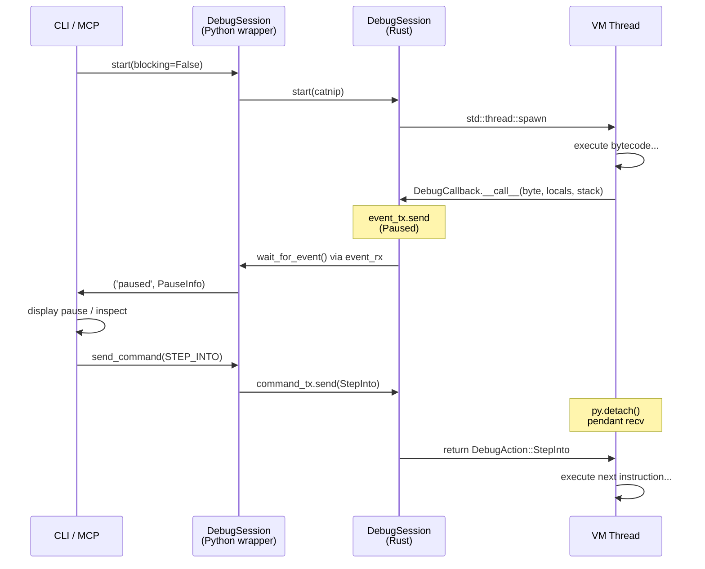

# Debugger

Debugger interactif pour Catnip : breakpoints, stepping et inspection de variables.

## Vue d'ensemble

Le debugger `catnip debug` permet de pauser l'exécution d'un programme Catnip, d'inspecter l'état de la VM instruction
par instruction, et de reprendre à la demande.

Deux modes d'accès :

- **CLI** : console interactive avec commandes textuelles (`catnip debug`)
- **MCP** : 6 tools pour agents (Claude, etc.)

Dans les deux cas, le mécanisme sous-jacent est identique : la VM Rust exécute le code dans un thread, et un callback
bloque l'exécution à chaque breakpoint ou step en attendant la commande suivante.

> Le debugger inspecte l'état de la VM pendant que celle-ci est suspendue. C'est un observateur qui modifie le
> comportement du système par le simple fait de l'observer. Heisenberg aurait approuvé, mais il n'aurait pas pu dire
> exactement où le breakpoint se trouve.

## Utilisation CLI

### Debugger un script

```bash
# Breakpoint à la ligne 5
catnip debug -b 5 script.cat

# Plusieurs breakpoints
catnip debug -b 3 -b 7 -b 15 script.cat

# Code inline
catnip debug -c "x = 10; y = x * 2; y + 1" -b 1
```

### Options

- `-b, --break LINE` : Ajouter un breakpoint (répétable)
- `-c, --command CODE` : Code à débugger (au lieu d'un fichier)

## Commandes interactives

Au point d'arrêt, le prompt `(catnip-dbg:L5) >` attend une commande :

| Commande     | Alias    | Description                                    |
| ------------ | -------- | ---------------------------------------------- |
| `continue`   | `c`      | Reprendre jusqu'au prochain breakpoint         |
| `step`       | `s`      | Pas à pas (entre dans les appels)              |
| `next`       | `n`      | Pas à pas (saute les appels)                   |
| `out`        | `o`      | Sort de la fonction courante                   |
| `break N`    | `b N`    | Ajouter un breakpoint à la ligne N             |
| `rbreak N`   | `rb N`   | Retirer un breakpoint                          |
| `print EXPR` | `p EXPR` | Évaluer une expression dans le scope courant   |
| `vars`       | `v`      | Afficher les variables locales                 |
| `list`       | `l`      | Afficher le source autour de la position       |
| `backtrace`  | `bt`     | Afficher la pile d'appels                      |
| `repl`       |          | Entrer en sous-mode REPL dans le scope courant |
| `quit`       | `q`      | Arrêter l'exécution                            |
| `help`       | `h`      | Aide                                           |

Appuyer sur Entrée sans commande répète le dernier `step`.

### Exemple de session

```bash
$ catnip debug -b 3 factorial.cat
=== Catnip Debugger ===
Paused at line 3, col 5
   2 |    if n <= 1 { 1 }
>  3 |    else { n * factorial(n - 1) }
   4 | }

(catnip-dbg:L3) > v
  n = 5

(catnip-dbg:L3) > p n * 2
  = 10

(catnip-dbg:L3) > s
Paused at line 3, col 5
   2 |    if n <= 1 { 1 }
>  3 |    else { n * factorial(n - 1) }
   4 | }

(catnip-dbg:L3) > bt
  #0 factorial at line 3
  #1 <module> at line 5

(catnip-dbg:L3) > c
Execution finished. Result: 120
```

### Sous-mode REPL

La commande `repl` ouvre un sous-mode interactif dans le scope du frame en pause. Les variables du programme et les
locales du point d'arrêt sont disponibles, et les nouvelles définitions persistent entre les expressions.

Toutes les commandes debug sont disponibles dans le REPL : `v`, `l`, `bt`, `b N`, `rb N`, `h`. Les commandes de
mouvement (`c`, `s`, `n`, `o`) reprennent l'exécution directement depuis le REPL sans repasser par le prompt debug.
Toute entrée non reconnue comme commande est évaluée comme expression Catnip.

```bash
(catnip-dbg:L3) > repl
Entering REPL (type /exit or empty line to return to debugger)
(repl:L3) => n
  5
(repl:L3) => y = n * 2
(repl:L3) => y + 1
  11
(repl:L3) => v
  n = 5
  y = 10
(repl:L3) => bt
  #0 factorial at line 3
  #1 <module> at line 5
(repl:L3) => c
Paused at line 3, col 5
```

Le sous-mode supporte la saisie multiline (brackets, opérateurs de continuation). `print EXPR` (`p EXPR`) évalue une
expression avec préfixe `= ` ; les entrées non reconnues sont évaluées directement. `/exit` ou ligne vide quitte le
REPL.

> En REPL, les commandes courtes (`v`, `l`, `b`) sont prioritaires sur les noms de variables identiques. Pour évaluer
> une variable `v`, taper `p v`.

## Breakpoints dans le code

En plus de l'option `-b` (CLI), on peut placer des breakpoints directement dans le source :

```python
x = 10
breakpoint()  # pause ici
y = x * 2
```

`breakpoint()` est transformé en opcode dédié lors de l'analyse sémantique. La VM intercepte cet opcode et déclenche le
callback debug, exactement comme un breakpoint posé via `-b`.

**Différence** :

- `-b N` : le debugger convertit le numéro de ligne en byte offset via `SourceMap`, puis pose le breakpoint sur la
  première instruction de cette ligne dans la table de lignes du bytecode
- `breakpoint()` : l'opcode est émis directement dans le bytecode par le compilateur

Les deux mécanismes convergent vers le même callback VM.

## Utilisation programmatique

```python
from catnip import Catnip
from catnip.debug import DebugSession

source = """
x = 10
y = x * 2
z = y + 1
"""

catnip = Catnip()
session = DebugSession(catnip, source)
session.add_breakpoint(3)
session.start(blocking=False)

# Attendre le premier événement
event_type, data = session.wait_for_event(timeout=10)
# event_type == 'paused', data == PauseInfo(line=3, ...)

print(data.locals)  # {'x': 10, 'y': 20}
print(data.snippet)  # source autour de la ligne 3

# Reprendre
session.send_command('continue')
event_type, data = session.wait_for_event(timeout=10)
# event_type == 'finished', data == 21
```

### API

- `DebugSession(catnip, source)` : crée une session
- `session.add_breakpoint(line)` / `session.remove_breakpoint(line)` : gestion breakpoints (1-indexed)
- `session.start(blocking=False)` : lance l'exécution en thread background
- `session.wait_for_event(timeout)` : attend `('paused', PauseInfo)`, `('finished', result)` ou `('error', exception)`
- `session.send_command(action)` : envoie `'continue'`, `'step_into'`, `'step_over'` ou `'step_out'`
- `session.state` : `DebugState.IDLE`, `RUNNING`, `PAUSED`, `FINISHED` ou `ERROR`
- `session.last_pause` : dernier `PauseInfo` ou `None`

## Intégration MCP

Le serveur MCP expose 6 tools pour piloter le debugger depuis un agent :

| Tool               | Description                                       | Paramètres                                  |
| ------------------ | ------------------------------------------------- | ------------------------------------------- |
| `debug_start`      | Démarre une session, retourne l'état au 1er arrêt | `code`, `breakpoints[]`                     |
| `debug_continue`   | Reprend jusqu'au prochain breakpoint              | `session_id`                                |
| `debug_step`       | Step into/over/out                                | `session_id`, `mode` (into/over/out)        |
| `debug_inspect`    | Inspecte les variables locales au point de pause  | `session_id`                                |
| `debug_eval`       | Évalue une expression dans le scope courant       | `session_id`, `expr`                        |
| `debug_breakpoint` | Ajoute ou retire un breakpoint                    | `session_id`, `line`, `action` (add/remove) |

### Workflow type

```
debug_start(code="...", breakpoints=[3])
  ⇒ { session_id: "dbg-1", status: "paused", line: 3, locals: {x: 10} }

debug_eval(session_id="dbg-1", expr="x * 2")
  ⇒ { result: "20" }

debug_step(session_id="dbg-1", mode="over")
  ⇒ { status: "paused", line: 4, locals: {x: 10, y: 20} }

debug_continue(session_id="dbg-1")
  ⇒ { status: "finished", result: "21" }
```

Les sessions MCP sont indépendantes : chaque `debug_start` crée une nouvelle session avec son propre thread VM.

## Architecture interne



### Channels Rust

Le debugger utilise deux threads communicant par `std::sync::mpsc` :

- **Main thread** : console interactive (CLI via `run_debugger()`) ou handler MCP (via `DebugSession` wrapper Python)
- **Background thread** : exécution VM (spawné via `Python::attach()`)

Deux channels :

- `event_tx/event_rx` (VM → frontend) : `DebugEvent::Paused`, `Finished`, `Error`
- `command_tx/command_rx` (frontend → VM) : `DebugAction::Continue`, `StepInto`, `StepOver`, `StepOut`

Le `DebugCallback` (Rust `#[pyclass]`) est appelé depuis le thread VM. Il construit un `PauseEvent` avec le GIL, envoie
via `event_tx`, puis libère le GIL (`py.detach()`) pendant `command_rx.recv_timeout(60s)`. Cette libération du GIL
permet au thread console d'acquérir le GIL pour évaluer des expressions (`p expr` via `Python::attach()`).

### SourceMap

La VM travaille en byte offsets (positions dans le source UTF-8). Le `SourceMap` (Rust, expose via PyO3) convertit entre
:

- Numéros de ligne (1-indexed) → byte offsets : `line_to_offset(line)`
- Byte offsets → ligne + colonne : `byte_to_line_col(offset)`
- Byte offsets → snippet source : `get_snippet(start, end, context_lines)`

### Pipeline breakpoint

1. CLI reçoit `-b 5` ou le code contient `breakpoint()`
1. `DebugSession.start()` compile le code et construit la `line_table` (bytecode → source bytes)
1. Pour chaque ligne demandée, trouve le premier byte offset dans la `line_table`
1. Appelle `vm.add_debug_breakpoint(offset)` sur la VM Rust
1. À l'exécution, quand la VM atteint un offset marqué, elle appelle `debug_callback`
1. Le callback envoie un `PauseEvent` via `event_tx`, libère le GIL (`py.detach()`), bloque sur `command_rx` et retourne
   un `DebugAction`

## Limitations

1. **Pas de breakpoints conditionnels** : on ne peut pas écrire `break 5 if x > 10`. Le workaround est d'utiliser
   `if x > 10 { breakpoint() }` dans le code

1. **Pas de watchpoints** : pas de breakpoint sur changement de variable

1. **Timeout** : si la console ne répond pas, le callback attend 5 tentatives de 60 secondes (total 300s) avant de
   continuer automatiquement

1. **VM uniquement** : le debugger nécessite le mode VM (défaut). Le mode est forcé automatiquement au démarrage de la
   session et restauré à la fin

> Le debugger a une patience de 300 secondes. Passé ce délai, il considère que le développeur a abandonné et reprend
> l'exécution de son propre chef. C'est le seul logiciel qui croit en l'autonomie du code plus que l'utilisateur.
