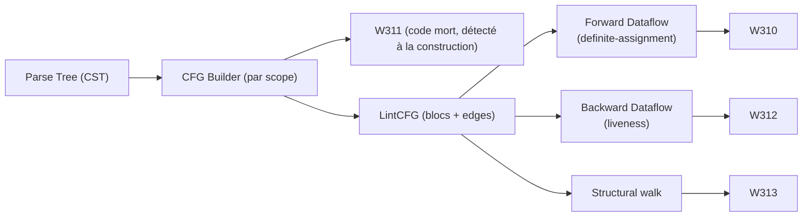

# Linter

Analyse statique du code Catnip : syntaxe, style et sémantique.

## Vue d'ensemble

Le linter `catnip lint` effectue une analyse en quatre phases pour repérer les soucis avant exécution :

1. **Syntaxe** : le code respecte-t-il la grammaire ?
1. **Style** : le formatage suit-il les conventions ?
1. **Sémantique** : les variables sont-elles définies ? Les appels récursifs optimisables ?
1. **Deep** (opt-in) : analyse CFG inter-branches (variable possiblement non initialisée)

Chaque phase peut être exécutée indépendamment ou combinée.

> Le linter ne se contente pas de valider que le code peut s'exécuter. Il vérifie qu'il *mérite* de s'exécuter.

## Utilisation CLI

### Analyse complète

```bash
# Toutes les vérifications (syntaxe + style + sémantique)
catnip lint script.cat

# Dossier (récursif, tous les .cat)
catnip lint src/

# Multiple fichiers ou globs
catnip lint *.cat
catnip lint src/*.cat tests/*.cat
```

Les dossiers sont parcourus récursivement pour trouver les fichiers `.cat`. Les globs ne retiennent que les fichiers
`.cat` (les autres extensions et dossiers sont ignorés). Si aucun fichier `.cat` n'est trouvé, le message
`No .cat files found` est affiché.

### Niveaux de vérification

```bash
# Syntaxe seulement (rapide)
catnip lint -l syntax script.cat

# Style seulement
catnip lint -l style script.cat

# Sémantique seulement
catnip lint -l semantic script.cat

# Tout (défaut)
catnip lint -l all script.cat
```

### Depuis stdin

```bash
# Pipe
echo 'x = y + 1' | catnip lint --stdin

# Fichier via cat
cat script.cat | catnip lint --stdin
```

### Seuils de métriques

```bash
# Ajuster les seuils (0 = désactiver la règle)
catnip lint --max-depth 8 script.cat       # I200: nesting depth (défaut: 5)
catnip lint --max-complexity 15 script.cat  # I201: complexité cyclomatique (défaut: 10)
catnip lint --max-length 50 script.cat      # I202: longueur de fonction (défaut: 30)
catnip lint --max-params 8 script.cat       # I203: nombre de paramètres (défaut: 6)

# Désactiver toutes les métriques
catnip lint --max-depth 0 --max-complexity 0 --max-length 0 --max-params 0 script.cat
```

### Suppression inline (`# noqa`)

Ajouter `# noqa` en fin de ligne pour supprimer les diagnostics sur cette ligne :

<!-- check: no-check -->

```catnip
x = compute()  # noqa           -- supprime tout sur cette ligne
y = value       # noqa: W200    -- supprime W200 seulement
z = other       # noqa: W200, E200  -- supprime plusieurs codes
```

Le commentaire n'affecte que la ligne où il apparaît.

### Désactivation globale par code

Là où `# noqa` agit sur une ligne, `--disable` éteint une règle pour tout le fichier. Plusieurs codes par occurrence
(séparés par des virgules) ou plusieurs occurrences :

```bash
# Taire une règle pour toute l'analyse
catnip lint --disable W401 script.cat

# Plusieurs codes, deux notations équivalentes
catnip lint --disable W401,I200 script.cat
catnip lint --disable W401 --disable I200 script.cat
```

Pour une désactivation persistante, déclarer la liste dans `catnip.toml` :

```toml
[lint]
disable = ["W401", "I200"]
```

`--enable` ré-active un code éteint par le fichier (ou par un `--disable` de la même commande). C'est le seul rôle
d'`--enable` : annuler un `disable`, pas allumer une phase éteinte (`--check-names`, `--deep` restent les leviers des
règles opt-in).

```bash
# Le fichier désactive W401 ; on le veut juste cette fois-ci
catnip lint --enable W401 script.cat
```

L'ensemble effectif des codes tus est `(fichier ∪ --disable) \ --enable`.

> Warning: un code inconnu dans `disable` ne proteste pas. Il attend une règle qui n'existe pas encore.

### Mode strict (gate CI)

Par défaut, seules les erreurs (Exxx) produisent un code de sortie non-zéro — les warnings s'affichent mais laissent
passer. `--strict` promeut les warnings en fatals ; les diagnostics Info et Hint restent consultatifs dans les deux
modes. Même doctrine que `clippy -D warnings` : un gate qui affiche sans échouer n'est pas un gate.

```bash
catnip lint --deep --strict codex/     # échoue au premier warning
```

### Analyse deep (CFG)

```bash
# Activer l'analyse inter-branches (W310, W311, W312, W313)
catnip lint --deep script.cat

# Combinable avec les autres options
catnip lint --deep --max-depth 8 script.cat
```

L'option `--deep` construit un CFG (Control Flow Graph) léger depuis le CST pour détecter des problèmes impossibles à
trouver en analyse linéaire : variables définies dans certaines branches seulement, code mort inter-branches, dead
stores via liveness backward, branches `else` redondantes après un `return`/`raise`.

Cette analyse est opt-in car plus coûteuse que les phases CST-only.

### Mode verbose

```bash
# Affiche "OK" pour les fichiers sans problème
catnip -v lint script.cat
```

## Codes de diagnostic

Les diagnostics suivent une convention de nommage :

- **Exxx** : Erreurs (empêchent l'exécution)
- **Wxxx** : Warnings (problèmes potentiels)
- **Ixxx** : Hints (suggestions d'amélioration)

### Syntaxe (E1xx)

| Code | Sévérité | Description       |
| ---- | -------- | ----------------- |
| E100 | Error    | Erreur de syntaxe |

Le message est contextuel : `Parse failed` si le parser échoue, ou un message précis avec position
(`at line N, column M`) si Tree-sitter localise un nœud `ERROR` dans l'arbre.

```bash
⇒ echo 'x = 1 +' | catnip lint --
<stdin>:1:1: error [E100]: Syntax error at line 1, column 8
```

### Style (W1xx)

| Code | Sévérité | Description                         |
| ---- | -------- | ----------------------------------- |
| W100 | Warning  | Line differs from formatted version |
| W101 | Warning  | Trailing whitespace                 |
| W102 | Info     | Expected N lines, got M             |

W100 compare chaque ligne avec la sortie du formatter Rust. W101 détecte les espaces en fin de ligne. W102 signale un
écart de nombre de lignes entre source et version formatée.

```bash
⇒ echo 'x=1+2  ' | catnip lint -l style --
<stdin>:1:1: warning [W100]: Line differs from formatted version
<stdin>:1:6: warning [W101]: Trailing whitespace
```

### Sémantique - Noms (E2xx/W2xx)

| Code | Sévérité | Description                                               |
| ---- | -------- | --------------------------------------------------------- |
| E200 | Error    | Name 'x' is not defined                                   |
| W200 | Warning  | Variable 'x' is defined but never used (local scope only) |
| W202 | Warning  | Wild import returns None; assignment is useless           |
| W203 | Warning  | Keyword used as variable name                             |

E200 détecte les références à des noms non définis dans le scope courant. W200 signale les variables assignées mais
jamais lues dans un **scope local** (lambda, for, match). Les variables au scope global sont ignorées : elles peuvent
constituer l'API publique d'un module consommée par un appelant externe. Le warning est aussi ignoré si le nom commence
par `_`. W202 avertit qu'assigner le retour d'un `import('...', wild=True)` est inutile puisque le wild import retourne
`None`. W203 avertit si un mot-clé du langage est utilisé comme nom de variable (`if = 5`).

```bash
⇒ echo 'y = x * 2' | catnip lint --
<stdin>:1:5: error [E200]: Name 'x' is not defined
```

```bash
⇒ echo 'f = () => { y = 1; 2 }' | catnip lint --
<stdin>:1:13: warning [W200]: Variable 'y' is defined but never used
```

### Sémantique - Noms suite (W2xx)

| Code | Sévérité | Description                  |
| ---- | -------- | ---------------------------- |
| W201 | Warning  | Parameter is never used      |
| W204 | Warning  | Variable shadows outer scope |

### Control flow (W3xx)

| Code | Sévérité | Description                                            |
| ---- | -------- | ------------------------------------------------------ |
| W300 | Warning  | Unreachable code after return                          |
| W301 | Warning  | Dead branch (condition always True/False)              |
| W302 | Warning  | `while True` without break (infinite loop détectable)  |
| W303 | Info     | Variable de condition de boucle jamais modifiée        |
| W304 | Warning  | Subscript à clé string sous `??`, KeyError non couvert |
| W310 | Warning  | Variable possibly uninitialized (`--deep` requis)      |
| W311 | Warning  | Unreachable code after terminating branches (`--deep`) |
| W312 | Warning  | Dead store: variable écrasée avant lecture (`--deep`)  |
| W313 | Hint     | Branche `else`/`elif` redondante après un exit         |

W300 détecte le code mort après un `return` dans le même bloc. W302 signale les boucles `while True` dont le corps ne
contient pas de `break` (les `break` dans des boucles ou lambdas imbriquées ne comptent pas). W303 complète W302 pour
l'autre forme de boucle qui ne s'arrête jamais : `while running { ... }` où la condition est un seul identifiant que le
corps ne modifie jamais. Périmètre volontairement étroit pour ne jamais crier au loup : le corps ne doit contenir aucun
appel (un closure capturé pourrait muter la variable), aucune lambda, aucun `for`/`match`/`try`, aucune réaffectation de
la variable, ni `break`/`return`/`raise`. Sous ces conditions la condition est invariante.

> Note: une boucle dont la condition ne bouge pas est soit infinie, soit jamais exécutée. Le linter ne sait pas laquelle
> -- les deux méritent un regard.

W304 signale un subscript à clé string en opérande non-final de `??`. L'opérateur ne coalesce que `None` :
`d['k'] ?? defaut` lève quand même `KeyError` si la clé est **absente** -- ce n'est pas un « get avec défaut ». La forme
qui couvre les deux cas (clé absente et valeur nulle) est `d.get('k') ?? defaut`. Tous les opérandes sont vérifiés sauf
le fallback final de la chaîne : dans `a ?? d['k'] ?? x`, l'opérande médian n'est pas protégé par le `?? x` qui le suit,
il est donc signalé. Périmètre volontairement étroit : la règle ne se déclenche que si le dernier membre de l'opérande
est un index à clé string littérale (le pattern d'accès dict) ; les clés calculées et les indices entiers, qui peuvent
viser des listes, ne sont pas signalés.

> Le défaut attend patiemment que la première source réelle omette un champ optionnel. Les jeux de test, eux, ont
> toujours toutes leurs clés.

W201 signale les paramètres de fonction jamais utilisés dans le corps (les paramètres préfixés par `_` et `self` sont
ignorés). Les paramètres lus dans une lambda imbriquée (capture) comptent comme utilisés. W204 détecte les affectations
qui créent une variable locale masquant une variable du scope parent. Le shadowing suppose une frontière de fonction :
une affectation dans un bloc de contrôle (`for`/`match`/`except`) vers une variable de la même fonction est un
write-through (`found = True` dans une boucle mute la variable extérieure), pas un shadow. Au-delà d'une frontière de
fonction (closure), l'heuristique distingue une mutation de capture qui relit le nom (`x = x + 1`) d'un vrai shadowing.
W301 signale les branches mortes quand la condition d'un `if` est un littéral booléen (`if True` / `if False`).

W310 détecte les variables définies dans certaines branches d'un `if`/`elif`/`match` mais pas toutes, puis lues après le
point de jonction. La détection vaut aussi quand le contrôle de flux est en position de valeur (un
`if`/`match`-expression comme membre droit) et pour le court-circuit `and`/`or`, dont le membre droit n'est évalué que
conditionnellement : une variable écrite seulement par ce membre déclenche W310 si elle est lue ensuite. Les cibles
d'affectation dans un `with` ou un bloc-expression (`r = { x = 10; x }`) comptent comme des définitions, et un nom de
kwarg (`f(nom=v)`) n'est pas une lecture de variable : ni l'un ni l'autre ne produit de faux W310. Nécessite `--deep`
car l'analyse construit un CFG et calcule un point fixe de dataflow (forward definite-assignment). Les variables jamais
définies nulle part ne déclenchent pas W310 (c'est le rôle de E200).

W311 détecte le code inatteignable après des branches qui terminent toutes : si chaque branche d'un `if`/`match`
contient un `return` ou `raise`, le code qui suit le bloc ne sera jamais exécuté. Complémente W300 (code mort intra-bloc
après un `return` isolé) en couvrant le cas inter-branches.

W312 détecte les dead stores : une variable assignée puis écrasée sans lecture intermédiaire. L'analyse est une liveness
backward sur le CFG, étendue à chaque corps de lambda (chaque scope reçoit son propre CFG). Une variable jamais lue
nulle part est ignorée (c'est W200, pas W312). Les bindings implicites (variable de boucle `for`, pattern de `match`,
binding d'`except`) ne déclenchent pas W312.

W313 signale les `elif`/`else` rendus redondants par une branche précédente qui termine toujours (return / raise / break
/ continue). Severity `hint` car la réécriture est typiquement une refactorisation en guard clause. Les cas où toutes
les branches terminent (`if X { return } else { return }`) ne sont pas signalés -- la simplification ne gagne rien.

```bash
⇒ echo 'f = () => { return 1; x = 2 }' | catnip lint --
<stdin>:1:23: warning [W300]: Unreachable code after return
```

```bash
⇒ echo 'f = (x, y) => { x + 1 }' | catnip lint --
<stdin>:1:8: warning [W201]: Parameter 'y' is never used
```

```bash
⇒ printf 'if cond { x = 1 }\nprint(x)' | catnip lint --deep --
<stdin>:2:7: warning [W310]: Variable 'x' may be uninitialized (defined in some branches only)
```

```bash
⇒ printf 'x = 1\nx = 2\nprint(x)' | catnip lint --deep --stdin
<stdin>:1:1: warning [W312]: dead store: 'x' is overwritten before being read
```

```bash
⇒ printf 'f = () => { if cond { return 1 } else { do(x) } }' | catnip lint --deep --stdin
<stdin>:1:34: hint [W313]: redundant else: previous branch always exits; flatten this block to the enclosing scope
```

```bash
⇒ printf 'while running {\n    x = 1\n}' | catnip lint --stdin
<stdin>:1:1: info [W303]: Loop condition 'running' is never modified in the body; the loop cannot terminate normally
```

```bash
⇒ echo "cover = item.properties['eo:cloud_cover'] ?? 100" | catnip lint --stdin
<stdin>:1:9: warning [W304]: '??' only coalesces None: ['eo:cloud_cover'] still raises KeyError when the key is missing
```

### Patterns avancés (W4xx)

| Code | Sévérité | Description                                     |
| ---- | -------- | ----------------------------------------------- |
| W401 | Warning  | Effet de bord (builtin impur) dans un broadcast |

W401 signale l'appel d'un builtin à effet de bord à l'intérieur d'un broadcast (`data.[print(_)]`), **uniquement quand
le fichier active un mode ND parallèle** via `pragma("nd_mode", ND.thread)` ou `ND.process`. Par défaut le broadcast est
séquentiel : l'ordre est défini, et un `data.[(x) => { print(x) }]` est parfaitement valide. Sous thread/process, en
revanche, l'opération s'exécute par élément dans un ordre non spécifié (GIL relâché, voire vrais processus) : y glisser
une entrée/sortie donne un résultat dont l'ordre n'est pas garanti. La règle s'en tient à une liste fermée de builtins
sans ambiguïté (`print`, `input`, `open`, `breakpoint`) ; les fonctions utilisateur et les builtins purs ne sont jamais
signalés.

> Un effet de bord broadcasté en parallèle, c'est demander à N copies de soi d'écrire dans le même journal sans se
> concerter. En séquentiel elles font la queue ; en thread, non.

```bash
⇒ printf 'pragma("nd_mode", ND.thread)\nnums.[print(_)]' | catnip lint --stdin
<stdin>:2:7: warning [W401]: Side effect in broadcast: 'print' is impure; it runs per element in unspecified order
```

### Sémantique - Types (E3xx)

| Code | Sévérité | Description                                                                    |
| ---- | -------- | ------------------------------------------------------------------------------ |
| E300 | Error    | Type mismatch entre une annotation et une valeur prouvablement d'un autre type |

E300 vérifie les annotations de type optionnelles (`x: int`) là où l'incompatibilité est **prouvable** -- valeur
littérale ou type inféré concret. Sites couverts :

- défaut de paramètre vs annotation (`(x: int = "no")`) ;
- défaut de champ de struct vs annotation (`struct P { x: int = "no" }`) ;
- type de retour déclaré vs type produit par le corps (`(): int => { "no" }`, en déballant un `return` terminal) ;
- argument vs paramètre **au site d'appel** d'une fonction à liaison prouvablement unique (`f("no")`), positionnels et
  par mot-clé (`f(x="no")`) ;
- argument vs champ **au constructeur d'un struct** (`P(1, "no")`).

La vérification des appels est **monomorphe** : elle ne s'applique qu'aux cibles statiquement uniques (une fonction
assignée une seule fois, jamais réassignée, jamais passée comme valeur ni masquée par un paramètre). Les arguments
absorbés par un `*args` ne sont pas vérifiés ; omettre un paramètre à défaut ne déclenche aucune erreur d'arité.

L'analyse est volontairement sound (zéro faux positif) : les primitifs, les types nominaux (enum/union/struct) et les
composites `list[T]`/`dict[K, V]` (conteneur et paramètres) sont modélisés ; un composite non modélisé ou un type
inconnu (`set[int]`) ne déclenche jamais E300. Une annotation ne sert pas qu'à E300 : elle alimente aussi l'inférence du
scrutinee de `match` (voir I103).

```bash
⇒ echo 'f = (x: int = "no") => { 0 }' | catnip lint --
<stdin>:1:5: error [E300]: Type mismatch: parameter 'x' declared 'int' but value has type 'str'

⇒ printf 'f = (x: int) => { x }\nf("no")\n' | catnip lint --
<stdin>:2:1: error [E300]: argument 'x' of 'f' expects 'int' but got 'str'
```

### Hints (Ixxx)

| Code | Sévérité | Description                                           |
| ---- | -------- | ----------------------------------------------------- |
| I100 | Hint     | Recursive call to 'f' is not in tail position         |
| I101 | Hint     | Redundant comparison with boolean literal             |
| I102 | Hint     | Self-assignment has no effect                         |
| I103 | Hint     | Non-exhaustive match (missing variants or catch-all)  |
| I200 | Hint     | Nesting depth exceeds threshold (default: 5)          |
| I201 | Hint     | Function cyclomatic complexity exceeds threshold (10) |
| I202 | Hint     | Function has too many statements (default: 30)        |
| I203 | Hint     | Function has too many parameters (default: 6)         |

I100 détecte les appels récursifs qui ne sont pas en position terminale et ne bénéficient donc pas du TCO (Tail Call
Optimization). I101 signale les comparaisons inutiles avec `True`/`False` (ex: `x == True` -> `x`). I102 repère les
auto-assignations (`x = x`).

I200 signale les structures de contrôle imbriquées au-delà du seuil (if, while, for, match, try). La profondeur se remet
à zéro aux limites de chaque fonction. I201 mesure la complexité cyclomatique par fonction : chaque branche (if, elif,
while, for, `and`, `or`) et chaque case d'un match (sauf le premier) ajoutent 1 au compteur. Les lambdas imbriquées sont
comptées séparément. I202 compte les statements directs dans le corps d'une fonction. I203 compte les paramètres d'une
fonction (`self` exclu pour les méthodes).

I103 vérifie l'exhaustivité des `match`. Quand le type du scrutinee est inférable (enum, union taggée, booléen), le
message liste les variantes manquantes (`Non-exhaustive match on union 'Option'; missing: None`) ; dans une méthode
d'union, `self` est typé comme l'union déclarante, donc `match self` est vérifié avec la même précision. Une annotation
de type étend cette inférence : un paramètre annoté (`(c: Color) => match c`) et un champ de struct typé (`match p.x`)
fournissent le type du scrutinee de la même façon. Sinon, la règle signale un `match` sans branche catch-all (`_` ou
variable nue sans guard). Voir [UNIONS](../lang/UNIONS.md#exhaustivit%C3%A9-linter) pour les règles d'inférence du
scrutinee.

```bash
⇒ echo 'f = (n) => { 1 + f(n - 1) }' | catnip lint --
<stdin>:1:14: hint [I100]: Recursive call to 'f' is not in tail position - consider restructuring for TCO
```

```bash
⇒ echo 'x = x' | catnip lint --
<stdin>:1:1: hint [I102]: Self-assignment has no effect
```

## Exemples pratiques

### Code avec erreur de syntaxe

```bash
⇒ cat broken.cat
factorial = (n) => {
    if n <= 1 { 1 }
    else { n * factorial(n - 1)  # missing }
}

⇒ catnip lint broken.cat
broken.cat:3:1: error [E100]: Syntax error at line 3, column ...
```

### Code avec problèmes sémantiques

```bash
⇒ cat issues.cat
compute = (x) => {
    y = x + 1
    temp = z * 2
    y
}

⇒ catnip lint issues.cat
issues.cat:3:12: error [E200]: Name 'z' is not defined
issues.cat:3:5: warning [W200]: Variable 'temp' is defined but never used
```

### Code propre

```bash
⇒ cat clean.cat
factorial = (n) => {
    if n <= 1 { 1 }
    else { n * factorial(n - 1) }
}
print(factorial(5))

⇒ catnip -v lint clean.cat
clean.cat: OK

No issues found
```

## Intégration CI/CD

### GitHub Actions

```yaml
name: Lint
on: [push, pull_request]

jobs:
  lint:
    runs-on: ubuntu-latest
    steps:
      - uses: actions/checkout@v4
      - uses: actions/setup-python@v5
        with:
          python-version: '3.12'
      - run: pip install catnip
      - run: catnip lint src/*.cat
```

### GitLab CI

```yaml
lint:
  image: python:3.12
  script:
    - pip install catnip
    - catnip lint **/*.cat
```

### Pre-commit hook

`.git/hooks/pre-commit` :

```bash
#!/bin/bash
for file in $(git diff --cached --name-only --diff-filter=ACM | grep '\.cat$'); do
    if ! catnip lint -l syntax "$file"; then
        echo "Lint failed for $file"
        exit 1
    fi
done
```

## Utilisation programmatique

### API simple

```python
from catnip.tools import lint_code, lint_file

# Depuis une string
result = lint_code('x = y + 1')
print(result.has_errors)  # True
print(result.summary())   # "1 error"

for diag in result.diagnostics:
    print(f"{diag.line}:{diag.column} [{diag.code}] {diag.message}")

# Depuis un fichier
from pathlib import Path
result = lint_file(Path('script.cat'))
```

### Configuration fine

```python
from catnip.tools import lint_code

# Syntaxe seulement
result = lint_code(source, check_syntax=True, check_style=False, check_semantic=False)

# Style seulement
result = lint_code(source, check_syntax=False, check_style=True, check_semantic=False)

# Tout (défaut)
result = lint_code(source)

# Analyse deep (CFG)
result = lint_code(source, check_ir=True)

# Seuils personnalisés (0 = désactivé)
result = lint_code(source, max_nesting_depth=8, max_cyclomatic_complexity=15)
result = lint_code(source, max_function_length=50, max_parameters=10)
```

### Accès aux diagnostics

```python
from catnip._rs import Severity

result = lint_code(source)

# Filtrer par sévérité
errors = result.errors      # Severity.Error
warnings = result.warnings  # Severity.Warning

# Filtrer par code (string)
undefined = [d for d in result.diagnostics if d.code == "E200"]

# Chaque diagnostic expose : code, message, severity, line, column,
# source_line (optionnel), suggestion (optionnel)
for diag in result.diagnostics:
    print(diag)  # "1:5: error [E200]: Name 'x' is not defined"
```

## Architecture interne

Le linter est implémenté en Rust (`catnip_tools/src/linter/`) avec un wrapper Python léger (`catnip/tools/linter.py`).
Les quatre phases s'exécutent séquentiellement dans le même appel Rust ; l'analyse sémantique (phase 3) et les
suggestions (phase 4) vivent dans les sous-modules `semantic.rs` et `improvements.rs`.

### Phase 1 : Analyse syntaxique


Utilise le parser Tree-sitter avec la grammaire compilée. Les nœuds `ERROR` dans l'arbre sont convertis en diagnostics
E100.

Si cette phase échoue (erreurs critiques), les phases suivantes sont ignorées.

### Phase 2 : Analyse stylistique


Compare le code source avec sa version formatée par le formatter Rust. Les différences génèrent des warnings W1xx.

Détection additionnelle :

- Trailing whitespace (scan par ligne)
- Écart de nombre de lignes (source vs formaté)

### Phase 3 : Analyse sémantique (CST walk)


Parcourt le CST (Concrete Syntax Tree) directement en Rust avec un `ScopeTracker` qui :

- Maintient une pile de `ScopeFrame` (un frame par scope : lambda, for, match/case, except, with)
- Chaque frame contient ses propres `names`, `definitions` et `used`
- Distingue le genre de chaque définition via `DefKind` (Local, Param, VariadicParam, ForVar, MatchVar, WithVar,
  ExceptVar)
- Émet les diagnostics W200/W201 au `pop_scope()` (par frame, pas globalement)
- Résout `use_name()` en remontant la pile de scopes vers le parent
- Reconnaît les noms importés via `import('mod', 'name')` et les alias `import('mod', 'name:alias')`
- Pour les affectations : collecte les LHS d'abord, analyse le RHS, puis distingue shadowing (`W204`) vs mutation de
  capture selon que le RHS lit la variable du scope parent

La liste des builtins connus est générée automatiquement depuis `context.py` (source de vérité) par
`catnip_tools/gen_builtins.py`. Les builtins ne déclenchent pas d'erreur E200. `make check-builtins` vérifie la
synchronisation en CI.

### Phase 4 : Suggestions d'amélioration

Passes globales sur le CST, indépendantes de l'analyse sémantique :

- Appels récursifs hors position terminale (I100)
- Comparaisons redondantes avec booléens (I101)
- Auto-assignations (I102)
- Branches mortes sur conditions littérales (W301)
- Boucles infinies détectables (W302)
- Code mort après return (W300)
- Métriques : profondeur de nesting (I200), complexité cyclomatique (I201), longueur de fonction (I202), nombre de
  paramètres (I203), match sans catch-all (I103)

### Phase 5 : Analyse deep (CFG)



Activée par `--deep` / `check_ir=True`. Construit un CFG léger directement depuis le CST tree-sitter (pas depuis l'IR du
semantic analyzer), un par scope : top-level + chaque corps de lambda + chaque corps de méthode (les paramètres, `self`
inclus, sont seedés comme defs implicites dans le block entry du sous-scope). Chaque bloc trace les variables définies
(`defs` avec byte offset pour l'ordre intra-bloc), lues (`reads`) et écrites en ordre source (`writes`, séparé pour la
liveness) ; les edges discriminent `CondTrue`/`CondFalse`/`LoopBack`/`LoopExit`/`Exception`.

L'analyse forward calcule un point fixe de definite-assignment : pour chaque bloc, l'ensemble des variables définies sur
tous les chemins entrants. Une lecture hors de cet ensemble déclenche W310. L'analyse backward calcule la liveness
`live_in = use ∪ (live_out \ def)`, puis pour chaque write explicit dont la variable n'est pas live après, émet W312.
W313 est un check structurel pur sur le CST (sans dataflow) : il regarde si une branche `then`/`elif` termine toujours
(return/raise/break/continue, récursif dans if/match) et signale les branches suivantes qui ne terminent pas.

**Captures dans les sous-scopes** : un corps de lambda peut référencer une variable du scope parent. Pour éviter des
faux positifs W310 sur `inc = () => { count = count + 1 }`, chaque sub-CFG identifie les captures via une **triple
condition** :

1. la première occurrence du nom en ordre source dans le sub-CFG est une **lecture** ;
1. le nom est **effectivement défini** dans un scope englobant (`parent_visible`) ;
1. SOIT le sous-scope n'écrit jamais ce nom (capture pure read-only), SOIT au moins une écriture de ce nom dans le
   sous-scope est **self-référentielle** (sa RHS lit le même nom, pattern `x = x + 1`).

Les conditions (2) et (3) éliminent deux pièges. (2) évite la suppression silencieuse des read-before-def quand rien
n'existe dans le parent : `f = () => { print(x); x = 1 }` → `x` absent du parent → pas classé capture → W310 fire. (3)
aligne le linter sur la sémantique de scoping Python-like : `b = () => { print(x); x = 2 }` où `x = 2` n'a pas `x` dans
la RHS est un shadow local pour tout le scope ; le `print(x)` est alors un vrai read-before-local-def, W310 fire. À
l'inverse `inc = () => { count = count + 1 }` a une écriture self-référentielle → capture mutation confirmée → seedé.
`parent_visible` se calcule en remontant depuis le body via `Node::parent()` : à chaque ancêtre on cumule les params
(lambda ou méthode) ou les bindings (assignment LHS, for-var, pattern, except, struct/trait) en excluant les sous-arbres
déjà traversés et les corps des **autres** fonctions (leurs défs internes ne sont pas visibles). Les captures retenues
sont seedées comme defs implicites du block entry (W310 silencieux) et exclues des candidats W312 (la mutation propage
vers le parent). Le critère ne s'applique pas au root : `print(x); x = 1` au module reste un W310. Les bindings de
pattern et de paramètre sont séquencés à la fin du node de leur déclaration, pas à la fin du case clause ou de la
lambda, pour qu'une lecture en aval ne les fasse pas passer pour captures.

> Ce CFG est distinct du CFG/SSA utilisé par l'optimiseur (`catnip_core/src/cfg/`). L'optimiseur travaille sur l'IR
> après semantic analysis. Le linter travaille sur le CST avant toute transformation.

## Différences avec l'exécution

| Aspect                      | Linter                          | Runtime                         |
| --------------------------- | ------------------------------- | ------------------------------- |
| **Variables non définies**  | Détecté statiquement (E200)     | `CatnipNameError` à l'exécution |
| **Variables non utilisées** | Warning W200/W201 (local scope) | Ignoré                          |
| **Code mort**               | W300, W301, W311 (--deep)       | Ignoré                          |
| **Init partielle**          | W310 (--deep, inter-branches)   | `NameError` à l'exécution       |
| **Dead store**              | W312 (--deep, liveness)         | Ignoré                          |
| **Guard clause**            | W313 (--deep, hint)             | Ignoré                          |
| **Complexité**              | Hints I200/I201/I202            | Pas de limite                   |
| **Tail position**           | Hint I100                       | TCO appliqué silencieusement    |
| **Performance**             | Rapide (pas d'exécution)        | Dépend du code                  |

Le linter détecte les problèmes *certains* (variables non définies, code mort après return) et les problèmes *probables*
(variables non utilisées, shadowing). Il ne peut pas détecter les erreurs qui dépendent des valeurs runtime.

## Limitations

1. **Analyse de flux opt-in** : L'analyse inter-branches (`--deep`) détecte les variables partiellement initialisées
   (W310) mais reste conservative : elle ne track pas les valeurs, seulement les définitions

1. **Pas d'inférence de types** : L'analyse de types est minimale, pas de système de types complet

1. **Modules externes** : Les modules chargés via `import('feature')` ne sont pas analysés

1. **Mutation de capture** : La distinction shadowing vs mutation repose sur une heuristique (le RHS lit-il la variable
   parente ?). Certains patterns indirects peuvent être mal classés

> Ces limitations reflètent un choix : mieux vaut un linter rapide avec quelques faux négatifs qu'un analyseur complet
> qui prend 10 secondes sur chaque fichier.
