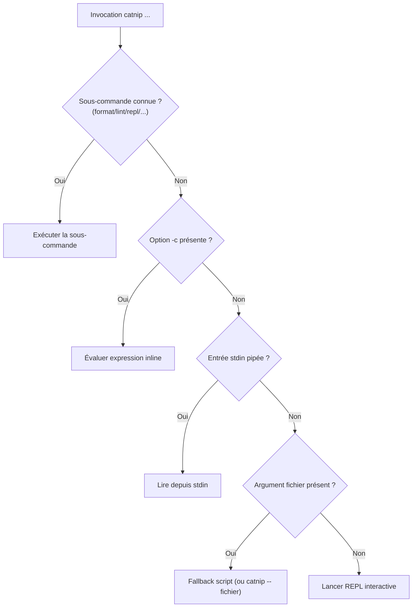

# CLI

Guide pratique de la ligne de commande Catnip.

> Console basse friction : des flags comme vecteurs de trajectoire.

## Quand utiliser la CLI ?

La CLI Catnip sert surtout à deux usages :

### 1. Développement et Exploration (REPL)

- **Tester la syntaxe** Catnip interactivement
- **Débugger** des expressions et scripts
- **Explorer** les fonctionnalités du langage
- **Prototyper** rapidement des transformations

```bash
catnip  # Lance REPL
```

### 2. Scripts de Traitement de Données

- **Scripts one-off** de transformation de données
- **Configuration DSL** chargée depuis fichiers
- **Automatisation** de tâches simples

```bash
catnip transform_data.cat
```

### Note importante : Embedded vs Standalone

**Si tu écris beaucoup de scripts Catnip standalone** → c'est souvent un signe que **Python sera plus adapté**.

Catnip est avant tout un **moteur embedded** :

| Use Case                                      | Recommandation                                          |
| --------------------------------------------- | ------------------------------------------------------- |
| Règles métier modifiables par administrateurs | **Embedded** - Stockez scripts en DB, exécutez dans app |
| Sandbox pour scripts utilisateur              | **Embedded** - Isolation + APIs exposées                |
| Pipelines ETL configurables                   | **Embedded** - Workflows définis par utilisateurs       |
| Script de traitement ponctuel                 | **Standalone possible**, mais Python souvent meilleur   |
| Application complète en Catnip                | **Pas le bon outil** - Utilisez Python                  |

**Règle empirique** : si ton script Catnip dépasse ~200 lignes ou demande des imports compliqués, il vaut mieux basculer
sur Python et garder Catnip pour les parties configurables.

Voir [`docs/examples/embedding/`](../examples/embedding/) pour patterns d'intégration.

______________________________________________________________________

## Modes d'Exécution

### Runtime Rust Standalone (catnip-standalone)

Catnip fournit aussi un binaire Rust standalone qui embarque Python :

```bash
# Installation (depuis source uniquement)
cd catnip
make install-bins  # Installe catnip-standalone + catnip-repl

# Utilisation (mêmes options que CLI Python)
catnip-standalone script.cat
catnip-standalone -c "2 + 3"
echo "x = 10; x * 2" | catnip-standalone --stdin

# Version
catnip-standalone --version
```

**Caractéristiques** :

- VM avec JIT
- Startup rapide pour scripts
- Pas de dépendance Python système

**Note** : les binaires standalone ne sont pas inclus dans les wheels PyPI (manylinux) à cause des limites du Python
statique. Ils sont disponibles via :

- Installation locale : `make install-bins`
- GitHub releases : binaires précompilés par plateforme
- Cargo : `cargo install --path catnip_rs --bin catnip-standalone --features embedded`

Voir `docs/user/STANDALONE.md` pour détails.

### REPL Interactif

Lance une session interactive (mode par défaut) :

```bash
catnip
```

La REPL maintient un contexte persistant entre les commandes :

```bash
$ catnip
```

<!-- check: no-check -->

```catnip
▸ x = 10
▸ x * 2
20
▸ factorial = (n) => { if (n <= 1) { 1 } else { n * factorial(n-1) } }
▸ factorial(5)
120
```

### Exécution de Script

#### Forme courte (fallback automatique)

```bash
catnip script.cat
```

Si l'argument n'est pas une sous-commande reconnue (`format`, `lint`), Catnip l'interprète comme un fichier à exécuter.

#### Forme explicite (avec `--`)

```bash
catnip -- script.cat
```

Le séparateur `--` force l'interprétation comme fichier, levant toute ambiguïté. Utile si un fichier s'appelle `format`
ou `lint`.

#### Avec options

```bash
# TCO activé
catnip -o tco:on script.cat

# Mode verbeux
catnip -v script.cat

# Multiple options
catnip -o tco:on -v --no-color script.cat
```

### Évaluation de Commande

Évalue une expression et affiche le résultat :

```bash
catnip -c "2 + 3 * 4"
# Output: 14

catnip -c "debug(42)"
# Output: 42

catnip -c "x = 10; x * 2"
# Output: 20
```

### Mode Pipe (stdin)

Lit depuis l'entrée standard :

```bash
echo "10 * 2" | catnip
# Output: 20

cat script.cat | catnip

# Avec options
echo "factorial(10)" | catnip -o tco:on
```

## Options Globales

### Configuration

#### `--config FILE`

Utilise un fichier de configuration alternatif :

```bash
# Utiliser une config custom
catnip --config my-catnip.toml script.cat

# Afficher la config utilisée
catnip --config my-catnip.toml config show

# Formatter avec config custom
catnip --config my-catnip.toml format code.cat
```

Par défaut, Catnip charge `~/.config/catnip/catnip.toml`. L'option `--config` permet de spécifier un fichier alternatif,
utile pour :

- Configs par projet (versionner `catnip.toml` dans git)
- Environnements différents (dev, staging, prod)
- Tests avec différentes configurations

Voir [Configuration](#config) pour le format du fichier.

### Options de Parsing

#### `-p, --parsing LEVEL`

Niveau de parsing (0-3, défaut : 3) :

- `0` : Parse tree Tree-sitter (arbre brut)
- `1` : IR après transformer
- `2` : IR exécutable après analyse sémantique
- `3` : Exécute et affiche le résultat (défaut)

```bash
# Afficher l'IR
catnip -p 1 -c "2 + 3"

# Afficher l'IR optimisé
catnip -p 2 script.cat
```

**Note** : Cette option est principalement destinée au développement du langage et à l'inspection des résultats des
optimiseurs. Les utilisateurs finaux n'ont généralement pas besoin de modifier cette valeur (utiliser la valeur par
défaut `3`).

### Options d'Optimisation

#### `-o, --optimize OPT`

Active des optimisations (peut être utilisé plusieurs fois) :

**TCO (Tail-Call Optimization)** :

```bash
# Active TCO
catnip -o tco script.cat
catnip -o tco:on script.cat

# Désactive TCO
catnip -o tco:off script.cat
```

**Niveau d'optimisation** (défaut: `3` - optimisations complètes) :

```bash
catnip -o level:0 script.cat      # Aucune optimisation
catnip -o level:3 script.cat      # Toutes (défaut)
```

Niveaux, alias et détails : voir [Pragmas](../lang/PRAGMAS.md).

**Memory guard** (défaut: `2048` MB) :

```bash
catnip -o memory:4096 script.cat  # Limite 4 Go
catnip -o memory:0 script.cat     # Désactive le guard
```

La VM vérifie périodiquement le RSS du processus et lève `MemoryError` si la limite est dépassée. Actif par défaut à
2048 MB, Linux uniquement (no-op sur autres plateformes). Voir [VM](../dev/VM.md#memory-guard).

### Options de Chargement de Modules

#### `-m, --module MODULE`

Charge un module Python comme namespace global :

```bash
# Module installé
catnip -m math script.cat
# Dans le script : math.sqrt(16)

# Plusieurs modules
catnip -m math -m random script.cat
# Dans le script : math.sqrt(16), random.random()
```

Pour des alias ou du chargement par chemin, utiliser le builtin `import()` dans le code :

<!-- check: no-check -->

```catnip
m = import("math")
host = import("./host.py")
tools = import("./tools.cat")
```

Voir `docs/user/MODULE_LOADING.md` pour les details.

#### `--policy-file FILE --policy PROFILE`

Charge une policy de modules depuis un fichier TOML externe avec un profil nommé :

```bash
catnip --policy-file policies.toml --policy sandbox script.cat
catnip --policy-file policies.toml --policy sandbox -c 'import("os")'
# => CatnipRuntimeError: module 'os' blocked by policy
```

Les deux flags sont requis ensemble. La policy CLI prend priorité sur la section `[modules]` de `catnip.toml`.

Voir `docs/user/MODULE_LOADING.md` pour le format du fichier et l'API Python.

### Options de Debug

#### `-v, --verbose`

Affiche les étapes détaillées du pipeline :

```bash
catnip -v script.cat
```

#### `--format FORMAT`

Format de sortie pour les niveaux de parsing 1-2 :

- `text` : JSON compact lisible (défaut) - primitives aplaties, métadonnées optionnelles omises
- `json` : JSON serde complet - chaque valeur wrappée dans un tagged enum, tous les champs présents
- `repr` : `repr()` Python - ancien format pformat, utile pour inspecter les objets Python bruts

```bash
# Défaut : compact JSON (lisible, parseable)
catnip -p 1 -c "2 + 3"

# JSON serde complet (pour analyse programmatique)
catnip -p 1 --format json -c "2 + 3"

# Ancien repr Python
catnip -p 1 --format repr -c "2 + 3"
```

Le format compact (défaut) produit du JSON lisible et parseable :

```json
[
  {
    "op": "Add",
    "args": [2, 3],
    "kwargs": {}
  }
]
```

Les champs `args` et `kwargs` sont toujours présents (même vides) pour diagnostiquer les bugs du parser. Les champs
`tail` et `pos` sont omis quand ils valent respectivement `false` et `[0, 0]`.

Le format `json` expose la structure serde complète (tagged enums, tous les champs) :

```json
[{
  "Op": {
    "opcode": "Add",
    "args": [{"Int": 2}, {"Int": 3}],
    "kwargs": {},
    "tail": false,
    "start_byte": 0,
    "end_byte": 5
  }
}]
```

La sortie est du JSON valide dans les deux cas, utilisable par pipe :

```bash
catnip -p 1 -c "2 + 3" | python -c "import sys,json; print(json.load(sys.stdin))"
```

**Note** : `--format` n'affecte que les niveaux de parsing 1 et 2. Le niveau 0 (parse tree) utilise toujours le format
texte Tree-sitter, et le niveau 3 (exécution) affiche le résultat.

#### `--theme THEME`

Sélectionne le thème de couleurs :

- `auto` : détecte le fond du terminal (défaut)
- `dark` : palette pour fond sombre
- `light` : palette pour fond clair

```bash
# Forcer le thème clair
catnip --theme light script.cat

# Forcer le thème sombre
catnip --theme dark script.cat
```

La détection automatique utilise `COLORFGBG` (xterm, rxvt, Konsole). Si la variable n'est pas définie, le thème sombre
est utilisé par défaut.

#### `--no-color`

Désactive la sortie colorée :

```bash
catnip --no-color script.cat
```

#### `--no-cache`

Désactive le cache disque de compilation (parsing et bytecode). Par défaut, le cache est **activé** et stocke les
résultats de parsing dans `~/.cache/catnip/` pour accélérer les exécutions suivantes.

```bash
# Exécuter sans utiliser le cache
catnip --no-cache script.cat

# Utile pour forcer une recompilation
catnip --no-cache -c "2 + 2"
```

**Par défaut** : Le cache est activé. Chaque script parsé est mis en cache avec sa configuration (niveau d'optimisation,
TCO, etc.).

**Désactivation persistante** : Via variable d'environnement (`CATNIP_CACHE=off`) ou config (fichier `catnip.toml`).

## Variables d'environnement

### Configuration

| Variable          | Description                                         | Valeurs                                               |
| ----------------- | --------------------------------------------------- | ----------------------------------------------------- |
| `CATNIP_CACHE`    | Active/désactive le cache disque                    | `off`, `false`, `0`, `no` pour désactiver             |
| `CATNIP_OPTIMIZE` | Options d'optimisation (même syntaxe que `-o`)      | `jit`, `tco:off`, `level:2`, combinables avec virgule |
| `CATNIP_EXECUTOR` | Mode d'exécution                                    | `vm` (défaut), `ast`                                  |
| `CATNIP_PATH`     | Répertoires de recherche pour `import()` (noms nus) | chemins séparés par `:` (ajoutés après CWD)           |
| `CATNIP_THEME`    | Thème de couleurs                                   | `auto` (défaut), `dark`, `light`                      |
| `CATNIP_DEV`      | Compilation rapide (profil `fastdev`)               | `1` pour activer                                      |
| `NO_COLOR`        | Désactive les couleurs (standard freedesktop.org)   | toute valeur non vide                                 |

**Hiérarchie de priorité** (croissante) :

```
défauts → catnip.toml → variables d'environnement → options CLI
```

```bash
# Activer JIT et réduire le niveau d'optimisation
CATNIP_OPTIMIZE=jit,level:2 catnip script.cat

# CLI override l'environnement
CATNIP_OPTIMIZE=jit catnip -o jit:off script.cat  # JIT désactivé

# Voir les sources des valeurs
catnip config show --debug
```

### Chemins XDG

| Variable          | Défaut           | Usage                                   |
| ----------------- | ---------------- | --------------------------------------- |
| `XDG_CONFIG_HOME` | `~/.config`      | Fichier config (`catnip/catnip.toml`)   |
| `XDG_STATE_HOME`  | `~/.local/state` | Historique REPL (`catnip/repl_history`) |
| `XDG_CACHE_HOME`  | `~/.cache`       | Cache de compilation (`catnip/`)        |
| `XDG_DATA_HOME`   | `~/.local/share` | Données persistantes (`catnip/`)        |

### Mode d'Exécution

#### `-x MODE`, `--executor MODE`

Sélectionne le moteur d'exécution :

- `vm` : Compilation bytecode + VM (**défaut**)
- `ast` : Interprétation AST (pour debug ou compatibilité)

```bash
# Mode VM (défaut)
catnip script.cat

# Mode AST (interpréteur classique)
catnip -x ast script.cat

# Via variable d'environnement
CATNIP_EXECUTOR=vm catnip script.cat   # Équivalent à -x vm
CATNIP_EXECUTOR=ast catnip script.cat  # Équivalent à -x ast
```

**Performances** : Le mode VM compile le code en bytecode et l'exécute sur une VM à pile, éliminant l'overhead Python ↔
VM.

La VM est le mode d'exécution par défaut. Utiliser `-x ast` si besoin de l'interpréteur classique.

### Autres Options

#### `--version`

Affiche la version de Catnip :

<!-- doc-snapshot: cli/version -->

```console
$ catnip --version
Catnip, version 0.0.6
```

#### `--help`

Affiche l'aide :

<!-- doc-snapshot: cli/help -->

```console
$ catnip --help
Usage: catnip [OPTIONS] COMMAND [ARGS]...

  Catnip - A sandboxed scripting language embedded in Python

  Usage:
    catnip                           # Interactive REPL (VM mode by default)
    catnip script.cat                # Run a script file
    catnip -c "2 + 3 * 4"           # Evaluate a command
    catnip -x ast script.cat         # Use AST interpreter instead of VM
    catnip --config my.toml script.cat  # Use custom config file

  Environment:
    CATNIP_OPTIMIZE       Optimizations (same as -o): jit,tco:off,level:2
    CATNIP_EXECUTOR       Execution mode: vm, ast
    CATNIP_THEME          Color theme: auto, dark, light
    NO_COLOR              Disable colors (freedesktop.org standard)

  Subcommands:
    commands  List available commands (built-ins + plugins)
    config    View/edit configuration
    format    Format Catnip code
    lint      Full code analysis
    module    Inspect module access policies
    plugins   Inspect registered plugins
    repl      Start interactive REPL (explicit)

Options:
  -c, --command TEXT         Evaluate command and display result
  -p, --parsing INTEGER      Parsing level: 0=tree, 1=IR, 2=exec IR, 3=run
  -v, --verbose              Show detailed pipeline stages
  --no-color                 Disable colored output
  --no-cache                 Disable disk cache for parsing/bytecode
  --config PATH              Use alternate config file instead of
                             ~/.config/catnip/catnip.toml
  -o, --optimize TEXT        Optimizations: tco[:on|off], level[:0-3],
                             jit[:on|off], memory[:MB]
  -m, --module TEXT          Load Python module as namespace (e.g., -m math,
                             -m numpy)
  -x, --executor [vm|ast]    Execution mode: vm=bytecode VM (default), ast=AST
                             interpreter
  --theme [auto|dark|light]  Color theme: auto=detect terminal background,
                             dark, light
  --format [text|json|repr]  Output format: text=compact JSON (default),
                             json=verbose serde JSON, repr=Python repr
  --policy-file PATH         TOML file with named module policies (requires
                             --policy)
  --policy TEXT              Policy profile name from --policy-file or
                             catnip.toml [modules.profiles]
  --version                  Show the version and exit.
  -h, --help                 Show this message and exit.

Commands:
  cache     Manage Catnip cache.
  commands  List available commands (built-ins + plugins).
  config    Manage Catnip configuration.
  debug     Start an interactive debug session.
  format    Format Catnip code files.
  lint      Full code analysis (syntax + style + semantic).
  module    Inspect module access policies.
  plugins   List registered plugins and their status.
  repl      Start the interactive REPL (default mode).
```

## Sous-Commandes

Les sous-commandes sont extensibles via le système de plugins (entry points Python).

### `format`

Formate le code source Catnip selon les conventions du projet.

**Implémentation** : Rust

```bash
# Formater un fichier (affiche sur stdout)
catnip format script.cat

# Formater en place
catnip format -i script.cat

# Formater un dossier (récursif, tous les .cat)
catnip format -i src/

# Formater depuis stdin
echo "x=1+2" | catnip format --stdin

# Vérifier si formaté (exit 1 si pas formaté - utile en CI)
catnip format --check src/

# Afficher le diff
catnip format --diff script.cat

# Options de style
catnip format -l 80 script.cat
catnip format --indent-size 2 src/

# Avec config custom
catnip --config my-catnip.toml format script.cat
```

**Options :**

- `--stdin` : Lire depuis stdin
- `--in-place`, `-i` : Modifier fichiers en place
- `--check` : Vérifier formatage (exit 1 si non formaté)
- `--diff` : Afficher unified diff au lieu du code formaté
- `--indent-size N` : Taille indentation (défaut: 4 ou depuis config)
- `--line-length`, `-l N` : Longueur ligne max (défaut: 120 ou depuis config)

**Configuration** : Section `[format]` dans `catnip.toml` :

```toml
[format]
indent_size = 4
line_length = 120
```

**Variables d'environnement :**

- `CATNIP_FORMAT_INDENT_SIZE=2`
- `CATNIP_FORMAT_LINE_LENGTH=100`

**Priorité** : `défaut < catnip.toml < ENV < CLI flags`

**Règles de style** :

- Espaces autour des opérateurs binaires (`x + y`, `a == b`)
- Pas d'espace pour opérateurs unaires (`-x`, `not y`)
- Indentation 4 espaces par défaut (configurable)
- Espace avant `{`, après `,`
- Préserve commentaires et shebangs
- Max 2 newlines consécutifs

### `lint`

Analyse statique du code (syntaxe, style, sémantique) :

```bash
# Analyse complète
catnip lint script.cat

# Syntaxe seulement (rapide)
catnip lint -l syntax script.cat

# Style seulement
catnip lint -l style script.cat

# Sémantique seulement
catnip lint -l semantic script.cat

# Depuis stdin
echo "x = y + 1" | catnip lint --stdin
```

Voir [docs/tools/lint](../tools/lint.md) pour les codes de diagnostic.

### `commands`

Liste les commandes disponibles (built-ins + plugins) :

<!-- doc-snapshot: cli/commands -->

```console
$ catnip commands
command   source   status  help
--------  -------  ------  ------------------------------------------
cache     builtin  ok      Manage Catnip cache.
commands  builtin  ok      List available commands (built-ins +...
config    builtin  ok      Manage Catnip configuration.
debug     builtin  ok      Start an interactive debug session.
format    builtin  ok      Format Catnip code files.
lint      builtin  ok      Full code analysis (syntax + style +...
module    builtin  ok      Inspect module access policies.
plugins   builtin  ok      List registered plugins and their status.
repl      builtin  ok      Start the interactive REPL (default mode).
```

```bash
# Liste sans résolution (plus rapide)
catnip commands --no-resolve
```

### `plugins`

Inspecte les plugins CLI enregistrés :

<!-- doc-snapshot: cli/plugins-entrypoints -->

```console
$ catnip plugins --entrypoints
plugin    source   status  entry_point
--------  -------  ------  -----------------------------------------
cache     builtin  ok      catnip.cli.commands.cache:cmd_cache
commands  builtin  ok      catnip.cli.commands.commands:cmd_commands
config    builtin  ok      catnip.cli.commands.config:cmd_config
debug     builtin  ok      catnip.cli.commands.debug:cmd_debug
format    builtin  ok      catnip.cli.commands.format:cmd_format
lint      builtin  ok      catnip.cli.commands.lint:cmd_lint
module    builtin  ok      catnip.cli.commands.module:cmd_module
plugins   builtin  ok      catnip.cli.commands.plugins:cmd_plugins
repl      builtin  ok      catnip.cli.commands.repl:cmd_repl
```

```bash
# Liste tous les plugins
catnip plugins

# Valide le chargement de chaque plugin
catnip plugins --check

# Exclut les commandes built-in
catnip plugins --no-builtins
```

### `repl`

Démarre explicitement la REPL (équivalent au mode par défaut) :

```bash
catnip repl
```

### `config`

Gère la configuration persistante. Fichier par défaut : `~/.config/catnip/catnip.toml`

Aussi disponible en REPL via `/config` : sans argument, ouvre un éditeur interactif TUI. Les sous-commandes `show`,
`get`, `set`, `path` restent accessibles.

```bash
# Afficher toutes les valeurs
catnip config show

# Afficher avec les sources (default/file/env/cli)
catnip config show --debug

# Obtenir une valeur
catnip config get jit

# Définir une valeur
catnip config set jit true
catnip config set optimize 2
catnip config set executor ast

# Afficher le chemin du fichier
catnip config path

# Utiliser un fichier alternatif
catnip --config my-catnip.toml config show
catnip --config my-catnip.toml config set jit false
```

<!-- doc-snapshot: cli/config-show -->

```console
$ catnip config show
# /home/ari/.config/catnip/catnip.toml
cache_max_size_mb = 100
cache_ttl_seconds = 86400
enable_cache = true
executor = vm
jit = false
log_weird_errors = true
max_weird_logs = 50
memory_limit = 2048
no_color = false
optimize = 3
tco = true
theme = auto
```

<!-- doc-snapshot: cli/config-show-debug -->

```console
$ catnip config show --debug
Configuration from: /home/ari/.config/catnip/catnip.toml

  cache_max_size_mb: 100  [default]
  cache_ttl_seconds: 86400  [default]
  enable_cache: True  [default]
  executor: 'vm'  [default]
  jit: False  [default]
  log_weird_errors: True  [default]
  max_weird_logs: 50  [default]
  memory_limit: 2048  [default]
  no_color: False  [default]
  optimize: 3  [default]
  tco: True  [default]
  theme: 'auto'  [default]
  --- format config ---
  format.indent_size: 4  [default]
  format.line_length: 120  [default]
```

**Format du fichier** : TOML avec sections

```toml
# ~/.config/catnip/catnip.toml

[repl]
no_color = false
theme = "auto"      # auto, dark, light

# Cache de compilation (parsing/bytecode)
enable_cache = true         # Activé par défaut

[optimize]
jit = false
tco = true
optimize = 3        # 0=none, 1=low, 2=medium, 3=high
executor = "vm"     # vm, ast
memory_limit = 2048 # RSS limit in MB (0 = disabled, Linux only)

[cache]
cache_max_size_mb = 100     # Limite 100 Mo (ou "unlimited")
cache_ttl_seconds = 86400   # TTL 24 heures (ou "unlimited")

[format]
indent_size = 4
line_length = 120

[diagnostics]
log_weird_errors = true     # Crash reports sur disque (defaut: true)
max_weird_logs = 50         # Nombre max de rapports (defaut: 50)
```

Voir `catnip.toml.example` dans le dépôt pour un fichier exemple commenté.

**Clés disponibles :**

- `no_color` (bool) : Désactive sortie colorée
- `theme` (str) : Thème de couleurs (`auto`/`dark`/`light`, défaut: `auto`)
- `jit` (bool) : Active JIT (expérimental)
- `tco` (bool) : Active tail-call optimization
- `optimize` (int) : Niveau optimisation (0-3)
- `executor` (str) : Mode exécution (vm/ast)
- `enable_cache` (bool) : Active le cache disque (défaut: `true`, via fichier)
- `cache_max_size_mb` (int|"unlimited") : Taille max cache en Mo
- `cache_ttl_seconds` (int|"unlimited") : TTL des entrées en secondes
- `memory_limit` (int) : Limite mémoire RSS en MB (défaut: `2048`, `0` = désactivé, Linux uniquement)
- `log_weird_errors` (bool) : Enregistre les erreurs internes sur disque (défaut: `true`)
- `max_weird_logs` (int) : Nombre max de crash reports conservés (défaut: `50`)

**Option `--debug`** : Montre d'où vient chaque valeur :

<!-- doc-snapshot: cli/config-show-debug-example -->

```bash
$ CATNIP_OPTIMIZE=jit catnip -o jit:off config show --debug
Configuration from: /home/ari/.config/catnip/catnip.toml

  cache_max_size_mb: 100  [default]
  cache_ttl_seconds: 86400  [default]
  enable_cache: True  [default]
  executor: 'vm'  [default]
  jit: False  [cli (-o jit:off)]
  log_weird_errors: True  [default]
  max_weird_logs: 50  [default]
  memory_limit: 2048  [default]
  no_color: False  [default]
  optimize: 3  [default]
  tco: True  [default]
  theme: 'auto'  [default]
  --- format config ---
  format.indent_size: 4  [default]
  format.line_length: 120  [default]
```

Sources possibles :

- `default` : valeur par défaut hardcodée
- `file` : fichier `catnip.toml`
- `env` : variable d'environnement (`CATNIP_CACHE`, `CATNIP_OPTIMIZE`, `CATNIP_EXECUTOR`, `CATNIP_THEME`, `NO_COLOR`)
- `cli` : option ligne de commande (`-o`, `-x`, `--theme`, `--no-color`)

### `module`

Inspecte les policies d'accès aux modules.

```bash
# Lister les profils dans un fichier de policies
catnip module list-profiles policies.toml

# Vérifier quels modules sont autorisés sous un profil
catnip module check policies.toml sandbox os math json subprocess
```

```console
$ catnip module list-profiles policies.toml
  admin  (a69a9813)
  sandbox  (fd10df1f)
  template  (3b2c7e04)

$ catnip module check policies.toml sandbox os math json
  - os
  + math
  + json
```

Voir `docs/user/MODULE_LOADING.md` pour le format du fichier de policies.

### `cache`

Gère le cache de compilation. Le cache est **activé par défaut** et stocke le parsing et bytecode dans
`~/.cache/catnip/` (XDG_CACHE_HOME).

**Comportement par défaut** : Tous les scripts exécutés sont automatiquement mis en cache.

```bash
# Afficher statistiques du cache
catnip cache stats

# Nettoyer les entrées expirées (selon TTL et max_size)
catnip cache prune

# Simulation (dry-run)
catnip cache prune --dry-run

# Supprimer tout le cache
catnip cache clear

# Sans confirmation
catnip cache clear --force
```

<!-- doc-snapshot: cli/cache-stats -->

```console
$ catnip cache stats
Disk Cache Statistics
==================================================
Directory:      /home/ari/.cache/catnip
Entries:        2
Volume:         1.58 KB (1623 bytes)
Max size:       100.00 MB
TTL:            86400 seconds

Debug: CATNIP_CACHE_DEBUG=1 catnip ...
```

**Configuration du cache** :

```bash
# Définir taille maximale (en Mo)
catnip config set cache_max_size_mb 100

# Définir TTL (en secondes)
catnip config set cache_ttl_seconds 7200  # 2 heures

# Désactiver les limites
catnip config set cache_max_size_mb unlimited
catnip config set cache_ttl_seconds unlimited
```

**Format dans catnip.toml** :

```toml
# Cache activé par défaut
enable_cache = true           # Activer le cache disque (défaut)

[cache]
cache_max_size_mb = 100       # Limite 100 Mo (défaut)
cache_ttl_seconds = 86400     # TTL 24 heures (défaut)
# cache_max_size_mb = unlimited  # Pas de limite de taille
# cache_ttl_seconds = unlimited  # Pas d'expiration
```

**Statistiques affichées** :

- Nombre d'entrées
- Volume total (Mo)
- Limite de taille (si configurée)
- TTL (si configuré)

**Debug du cache** :

Pour voir les hits/misses en temps réel, activer le mode debug :

```bash
CATNIP_CACHE_DEBUG=1 catnip script.cat
```

Cela affiche sur stderr les événements cache (`[cache] HIT ...`, `[cache] MISS ...`).

**Comportement de `prune`** :

1. Supprime les entrées dont l'âge dépasse `cache_ttl_seconds`
1. Si la taille totale > `cache_max_size_mb`, supprime les entrées les moins récemment accédées (LRU)

### `debug`

Debugger interactif avec breakpoints et stepping. Pause l'exécution aux points d'arrêt et permet d'inspecter l'état de
la VM.

```bash
# Debugger un script avec breakpoints
catnip debug -b 5 -b 12 script.cat

# Debugger du code inline
catnip debug -c "x = 10; y = x * 2; y + 1" -b 1

# Plusieurs breakpoints
catnip debug -b 3 -b 7 -b 15 script.cat
```

**Options** :

- `-b, --break LINE` : Ajouter un breakpoint (répétable)
- `-c, --command CODE` : Code à débugger (au lieu d'un fichier)

**Commandes interactives** (au point d'arrêt) :

| Commande     | Alias    | Description                                  |
| ------------ | -------- | -------------------------------------------- |
| `continue`   | `c`      | Reprendre jusqu'au prochain breakpoint       |
| `step`       | `s`      | Pas à pas (entre dans les appels)            |
| `next`       | `n`      | Pas à pas (saute les appels)                 |
| `out`        | `o`      | Sort de la fonction courante                 |
| `break N`    | `b N`    | Ajouter un breakpoint à la ligne N           |
| `rbreak N`   | `rb N`   | Retirer un breakpoint                        |
| `print EXPR` | `p EXPR` | Évaluer une expression dans le scope courant |
| `vars`       | `v`      | Afficher les variables locales               |
| `list`       | `l`      | Afficher le source autour de la position     |
| `backtrace`  | `bt`     | Afficher la pile d'appels                    |
| `quit`       | `q`      | Arrêter l'exécution                          |
| `help`       | `h`      | Aide                                         |

Appuyer sur Entrée sans commande répète le dernier `step`.

## Plugins CLI

La CLI supporte l'ajout de sous-commandes via des packages Python externes.

### Créer un plugin

```python
# mon_plugin/__init__.py
import click

@click.command("mycommand")
@click.argument("file")
@click.pass_context
def mycommand(ctx, file):
    """Ma commande custom."""
    verbose = ctx.obj.get("verbose", False)
    # ...
```

```toml
# pyproject.toml du plugin
[project.entry-points."catnip.commands"]
mycommand = "mon_plugin:mycommand"
```

### Utiliser un plugin

```bash
pip install mon-plugin
catnip mycommand file.cat  # Automatiquement disponible
```

Les options globales (`-v`, `--no-color`, `--theme`, etc.) sont accessibles via `ctx.obj`.

## Exemples Complets

### Exécution Simple

```bash
# REPL
catnip

# Script
catnip script.cat

# Commande
catnip -c "print('Hello, Catnip!')"

# Pipe
echo "2 + 3" | catnip
```

### Avec Optimisations

```bash
# TCO pour récursion profonde
catnip -o tco:on recursive_fibonacci.cat

# Mode verbeux + TCO
catnip -v -o tco:on script.cat
```

### Avec Modules Python

```bash
# Module installé
catnip -m math script.cat
# Utilisation : math.sqrt(16)

# Plusieurs modules
catnip -m math -m random script.cat
# Utilisation : math.sqrt(16), random.random()
```

Pour alias et chargement par chemin, utiliser `import()` dans le code :

<!-- check: no-check -->

```catnip
m = import("math")
host = import("./host.py")
```

### Debugging

```bash
# Afficher l'IR
catnip -p 2 -c "x = 10; x * 2"

# Mode verbeux
catnip -v script.cat

# Sans couleurs (pour logs)
catnip --no-color script.cat > output.log
```

#### Messages d'Erreur et Stack Traces

Les erreurs runtime affichent la position source complète avec pile d'appels :

<!-- doc-snapshot: cli/error-not-callable -->

```bash
$ catnip -c 'x = 1; x()'
TypeError: 'int' object is not callable
  1 | x = 1; x()
    |        ^
```

**Format** : `fichier:ligne:colonne: message` avec snippet source et caret pointant sur l'erreur.

**Suggestions "Did you mean?"** : quand une variable ou un attribut struct est mal orthographie, Catnip suggere le nom
le plus proche :

```bash
$ catnip -c 'factorial = 1; factoral'
Name 'factoral' is not defined
  Did you mean 'factorial'?
```

```bash
$ catnip -c 'struct Config { name, value }; c = Config("a", 1); c.naem'
'Config' has no attribute 'naem'. Did you mean 'name'?
```

Les mots-cles d'autres langages sont aussi detectes :

```bash
$ catnip -c 'class Foo { x }'
Unexpected token 'class Foo' at line 1, column 1. Did you mean 'struct'?
```

**Stack traces imbriquees** :

<!-- doc-snapshot: cli/error-division-by-zero -->

```bash
$ catnip -c 'f = (x) => { x / 0 }; g = (y) => { f(y) }; g(42)'
Traceback (most recent call last):
  File "<input>", in <lambda>
RuntimeError: division by zero
  1 | f = (x) => { x / 0 }; g = (y) => { f(y) }; g(42)
    |              ^
```

Le traceback montre la pile complète d'appels depuis le point d'erreur jusqu'à la racine.

### Combinaisons Avancées

```bash
# Tout ensemble
catnip -v -o tco:on -m math --no-color script.cat

# REPL avec module chargé
catnip -m math
# Puis dans la REPL : math.sqrt(42)

# Pipe avec options
cat data.cat | catnip -o tco:on -v
```

## Ordre des Arguments



L'ordre recommandé pour la clarté :

```bash
catnip [OPTIONS] [--] [SCRIPT|SUBCOMMAND]
```

**Exemples** :

```bash
# Options avant le fichier
catnip -o tco:on -v script.cat        # ✓ Recommandé

# Séparateur pour lever l'ambiguïté
catnip -o tco:on -- format.cat        # ✓ 'format.cat' est un fichier, pas une commande

# Fallback automatique
catnip format.cat                     # ✗ Ambigu (fichier ou commande ?)
catnip -- format.cat                  # ✓ Explicite : c'est un fichier
```

## Codes de Sortie

| Code | Signification                                                       |
| ---- | ------------------------------------------------------------------- |
| `0`  | Succès (exécution, formatage, lint sans erreur)                     |
| `1`  | Erreur (fichier introuvable, erreur de syntaxe, erreur d'exécution) |

Convention Unix standard. `format --check` retourne `1` si le code n'est pas formaté. `lint` retourne `1` si des
diagnostics sont trouvés.

```bash
# Utilisable dans des scripts shell
catnip script.cat && echo "OK" || echo "ERREUR"

# CI : vérifier le formatage
catnip format --check src/ || exit 1
```

## Notes Techniques

### Fallback Script

Si l'argument n'est pas une option (`-x`) ni une sous-commande reconnue, Catnip le traite comme un fichier script.

```bash
catnip script.cat        # Fallback → exécute le fichier
catnip format script.cat # Sous-commande format
catnip lint script.cat   # Sous-commande lint
catnip -- format.cat     # Force fichier (même si "format" existe)
```

### Séparateur `--`

Le séparateur `--` garantit qu'aucune confusion ne peut survenir :

```bash
catnip format.cat       # Ambigu : fichier "format.cat" ou commande "format" ?
catnip -- format.cat    # Explicite : c'est le fichier "format.cat"
catnip format file.cat  # Explicite : commande "format" sur fichier "file.cat"
```

### Contexte REPL

La REPL maintient un contexte persistant :

```bash
$ catnip
▸ x = 10          # Définit x
▸ y = x * 2       # Utilise x
▸ y
20
▸ quit()
```
