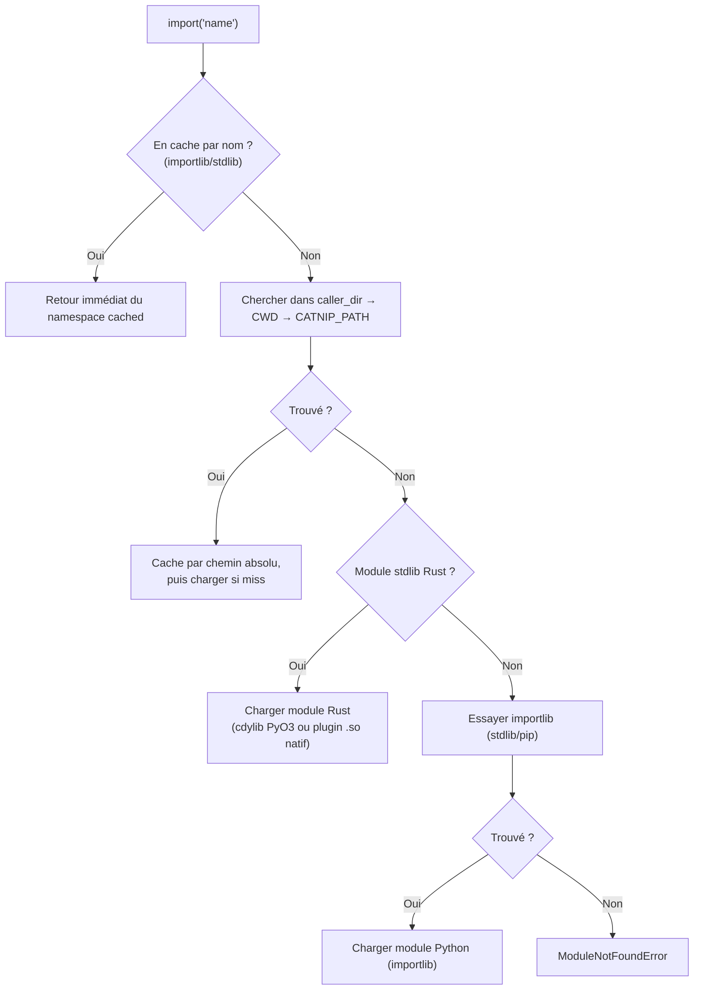
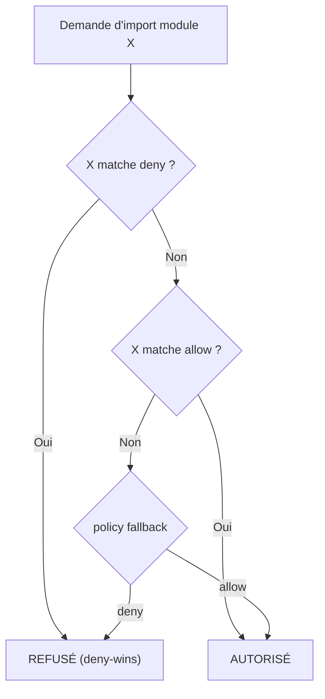

# Module loading

Catnip peut charger des modules Catnip et Python, avec des **namespaces propres**.

## CLI : `-m`

```bash
catnip -m <module> script.cat
```

Charge un module Python installé et l'expose comme namespace global.

```bash
catnip -m math -c "math.sqrt(16)"
# → 4.0

catnip -m math -m random -c "math.floor(random.random() * 100)"
```

### Suffixes

Le flag `-m` supporte deux suffixes pour contrôler l'injection :

| Suffixe  | Syntaxe     | Effet                                                   |
| -------- | ----------- | ------------------------------------------------------- |
| `:alias` | `-m math:m` | Namespace renommé (`m.sqrt()` au lieu de `math.sqrt()`) |
| `:!`     | `-m io:!`   | Injection directe dans les globals (pas de namespace)   |

```bash
# Alias : le module est accessible sous un nom court
catnip -m math:m -c "m.sqrt(16)"
# → 4.0

# Injection directe : les fonctions sont dans les globals
catnip -m io:! -c "print('BORN TO SEGFAULT')"
# → BORN TO SEGFAULT
```

Sans suffixe, le namespace porte le nom du module.

## Langage : `import()`

Le builtin `import()` charge un module et retourne un objet namespace.

### Statement (binding automatique)

En position statement, `import()` avec un seul argument bind automatiquement le module dans le scope :

```catnip
import('math')
math.sqrt(144)
# → 12.0
```

<!-- check: no-check -->

```catnip
import('.utils')       # relatif, bind utils
utils.run()
```

Le nom est dérivé du dernier segment du spec. Les specs avec dots internes (`import('os.path')`) ne sont pas auto-bindés
-- utiliser la forme expression.

### Expression (binding explicite)

```catnip
m = import('math')
m.sqrt(144)
# → 12.0

m.pi
# → 3.141592653589793
```

### Resolution par nom

`import()` prend un **nom**, pas un chemin de fichier. Le loader cherche le module dans les répertoires de recherche,
puis tombe en fallback sur `importlib` (stdlib, pip) :



1. **Cache** - si déjà chargé, retour immédiat
1. **Fichiers** (caller_dir → CWD → CATNIP_PATH) - `.cat`, `.py`, extensions natives, packages `lib.toml`
1. **Stdlib Rust** - modules natifs (`io`, `sys`, `http`) chargés dynamiquement
1. **`importlib`** - modules Python installés (stdlib, pip)

Les fichiers locaux et `CATNIP_PATH` sont résolus avant stdlib et `importlib`. Un fichier local peut donc masquer
n'importe quel module, y compris stdlib. Pour forcer l'accès à un module Python masqué, utiliser `protocol="py"` :
`import('http', protocol='py')`.

> Un module stdlib Rust et son homonyme Python coexistent sans se masquer : `import('http')` (ou `protocol="rs"`) donne
> toujours la lib Catnip, `import('http', protocol="py")` toujours le module Python. Le cache les garde dans des cases
> séparées.

<!-- check: no-check -->

```catnip
json = import('json')     # importlib trouve le module stdlib
utils = import('utils')   # pas dans importlib → cherche utils.cat, puis utils.py
```

### Modules stdlib (Rust natif)

Les modules stdlib sont chargés dynamiquement depuis le package installé ou via `CATNIP_PATH`. Ils ont priorité sur la
recherche fichier (sauf si `protocol="py"` ou `protocol="cat"` force un autre backend). Deux backends coexistent,
choisis dans `spec.toml` :

- **cdylib PyO3** (`io`, `sys`) : extensions C-Python standalone.
- **plugin natif catnip_vm** (`http`) : `.so` chargé via `libloading`, sans backend PyO3 (`pyo3 = false`). Exposé au VM
  PyO3 via un pont qui marshale les valeurs et préserve la distinction attribut/méthode des objets (`Response.status` vs
  `Response.json()`). Auparavant réservé au PureVM/MCP, il est désormais chargeable depuis tous les exécuteurs.

| Module | Backend      | Exports                                                                     | PROTOCOL |
| ------ | ------------ | --------------------------------------------------------------------------- | -------- |
| `io`   | cdylib PyO3  | `print`, `write`, `writeln`, `eprint`, `input`, `open`                      | `"rust"` |
| `sys`  | cdylib PyO3  | `argv`, `environ`, `executable`, `version`, `platform`, `cpu_count`, `exit` | `"rust"` |
| `http` | plugin natif | `get`, `post`, `put`, `delete`, `request`, `Server`, `basic_auth`, `bearer` | `"rust"` |

<!-- check: no-check -->

```catnip
io = import('io')
io.print("BORN TO SEGFAULT", "world", sep=", ")
# → BORN TO SEGFAULT, world

io.write("no newline")
io.eprint("stderr message")

# ← Ari
name = io.input("Name: ")
```

`io.PROTOCOL` (comme `sys.PROTOCOL`, `http.PROTOCOL`) retourne `"rust"` pour identifier le backend natif, quel que soit
le flavour (cdylib PyO3 ou plugin catnip_vm). Un module dans `CATNIP_PATH` peut overrider un module stdlib du même nom.

> Si `utils.cat` et `utils.py` coexistent dans le même répertoire et qu'aucun module `utils` n'existe dans `importlib`,
> le `.cat` gagne. Pour forcer le `.py`, utiliser le kwarg `protocol` : `import('utils', protocol='py')`.

### Kwarg `protocol`

Le kwarg `protocol` (`"py"`, `"rs"` ou `"cat"`) force un backend spécifique :

<!-- check: no-check -->

```catnip
host = import('host', protocol='py')       # cherche host.py uniquement
tools = import('tools', protocol='cat')    # cherche tools.cat uniquement
ext = import('myext', protocol='rs')       # cherche extension native (.so/.dylib) uniquement
```

Quand les deux existent dans le même répertoire, le protocole tranche :

<!-- check: no-check -->

```catnip
# utils.cat et utils.py coexistent
import('utils')                     # → utils.cat (.cat gagne par défaut)
import('utils', protocol='py')     # → utils.py (forcé par protocole)
import('utils', protocol='cat')    # → utils.cat (forcé par protocole)
```

`protocol="cat"` bloque le fallback `importlib` - si le fichier `.cat` n'est pas trouvé, c'est une erreur.

> Un protocole inconnu lève `CatnipRuntimeError`. Les valeurs valides sont `"py"`, `"rs"` et `"cat"`.

### Noms dotted

Le `.` est un séparateur de packages. `import('mylib.utils')` cherche `mylib/utils.cat` (etc.) dans les répertoires de
recherche :

<!-- check: no-check -->

```catnip
m = import('mylib.utils')      # → mylib/utils.cat (ou .py)
m = import('a.b.c')            # → a/b/c.cat (ou .py)
```

Si aucun fichier local n'est trouvé, le fallback `importlib` prend le relais - ce qui permet d'importer des modules
Python dotted comme `os.path` ou `PIL.Image` :

```catnip
p = import('os.path')
p.join("a", "b")
# → "a/b"
```

### Import relatif

Les imports relatifs utilisent des dots en tête pour résoudre depuis le fichier appelant, sans fallback importlib ni
search path :

| Syntaxe       | Résolution                    |
| ------------- | ----------------------------- |
| `.utils`      | `caller_dir/utils.cat`        |
| `..utils`     | `caller_dir/../utils.cat`     |
| `...utils`    | `caller_dir/../../utils.cat`  |
| `..lib.utils` | `caller_dir/../lib/utils.cat` |

Exemple avec une arborescence projet :

```
project/
  main.cat
  lib/
    core.cat
    helpers.cat
  shared/
    utils.cat
```

<!-- check: no-check -->

```catnip
# lib/core.cat
helpers = import('.helpers')         # → project/lib/helpers.cat
utils = import('..shared.utils')     # → project/shared/utils.cat
```

Contraintes :

- Exige `META.file` (pas disponible en REPL ou `-c`). Appeler `import('.foo')` sans contexte fichier lève une erreur.
- Pas de fallback importlib, CWD ou CATNIP_PATH -- résolution stricte depuis le fichier appelant.
- Respecte le kwarg `protocol` : `import('.utils', protocol='py')` ne cherche que les `.py`.
- Les dots seuls (`"."`, `".."`) sont invalides -- un nom de module est requis après les dots.

> `"./foo"` reste rejeté (migration path-based). Le `.` en tête suivi d'un nom, c'est du relatif. Le `./` suivi d'un
> chemin, c'est du filesystem. La distinction est un slash.

### Repertoires de recherche

La résolution parcourt ces répertoires dans l'ordre (dédupliqués) :

1. **`CATNIP_PATH`** - variable d'environnement, répertoires séparés par `:` (priorité maximale)
1. **caller_dir** - le répertoire du fichier qui appelle `import()` (via `META.file`)
1. **CWD** - le répertoire courant du processus

```bash
export CATNIP_PATH="/opt/catnip-libs:$HOME/.catnip/modules"
catnip script.cat
```

<!-- check: no-check -->

```catnip
# Si /opt/catnip-libs/mylib.cat existe :
m = import('mylib')
m.greet()
```

`caller_dir` permet aux modules d'importer leurs voisins sans dépendre du CWD :

```
project/
  main.cat
  lib/
    core.cat
    helpers.cat
```

<!-- check: no-check -->

```catnip
# lib/core.cat
helpers = import('helpers')    # → project/lib/helpers.cat (caller_dir = project/lib/)
```

> La résolution repose sur `META.file`, qui est renseigné automatiquement avant l'exécution d'un module ou script. Si
> `META.file` n'est pas défini (REPL, `-c`), seuls CWD et CATNIP_PATH sont utilisés.

#### Pourquoi pas de `sys.path` ?

Catnip n'a pas d'équivalent mutable de `sys.path` (Python) ou `$LOAD_PATH` (Ruby). La liste de recherche est fixée au
démarrage : CATNIP_PATH, caller_dir, CWD. Le code ne peut pas la modifier à l'exécution.

Raisons :

- **Reproductibilité** - le résultat d'un `import('x')` dépend uniquement du fichier appelant et de l'environnement au
  lancement. Pas d'un `sys.path.insert(0, ...)` trois modules plus haut dans la call stack.
- **Raisonnement local** - pour savoir ce que charge `import('utils')`, il suffit de regarder le répertoire du fichier,
  le CWD et la variable d'environnement. Pas besoin de tracer quel code a muté la liste de recherche et dans quel ordre.
- **Pas d'état global partagé** - un `sys.path` mutable est un état global implicite. Chaque module qui le modifie
  affecte tous les modules chargés ensuite, y compris ceux qui ne le savent pas. C'est une source de bugs
  order-dependent difficiles à diagnostiquer.
- **CATNIP_PATH suffit** - pour ajouter des répertoires de recherche, la variable d'environnement couvre le cas d'usage
  sans introduire de mutation runtime. Les packages `lib.toml` couvrent le reste.

> Si le système est archivé, cette contrainte empêche le genre de pourriture lente où un projet fonctionne uniquement
> parce qu'un script de bootstrap a muté le path dans le bon ordre avant le premier import.

### Packages (`lib.toml`)

Un répertoire contenant un fichier `lib.toml` est traité comme un package. Le package a priorité sur un fichier du même
nom (`mylib/lib.toml` bat `mylib.cat`).

Format minimal :

```toml
[lib]
name = "mylib"
version = "0.1.0"
entry = "main.cat"      # défaut si absent

[lib.exports]
include = ["fn_a", "fn_b"]   # optionnel, restreint les exports
```

Structure :

```
mylib/
  lib.toml
  main.cat           # entry point (défaut)
  helpers.cat        # sous-module accessible via import('mylib.helpers')
```

<!-- check: no-check -->

```catnip
m = import('mylib')                # charge mylib/main.cat
h = import('mylib.helpers')        # charge mylib/helpers.cat (fichier dans le répertoire)
```

Si `lib.exports.include` est défini, seuls les noms listés sont exposés dans le namespace. Sinon, le mécanisme d'export
standard s'applique (`META.exports` > `__all__` > heuristique).

> Un répertoire sans `lib.toml` n'est pas un package. Il est ignoré par le loader.

### Auto-import

Certains modules peuvent être chargés automatiquement au démarrage, sans `import()` explicite. La liste est configurable
dans `catnip.toml` et dans les profils de policy.

#### Défaut

Par défaut (sans fichier `catnip.toml`), le module `io` est auto-chargé en mode wild (`io:!`) en **CLI** et **REPL**. Le
mode DSL (embedding) ne charge rien.

```catnip
# Disponible sans import en CLI et REPL :
print("BORN TO SEGFAULT")
```

#### Configuration `catnip.toml`

La liste est configurable par mode dans `catnip.toml` :

```toml
[modules]
auto = ["io"]              # fallback commun

[modules.repl]
auto = ["io", "math"]      # REPL : confort interactif

[modules.cli]
auto = ["io"]              # CLI : minimal

[modules.dsl]
auto = []                  # embedding : rien par défaut
```

Chaque mode (REPL, CLI, DSL) peut définir sa propre liste `auto`. Si `[modules.<mode>]` n'existe pas, le fallback est
`[modules].auto`.

Les modules listés dans `auto` sont chargés avant l'exécution, comme s'ils avaient été passés via `-m`. Leur namespace
est injecté dans les globals.

#### Modes

- **repl** : session interactive (`catnip` sans argument, ou `catnip repl`)
- **cli** : exécution de script (`catnip script.cat`, `-c`, pipe, `catnip debug`)
- **dsl** : utilisation via l'API Python (`Catnip()`)

#### Policies nommées

Les policies sont définies dans `catnip.toml` sous `[modules.policies.<name>]` :

```toml
[modules.policies.sandbox]
policy = "deny"
allow = ["math", "json", "io"]

[modules.policies.admin]
policy = "allow"
deny = ["subprocess", "os"]
```

Sélection en CLI :

```bash
catnip --policy sandbox script.cat
```

Inspection :

```bash
catnip module list-profiles       # liste les policies nommées
catnip module check sandbox os    # vérifie l'accès d'un module
```

#### Priorité

- `--policy <name>` sélectionne une policy nommée depuis la config
- `[modules.<mode>].auto` si défini pour le mode courant, sinon `[modules].auto`
- `-m` du CLI est additif (s'ajoute aux auto-imports, déduplique)
- Un module bloqué par la policy est ignoré avec un message d'erreur

#### API Python (embedding)

```python
cat = Catnip(auto=["io", "math"])
cat.parse("math.sqrt(16)")
cat.execute()
# => 4.0
```

> Un module introuvable dans `auto` ne provoque pas de crash. Le chargement continue avec les modules restants.

### Wild import

Par défaut, `import()` retourne un namespace. Avec `wild=True`, les exports sont injectés directement dans les globals
du module courant :

```catnip
# utils.cat
double = (x) => { x * 2 }
triple = (x) => { x * 3 }
```

<!-- check: no-check -->

```catnip
# main.cat
import('utils', wild=True)
double(5)    # → 10 (pas besoin de utils.double)
triple(3)    # → 9
```

`wild=True` retourne `None` - il n'y a pas de namespace à stocker. Les exports sont filtrés par les mêmes règles que
l'import classique (`META.exports` > `__all__` > heuristique). Les métadonnées du module (`META`, noms commencant par
`_`) ne sont jamais injectées dans le wild import.

### Import sélectif

Pour importer uniquement certains noms d'un module, les passer en arguments positionnels après le spec. Le format
`"name:alias"` permet de renommer à l'injection :

```catnip
import('math', 'sqrt', 'pi')
sqrt(144)    # → 12.0
pi           # → 3.141592653589793

import('math', 'sqrt:racine', 'pi:p')
racine(16)   # → 4.0
p            # → 3.141592653589793
```

L'import sélectif retourne `None` - les noms sont injectés directement dans les globals, comme `wild=True` mais limité
aux noms demandés. Le module complet est chargé en interne (même cache), seule l'injection est filtrée.

Combiner des noms sélectifs avec `wild=True` lève `CatnipTypeError` - les deux modes sont mutuellement exclusifs.

> La syntaxe `"name:alias"` est la même que `-m name:alias` en CLI. Cohérence ou obsession, à toi de juger.

### Modules Catnip

Catnip injecte un objet `META` (`CatnipMeta`, implémenté en Rust) dans le contexte global de chaque exécution (module,
script, REPL). Le module peut enrichir cet objet pour contrôler ses exports et accéder à ses métadonnées.

**Exports** - le loader lit les exports dans cet ordre de priorité :

1. `META.exports` - noms à exporter : `list(...)`, `tuple(...)` ou `set(...)` (prioritaire)
1. `__all__` - fallback, même convention que Python
1. Heuristique - tout sauf `_prefixé` et `META`

```catnip
# math_utils.cat
add = (a, b) => { a + b }
sub = (a, b) => { a - b }
_helper = (x) => { x }

META.exports = list("add", "sub")    # ou tuple(...) ou set(...)
```

<!-- check: no-check -->

```catnip
m = import('math_utils')
m.add(1, 2)    # => 3
m._helper(1)   # => AttributeError
```

**Métadonnées** - avant l'exécution du module, le loader renseigne automatiquement :

- `META.file` - chemin absolu du fichier source
- `META.main` - `True` si exécuté directement, `False` si importé comme module
- `META.protocol` - protocole de chargement (`"cat"`, posé par le loader)

<!-- check: no-check -->

```catnip
# Dans un module ou script :
META.file       # "/home/user/project/math_utils.cat"
META.main       # False (importé comme module)
META.protocol   # "cat"
```

`META` est un namespace dynamique : le code peut y ajouter n'importe quel attribut (`META.version`, `META.author`,
etc.).

### Cache

Un module chargé une fois est cached. Les appels suivants retournent le même objet :

```catnip
a = import('math')
b = import('math')
# a et b sont le même namespace
```

```catnip
# Le protocole n'affecte pas le cache :
a = import('math', protocol='py')
b = import('math')
# a et b sont le même namespace
```

La clé de cache dépend du type de module :

- **Modules fichier** (`.cat`, `.py`, extensions natives) : cached par **chemin absolu résolu**. Deux modules homonymes
  dans des répertoires différents produisent des entrées distinctes.
- **Modules importlib/stdlib** (`math`, `sys`, packages pip) : cached par **nom**. Le résultat est indépendant du
  répertoire appelant.

## Module Policy

Le système de policy contrôle quels modules Python peuvent être chargés. Utile pour restreindre l'accès dans des
contextes d'exécution non fiables (templates, plugins, sandboxes).

### Configuration TOML

Dans `~/.config/catnip/catnip.toml` :

```toml
[modules]
policy = "deny"                              # fallback : deny ou allow
allow = ["math", "json", "random", "numpy.*"]
deny = ["os", "subprocess", "sys", "importlib"]
```

L'évaluation suit l'ordre : deny d'abord (deny-wins), puis allow, puis fallback.



Le matching est hiérarchique :

- `"os"` bloque `os`, `os.path`, `os.path.join` (frontière au `.`)
- `"os.*"` bloque les sous-modules seulement, pas `os` lui-même
- `"oslo"` ne matche **pas** `"os"`

### API Python

```python
from catnip._rs import ModulePolicy
from catnip import Catnip

# Construction directe
policy = ModulePolicy("deny", allow=["math", "json"], deny=["os"])

# Via kwargs
cat = Catnip(module_policy=policy)

# Ou sur un contexte existant
cat = Catnip()
cat.context.module_policy = policy
```

Un module bloqué lève `CatnipRuntimeError`. Les modules déjà en cache (chargés avant l'activation de la policy) ne sont
pas re-vérifiés.

La policy est héritée par les sous-modules Catnip : quand un module `.cat` est importé, il reçoit la `module_policy` du
contexte appelant. Ses propres `import()` sont donc soumis aux mêmes règles.

Les imports relatifs sont vérifiés avec leur nom qualifié complet : `import('.secret')` dans `pkg/mod.cat` est évalué
comme `pkg.secret` contre la policy. Ainsi `deny=["pkg.secret"]` bloque l'import qu'il soit absolu ou relatif.

> La policy est un garde-fou structurel, pas un firewall. Elle empêche les `import()` accidentels, pas une évasion
> déterminée.

## Écrire un Module Host

### Structure recommandée

```python
# my_module.py

def my_function(x):
    """Cette fonction sera exposée dans le namespace."""
    return x * 2

class MyClass:
    """Les classes sont aussi exposées."""
    def __init__(self):
        self.value = 0

def _private_helper():
    """Fonctions commençant par _ ne sont PAS exposées."""
    return "private"
```

### Règles d'exposition

**Exposé dans le namespace** :

- Fonctions publiques (ne commencent pas par `_`)
- Classes publiques
- Constantes publiques

**Non exposé** :

- Attributs commençant par `_`

## REPL avec modules

```bash
catnip -m math
```

> Quand des modules sont chargés via `-m`, la REPL Python minimale est utilisée à la place de la REPL Rust (pour que les
> namespaces soient accessibles).

## Résumé

```bash
# CLI
catnip -m math script.cat              # math.sqrt()
catnip -m math:m script.cat            # m.sqrt() (alias)
catnip -m io:! script.cat              # print() directement (injection globals)
catnip -m math -m random script.cat    # math + random
catnip -m math                         # REPL avec math
```

<!-- check: no-check -->

```catnip
# Résolution par nom (priorité : local → CATNIP_PATH → stdlib → importlib)
m = import('math')                     # importlib (stdlib)
utils = import('utils')                # pas dans importlib → utils.cat si présent, sinon utils.py

# Protocole (force un backend)
host = import('host', protocol='py')       # host.py uniquement
tools = import('tools', protocol='cat')    # tools.cat uniquement

# Noms dotted (séparateur de packages)
m = import('mylib.utils')              # mylib/utils.cat (ou .py)
p = import('os.path')                  # fallback importlib

# Import relatif (depuis le fichier appelant, sans fallback)
h = import('.helpers')                 # caller_dir/helpers.cat
u = import('..shared.utils')           # caller_dir/../shared/utils.cat

# Wild import (injection dans les globals)
import('utils', wild=True)             # double() et triple() directement accessibles

# Import sélectif
import('math', 'sqrt', 'pi:p')        # sqrt() et p dans les globals
```

```bash
# Search path
export CATNIP_PATH="/opt/libs"         # répertoires supplémentaires
```
