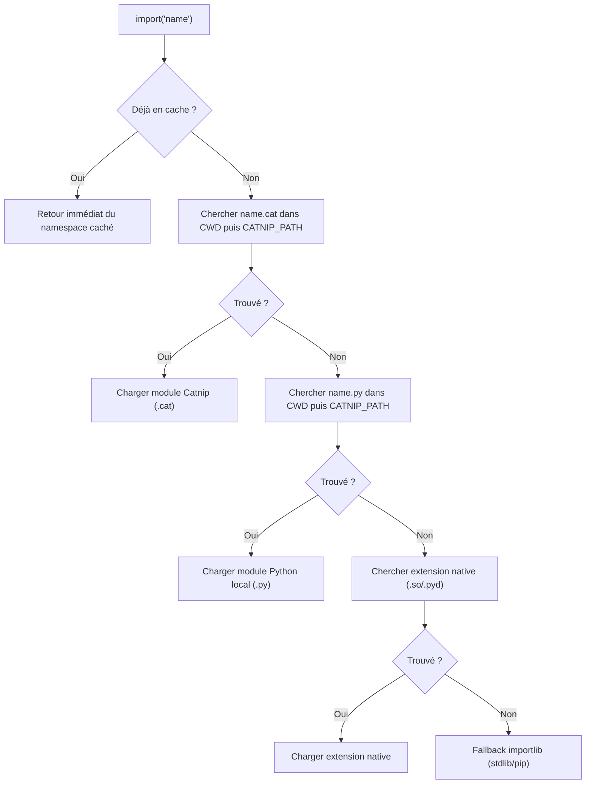
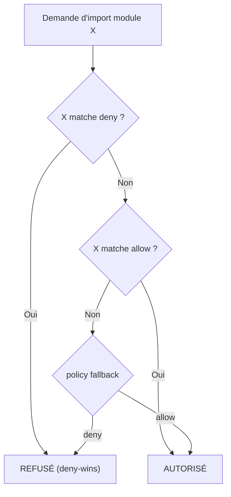

# Module Loading

Catnip peut charger des modules Catnip et Python, avec des **namespaces propres**.

## CLI : `-m`

```bash
catnip -m <module> script.cat
```

Charge un module Python installé et l'expose comme namespace global.

```bash
catnip -m math -c "math.sqrt(16)"
# → 4.0

catnip -m math -m random -c "math.floor(random.random() * 100)"
```

> Le namespace porte le nom du module. Pas d'alias, pas d'injection directe. Si on veut un alias, on utilise `import()`
> dans le code.

## Langage : `import()`

Le builtin `import()` charge un module et retourne un objet namespace :

```catnip
m = import("math")
m.sqrt(144)
# → 12.0

m.pi
# → 3.141592653589793
```

### Chemin explicite

Un spec contenant `/`, `\`, un préfixe `.` ou une extension est traité comme chemin de fichier. Le fichier est chargé
directement selon son type :

<!-- check: no-check -->

```catnip
host = import("./host.py")          # Python local
tools = import("./tools.cat")       # Catnip local
tools = import("/opt/lib/tools.cat") # Chemin absolu
```

### Imports relatifs

Les chemins relatifs (`./`, `../`) sont résolus par rapport au fichier qui contient l'appel `import()`, pas par rapport
au CWD du processus. Cela permet aux modules d'importer leurs dépendances locales indépendamment d'où le script
principal est lancé.

```
project/
  main.cat
  lib/
    core.cat
    helpers.cat
  shared.cat
```

<!-- check: no-check -->

```catnip
# main.cat
core = import("./lib/core")         # → project/lib/core.cat

# lib/core.cat
helpers = import("./helpers")       # → project/lib/helpers.cat (pas CWD/helpers.cat)
shared = import("../shared")        # → project/shared.cat
```

L'extension est optionnelle : sans suffixe, le loader essaie `.cat` puis `.py`.

> La résolution repose sur `META.path`, qui est renseigné automatiquement avant l'exécution d'un module ou script. Si
> `META.path` n'est pas défini (REPL, `-c`), les chemins relatifs sont résolus depuis le CWD.

### Wild import

Par défaut, `import()` retourne un namespace. Avec `wild=True`, les exports sont injectés directement dans les globals
du module courant :

```catnip
# utils.cat
double = (x) => { x * 2 }
triple = (x) => { x * 3 }
```

<!-- check: no-check -->

```catnip
# main.cat
import("./utils", wild=True)
double(5)    # → 10 (pas besoin de utils.double)
triple(3)    # → 9
```

`wild=True` retourne `None` -- il n'y a pas de namespace à stocker. Les exports sont filtrés par les mêmes règles que
l'import classique (`META.exports` > `__all__` > heuristique).

### Nom nu (sans chemin)

Un nom sans séparateur ni extension déclenche une résolution par priorité :



1. **Cache** -- si déjà chargé, retour immédiat
1. **`.cat`** dans les répertoires de recherche
1. **`.py`** dans les répertoires de recherche
1. **Extensions natives** (`.so`, `.pyd`) dans les répertoires de recherche
1. **`importlib`** -- fallback Python (stdlib, pip)

<!-- check: no-check -->

```catnip
utils = import("utils")   # cherche utils.cat, puis utils.py, puis pip
json = import("json")     # pas de .cat/.py local → stdlib
```

> Si `utils.cat` et `utils.py` coexistent dans le même répertoire, le `.cat` gagne. Pour forcer le `.py`, utiliser un
> chemin explicite : `import("./utils.py")`.

### Repertoires de recherche

La résolution parcourt ces répertoires dans l'ordre :

1. **CWD** -- le répertoire courant
1. **`CATNIP_PATH`** -- variable d'environnement, répertoires séparés par `:`

```bash
export CATNIP_PATH="/opt/catnip-libs:$HOME/.catnip/modules"
catnip script.cat
```

<!-- check: no-check -->

```catnip
# Si /opt/catnip-libs/mylib.cat existe :
m = import("mylib")
m.greet()
```

### Modules Catnip

Catnip injecte un objet `META` (`CatnipMeta`, implémenté en Rust) dans le contexte global de chaque exécution (module,
script, REPL). Le module peut enrichir cet objet pour contrôler ses exports et accéder à ses métadonnées.

**Exports** -- le loader lit les exports dans cet ordre de priorité :

1. `META.exports` -- noms à exporter : `list(...)`, `tuple(...)` ou `set(...)` (prioritaire)
1. `__all__` -- fallback, même convention que Python
1. Heuristique -- tout sauf `_prefixé` et `META`

```catnip
# math_utils.cat
add = (a, b) => { a + b }
sub = (a, b) => { a - b }
_helper = (x) => { x }

META.exports = list("add", "sub")    # ou tuple(...) ou set(...)
```

<!-- check: no-check -->

```catnip
m = import("./math_utils.cat")
m.add(1, 2)    # => 3
m._helper(1)   # => AttributeError
```

**Métadonnées** -- `META.path` est automatiquement renseigné avant l'exécution du module (chemin absolu du fichier).
Pour les scripts lancés via CLI, `META.path` contient le chemin du script.

<!-- check: no-check -->

```catnip
# Dans un module ou script :
META.path   # => "/home/user/project/math_utils.cat"
```

`META` est un namespace dynamique : le code peut y ajouter n'importe quel attribut (`META.version`, `META.author`,
etc.).

### Cache

Un module chargé une fois est mis en cache par son spec exact. Les appels suivants retournent le même objet :

```catnip
a = import("math")
b = import("math")
# a et b sont le même namespace
```

## Module Policy

Le système de policy contrôle quels modules Python peuvent être chargés. Utile pour restreindre l'accès dans des
contextes d'exécution non fiables (templates, plugins, sandboxes).

### Configuration TOML

Dans `~/.config/catnip/catnip.toml` :

```toml
[modules]
policy = "deny"                              # fallback : deny ou allow
allow = ["math", "json", "random", "numpy.*"]
deny = ["os", "subprocess", "sys", "importlib"]
```

L'évaluation suit l'ordre : deny d'abord (deny-wins), puis allow, puis fallback.



Le matching est hiérarchique :

- `"os"` bloque `os`, `os.path`, `os.path.join` (frontière au `.`)
- `"os.*"` bloque les sous-modules seulement, pas `os` lui-même
- `"oslo"` ne matche **pas** `"os"`

### Fichier de policies externe

Pour des applications qui ont besoin de plusieurs profils de sécurité (CMS, plugins, multi-tenant), les policies peuvent
être définies dans un fichier TOML séparé avec des profils nommés :

```toml
# policies.toml
[sandbox]
policy = "deny"
allow = ["math", "json", "random"]

[admin]
policy = "allow"
deny = ["subprocess"]

[template]
policy = "deny"
allow = ["math", "json"]
deny = ["os", "sys", "importlib"]
```

Chargement depuis Python :

```python
from catnip._rs import ModulePolicy
from catnip import Catnip

# Charger un profil nommé
policy = ModulePolicy.from_file("policies.toml", "sandbox")
cat = Catnip(module_policy=policy)

# Lister les profils disponibles
ModulePolicy.list_profiles("policies.toml")
# => ["admin", "sandbox", "template"]
```

### API Python

```python
from catnip._rs import ModulePolicy
from catnip import Catnip

# Construction directe
policy = ModulePolicy("deny", allow=["math", "json"], deny=["os"])

# Via kwargs
cat = Catnip(module_policy=policy)

# Ou sur un contexte existant
cat = Catnip()
cat.context.module_policy = policy
```

Un module bloqué lève `CatnipRuntimeError`. Les modules déjà en cache (chargés avant l'activation de la policy) ne sont
pas re-vérifiés.

> La policy est un garde-fou structurel, pas un firewall. Elle empêche les `import()` accidentels, pas une évasion
> déterminée.

## Écrire un Module Host

### Structure recommandée

```python
# my_module.py

def my_function(x):
    """Cette fonction sera exposée dans le namespace."""
    return x * 2

class MyClass:
    """Les classes sont aussi exposées."""
    def __init__(self):
        self.value = 0

def _private_helper():
    """Fonctions commençant par _ ne sont PAS exposées."""
    return "private"
```

### Règles d'exposition

**Exposé dans le namespace** :

- Fonctions publiques (ne commencent pas par `_`)
- Classes publiques
- Constantes publiques

**Non exposé** :

- Attributs commençant par `_`

## REPL avec modules

```bash
catnip -m math
```

> Quand des modules sont chargés via `-m`, le REPL Python minimal est utilisé à la place du REPL Rust (pour que les
> namespaces soient accessibles).

## Résumé

```bash
# CLI
catnip -m math script.cat              # math.sqrt()
catnip -m math -m random script.cat    # math + random
catnip -m math                         # REPL avec math
```

<!-- check: no-check -->

```catnip
# Chemin explicite
host = import("./host.py")             # Fichier Python local
tools = import("./tools.cat")          # Fichier Catnip local

# Nom nu (résolution par priorité)
m = import("math")                     # .cat → .py → .so → stdlib
utils = import("utils")                # utils.cat si présent, sinon utils.py

# Imports relatifs (résolus depuis le fichier courant)
sub = import("./lib/sub")              # extension inférée (.cat → .py)
parent = import("../shared")           # remonte d'un niveau

# Wild import (injection dans les globals)
import("./utils", wild=True)           # double() et triple() directement accessibles
```

```bash
# Search path
export CATNIP_PATH="/opt/libs"         # répertoires supplémentaires
```
