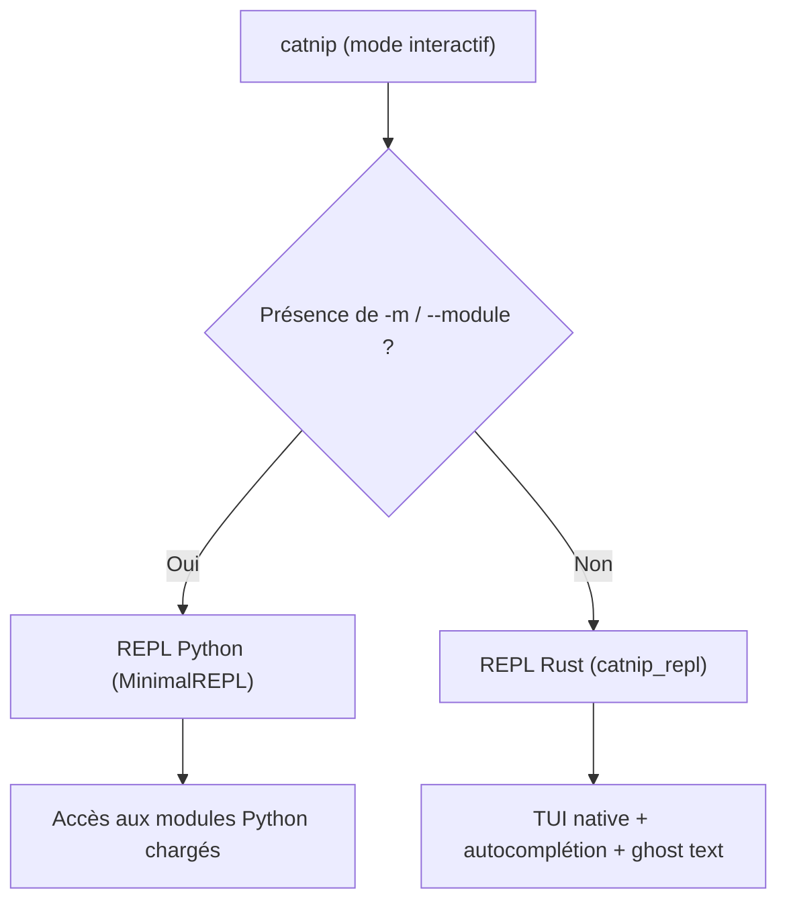

# REPL Interactive

La REPL Catnip existe en version **Rust native** integree via PyO3, et en version Python pour l'intégration modules.

> La REPL s'inscrit dans la tradition Lisp (lecture/évaluation/affichage). Dialogue direct avec le runtime: latence
> humaine, réponse machine.

## Architecture REPL

Catnip fournit **deux modes REPL** selon le contexte :

### REPL Rust (mode par défaut)

TUI ratatui/crossterm dans le crate `catnip_repl` (`_repl.run_repl()`) :

- **Rapide** : startup instantané, exécution native
- **Intégrée** : aucun binaire externe nécessaire, livré avec `pip install catnip-lang`
- **Optimisé** : VM bytecode + JIT intégré
- **Source** : `catnip_repl/src/` (boucle TUI), `catnip_repl/src/executor.rs` (pipeline)

Le GIL est libéré (`py.detach()`) pendant la boucle TUI, puis ré-acquis via `Python::attach()` à chaque exécution de
code.

Utilisé automatiquement pour du Catnip "pur".

### REPL Python (minimal)

Wrapper léger `MinimalREPL` pour intégrer des modules Python (`-m`/`--module`) :

- **Contexte Python** : accès aux modules chargés (`-m math`, etc.)
- **Pipeline complet** : parsing → semantic → execution Python
- **Source** : `catnip/repl/minimal.py`

Activé automatiquement si `catnip -m module` ou `catnip repl -m module`.

## Lancement

```bash
# REPL Rust (par défaut)
catnip              # Mode interactif rapide
catnip -v           # Mode verbeux

# REPL Python (avec modules)
catnip -m math      # Charge module Python, REPL Python
catnip -m math -m numpy  # Multi-modules

# Mode pipe (non-interactif)
echo "2+3" | catnip
```

## Commandes REPL

Les commandes commencent par `/` :

| Commande         | Description                           |
| ---------------- | ------------------------------------- |
| `/help`          | Afficher l'aide                       |
| `/exit`, `/quit` | Quitter la REPL                       |
| `/clear`         | Effacer la sortie                     |
| `/history`       | Afficher l'historique                 |
| `/load <file>`   | Charger et exécuter un fichier `.cat` |
| `/stats`         | Statistiques d'exécution              |
| `/jit`           | Activer/désactiver le JIT             |
| `/verbose`       | Activer/désactiver le mode verbeux    |
| `/debug`         | Activer/désactiver le mode debug      |
| `/time <expr>`   | Benchmarker une expression            |
| `/config`        | Editeur interactif de configuration   |
| `/version`       | Afficher la version                   |

<!-- doc-snapshot: repl/version -->

```console
▸ /version
Catnip REPL v0.0.6
Build: release mode
Features: JIT (Cranelift), NaN-boxing VM, Rust builtins
```

<!-- doc-snapshot: repl/stats -->

```console
▸ /stats
=== Execution Statistics ===
Variables defined: 0
JIT enabled:       yes
JIT threshold:     100
```

<!-- doc-snapshot: repl/jit-toggle -->

```console
▸ /jit
JIT compiler: disabled
▸ /jit
JIT compiler: enabled
```

## Editeur de configuration (`/config`)

`/config` sans arguments ouvre un overlay interactif sous la ligne de prompt. Toutes les clés de `catnip.toml` y sont
listées avec leur valeur courante et leur source (default, file, env, cli).

**Navigation** :

| Touche          | Action                                              |
| --------------- | --------------------------------------------------- |
| Up / Down / k/j | Naviguer entre les clés                             |
| Enter / Space   | Toggle (bool), cycle (choice), ou entrer en édition |
| Esc / q         | Fermer l'éditeur                                    |

**Mode édition** (valeurs numériques) :

| Touche    | Action                       |
| --------- | ---------------------------- |
| 0-9       | Saisir la valeur             |
| Backspace | Effacer un caractère         |
| Enter     | Valider (avec borne min/max) |
| Esc       | Annuler l'édition            |

Les modifications sont sauvegardées dans `catnip.toml` immédiatement.

Les sous-commandes textuelles restent disponibles :

- `/config show` : affichage statique (comme `catnip config show`)
- `/config get KEY` : valeur d'une clé
- `/config set KEY VALUE` : modifier une clé
- `/config path` : chemin du fichier de configuration

## Raccourcis clavier

### REPL Rust (par défaut)

| Raccourci       | Action                                       |
| --------------- | -------------------------------------------- |
| Ctrl+D          | Quitter (ligne vide, sortie normale)         |
| Ctrl+C          | Annuler la saisie courante, ou abort si vide |
| Up/Down         | Naviguer dans l'historique                   |
| Ctrl+A / Home   | Debut de ligne                               |
| Ctrl+E / End    | Fin de ligne                                 |
| Ctrl+U          | Effacer la ligne                             |
| Ctrl+W          | Effacer le mot precedent                     |
| Ctrl+Left/Right | Deplacer par mot                             |
| Ctrl+L          | Effacer l'ecran                              |
| Tab             | Declencher / accepter la completion          |
| Right           | Accepter le ghost text (hint)                |
| Escape          | Fermer le popup completion                   |

### REPL Python (minimal)

La REPL Python minimal offre une interface simplifiée :

| Raccourci | Action                                       |
| --------- | -------------------------------------------- |
| Ctrl+D    | Quitter (ligne vide, sortie normale)         |
| Ctrl+C    | Annuler la saisie courante, ou abort si vide |

Pas d'auto-complétion ni de recherche historique avancée : priorité à la compatibilité Python.

## Auto-complétion (REPL Rust)

Tab ouvre un popup de complétion contextuelle. Chaque suggestion est catégorisée :

| Catégorie  | Contenu                                       |
| ---------- | --------------------------------------------- |
| `variable` | Variables définies dans le contexte courant   |
| `keyword`  | Mots-clés du langage (`if`, `while`, `match`) |
| `builtin`  | Fonctions builtin (`print`, `len`, `range`)   |
| `command`  | Commandes REPL (`/help`, `/exit`, `/stats`)   |
| `method`   | Méthodes après `.` (string, list, dict)       |

**Priorité** : variables > keywords > builtins (évite le shadowing accidentel).

**Navigation** : Tab/Down = suivant, Shift+Tab/Up = précédent. Si plus de 8 suggestions, un indicateur de scroll
`(offset/total)` apparaît.

## Ghost text (REPL Rust)

En plus du popup (Tab), la REPL affiche un **ghost text** grisé après le curseur. Le texte apparaît pendant la saisie et
se valide avec la flèche droite.

Trois contextes de suggestion :

- **Appel de fonction** : `map(fn, |` affiche `iterable)` (paramètres restants)
- **Mot-clé** : `whi|` affiche `le condition { body }` (template de structure)
- **Identifiant** : `pri|` affiche `nt(values...)` (complétion + signature)

Le ghost text et le popup de complétion sont mutuellement exclusifs : Tab ouvre le popup et masque le ghost text, Escape
ferme le popup et restaure le ghost text.

> Le ghost text connaît les 28 signatures builtin et les 8 templates de mots-clés. Il connaît aussi les variables
> définies dans le contexte courant, ce qui lui confère une omniscience locale dont il use avec modération.

## Recherche historique (REPL Rust)

L'historique est persistant dans `$XDG_STATE_HOME/catnip/repl_history` (par défaut
`~/.local/state/catnip/repl_history`).

## Multiline

La REPL détecte automatiquement les expressions multilignes :

- Délimiteurs non fermés (`{`, `(`, `[`)
- Opérateurs en fin de ligne (`+`, `-`, `*`, etc.)
- Mots-clés de contrôle (`if`, `while`, `for`, etc.)

La continuation est automatique : Enter ajoute une nouvelle ligne tant que l'expression est incomplète, et soumet quand
elle est complète.

<!-- check: no-check -->

```catnip
▸ f = (x) => {
▹   x * 2
▹ }
▸ f(21)
42
```

## Affichage des résultats

La REPL affiche automatiquement le résultat de chaque expression évaluée. Les résultats `None` sont supprimés, comme en
Python :

<!-- check: no-check -->

```catnip
▸ 42
42

▸ "hello"
hello

▸ x = 10
10

▸ while (False) { 1 }
▸                       # Pas d'affichage (None supprimé)
```

En mode verbose (`-v`), `None` reste visible dans le stage `RESULT` pour le debug.

## Choix de REPL

La CLI détecte automatiquement quelle REPL utiliser :



```bash
# REPL Rust (standalone)
catnip                    # Aucun module → REPL Rust
catnip -o jit script.cat  # Pas de -m → REPL Rust si erreur

# REPL Python (wrapper)
catnip -m math            # -m présent → REPL Python
catnip -m math -m numpy   # idem
```

**Règle** : Présence de `-m`/`--module` déclenche REPL Python (accès contexte modules). Sinon, REPL Rust (standalone).

## Erreur REPL manquante

Depuis l'intégration PyO3, la REPL Rust est incluse dans l'extension `_rs.so` compilée avec `make compile`. Aucun
binaire externe n'est requis.

Si la REPL n'est pas disponible (extension non compilée) :

```
Error: Rust REPL not available
Install it with: make compile
```

Solution : recompiler l'extension Rust :

```bash
make compile
# ou
make setup
```

> Le binaire standalone `catnip-repl` existe toujours comme fallback (si `_repl.run_repl` échoue), mais il n'est plus
> nécessaire en usage normal.

## Messages d'Erreur

Les erreurs runtime affichent la position source avec pile d'appels :

```
▸ f = (x) => { x / 0 }
▸ f(42)
File '<repl>', line 2, column 6: division by zero
    2 | f(42)
    |      ^
Traceback (most recent call last):
  File "<repl>", in <lambda>
CatnipRuntimeError: division by zero
```

**Format** : fichier, ligne, colonne, snippet avec caret, traceback montrant la chaîne d'appels.

**Continuer après erreur** : La REPL reste ouverte, les variables définies avant l'erreur restent accessibles.

## Messages de sortie

La REPL affiche un message aléatoire à la fermeture, adapté au contexte :

- **Sortie normale** (Ctrl+D, `/exit`) : messages de résolution (`state resolved.`, `fixed point reached.`,
  `all branches resolved.`, etc.)
- **Interruption** (Ctrl+C) : messages d'abort (`context destroyed.`, `causality broken.`, `rollback.`, etc.)
- **Messages rares** (1% de chance) : observations méta (`evaluation evaluated itself.`,
  `the computation noticed you watching.`, etc.)

> Les messages sont définis dans `catnip_rs/src/constants.rs`. Le ratio exact est 99% normal/abort et 1% weird, ce qui
> donne à chaque sortie une probabilité non nulle de devenir philosophique.
