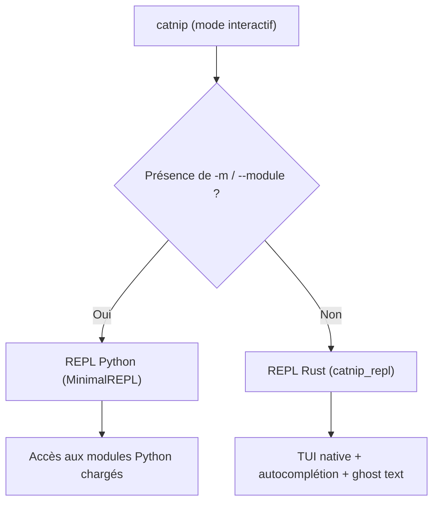

# REPL interactive

La REPL Catnip existe en version **Rust native** intégrée via PyO3, et en version Python pour l'intégration modules.

> La REPL s'inscrit dans la tradition Lisp (lecture/évaluation/affichage). Dialogue direct avec le runtime: latence
> humaine, réponse machine.

## Architecture REPL

Catnip fournit **deux modes REPL** selon le contexte :

### REPL Rust (mode par défaut)

TUI ratatui/crossterm dans le crate `catnip_repl` (`_repl.run_repl()`) :

- **Rapide** : startup instantané, exécution native
- **Intégrée** : aucun binaire externe nécessaire, livré avec `pip install catnip-lang`
- **Optimisé** : VM bytecode + JIT intégré
- **Config-aware** : charge les defaults (`catnip.toml` ou built-in), auto-modules (`io:!`), policies
- **Source** : `catnip_repl/src/` (boucle TUI), `catnip_repl/src/executor.rs` (pipeline)

Le GIL est libéré (`py.detach()`) pendant la boucle TUI, puis ré-acquis via `Python::attach()` à chaque exécution de
code.

Utilisé automatiquement pour du Catnip "pur".

### REPL Python (minimal)

Wrapper léger `MinimalREPL` pour intégrer des modules Python (`-m`/`--module`) :

- **Contexte Python** : accès aux modules chargés (`-m math`, etc.)
- **Pipeline complet** : parsing → semantic → exécution Python
- **Source** : `catnip/repl/minimal.py`

Activé automatiquement si `catnip -m module` ou `catnip repl -m module`.

## Lancement

```bash
# REPL Rust (par défaut)
catnip              # Mode interactif rapide
catnip -v           # Mode verbeux

# REPL Python (avec modules)
catnip -m math      # Charge module Python, REPL Python
catnip -m math -m numpy  # Multi-modules

# Mode pipe (non-interactif)
echo "2+3" | catnip
```

## Commandes REPL

Les commandes commencent par `/` :

| Commande         | Description                           |
| ---------------- | ------------------------------------- |
| `/help`          | Afficher l'aide                       |
| `/exit`, `/quit` | Quitter la REPL                       |
| `/clear`         | Effacer la sortie                     |
| `/history`       | Afficher l'historique                 |
| `/load <file>`   | Charger et exécuter un fichier `.cat` |
| `/context [var]` | Inspecter les variables utilisateur   |
| `/stats`         | Statistiques d'exécution              |
| `/jit`           | Activer/désactiver le JIT             |
| `/verbose`       | Activer/désactiver le mode verbeux    |
| `/debug`         | Activer/désactiver le mode debug      |
| `/time <expr>`   | Benchmarker une expression            |
| `/config`        | Editeur interactif de configuration   |
| `/version`       | Afficher la version                   |

**Note** : `exit()` n'est pas un builtin du langage. Pour quitter la REPL, utiliser `/exit`, `/quit` ou Ctrl+D. Pour
terminer un programme depuis le code, utiliser `sys = import('sys'); sys.exit(code)`.

<!-- doc-snapshot: repl/version -->

```console
▸ /version
Catnip REPL v0.0.7
Build: release mode
Features: JIT (Cranelift), NaN-boxing VM, Rust builtins
```

<!-- doc-snapshot: repl/stats -->

```console
▸ /stats
=== Execution Statistics ===
Variables defined: 0
JIT enabled:       yes
JIT threshold:     100
```

<!-- doc-snapshot: repl/jit-toggle -->

```console
▸ /jit
JIT compiler: disabled
▸ /jit
JIT compiler: enabled
```

## Editeur de configuration (`/config`)

`/config` sans arguments ouvre un overlay interactif sous la ligne de prompt. Les clés sont organisées en 6 groupes :

| Groupe    | Clés                                                     | Persistance   |
| --------- | -------------------------------------------------------- | ------------- |
| execution | executor, optimize, tco, jit                             | `catnip.toml` |
| display   | no_color, theme                                          | `catnip.toml` |
| cache     | enable_cache, cache_max_size_mb, cache_ttl_seconds       | `catnip.toml` |
| debug     | log_weird_errors, max_weird_logs, memory_limit           | `catnip.toml` |
| format    | indent_size, line_length                                 | `catnip.toml` |
| repl      | show_parse_time, show_exec_time, debug_mode, max_history | session       |

Les clés DSL/CLI (groupes `execution` à `format`) sont sauvegardées dans `catnip.toml` immédiatement. Les clés REPL
(groupe `repl`) sont modifiées en mémoire pour la session courante.

Chaque clé affiche sa valeur courante et sa source (default, file, env, cli, session). Un `*` marque les valeurs
modifiées par rapport au défaut.

**Rendu par type** :

- **Bool** : `on` (vert) / `off` (dim), toggle instantané
- **Choice** : `vm | ast` avec la valeur courante en gras, cycle au suivant
- **Int** : valeur + range (`0..3`) quand sélectionnée, édition inline

**Navigation** :

| Touche           | Action                                              |
| ---------------- | --------------------------------------------------- |
| Up / Down / k/j  | Naviguer entre les clés                             |
| Tab              | Sauter au groupe suivant                            |
| Shift+Tab        | Sauter au groupe précédent                          |
| Home / g         | Première clé                                        |
| End / G          | Dernière clé                                        |
| PageUp/PageDown  | Page haut/bas                                       |
| Enter / Space    | Toggle (bool), cycle (choice), ou entrer en édition |
| r                | Reset au défaut                                     |
| ?                | Afficher/masquer l'aide                             |
| Esc / q / Ctrl+C | Fermer l'éditeur                                    |

**Mode édition** (valeurs numériques) :

| Touche       | Action                       |
| ------------ | ---------------------------- |
| 0-9          | Saisir la valeur             |
| Backspace    | Effacer un caractère         |
| Left/Right   | Déplacer le curseur          |
| Enter        | Valider (avec borne min/max) |
| Esc / Ctrl+C | Annuler l'édition            |

Les sous-commandes textuelles restent disponibles :

- `/config show` : affichage statique (comme `catnip config show`)
- `/config get KEY` : valeur d'une clé
- `/config set KEY VALUE` : modifier une clé
- `/config path` : chemin du fichier de configuration

## Raccourcis clavier

### REPL Rust (par défaut)

| Raccourci       | Action                                                   |
| --------------- | -------------------------------------------------------- |
| Ctrl+D          | Quitter (ligne vide, sortie normale)                     |
| Ctrl+C          | Interrompre l'exécution en cours, ou annuler/abort sinon |
| Ctrl+R          | Recherche inverse dans l'historique                      |
| Up/Down         | Naviguer dans l'historique                               |
| Ctrl+A / Home   | Début de ligne                                           |
| Ctrl+E / End    | Fin de ligne                                             |
| Ctrl+U          | Effacer la ligne                                         |
| Ctrl+W          | Effacer le mot précédent                                 |
| Ctrl+Left/Right | Déplacer par mot                                         |
| Ctrl+L          | Effacer l'écran                                          |
| Tab             | Déclencher / accepter la complétion                      |
| Right           | Accepter le ghost text (hint)                            |
| Escape          | Fermer le popup complétion                               |

### Interruption d'exécution (Ctrl+C)

Ctrl+C interrompt les exécutions longues. La VM vérifie un flag d'interruption toutes les ~65k instructions. Pendant
l'exécution, un `SigintGuard` (RAII) ré-active `ISIG` et installe un handler SIGINT dédié, puis restaure le terminal en
mode raw à la fin.

En dehors d'une exécution (prompt de saisie), Ctrl+C annule la ligne courante ou quitte la REPL si la ligne est vide.

### REPL Python (minimal)

La REPL Python minimale offre une interface simplifiée :

| Raccourci | Action                                       |
| --------- | -------------------------------------------- |
| Ctrl+D    | Quitter (ligne vide, sortie normale)         |
| Ctrl+C    | Annuler la saisie courante, ou abort si vide |

Pas d'auto-complétion ni de recherche historique avancée : priorité à la compatibilité Python.

## Auto-complétion (REPL Rust)

Tab ouvre un popup de complétion contextuelle. Chaque suggestion est catégorisée :

| Catégorie  | Contenu                                          |
| ---------- | ------------------------------------------------ |
| `variable` | Variables définies dans le contexte courant      |
| `keyword`  | Mots-clés du langage (`if`, `while`, `match`)    |
| `builtin`  | Fonctions builtin (générées depuis `context.py`) |
| `command`  | Commandes REPL (`/help`, `/exit`, `/stats`)      |
| `method`   | Méthodes/attributs après `.`                     |

Après un `.`, le compléteur utilise `dir()` sur la variable pour proposer ses attributs réels. Par exemple,
`io = import('io')` puis `io.` propose les attributs du module `io`. Les instances de struct exposent leurs champs et
méthodes : `p = Point(1, 2)` puis `p.` propose `x`, `y` et les méthodes définies. Si la variable n'est pas connue,
fallback sur les méthodes hardcodées de `str`, `list` et `dict`.

**Priorité** : variables > keywords > builtins (évite le shadowing accidentel).

**Navigation** : Tab/Down = suivant, Shift+Tab/Up = précédent. Si plus de 8 suggestions, un indicateur de scroll
`(offset/total)` apparaît.

## Ghost text (REPL Rust)

En plus du popup (Tab), la REPL affiche un **ghost text** grisé après le curseur. Le texte apparaît pendant la saisie et
se valide avec la flèche droite.

Trois contextes de suggestion :

- **Appel de fonction** : `map(fn, |` affiche `iterable)` (paramètres restants)
- **Mot-clé** : `whi|` affiche `le condition { body }` (template de structure)
- **Identifiant** : `pri|` affiche `nt(values...)` (complétion + signature)

Le ghost text et le popup de complétion sont mutuellement exclusifs : Tab ouvre le popup et masque le ghost text, Escape
ferme le popup et restaure le ghost text.

> Le ghost text connaît les 28 signatures builtin et les 8 templates de mots-clés. Il connaît aussi les variables
> définies dans le contexte courant, ce qui lui confère une omniscience locale dont il use avec modération.

## Recherche historique (REPL Rust)

L'historique est persistant dans `$XDG_STATE_HOME/catnip/repl_history` (par défaut
`~/.local/state/catnip/repl_history`).

**Recherche inverse** (Ctrl+R) : ouvre un prompt de recherche dans l'historique, similaire à fish/bash. Taper du texte
filtre les entrées correspondantes. Ctrl+R cycle vers le résultat suivant, Enter accepte la sélection, Escape annule et
revient au prompt normal.

## Multiline

La REPL détecte automatiquement les expressions multilignes :

- Délimiteurs non fermés (`{`, `(`, `[`)
- Opérateurs en fin de ligne (`+`, `-`, `*`, etc.)
- Mots-clés de contrôle (`if`, `while`, `for`, etc.)

La continuation est automatique : Enter ajoute une nouvelle ligne tant que l'expression est incomplète, et soumet quand
elle est complète. Les nouvelles lignes sont **auto-indentées** selon le niveau d'imbrication courant (accolades,
parenthèses, crochets).

<!-- check: no-check -->

```catnip
▸ f = (x) => {
      x * 2
  }
▸ f(21)
42
```

## Inspection du contexte (`/context`)

`/context` affiche les variables définies par l'utilisateur avec leur type et valeur tronquée. `/context <var>` affiche
le détail complet d'une variable.

<!-- check: no-check -->

```catnip
▸ x = 42
▸ name = "Alice"
▸ /context
=== Context ===
  name             str          'Alice'
  x                int          42
▸ /context x
x: int = 42
```

Les variables builtins et internes (préfixées `_`) sont exclues de l'affichage.

## Pragmas

Les [directives pragma](../lang/PRAGMAS.md) fonctionnent dans les deux REPL. L'état des pragmas persiste entre les
évaluations :

<!-- check: no-check -->

```catnip
▸ pragma("jit", True)
▸ pragma("tco", False)
▸ # Les pragmas restent actifs pour les évaluations suivantes
```

Les pragmas s'appliquent au contexte d'exécution immédiatement. La precedence reste : CLI > REPL > Défaut.

## Affichage des résultats

La REPL affiche automatiquement le résultat de chaque expression évaluée. Les résultats `None` sont supprimés, comme en
Python :

<!-- check: no-check -->

```catnip
▸ 42
42

▸ "BORN TO SEGFAULT"
BORN TO SEGFAULT

▸ x = 10
10

▸ while (False) { 1 }
▸                       # Pas d'affichage (None supprimé)
```

En mode verbose (`-v`), `None` reste visible dans le stage `RESULT` pour le debug.

## Choix de la REPL

La CLI détecte automatiquement quelle REPL utiliser :



```bash
# REPL Rust (standalone)
catnip                    # Aucun module → REPL Rust
catnip -o jit script.cat  # Pas de -m → REPL Rust si erreur

# REPL Python (wrapper)
catnip -m math            # -m présent → REPL Python
catnip -m math -m numpy   # idem
```

**Règle** : Présence de `-m`/`--module` déclenche REPL Python (accès contexte modules). Sinon, REPL Rust (standalone).

## Erreur REPL manquante

Depuis l'intégration PyO3, la REPL Rust est incluse dans l'extension `_rs.so` compilée avec `make compile`. Aucun
binaire externe n'est requis.

Si la REPL n'est pas disponible (extension non compilée) :

```
Error: Rust REPL not available
Install it with: make compile
```

Solution : recompiler l'extension Rust :

```bash
make compile
# ou
make setup
```

> Le binaire standalone `catnip-repl` existe toujours comme fallback (si `_repl.run_repl` échoue), mais il n'est plus
> nécessaire en usage normal.

## Messages d'Erreur

Les erreurs runtime affichent la position source avec pile d'appels :

<!-- check: expect-error -->

```catnip
▸ f = (x) => { x / 0 }
▸ f(42)
File '<repl>', line 2, column 6: division by zero
    2 | f(42)
    |      ^
Traceback (most recent call last):
  File "<repl>", in <lambda>
CatnipRuntimeError: division by zero
```

**Format** : fichier, ligne, colonne, snippet avec caret, traceback montrant la chaîne d'appels.

**Continuer après erreur** : La REPL reste ouverte, les variables définies avant l'erreur restent accessibles.

## Syntax highlighting

Le highlighter utilise tree-sitter pour coloriser le code en temps réel :

| Element        | Couleur   | Style | Exemples                                |
| -------------- | --------- | ----- | --------------------------------------- |
| Keywords       | Cyan      | Bold  | `if`, `while`, `for`, `match`, `return` |
| Constants      | Purple    | Bold  | `True`, `False`, `None`                 |
| Built-in types | Blue      | -     | `dict`, `list`, `set`, `tuple`          |
| Numbers        | Yellow    | -     | `42`, `3.14`, `0xFF`                    |
| Strings        | Green     | -     | `"hello"`, `f"x={x}"`                   |
| Comments       | Dark gray | -     | `# comment`                             |
| Operators      | Red       | -     | `+`, `-`, `==`, `=>`                    |
| Builtins       | Blue      | -     | `print`, `len`, `type`, `range`         |
| Punctuation    | White     | -     | `(`, `)`, `[`, `]`, `{`, `}`            |
| Identifiers    | Default   | -     | Variables et fonctions                  |

Les noeuds `ERROR` (code incomplet) sont aussi traversés pour que le highlighting fonctionne pendant la saisie.
